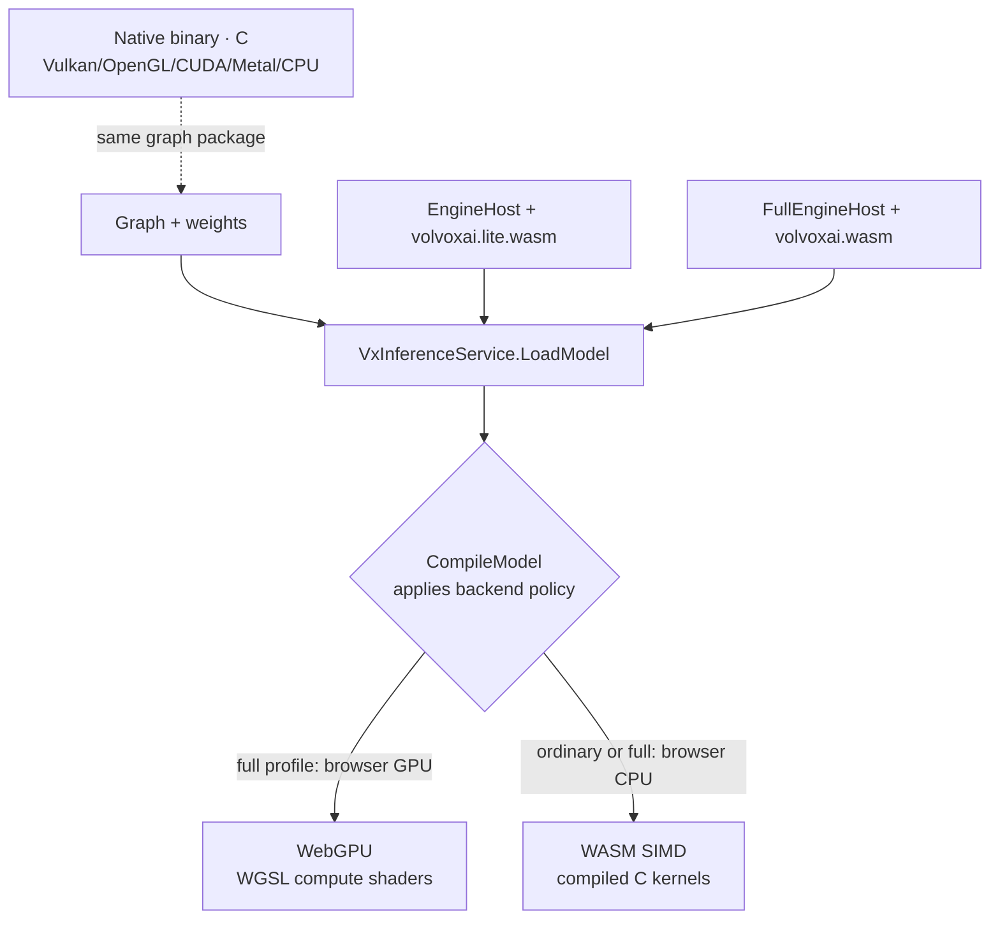

# Chapter 1 — Foundations

*Read the badges that match you: 🌱 **Idea** (anyone, no code) · 🔧 **Build** (a little code) · 🔬 **Deep**
(engine developers). New here? Follow just the 🌱 sections — straight through the whole book.*

*Goal: after this chapter you can look at any model and see it as a **graph of operations on
tensors**, and you understand the pieces VolvoxAI uses to run one.*

> 🌱 **The big idea.** An "AI" is not a brain and not magic. It's a **machine that does a huge pile
> of tiny arithmetic** — mostly "multiply these numbers, add them up" — over and over, in a fixed
> order. You put in numbers (a picture, a sentence turned into numbers), the machine does its pile
> of little sums, and numbers come out the other end (a label, a word, a box around a cat). This
> whole chapter is just naming the four LEGO pieces that machine is built from: **numbers in a grid
> (a tensor)**, **one small math step (an operation)**, **a list of those steps wired together (a
> graph)**, and **the saved graph document**. That's the entire vocabulary. Everything else
> in the book is detail.

---

## 1.1 What "running an AI" actually means

> 🌱 **Idea.** Think of a very long **recipe**. You hand it some ingredients (your question or your
> photo, turned into numbers). The recipe is a list of simple steps — *stir, add, mix* — and each
> step also reaches into a giant pantry of pre-measured numbers (the **weights**) that someone
> figured out ahead of time. Follow the whole recipe once and you get a dish: the answer. Running
> the recipe once is called a **forward pass**. That's all "running an AI" is.
>
> *What does "turned into numbers" mean?* A letter becomes a number by its position in a list (the
> word "cat" might become `[3, 1, 20]`); a photo becomes numbers by reading each pixel's brightness
> (a gray dot → `0.5`, pure white → `1.0`). Boring — but that's the trick: once everything is
> numbers, the machine only ever has to do arithmetic.

🔧 When you use an AI model, three things happen:

1. Your input (text, an image, audio) is turned into **numbers**.
2. Those numbers flow through a long list of **arithmetic operations**. Each operation also
   uses a big table of pre-computed numbers called **weights**.
3. The final numbers are turned back into something meaningful (a word, a box, a label).

Step 2 is the model. Running it once is called a **forward pass**, or **inference**. That is
all inference is: a pipeline of multiply-and-add, arranged in a specific order that someone
*trained* to be useful.

> 🔬 **Under the hood.** Ordinary execution is a **pure function**: same pinned weights + same input →
> same output. Decode/KV state is explicit and belongs to one `ExecutionContext`; it is never hidden
> process state. A provider's execution plan walks the graph and dispatches each node, so "how long
> does inference take" is mostly "the sum of each op's time" — which is exactly why Chapters 6–8
> focus on making individual ops cheaper.

> **Training vs. inference.** 🌱 *Inference* is **cooking** with a finished recipe (Part I).
> *Training* is **writing** that recipe in the first place (Part II): you cook a dish, taste how
> wrong it is, tweak the amounts a little, and repeat thousands of times until it's good. 🔬 In
> precise terms: inference uses finished weights to compute an answer; training *discovers* those
> weights — by showing the network many examples, measuring how wrong it is, and nudging every
> weight to be a little less wrong. VolvoxAI does **both**: it runs forward passes *and* implements
> the backward pass, optimizers, and quantization that produce and shrink a model. This book
> follows the whole loop.

---

## 1.2 The tensor: the only data structure you need

> 🌱 **Idea.** Every number moving through an AI lives in a **tensor**. Picture a giant **egg
> carton**: a grid of little cups, each holding one number, plus a label saying how the carton is
> shaped (say, 2 rows × 3 cups). A photo, a sentence, a sound — the computer turns all of them into
> cartons of numbers. That's the only kind of "stuff" that flows through the machine. Once you can
> picture "a labeled grid of numbers," you've got it.
>
> *Why the label matters.* The six numbers `1 2 3 4 5 6` could be two rows of three (`2×3`), three
> rows of two (`3×2`), or one flat line of six — same numbers, completely different meaning. The
> **shape** is the label on the carton that tells every step how to read the cups. Get the shape wrong
> and the math is nonsense, so a tensor *always* carries its shape with it.

🔧 Every number moving through a network lives in a **tensor**. A tensor is just a
multi-dimensional array (a grid of numbers) plus a **shape** that says how big each dimension is.

```
scalar   3.14                         shape []            (a single number)
vector   [3.14, 2.71, 1.62]           shape [3]           (a list)
matrix   [[1, 2, 3],                   shape [2, 3]        (a table: 2 rows, 3 cols)
          [4, 5, 6]]
tensor   a batch of 224x224 RGB images shape [8, 224, 224, 3]
```

That last shape, `[8, 224, 224, 3]`, reads as: **8** images, each **224** pixels tall, **224**
wide, with **3** color channels (red, green, blue). Four numbers fully describe millions of
values.

🔧 A tensor needs only a name, a shape, a data type, and a flat buffer of numbers.
Here is a teaching sketch; the engine keeps its actual tensor storage in C:

```javascript
// Conceptual tensor, not a class exported by the runtime
class Tensor {
  name;      // e.g. "hidden_0"
  shape;     // e.g. [1, 256, 64]
  dtype;     // "float32" | "int8" | "int32"
  buffer;    // a flat Float32Array / Int8Array holding shape-product numbers
  isWeight;  // true if it was learned during training (read-only at inference)
}
```

### 🔬 Tensors are stored flat

A computer's memory is one long line of bytes — it has no idea about "rows" and "columns." A
tensor with shape `[2, 3]` is stored as **6 numbers in a row**, and we compute *where* element
`[row, col]` lives with index math:

```
logical view          flat memory (what actually exists)
[[a, b, c],           [ a, b, c, d, e, f ]
 [d, e, f]]             0  1  2  3  4  5

  element [row, col]  →  flat index = row * 3 + col
  element [1, 2] = 'f' →  1 * 3 + 2 = 5   ✓
```

You will see this exact pattern — `((b * H + y) * W + x) * C + c` — all over the kernels. It is
how a 4-D image tensor is addressed inside a 1-D array. Memorize the shape, and the index math
follows.

> 🔬 **Under the hood: strides and dtype.** The packed formula above is the common case; the general
> rule gives each dimension a **stride** — how many numbers to skip to move one step along that axis —
> and the flat index is `Σ coord[d] × stride[d]`. A contiguous `[2, 3]` tensor has strides `[3, 1]`; a
> **transpose** can leave every number exactly where it is and just swap the strides to `[1, 3]`,
> which is why reshape/transpose are often nearly free. The **dtype** fixes how many bytes each cup
> takes — `float32` = 4, `int8` = 1, `int32` = 4 — so a tensor's memory footprint is
> `product(shape) × bytes(dtype)`. Chapter 6 is entirely about shrinking that second factor by 4×.

> 🔬 **NHWC vs NCHW.** The *order* of the dimensions matters. VolvoxAI's vision models use
> **NHWC** (batch, height, width, channels) — the color channels of one pixel sit next to each
> other in memory. PyTorch usually uses **NCHW**. Same data, different memory layout; kernels
> must agree on which one they're reading. (This repo's converter records `"internal_layout":
> "NHWC"` in every vision `graph.json`.)

---

## 1.3 The operation: one small, well-defined job

> 🌱 **Idea.** An **operation** is one step of the recipe — a single small job like "add these two
> cartons of numbers together, cup by cup." Each op is almost embarrassingly simple on its own. The
> intelligence doesn't live in any one step; it comes from doing *thousands* of these tiny steps in
> the right order. The punchline of this whole book: **there is no step where something magical or
> unexplainable happens.** It's all little sums.
>
> *A whole op, worked by hand.* "Add" of `[1, 2, 3]` and `[10, 20, 30]` is just `[11, 22, 33]`, cup
> by cup. "ReLU" of `[-2, 5, -1, 3]` means "replace negatives with zero" → `[0, 5, 0, 3]`. That is the
> actual difficulty level of one op. A model feels intelligent only because it stacks thousands of
> these in an order that was carefully trained.

🔧 An **operation** (or **op**, or **layer**) takes one or more input tensors, does a fixed piece
of math, and writes one or more output tensors. Examples you will meet:

| Op | In words | Used by |
|---|---|---|
| `MatMul` | Matrix multiply — the core "mixing" of features | both models |
| `Conv2D` | Slide a small filter over an image | the detector |
| `Add` | Element-wise add two tensors | both |
| `LayerNorm` | Re-center and re-scale a vector to be well-behaved | the LM |
| `SDPA` | Scaled-dot-product attention — "which words look at which" | the LM |
| `GELU` / `ReLU` | A nonlinear squashing function | both |
| `MaxPool2D` | Shrink an image by keeping the biggest value in each patch | the detector |

Every op in VolvoxAI has a shape/type contract and provider implementations.
Here is a pedagogical sketch of the *essence* of `Add` — one output cup per pair of input cups:

```javascript
// conceptual element-wise addition with broadcasting
for (let i = 0; i < out.length; i++) {
  out[i] = a[i] + b[i % b.length];   // b.length may be smaller ("broadcast")
}
```

That is the whole secret: a model is thousands of operations like this, each trivial, chained
together. **There is no step where something inexplicable happens.**

> 🔬 **Under the hood: the shipped op is a little richer than that one-liner.** Provider kernels use
> strides for true N-dimensional **broadcasting** — stretching a `[64]` bias across a
> `[1, 256, 64]` activation, say — and may accept a fused `relu` parameter (`0` none, `1` ReLU,
> `2` ReLU6) so an `Add` immediately followed by a clamp becomes **one pass instead of two** (that
> fusion is Chapter 8). The *math* is still just "add, maybe clamp"; shared contracts and an
> independent numerical oracle qualify the WASM, WebGPU, and native implementations.

---

## 1.4 The graph: operations wired together

> 🌱 **Idea.** A model is a **list of steps wired together** — like an assembly line, or a chain of
> dominoes. Each step's output becomes the next step's input. To "run the model," the computer just
> walks down the list and does each step in turn. So a whole AI engine, at its heart, is a **loop
> that says "do the next step, do the next step, do the next step"** until the list ends. Really.

🔧 A model is a **graph** — a list of ops where each op's outputs feed later ops' inputs. VolvoxAI
loads the graph into C: a set of **tensors** and a list of **nodes**
(op + which tensors are its inputs/outputs + its parameters). Its inspectable source is `graph.json`.

Because every op declares its inputs and outputs *by name*, the graph is just bookkeeping:

```
tokens ─┐
        ├─▶ [Embedding] ─▶ emb_tok ─┐
wte  ───┘                           ├─▶ [Add] ─▶ hidden_0 ─▶ [LayerNorm] ─▶ ...
positions ─▶ [Embedding] ─▶ emb_pos ┘
```

To **run** the graph, a provider walks its prepared node schedule and executes each op.
Conceptually, the executor loop is this readable:

```javascript
// conceptual provider executor
for (const node of graph.nodes) {
  this._runNode(node);      // dispatch on node.opType → the matching kernel
}
```

🔬 Provider dispatch maps each op type (`"MatMul"` → matmul kernel, `"Conv2D"` → conv
kernel, …). At its core, **a neural network engine is a schedule of kernel calls.**
Everything else is making those functions fast (Chapter 8), numerically small (Chapters 6–7), and —
in Part II — running them *backward* to discover the weights in the first place.

> 🔬 **Under the hood: prepare the wiring once.** The exporter writes nodes in dependency order,
> and the C loader resolves named tensor references before execution. Compilation validates the
> operator and shape rules and prepares the route. A request then runs that prepared schedule with
> its concrete inputs. Editing a graph publishes a new plan; existing compilations retain their
> original revision. Decode can reuse invariant branches and cached attention state rather than
> repeating every part of a full forward pass.

---

## 1.5 The graph package: how a model is stored

> 🌱 **Idea.** A saved model is just **two files**: the **recipe card** (the list of steps, in
> order) and the **pantry** (all the pre-measured numbers the steps use). Hand those two files to
> the engine and it can cook. Nothing else is hidden — no secret brain, no cloud magic. Two files.
>
> *Why split into two?* The recipe card is small text you can open and read; the pantry is a big block
> of raw numbers you can't (and shouldn't) read by eye. Keeping them apart lets you inspect or edit the
> *plan* without disturbing the millions of learned numbers — and swap in different numbers (a
> fine-tuned pantry) without rewriting the plan.

🔧 A VolvoxAI model on disk is two files:

```
model/
  graph.json          # the GRAPH: a list of op nodes (topology + params + shapes)
  model.safetensors    # the WEIGHTS: the learned numbers, in a standard binary format
```

- **`graph.json`** is the graph document. It opens by declaring which shapes the model accepts, then
  lists its nodes in order. TinyStories takes sentences of *any* length up to 256 tokens, and it says
  so with a named, bounded **dimension symbol**:

  ```json
  {
    "format": "volvox-graph/v1",
    "dimensions": { "S": { "min": 1, "max": 256 } },
    "inputs": {
      "tokens":    { "shape": [1, "S"], "dtype": "int32" },
      "positions": { "shape": [1, "S"], "dtype": "int32" }
    }
  }
  ```

  🌱 `S` is a blank left in the recipe: *"however many words you actually give me — at least 1, at
  most 256."* Writing `S` in two places means **the same number in both**, so a 12-word prompt is 12
  everywhere, and nothing has to be padded out to 256 just to fit a fixed slot.

  Each node then names its op, its input/output tensors, its parameters, and a typed output-shape
  assertion that may use those same symbols. Here is one real TinyStories node:

  ```json
  {
    "id": "node_3",
    "opType": "LayerNorm",
    "inputs":  { "input": "hidden_0", "weight": "h.0.ln_1.weight", "bias": "h.0.ln_1.bias" },
    "outputs": {
      "out": { "tensor": "ln1_0", "shape": [1, "S", 64], "dtype": "float32" }
    },
    "params": { "eps": 1e-05, "d_model": 64 }
  }
  ```

  🔧 Note that `id` and the output `tensor` name are different things: `node_3` identifies the *node*,
  `ln1_0` names the *tensor it writes*. Because every symbol is both named and bounded, compilation
  can prove a working route for every length in `1..256` **once**, before any request arrives — the
  subject of Chapter 8.

- **`model.safetensors`** holds the raw weight tensors (`h.0.ln_1.weight`, `wte.weight`, …) in
  [safetensors](https://github.com/huggingface/safetensors) format — a simple, safe, standard
  layout used across the ML world.

🔬 The C model loader reads both and retains the graph and weight revision — with no PyTorch
or ONNX Runtime dependency at inference time. A provider
compiles that snapshot once, and each `ExecutionContext` privately binds and resolves the current
concrete input shapes. You can **export a model trained elsewhere** into this graph package, or —
as Part II shows — let VolvoxAI **train and write the package itself**.

> 🔬 **Under the hood: the `.safetensors` byte layout.** The format is deliberately trivial to parse:
> an **8-byte little-endian length**, then a **JSON header** mapping each tensor name to its
> `{ dtype, shape, data_offsets }`, then the **raw tensor bytes** back to back. Nothing executes while
> loading — the header is data, not code (that safety is the whole point of the format versus Python
> pickles). The native loader can **memory-map** a file and point tensor views at its bytes
> (`native/src/runtime/safetensors.c`), avoiding a separate copy for each tensor. Validation and
> preparation may still read those bytes or create packed copies. The browser stages bytes into
> WASM for the same C storage validation. `graph.json` stores bounded logical shapes and output assertions. Compilation proves the complete symbolic domain once; request-time
> resolution substitutes one checked binding and caches its concrete plan rather than trusting a
> precomputed maximum shape.

---

## 1.6 One model, explicit ways to run it

> 🌱 **Idea.** The same recipe can be cooked in different kitchens: a fast fancy oven, a normal
> stove, a tiny camp stove — the dish comes out the same, just faster or slower. VolvoxAI can run
> the *same* model on a browser tab, on your laptop, on a phone, or even on a **robot**. The
> deployment chooses which kitchens are installed, and the application's generated policy selects
> among those available. The ordinary browser package deliberately brings only portable WASM; the
> full package also brings WebGPU. Same answer everywhere; this is why the
> book keeps saying VolvoxAI runs "in the browser *and* on the edge."

🔧 The same graph can be executed on very different hardware. The chosen runtime profile defines
the available provider set, and `CompileModel` applies the caller's generated `BackendPolicy`
within that set. Every qualified provider computes the *same* declared result:



- **WASM** runs portable C compiled to WebAssembly. It is the ordinary browser profile's sealed
  execution route and the full profile's fallback.
- **WebGPU** belongs to the full browser profile, where C applies the requested backend policy and executes
  each op as a GPU compute shader (`shaders/{inference,training}/*.wgsl`).
- **Native** (`native/`) is a standalone C program that runs the *same* graph package on a desktop,
  phone, or robot, optionally on Vulkan/OpenGL/CUDA/Metal. CUDA is an opt-in manual-kernel backend
  (forward inference, plus training in the full build; see Chapter 9C). This is the path to
  **on-device / edge AI**, and it's the subject of Chapter 9.

> 🔬 **Under the hood: how a provider gets picked, and why answers still match.**
> `EngineHost` supports only WASM CPU. `FullEngineHost` also supports WebGPU and accepts an optional
> `gpuBridge` for device transport. Backend availability is fixed by the C build; both hosts forward
> the generated `VxInferenceService.CompileModel` operation, which applies an empty,
> preferred, or required `BackendPolicy` and records every candidate outcome before execution.
> Execution failure never switches provider. Every provider is free to differ in *speed* but not in
> *answer*: shared operator contracts and cross-provider qualification hold the browser and native
> providers to the same declared outputs. "Same graph package, same answer, many kitchens" is a
> runtime contract, not a fallback policy.

🔧 End to end, running TinyStories on six tokens is this much code:

```javascript
import { EngineHost, VxInferenceServiceClient, pb } from 'volvoxai';

const host = new EngineHost({
  wasmUrl: new URL('./volvoxai.wasm', import.meta.url),
});
const inference = new VxInferenceServiceClient(host);
try {
  const runtime = await inference.createRuntime(new pb.CreateRuntimeRequest());
  const model = await inference.loadModel(new pb.LoadModelRequest({
    runtimeId: runtime.runtimeId,
    graphPath: './models/tinystories_1m/graph.json',
    weightPaths: ['./models/tinystories_1m/model.safetensors'],
  }));
  const compiled = await inference.compileModel(new pb.CompileModelRequest({
    modelId: model.modelId,
    policy: new pb.BackendPolicy({
      mode: pb.BackendPolicyMode.BACKEND_POLICY_MODE_REQUIRE,
      backends: ['wasm'],
      operatorFallback: pb.OperatorFallback.OPERATOR_FALLBACK_ALLOW,
    }),
  }));

  const tokens = Int32Array.from([7454, 2402, 257, 640, 11, 20037]);
  const positions = Int32Array.from([0, 1, 2, 3, 4, 5]);
  const result = await inference.run(new pb.RunRequest({
    compiledModelId: compiled.compiledModelId,
    inputs: [
      new pb.Tensor({ name: 'tokens', dtype: pb.DataType.DATA_TYPE_I32,
        shape: [1n, 6n], inline: new Uint8Array(tokens.buffer) }),
      new pb.Tensor({ name: 'positions', dtype: pb.DataType.DATA_TYPE_I32,
        shape: [1n, 6n], inline: new Uint8Array(positions.buffer) }),
    ],
  }));
  const logits = (await inference.readOutput(new pb.ReadOutputRequest({
    resultId: result.resultId,
    name: 'logits',
  }))).tensor;

  await inference.releaseResult(new pb.ResultRef({ resultId: result.resultId }));
  await inference.releaseCompiledModel(
    new pb.CompiledModelRef({ compiledModelId: compiled.compiledModelId }));
  await inference.releaseModel(new pb.ModelRef({ modelId: model.modelId }));
  await inference.releaseRuntime(new pb.RuntimeRef({ runtimeId: runtime.runtimeId }));
} finally {
  await host.close();
}
```

Note the shape of every input is **stated, never guessed**. A generated `pb.Tensor` carries its
name, dtype, shape, and exact bytes —
the engine will not infer `[1, 6]` from "the buffer holds 6 int32s," because a 6-element buffer is
equally `[1,6]`, `[6,1]`, or `[2,3]`, and quietly picking one is how a wrong answer becomes a silent
answer. Those two `[1, 6]`s are what bind `S = 6` from §1.5.

For the rest of the book, when we "trace an op," we read the portable-C implementation and
the operator contract because they say most directly *what the math is*.

---

## 1.7 The mental model, assembled

> 🌱 **Idea recap.** Numbers go in → the machine runs its long list of tiny math steps, each one
> using pre-measured numbers from the pantry → numbers come out → we translate them back into a
> word or a box. That's a model. To make one *learn*, you run it, see how wrong it was, and nudge
> the pantry numbers — that's training (Part II). To make it *small enough for a phone or robot*,
> you round the numbers off — that's quantization (Part III). You now know the whole shape of the
> book.

🔧 Put it together and you have the whole engine in one picture:

```
  INPUT ──encode──▶ TENSORS ──┐
                              │   for each node in graph.nodes:
   WEIGHTS (from .safetensors)─┼──▶   op(inputs, params) → output tensor
                              │
                        (repeat for all ~85 or ~262 nodes)
                              │
                              ▼
                        OUTPUT TENSOR ──decode──▶ ANSWER
```

Two questions define any model:

1. **What are the ops, and in what order?** (the graph / `graph.json`)
2. **What do the weights make each op do?** (the `.safetensors`)

> 🔬 **Under the hood: three axes, one object.** Everything the rest of the book does is an operation
> *on this one graph object*. **Forward** (Part I) walks it. **Backward** (Part II) walks a mirror of
> it in reverse to get gradients, then an optimizer edits the weight tensors in place. **Quantization**
> (Part III) rewrites those weight tensors as int8 plus `scale`/`zero_point` and swaps in integer ops.
> Same graph, same tensors — three different things you *do* to them. Hold that picture and no later
> chapter can surprise you.

In the next two chapters we answer both questions for two real models — and you'll see that a
"language model" and an "image detector" are the *same idea* with different ops in the list.

**Next:** [Chapter 2 — A Language Model, op by op →](02-tinystories-language-model.md)
