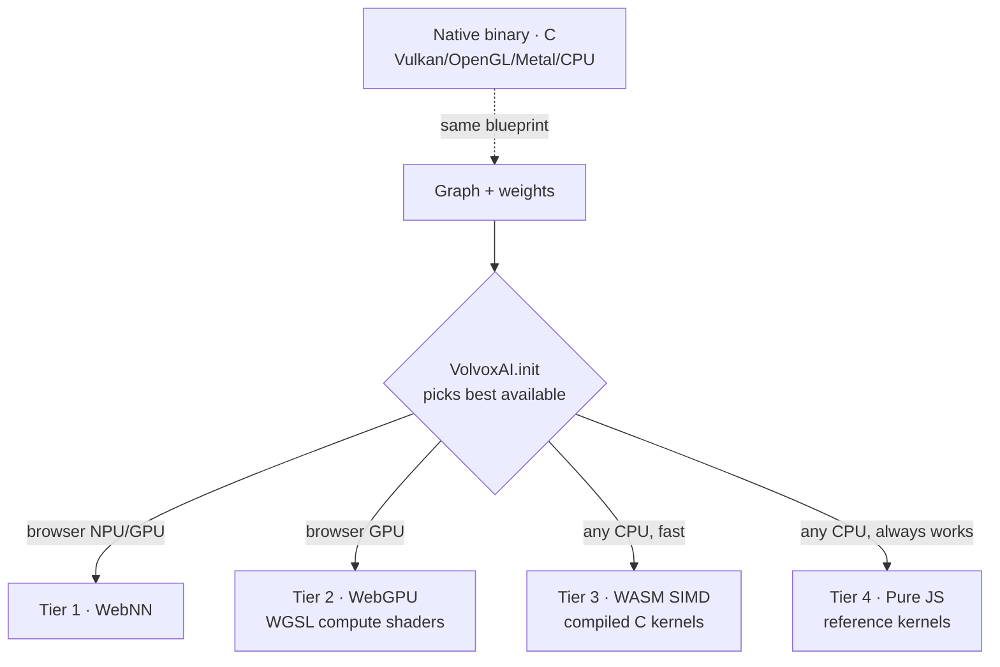

# Chapter 1 — Foundations

*Goal: after this chapter you can look at any model and see it as a **graph of operations on
tensors**, and you understand the pieces VolvoxAI uses to run one.*

---

## 1.1 What "running an AI" actually means

When you use an AI model, three things happen:

1. Your input (text, an image, audio) is turned into **numbers**.
2. Those numbers flow through a long list of **arithmetic operations**. Each operation also
   uses a big table of pre-computed numbers called **weights**.
3. The final numbers are turned back into something meaningful (a word, a box, a label).

Step 2 is the model. Running it once is called a **forward pass**, or **inference**. That is
all inference is: a pipeline of multiply-and-add, arranged in a specific order that someone
*trained* to be useful.

> **Training vs. inference.** *Training* is the expensive process that searches for good weight
> values by showing the network millions of examples and nudging the weights to reduce mistakes.
> *Inference* just uses the finished weights. **VolvoxAI is an inference engine** — it never
> changes a weight. Everything in this book is about inference.

---

## 1.2 The tensor: the only data structure you need

Every number moving through a network lives in a **tensor**. A tensor is just a
multi-dimensional array (a grid of numbers) plus a **shape** that says how big each dimension is.

```
scalar   3.14                         shape []            (a single number)
vector   [3.14, 2.71, 1.62]           shape [3]           (a list)
matrix   [[1, 2, 3],                   shape [2, 3]        (a table: 2 rows, 3 cols)
          [4, 5, 6]]
tensor   a batch of 224x224 RGB images shape [8, 224, 224, 3]
```

That last shape, `[8, 224, 224, 3]`, reads as: **8** images, each **224** pixels tall, **224**
wide, with **3** color channels (red, green, blue). Four numbers fully describe millions of
values.

**In this repo**, a tensor is a tiny object (`js/Tensor.js`) — a name, a shape, a data type,
and a flat buffer of numbers:

```javascript
// js/Tensor.js (paraphrased)
class Tensor {
  name;      // e.g. "hidden_0"
  shape;     // e.g. [1, 256, 64]
  dtype;     // "float32" | "int8" | "int32"
  buffer;    // a flat Float32Array / Int8Array holding shape-product numbers
  isWeight;  // true if it was learned during training (read-only at inference)
}
```

### Tensors are stored flat

A computer's memory is one long line of bytes — it has no idea about "rows" and "columns." A
tensor with shape `[2, 3]` is stored as **6 numbers in a row**, and we compute *where* element
`[row, col]` lives with index math:

```
logical view          flat memory (what actually exists)
[[a, b, c],           [ a, b, c, d, e, f ]
 [d, e, f]]             0  1  2  3  4  5

  element [row, col]  →  flat index = row * 3 + col
  element [1, 2] = 'f' →  1 * 3 + 2 = 5   ✓
```

You will see this exact pattern — `((b * H + y) * W + x) * C + c` — all over the kernels. It is
how a 4-D image tensor is addressed inside a 1-D array. Memorize the shape, and the index math
follows.

> **NHWC vs NCHW.** The *order* of the dimensions matters. VolvoxAI's vision models use
> **NHWC** (batch, height, width, channels) — the color channels of one pixel sit next to each
> other in memory. PyTorch usually uses **NCHW**. Same data, different memory layout; kernels
> must agree on which one they're reading. (This repo's converter records `"internal_layout":
> "NHWC"` in every vision `config.json`.)

---

## 1.3 The operation: one small, well-defined job

An **operation** (or **op**, or **layer**) takes one or more input tensors, does a fixed piece
of math, and writes one or more output tensors. Examples you will meet:

| Op | In words | Used by |
|---|---|---|
| `MatMul` | Matrix multiply — the core "mixing" of features | both models |
| `Conv2D` | Slide a small filter over an image | the detector |
| `Add` | Element-wise add two tensors | both |
| `LayerNorm` | Re-center and re-scale a vector to be well-behaved | the LM |
| `SDPA` | Scaled-dot-product attention — "which words look at which" | the LM |
| `GELU` / `ReLU` | A nonlinear squashing function | both |
| `MaxPool2D` | Shrink an image by keeping the biggest value in each patch | the detector |

Every op in VolvoxAI has a plain-English **reference implementation** in `js/ops/`, one small
file each. Here is the *entire* `Add` op — this is not a simplification, it is the real code:

```javascript
// js/ops/add.js — element-wise addition with broadcasting
for (let i = 0; i < out.length; i++) {
  out[i] = a[i] + b[i % b.length];   // b.length may be smaller ("broadcast")
}
```

That is the whole secret: a model is thousands of operations like this, each trivial, chained
together. **There is no step where something inexplicable happens.**

---

## 1.4 The graph: operations wired together

A model is a **graph** — a list of ops where each op's outputs feed later ops' inputs. VolvoxAI
stores this as a `Graph` object (`js/Graph.js`): a set of **tensors** and a list of **nodes**
(op + which tensors are its inputs/outputs + its parameters).

Because every op declares its inputs and outputs *by name*, the graph is just bookkeeping:

```
tokens ─┐
        ├─▶ [Embedding] ─▶ emb_tok ─┐
wte  ───┘                           ├─▶ [Add] ─▶ hidden_0 ─▶ [LayerNorm] ─▶ ...
positions ─▶ [Embedding] ─▶ emb_pos ┘
```

To **run** the graph, VolvoxAI simply walks the node list top to bottom and executes each op.
The whole executor loop is this readable (`js/CPUEngine.js`):

```javascript
// js/CPUEngine.js — the heart of the engine
for (const node of graph.nodes) {
  this._runNode(node);      // dispatch on node.opType → the matching kernel
}
```

`_runNode` is a big `switch` on the op type (`"MatMul"` → matmul kernel, `"Conv2D"` → conv
kernel, …). That's it. **A neural network engine is a `for` loop over a list of function calls.**
Everything else is making those functions fast (Chapter 5) and numerically small (Chapter 4).

---

## 1.5 The blueprint: how a model is stored

A VolvoxAI model on disk is two files:

```
model/
  config.json          # the GRAPH: a list of op nodes (topology + params + shapes)
  model.safetensors    # the WEIGHTS: the learned numbers, in a standard binary format
```

- **`config.json`** is the *blueprint*: an ordered list of nodes. Each node names its op, its
  input/output tensors, its parameters, and the exact output shape (pre-computed by the
  exporter so the engine never has to guess). Here is one real node from TinyStories:

  ```json
  {
    "op": "LayerNorm",
    "inputs":  { "input": "hidden_0", "weight": "h.0.ln_1.weight", "bias": "h.0.ln_1.bias" },
    "outputs": { "out": "ln1_0" },
    "outputs_shape": { "out": [1, 256, 64] },
    "params": { "eps": 1e-05, "d_model": 64 }
  }
  ```

- **`model.safetensors`** holds the raw weight tensors (`h.0.ln_1.weight`, `wte.weight`, …) in
  [safetensors](https://github.com/huggingface/safetensors) format — a simple, safe, standard
  layout used across the ML world.

`js/GraphLoader.js` reads both, builds the `Graph`, and hands it to the engine. **You train in
PyTorch, export to this blueprint, and Volvox runs it** — with no PyTorch, no ONNX Runtime, no
dependencies at inference time.

---

## 1.6 One model, four ways to run it (the "tiers")

The same graph can be executed on very different hardware. VolvoxAI picks the best available
**tier** automatically, and every tier computes the *same* result:



- **Tier 4 (Pure JS, `js/ops/*.js`)** is the *reference*: slow but obviously-correct, and the
  ground truth every other tier is checked against. **We use it as our teaching text** because
  it is the most readable.
- **Tier 3 (WASM)** runs the same math as compiled C for a big speedup.
- **Tier 2 (WebGPU)** re-expresses each op as a GPU compute shader (`shaders/*.wgsl`).
- **Tier 1 (WebNN)** hands the graph to the browser's own neural-network API (can hit an NPU).
- **Native** (`native/`) is a standalone C program that runs the *same* blueprint on a desktop
  or phone, optionally on Vulkan/OpenGL/Metal.

For the rest of the book, when we "trace an op," we read the pure-JS or portable-C version,
because they say most directly *what the math is*.

---

## 1.7 The mental model, assembled

Put it together and you have the whole engine in one picture:

```
  INPUT ──encode──▶ TENSORS ──┐
                              │   for each node in graph.nodes:
   WEIGHTS (from .safetensors)─┼──▶   op(inputs, params) → output tensor
                              │
                        (repeat for all ~85 or ~262 nodes)
                              │
                              ▼
                        OUTPUT TENSOR ──decode──▶ ANSWER
```

Two questions define any model:

1. **What are the ops, and in what order?** (the graph / `config.json`)
2. **What do the weights make each op do?** (the `.safetensors`)

In the next two chapters we answer both questions for two real models — and you'll see that a
"language model" and an "image detector" are the *same idea* with different ops in the list.

**Next:** [Chapter 2 — A Language Model, op by op →](02-tinystories-language-model.md)
