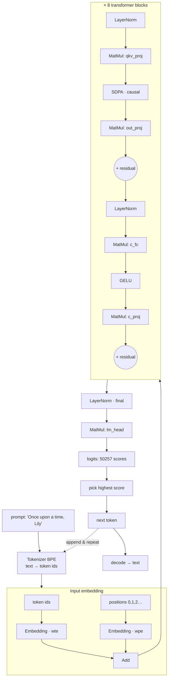
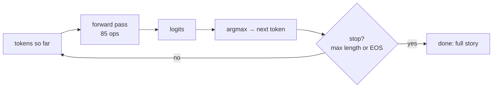

# Chapter 2 — A Language Model, op by op (TinyStories)

*Goal: follow the words **"Once upon a time, Lily"** through a real GPT-style transformer and
watch it predict the next word. Every op here is one of the small kernels from `js/ops/`.*

The model lives in `models/tinystories_1m/`. It is a tiny GPT (a **decoder-only transformer**)
trained on the [TinyStories](https://arxiv.org/abs/2305.07759) dataset of simple children's
stories. "Tiny" is real: its internal vector width is **64**, it has **8** layers, and yet it
writes coherent little stories. Studying it teaches you the *exact* architecture behind
GPT-2/3/4, LLaMA, and Mistral — those are this graph, scaled up.

## 2.1 The model's dimensions (read them off the blueprint)

From `config.json`, one number at a time:

| Symbol | Value | Meaning |
|---|---|---|
| `d_model` | **64** | Width of the "thought vector" carried per token. |
| `n_layers` | **8** | Number of transformer blocks stacked. |
| `n_heads` | **16** | Attention heads per block (so `head_dim = 64/16 = 4`). |
| `d_mlp` | **256** | Width of the feed-forward hidden layer (`4 × d_model`). |
| `vocab` | **50257** | Number of distinct tokens it knows (GPT-2 vocabulary). |
| `context` | **256** | Max tokens it can look at in one pass. |

> The folder is called `tinystories_1m` (~1M transformer parameters), but `model.safetensors`
> is ~27 MB. Why? The **token embedding table** is `50257 × 64 ≈ 3.2M` numbers, and there are
> two such tables (input + output). In tiny LMs, the *vocabulary*, not the *layers*, dominates
> the file. That's a real lesson: model size ≠ model depth.

The whole graph is **85 nodes**. Their inventory:

```
33 MatMul   17 LayerNorm   17 Add   8 SDPA   8 GELU   2 Embedding
= 2 embeddings + 8 blocks × (2 LayerNorm + 4 MatMul + 1 SDPA + 1 GELU + 2 Add) + final LayerNorm + 1 lm_head
```

## 2.2 The pipeline at a glance



Now we walk it, stage by stage, with the real kernels.

---

## 2.3 Stage 0 — Tokenize: text becomes integers

A neural net cannot read letters; it reads numbers. The **tokenizer** (`js/Tokenizer.js`,
`native/tokenizer.c`) chops text into **tokens** (common word-pieces) and maps each to an
integer ID using a vocabulary + a list of **merge rules** (this is **Byte-Pair Encoding**, BPE).

```
"Once upon a time, Lily"
   │  regex splits into word-ish chunks, then BPE merges frequent byte-pairs
   ▼
[ "Once", " upon", " a", " time", ",", " Lily" ]     (illustrative)
   │  each chunk → an integer id from the 50257-word vocab
   ▼
tokens    = [7454, 2402, 257, 640, 11, 20037, …]     ← the model's real input
positions = [   0,    1,   2,   3,  4,     5, …]     ← "which slot am I?"
```

Two integer tensors go into the graph: **`tokens`** (what the words are) and **`positions`**
(their order, `0,1,2,…`). Both are shape `[1, 256]` — the sequence is padded to the 256-token
context window.

> **Why positions?** The attention math (below) is order-blind by itself — it would treat
> "dog bites man" and "man bites dog" identically. Feeding in an explicit position number lets
> the model learn word order.

---

## 2.4 Stage 1 — Embedding: integers become vectors

An ID like `20037` ("Lily") is meaningless as a *number* (it isn't 20037× anything). We replace
it with a learned **vector** of 64 numbers — its **embedding** — that encodes meaning. The
`Embedding` op is pure table lookup. Here is the entire kernel (`js/ops/embedding.js`):

```javascript
for (let i = 0; i < seq_len; i++) {
  const token_id = tokens[i];
  for (let j = 0; j < d_model; j++) {
    out[i * d_model + j] = weight[token_id * d_model + j];   // copy row `token_id`
  }
}
```

The weight `wte.weight` is the `[50257, 64]` table; row `token_id` *is* that token's meaning
vector. It runs **twice**:

- `Embedding(tokens, wte)` → `emb_tok` `[1,256,64]` — *what* each token is.
- `Embedding(positions, wpe)` → `emb_pos` `[1,256,64]` — *where* it is.

Then `Add` fuses them: `hidden_0 = emb_tok + emb_pos`. Now every one of the 256 slots holds a
64-number vector that mixes *word identity* and *position*. This tensor, `hidden_0 [1,256,64]`,
is the **residual stream** — the "conveyor belt" that every block reads from and writes back to.

```
hidden_0:  256 rows (one per token position), each a 64-number vector

 pos 0 "Once"  [ 0.12, -0.4, ...(64) ]
 pos 1 " upon" [-0.03,  0.9, ...(64) ]
 pos 2 " a"    [ ...                 ]
   ⋮
```

---

## 2.5 Stage 2 — A transformer block (this happens 8×)

Each block refines the residual stream with two sub-steps: **attention** (tokens share
information) and a **feed-forward MLP** (each token thinks on its own). Both are wrapped in the
**pre-norm + residual** pattern that makes deep networks trainable.

### 2.5a LayerNorm — keep the numbers sane

Before each sub-step, `LayerNorm` rescales each token's 64-vector to have mean 0 and variance 1,
then applies a learned scale (`weight`) and shift (`bias`). This stops values from exploding or
vanishing across 8 layers. The real kernel (`js/ops/layerNorm.js`), per token row:

```javascript
const mean = sum / d_model;
const variance = sq_sum / d_model - mean * mean;
const inv_std = 1 / Math.sqrt(variance + 1e-5);          // eps guards ÷0
out[j] = (in[j] - mean) * inv_std * weight[j] + bias[j]; // normalize, then re-scale/shift
```

### 2.5b Attention — "which earlier words matter to me?"

This is the heart of a transformer. First a single `MatMul` projects each 64-vector up to **192**
numbers (`qkv_proj`, shape `[1,256,192]`). Those 192 are three 64-vectors glued together: the
**Query**, **Key**, and **Value** (Q, K, V). Intuition:

- **Query** = "what am I looking for?"
- **Key** = "what do I offer?"
- **Value** = "what I'll hand over if you pick me."

Then `SDPA` (**Scaled Dot-Product Attention**) does the actual looking. For each token *q*, it
compares its Query to every earlier token's Key (a dot product = similarity), turns the
similarities into weights with **softmax**, and returns a weighted blend of those tokens' Values.
The real causal kernel (`js/ops/sDPA.js`), lightly annotated:

```javascript
for (let h = 0; h < num_heads; h++) {                 // 16 independent heads
  for (let q = 0; q < seq_len; q++) {                 // for each query position
    for (let k = 0; k <= q; k++) {                    // ← only look at k ≤ q  (CAUSAL)
      score = dot(Q[q,h], K[k,h]) * scale;            // similarity of q to k
    }
    softmax(scores);                                  // turn scores into weights that sum to 1
    out[q,h] = Σ_k  weight[k] * V[k,h];               // blended value
  }
}
```

Two ideas worth pausing on:

- **Causal masking** (`k <= q`): a token may only attend to itself and *earlier* tokens, never
  future ones. That's what makes it a left-to-right text *generator* — position 3 can't cheat by
  peeking at position 4.
- **Multi-head** (`h`): the 64 dims are split into 16 groups of 4. Each "head" learns a different
  kind of relationship (e.g. one tracks subjects, another tracks punctuation) in parallel.

```
Attention for the token " Lily" (illustrative weights after softmax):

  " Lily" attends to →   "Once"  " upon"  " a"  " time"  ","   " Lily"
  weight                  0.05    0.05   0.05   0.30   0.05   0.50
                                                  ▲             ▲
                                       "time" is relevant   mostly itself
  output = 0.05·V(Once) + … + 0.30·V(time) + 0.50·V(Lily)
```

A final `MatMul` (`out_proj`, with bias) mixes the 16 heads' outputs back into a 64-vector, and a
**residual `Add`** adds it onto the stream: `add1 = hidden + attention_output`. "Residual" means
we *add* the block's result instead of replacing the stream — so information is never lost and
gradients flow during training.

### 2.5c Feed-forward MLP — each token thinks

After tokens have shared info, each one is transformed on its own by a 2-layer MLP:

```
c_fc  : MatMul 64 → 256   (+bias)     "expand: give it room to compute"
GELU  : nonlinearity                  "let it make nonlinear decisions"
c_proj: MatMul 256 → 64   (+bias)     "compress back to stream width"
Add   : residual                      hidden_next = add1 + mlp_output
```

`GELU` (`js/ops/gELU.js`) is the nonlinearity — a smooth gate that lets small negatives leak and
passes positives. Without a nonlinearity like this, stacking MatMuls would collapse into a single
MatMul and the network could only learn straight-line relationships:

```javascript
out[i] = 0.5 * x * (1 + tanh(0.7978845608 * (x + 0.044715 * x*x*x)));   // the GELU curve
```

The block's output `hidden_next [1,256,64]` has the same shape as its input — which is exactly
why we can stack **8** of them. Each block reads the stream and writes a slightly smarter version
back.

---

## 2.6 Stage 3 — Head: vectors become word-scores

After the 8th block, one last `LayerNorm` (`ln_f`) cleans up the stream. Then the **language-model
head** — a single `MatMul` by `lm_head.weight [50257, 64]` — turns each 64-vector into **50257
scores**, one per vocabulary word:

```
final_norm [1,256,64]  ──MatMul lm_head──▶  logits [1,256,50257]
```

These raw scores are called **logits**. `logits[0, p, w]` = "how strongly the model, having read
tokens `0..p`, expects word `w` to come next." We only care about the row for the **last real
token** — that's the prediction for what comes after the prompt.

---

## 2.7 Stage 4 — Sample: scores become the next word

We now have 50257 scores for the next token. This repo's generator (`native/main.c`,
`command_generate`) uses the simplest rule, **greedy / argmax** — just take the highest:

```c
int best_id = 0; float best_val = -1e30f;
for (int i = 0; i < vocab_count; i++)
    if (logits[i] > best_val) { best_val = logits[i]; best_id = i; }   // argmax
// best_id is the next token; decode it back to text:
printf("%s", tokenizer_decode(tok, best_id));
```

> **Real generators add randomness** — *temperature* (flatten/sharpen the scores), *top-k* /
> *top-p* (sample only from the most likely few). Those turn logits into a probability
> distribution with `softmax` and roll a weighted die, which is why ChatGPT gives different
> answers each time. Greedy is the deterministic special case; it's perfect for a textbook.

---

## 2.8 The loop — one word at a time (autoregression)

A transformer predicts **one** token per forward pass. To write a sentence, you append the new
token and run again. This is **autoregressive generation**:



```
step 0:  "Once upon a time, Lily"           → " was"
step 1:  "Once upon a time, Lily was"       → " a"
step 2:  "Once upon a time, Lily was a"     → " little"
step 3:  … → " girl" → " who" → " loved" → " to" → " play" …
```

That is literally how ChatGPT types word-by-word: it is running this loop, each new token fed
back in as input.

> **KV-cache (an optimization you'll hear about).** Naively, step *N* recomputes attention over
> all *N* tokens from scratch — wasteful. Production engines *cache* each token's Key and Value
> so each step only computes the new token's. VolvoxAI's native runner exposes this split as
> `engine_prefill()` (process the whole prompt once) and `engine_decode()` (one new token at a
> time). The math is identical; the cache just avoids repeating work.

---

## 2.9 What you just learned

- A language model is: **tokenize → embed → (LayerNorm, attention, MLP) × N → head → sample →
  loop.** Nothing more.
- **Attention** lets tokens share information ("which earlier words matter to me?"); the **MLP**
  lets each token compute on its own; **residuals + LayerNorm** make the stack trainable and deep.
- Every op is one small kernel in `js/ops/` — `MatMul`, `SDPA`, `LayerNorm`, `GELU`, `Add`,
  `Embedding`. GPT-2/3/4 and LLaMA are **this exact graph, wider and deeper**.

Next we switch domains entirely — from text to pixels — and you'll see the *same skeleton*
(a graph of small ops on tensors) solve a completely different problem.

**Next:** [Chapter 3 — A Vision Model, op by op →](03-efficientdet-vision-model.md)
