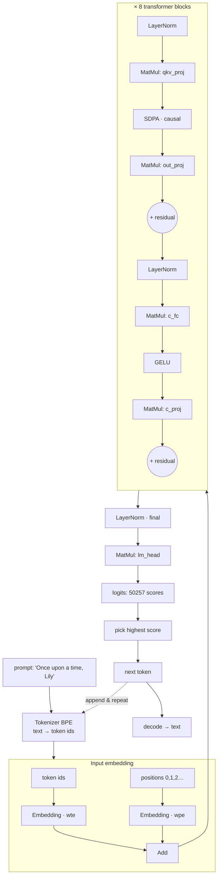
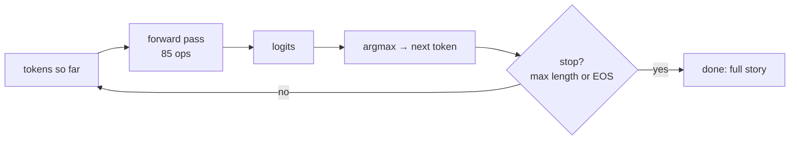

# Chapter 2 — A Language Model, op by op (TinyStories)

*Read the badges that match you: 🌱 **Idea** (anyone, no code) · 🔧 **Build** (a little code) · 🔬 **Deep**
(engine developers). New here? Follow just the 🌱 sections.*

*Goal: follow the words **"Once upon a time, Lily"** through a real GPT-style transformer and
watch it predict the next word. Every op here follows the same contracts used by the shipping providers.*

> 🌱 **The big idea.** A language model is an extremely good **"guess the next word" machine.** You
> give it "Once upon a time, Lily" and it guesses " was". Then you glue " was" onto the end and ask
> again, and it guesses " a". Do this over and over and it writes a whole story, one word at a
> time. That is *exactly* how ChatGPT types. This chapter opens up the machine and shows that the
> "guessing" is just the four LEGO pieces from Chapter 1 — grids of numbers flowing through tiny
> math steps. The one genuinely clever step is called **attention**, and its whole job is letting
> each word *look back at the earlier words* to decide what comes next.

🔧 The model lives in `models/tinystories_1m/`. It is a tiny GPT (a **decoder-only transformer**)
trained on the [TinyStories](https://arxiv.org/abs/2305.07759) dataset of simple children's
stories. "Tiny" is real: its internal vector width is **64**, it has **8** layers, and yet it
writes coherent little stories. Studying it teaches you the *exact* architecture behind
GPT-2/3/4, LLaMA, and Mistral — those are this graph, scaled up.

> **🌱 Where this model comes from.** We didn't train these weights here — TinyStories-1M is a
> *real, publicly released* model (`roneneldan/TinyStories-1M` on Hugging Face, a GPT-Neo). VolvoxAI's
> exporter **converts** that checkpoint into the two-file graph package from Chapter 1 (`graph.json` +
> `model.safetensors` + the tokenizer files); `make models_tinystories` regenerates it from the public
> source (the `models/` folder is git-ignored, not shipped). So everything below reads a model
> *someone else* trained — Part II is where VolvoxAI trains its own. (Details: `docs/models.md`,
> `examples/tinystories/`.)

## 2.1 The model's dimensions (read them from `graph.json`)

> 🌱 **Idea.** Every model has a few "size knobs" — how wide its thoughts are, how many thinking
> stages it has, how many words it knows. Below are this little model's knobs. You don't need the
> numbers; just know that big models like ChatGPT are *this same list of knobs turned way up*.

🔧 From `graph.json`, one number at a time:

| Symbol | Value | Meaning |
|---|---|---|
| `d_model` | **64** | Width of the "thought vector" carried per token. |
| `n_layers` | **8** | Number of transformer blocks stacked. |
| `n_heads` | **16** | Attention heads per block (so `head_dim = 64/16 = 4`). |
| `d_mlp` | **256** | Width of the feed-forward hidden layer (`4 × d_model`). |
| `vocab` | **50257** | Number of distinct tokens it knows (GPT-2 vocabulary). |
| `S` | **1 … 256** | Sequence length. Not a fixed number — a *range*. |

🔧 That last row is different in kind from the others. `d_model` and `n_layers` are baked into the
weights; `S` is a **dimension symbol** declared in `graph.json`:

```json
"dimensions": { "S": { "min": 1, "max": 256 } }
```

You give the model however many tokens you actually have, from 1 to 256, and `S` takes that value
for the whole run. Every shape in the rest of this chapter is written with `S` in it for that
reason — `[1, S, 64]`, not `[1, 256, 64]`. Chapter 8 covers how one compiled model serves every
length in that range.

> The folder is called `tinystories_1m` (~1M transformer parameters), but `model.safetensors`
> is ~27 MB. Why? The **token embedding table** is `50257 × 64 ≈ 3.2M` numbers, and there are
> two such tables (input + output). In tiny LMs, the *vocabulary*, not the *layers*, dominates
> the file. That's a real lesson: model size ≠ model depth.

🔬 The whole graph is **85 nodes**. Their inventory:

```
33 MatMul   17 LayerNorm   17 Add   8 SDPA   8 GELU   2 Embedding
= 2 embeddings + 8 blocks × (2 LayerNorm + 4 MatMul + 1 SDPA + 1 GELU + 2 Add) + final LayerNorm + 1 lm_head
```

> 🔬 **Under the hood: where the parameters actually live.** The "1M" in the folder name counts
> transformer weights loosely; the 27 MB file is dominated by **embeddings**. Per block the weight
> matrices are `qkv_proj 64×192`, `out_proj 64×64`, `c_fc 64×256`, `c_proj 256×64` ≈ 49k numbers, so
> all 8 blocks together are only ~0.4M — dwarfed by the two `50257×64 ≈ 3.2M` embedding tables. At 4
> bytes each that's ~26 MB of embeddings versus ~1.6 MB of everything else. The lesson from Chapter 1
> holds here numerically: in a small LM the *vocabulary*, not the depth, is the model.

## 2.2 The pipeline at a glance

> 🌱 **Idea.** Here's the whole assembly line for turning your prompt into the next word. Read it
> top to bottom: the words get turned into numbers, the numbers flow through 8 identical "thinking"
> stages, and at the end the machine produces a score for every word it knows and picks the
> winner. The rest of the chapter walks each stage.

🔧



Now we walk it, stage by stage, with the real kernels.

---

## 2.3 Stage 0 — Tokenize: text becomes integers

> 🌱 **Idea.** Computers can't read letters, only numbers. So first we chop the sentence into
> chunks (whole words, or common word-pieces) and swap each chunk for its ID number — like a
> coat-check ticket. "Lily" might become `20037`. Now the sentence is a list of numbers the machine
> can work with.

🔧 A neural net cannot read letters; it reads numbers. A **tokenizer** chops text into **tokens**
(common word-pieces) and maps each to an integer ID using a vocabulary and ranked **merge rules**
(**Byte-Pair Encoding**, BPE). The example exports those assets with
`examples/tinystories/tools/export_tokenizer.py`. VolvoxAI's reusable tokenizer runs in
`native/src/runtime/tokenizer.c`, exposed through `VxTextService` in both profiles; the application
chooses the assets and model-specific prompt policy.

```
"Once upon a time, Lily"
   │  regex splits into word-ish chunks, then BPE merges frequent byte-pairs
   ▼
[ "Once", " upon", " a", " time", ",", " Lily" ]     (illustrative)
   │  each chunk → an integer id from the 50257-word vocab
   ▼
tokens    = [7454, 2402, 257, 640, 11, 20037, …]     ← the model's real input
positions = [   0,    1,   2,   3,  4,     5, …]     ← "which slot am I?"
```

Two integer tensors go into the graph: **`tokens`** (what the words are) and **`positions`**
(their order, `0,1,2,…`). Both are shape `[1, S]`. Our six-token prompt binds `S = 6`, so both
tensors really are six long — **there is no padding out to 256**. Writing `S` in both means the
engine also checks they match: six tokens with five positions is rejected before any kernel runs.

> 🌱 **Why this matters.** Imagine a form with 256 blank lines that you must fill in even when your
> answer is six words — then someone has to read all 256 lines. Padding is exactly that: fake work on
> fake data. Telling the model "this one is six" instead lets it do six lines of work.

> 🔬 **Under the hood: byte-level BPE.** BPE starts from the 256 raw **bytes** as base tokens, so no
> input is ever "unknown" — worst case, a rare character is spelled out one byte at a time. A
> GPT-2-style regex first splits text into word-ish chunks (keeping the leading space, which is why
> tokens print as `" upon"` not `"upon"`), then **merge rules** are applied in **rank order**, greedily
> gluing the most frequent byte-pair again and again until none apply. `VxTextService` accepts
> vocabulary and merge bytes, then encodes text into IDs. The graph receives token IDs and positions.
> Use the model's matching assets and validate expected IDs; sharing the C tokenizer across hosts
> does not by itself prove compatibility with every model's tokenizer conventions.

> **Why positions?** 🌱 The next step (attention) is like everyone in a room talking at once — by
> itself it can't tell who spoke *first*. So we staple a seat number to each word. 🔬 The attention
> math is order-blind by itself — it would treat "dog bites man" and "man bites dog" identically.
> Feeding in an explicit position number lets the model learn word order.

---

## 2.4 Stage 1 — Embedding: integers become vectors

> 🌱 **Idea.** An ID number like `20037` is just a ticket stub — it doesn't *mean* anything on its
> own. So we look each word up in a big table and replace it with a little list of 64 numbers that
> captures its *meaning* (words with similar meanings get similar lists). This "meaning list" is
> called an **embedding**. Now every word is a small cloud of numbers the machine can actually
> reason with.
>
> *What "similar words get similar lists" buys you.* If "dog" is `[0.8, -0.2, …]` and "puppy" is
> `[0.79, -0.18, …]`, they sit close together, so whatever the model learns about one partly transfers
> to the other for free. Nobody writes this table by hand — training *discovers* these 64-number
> meanings (Part II).

🔧 An ID like `20037` ("Lily") is meaningless as a *number* (it isn't 20037× anything). We replace
it with a learned **vector** of 64 numbers — its **embedding** — that encodes meaning. The
`Embedding` op is pure table lookup. Here is its complete conceptual loop:

```javascript
for (let i = 0; i < seq_len; i++) {
  const token_id = tokens[i];
  for (let j = 0; j < d_model; j++) {
    out[i * d_model + j] = weight[token_id * d_model + j];   // copy row `token_id`
  }
}
```

The weight `wte.weight` is the `[50257, 64]` table; row `token_id` *is* that token's meaning
vector. It runs **twice**:

- `Embedding(tokens, wte)` → `emb_tok` `[1,S,64]` — *what* each token is.
- `Embedding(positions, wpe)` → `emb_pos` `[1,S,64]` — *where* it is.

Then `Add` fuses them: `hidden_0 = emb_tok + emb_pos`. Now every one of the `S` slots holds a
64-number vector that mixes *word identity* and *position*. This tensor, `hidden_0 [1,S,64]`,
is the **residual stream** — the "conveyor belt" that every block reads from and writes back to.

🔧 Note where `S` came from. Nobody wrote `S = 6` into `emb_tok`'s descriptor — the graph declares
`emb_tok` as `[1,"S",64]`, and `S` was **bound once** when `tokens` arrived with six entries. The
same binding then flows through all 85 nodes. That is the payoff of naming the symbol instead of
just bounding it.

> 🔬 **Under the hood: gather now, scatter later.** `Embedding` is a pure **gather** — copy row
> `token_id` out of the table — so it does zero arithmetic. Its training twin is the reverse, a
> **scatter-add**: wherever a token appeared, its gradient is added back into that one row (Chapter 4).
> Note `wte` (input) and `lm_head` (output) are two *separate* `50257×64` tables here; many
> GPT-2-family models **tie** them (share one) to halve the embedding cost, but this export keeps them
> distinct — which, from the note above, is most of the 27 MB.

```
hidden_0:  S rows (one per token position), each a 64-number vector

 pos 0 "Once"  [ 0.12, -0.4, ...(64) ]
 pos 1 " upon" [-0.03,  0.9, ...(64) ]
 pos 2 " a"    [ ...                 ]
   ⋮
```

---

## 2.5 Stage 2 — A transformer block (this happens 8×)

> 🌱 **Idea.** Now the words go through 8 identical "thinking rooms," one after another. Each room
> does two things: first the words **talk to each other** (attention — "given the earlier words,
> what matters to me?"), then each word **thinks by itself** for a moment (a small calculation).
> After 8 rooms, the words have quietly passed enough notes to figure out what should come next.

🔧 Each block refines the residual stream with two sub-steps: **attention** (tokens share
information) and a **feed-forward MLP** (each token thinks on its own). Both are wrapped in the
**pre-norm + residual** pattern that makes deep networks trainable.

### 2.5a LayerNorm — keep the numbers sane

> 🌱 **Idea.** Before each step, we tidy the numbers so none of them blow up too big or shrink to
> nothing — like normalizing the volume on a track so it's neither deafening nor silent. This keeps
> the 8 stacked rooms stable.

🔧 Before each sub-step, `LayerNorm` rescales each token's 64-vector to have mean 0 and variance 1,
then applies a learned scale (`weight`) and shift (`bias`). This stops values from exploding or
vanishing across 8 layers. In pseudocode, per token row:

```javascript
const mean = sum / d_model;
const variance = sq_sum / d_model - mean * mean;
const inv_std = 1 / Math.sqrt(variance + 1e-5);          // eps guards ÷0
out[j] = (in[j] - mean) * inv_std * weight[j] + bias[j]; // normalize, then re-scale/shift
```

> 🔬 **Under the hood: what LayerNorm normalizes, and why "pre-norm".** It normalizes across the **64
> feature dims of one token**, independently per token — never across tokens or the batch (that's
> BatchNorm, Chapter 3). The variance is the **biased** estimate (÷ `d_model`, not ÷ `d_model−1`), and
> `eps = 1e-5` inside the √ guards divide-by-zero on a flat vector. This model puts LayerNorm **before**
> each sub-layer (**pre-norm**), not after (post-norm); pre-norm leaves a clean, unnormalized residual
> highway running straight from input to output, which is what lets 8 (or 96) blocks train without the
> signal exploding. LLaMA-style models swap in **RMSNorm**, a cheaper cousin that drops the
> mean-centering entirely.

### 2.5b Attention — "which earlier words matter to me?"

> 🌱 **Idea.** This is the clever part. Imagine each word asking a question out loud — *"who here is
> relevant to me?"* — and every earlier word holding up a sign. Words whose signs match the
> question get listened to more; words that don't get ignored. So when the model reaches "Lily", it
> can look back and notice "time" and "Lily" matter most right now, and use them to guess what
> comes next. That "look back and weight the earlier words" move is **attention**, and it's the
> heart of every large language model.
>
> *How "listen more or less" becomes numbers:* **softmax** takes the raw match scores — say
> `[2, 1, 0]` — exponentiates them and divides by the total, turning them into positive weights that
> sum to 1 — here about `[0.67, 0.24, 0.09]`. A higher score simply gets a bigger share of the
> listening. That softmax is the *only* step in attention that isn't a plain multiply-and-add.

🔧 This is the heart of a transformer. First a single `MatMul` projects each 64-vector up to **192**
numbers (`qkv_proj`, shape `[1,S,192]`). Those 192 are three 64-vectors glued together: the
**Query**, **Key**, and **Value** (Q, K, V). Intuition:

- **Query** = "what am I looking for?"
- **Key** = "what do I offer?"
- **Value** = "what I'll hand over if you pick me."

Then `SDPA` (**Scaled Dot-Product Attention**) does the actual looking. For each token *q*, it
compares its Query to every earlier token's Key (a dot product = similarity), turns the
similarities into weights with **softmax**, and returns a weighted blend of those tokens' Values.
The causal calculation, lightly annotated:

```javascript
for (let h = 0; h < num_heads; h++) {                 // 16 independent heads
  for (let q = 0; q < seq_len; q++) {                 // for each query position
    for (let k = 0; k <= q; k++) {                    // ← only look at k ≤ q  (CAUSAL)
      score = dot(Q[q,h], K[k,h]) * scale;            // similarity of q to k
    }
    softmax(scores);                                  // turn scores into weights that sum to 1
    out[q,h] = Σ_k  weight[k] * V[k,h];               // blended value
  }
}
```

Two ideas worth pausing on:

- **Causal masking** (`k <= q`): 🌱 a word may only listen to itself and the words *before* it,
  never peek ahead — because when you're writing, you don't yet know what comes next. That one-way
  rule is what makes it a left-to-right *writer*.
- **Multi-head** (`h`): 🌱 several "listeners" run at once, each paying attention to a different
  kind of relationship (one tracks *who did what*, another tracks punctuation), and their notes get
  combined. 🔬 The 64 dims are split into 16 groups of 4; each head attends independently.

```
Attention for the token " Lily" (illustrative weights after softmax):

  " Lily" attends to →   "Once"  " upon"  " a"  " time"  ","   " Lily"
  weight                  0.05    0.05   0.05   0.30   0.05   0.50
                                                  ▲             ▲
                                       "time" is relevant   mostly itself
  output = 0.05·V(Once) + … + 0.30·V(time) + 0.50·V(Lily)
```

A final `MatMul` (`out_proj`, with bias) mixes the 16 heads' outputs back into a 64-vector, and a
**residual `Add`** adds it onto the stream: `add1 = hidden + attention_output`. 🌱 "Residual" just
means we *add* the new insight on top of what we already had instead of overwriting it — so nothing
gets lost. 🔬 It also keeps gradients flowing cleanly during training.

> 🔬 **Under the hood: the scale, the mask, and the cost.** The `scale` is `1/√head_dim` (here
> `1/√4 = 0.5`): without it, dot products grow with `head_dim` and shove softmax into a near one-hot
> spike that learns badly. **Causal masking** is implemented by setting every `k > q` score to `−∞`,
> so its softmax weight comes out *exactly* 0 — the future isn't "skipped," it's masked. The softmax
> also subtracts each row's **max** before exponentiating so a large score can't overflow `exp` (the
> very trick the CUDA kernel uses in [Chapter 9C §9C.1](09c-cuda-backend.md)). And the price is
> **O(seq² · d)** per layer — every query inspects every key — the quadratic that the KV-cache (§2.8)
> and flash-attention exist to attack.

### 2.5c Feed-forward MLP — each token thinks

> 🌱 **Idea.** After the words have compared notes, each one takes a quiet moment to think on its
> own: expand into more room to compute, make a nonlinear decision, then compress back. That
> "nonlinear" bit matters — without it, stacking steps would collapse into one boring straight-line
> step and the model could never learn interesting patterns.

🔧 After tokens have shared info, each one is transformed on its own by a 2-layer MLP:

```
c_fc  : MatMul 64 → 256   (+bias)     "expand: give it room to compute"
GELU  : nonlinearity                  "let it make nonlinear decisions"
c_proj: MatMul 256 → 64   (+bias)     "compress back to stream width"
Add   : residual                      hidden_next = add1 + mlp_output
```

`GELU` is the nonlinearity — a smooth gate that lets small negatives leak and
passes positives. Without a nonlinearity like this, stacking MatMuls would collapse into a single
MatMul and the network could only learn straight-line relationships:

```javascript
out[i] = 0.5 * x * (1 + tanh(0.7978845608 * (x + 0.044715 * x*x*x)));   // the GELU curve
```

> 🔬 **Under the hood: the magic constant and the 4× width.** `0.7978845608` is `√(2/π)` — this is the
> **tanh approximation** of GELU, whose exact form uses the error function `erf`; the approximation is
> far cheaper and agrees to a few decimals, and every backend uses the *same* one so answers match.
> The hidden width is `d_mlp = 4 × d_model`, a near-universal transformer ratio: expand into 4× the
> room, make one nonlinear decision, project back. And the reason a nonlinearity is *required*: a stack
> of linear maps is still one linear map — `A(Bx) = (AB)x` — so without a GELU-like bend the entire
> 8-block tower would collapse into a single matrix and could only draw straight lines.

The block's output `hidden_next [1,S,64]` has the same shape as its input — which is exactly
why we can stack **8** of them. Each block reads the stream and writes a slightly smarter version
back.

---

## 2.6 Stage 3 — Head: vectors become word-scores

> 🌱 **Idea.** After the 8 rooms, the machine turns its final thought into a **score for every word
> it knows** — 50,257 scores, one per word. A high score means "this word is a good next word." We
> only care about the scores sitting after the *last* word of your prompt: that's the prediction.

🔧 After the 8th block, one last `LayerNorm` (`ln_f`) cleans up the stream. Then the **language-model
head** — a single `MatMul` by `lm_head.weight [50257, 64]` — turns each 64-vector into **50257
scores**, one per vocabulary word:

```
final_norm [1,S,64]  ──MatMul lm_head──▶  logits [1,S,50257]
```

These raw scores are called **logits**. `logits[0, p, w]` = "how strongly the model, having read
tokens `0..p`, expects word `w` to come next." We only care about the row for the **last** token —
that's the prediction for what comes after the prompt.

> 🔬 **Under the hood: two different kinds of waste, and only one is left.** `lm_head` is a bias-free
> `MatMul` by a `[50257, 64]` matrix — multiplying one 64-vector against 50257 rows is the single
> biggest matmul in the forward pass, so the vocabulary drives both the file size *and* the per-token
> compute. That makes it worth asking how many rows we actually compute.
>
> The first kind of waste was **padding**: with a fixed `[1, 256, …]` graph, a six-token prompt still
> pushed 256 rows through all 85 nodes, 250 of them holding nothing. Binding `S = 6` deletes that
> waste outright — the tensors *are* six rows, everywhere. The historical padded-static baseline
> measured the ceiling this removes: at `S = 64` padded to 512, a width-128 sequence Linear runs **7.9× slower**
> padded than active (2.76 ms → 21.87 ms p50), with byte-identical output over the active region.
>
> The second kind is still real: of the `S` rows the head computes, generation reads only the last
> one. Dynamic shape shrinks `S` but does not change that ratio, which is why the native row APIs
> (§2.8) exist — they compute the head for the new row alone. **Right-sizing the tensor and computing
> fewer rows of it are separate wins**, and you want both.

---

## 2.7 Stage 4 — Sample: scores become the next word

> 🌱 **Idea.** We have a score for every word; now we pick one. The simplest rule is "just take the
> highest score" — that's what this repo does. Real chatbots roll a little weighted dice instead,
> which is why ChatGPT gives a slightly different answer each time you ask.

🔧 We now have 50257 scores for the next token. Application code can use the
simplest rule, **greedy / argmax** — just take the highest:

```c
int best_id = 0; float best_val = -1e30f;
for (int i = 0; i < vocab_count; i++)
    if (logits[i] > best_val) { best_val = logits[i]; best_id = i; }   // argmax
// best_id is the next token; map it through the application's vocabulary:
printf("%s", decode_token(app_tokenizer, best_id)); // application helper
```

> 🔬 **Real generators add randomness** — *temperature* (flatten/sharpen the scores), *top-k* /
> *top-p* (sample only from the most likely few). Those turn logits into a probability
> distribution with `softmax` and roll a weighted die, which is why ChatGPT gives different
> answers each time. Greedy is the deterministic special case; it's perfect for a textbook.

---

## 2.8 The loop — one word at a time (autoregression)

> 🌱 **Idea.** The machine only ever predicts **one** word. To get a whole story, you glue that new
> word onto the end of the sentence and run the machine again — and again, and again. That
> feed-the-output-back-in loop is the entire trick behind text that seems to "type itself."

🔧 A transformer predicts **one** token per forward pass. To write a sentence, you append the new
token and run again. This is **autoregressive generation**:



```
step 0:  "Once upon a time, Lily"           → " was"
step 1:  "Once upon a time, Lily was"       → " a"
step 2:  "Once upon a time, Lily was a"     → " little"
step 3:  … → " girl" → " who" → " loved" → " to" → " play" …
```

That is literally how ChatGPT types word-by-word: it is running this loop, each new token fed
back in as input.

> 🔬 **KV-cache (an optimization you'll hear about).** Naively, step *N* recomputes attention over
> all *N* tokens from scratch — wasteful. Production engines *cache* each token's Key and Value
> so each step only computes the new token's. VolvoxAI gives each decode stream its own generated
> context ID. The generated `DecodePrefill` operation processes the prompt and `DecodeStep`
> advances one position; `ResetDecode` clears that state. Each successful call returns a result ID
> whose named snapshots are read with `ReadOutput`. The math is identical; the cache just avoids repeating work. The trade is
> memory: the cache holds `2 × n_layers × seq × d_model` floats (a Key and a Value for every past
> token in every layer), so long contexts cost RAM.
>
> Decode is also where a naive reading of Chapter 8's shape system would go wrong. The sequence grows
> by one every step, so "bind a new shape and re-plan per token" would mean re-specializing 200 times
> to write 200 words. It doesn't work that way: the decode path allocates KV up to its **bounded
> capacity** once and then tracks an **active length** inside it. Growing that length is a counter
> update, not a new shape binding.

---

## 2.9 What you just learned

> 🌱 **Idea recap.** A language model is a next-word guesser. It turns words into numbers, lets the
> words look back at each other (**attention**) through several thinking stages, scores every
> possible next word, picks one, glues it on, and repeats. ChatGPT is this exact machine, just much
> bigger.

🔧

- A language model is: **tokenize → embed → (LayerNorm, attention, MLP) × N → head → sample →
  loop.** Nothing more.
- **Attention** lets tokens share information ("which earlier words matter to me?"); the **MLP**
  lets each token compute on its own; **residuals + LayerNorm** make the stack trainable and deep.
- Every provider implements the same small ops — `MatMul`, `SDPA`, `LayerNorm`, `GELU`, `Add`,
  `Embedding`. GPT-2/3/4 and LLaMA are **this exact graph, wider and deeper**.

Next we switch domains entirely — from text to pixels — and you'll see the *same skeleton*
(a graph of small ops on tensors) solve a completely different problem.

**Next:** [Chapter 3 — A Vision Model, op by op →](03-efficientdet-vision-model.md)
