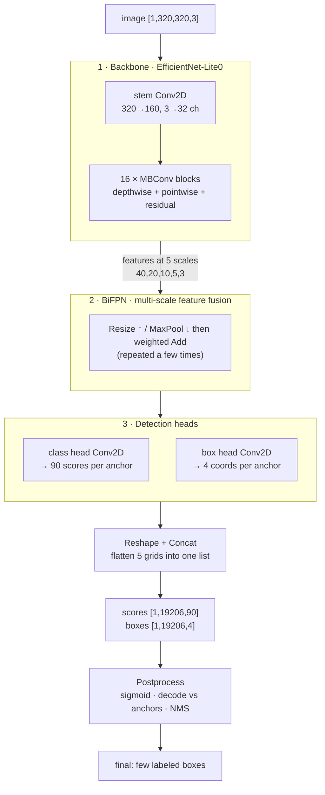
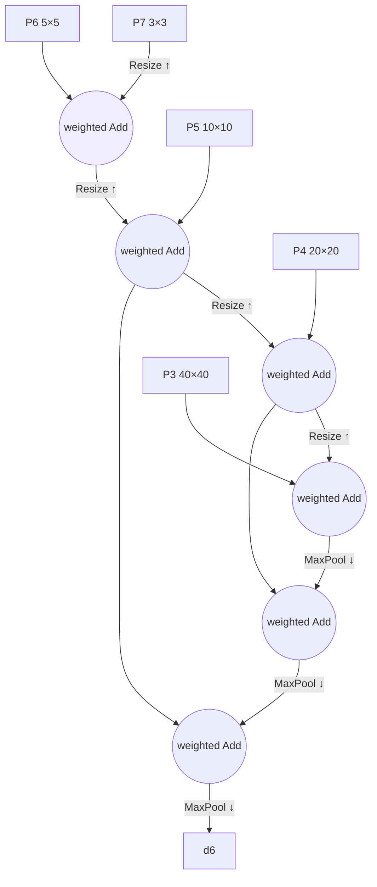

# Chapter 3 — A Vision Model, op by op (EfficientDet-Lite0)

*Goal: follow a **320×320 photo** through an object detector until it outputs labeled boxes
("dog at (x0,y0,x1,y1)"). Different ops than Chapter 2 — but the same idea: a graph of small
kernels on tensors.*

The model lives in `models/efficientdet_lite0_*/`. **EfficientDet-Lite0** is a compact
[object detector](https://arxiv.org/abs/1911.09070): given an image, it finds *what* objects are
present and *where*. It ships here in three numeric precisions — **fp32, fp16, int8** — that
compute the same thing at different size/speed trade-offs. This chapter traces the **fp32**
version (ops named `Conv2D`); Chapter 4 explains how int8 swaps in `QConv2D`.

## 3.1 What the model consumes and produces

```
INPUT   input0 : shape [1, 320, 320, 3]   one 320×320 RGB image (NHWC)
        (int8 variant takes uint8 pixels 0–255; fp32 takes normalized floats)

OUTPUT  scores : shape [1, 19206, 90]     for each of 19206 candidate boxes, 90 class scores
        boxes  : shape [1, 19206, 4]       for each candidate box, 4 coordinates
```

The network proposes **19,206 candidate boxes** covering the image at many positions and sizes,
scores each against **90 object classes** (the COCO label set — person, car, dog, …), and you
keep the few confident, non-overlapping ones. Where does 19,206 come from? Five detection grids
of decreasing resolution, 9 candidate boxes ("anchors") per cell:

```
grid 40×40 × 9 = 14400   (finds small objects)
grid 20×20 × 9 =  3600
grid 10×10 × 9 =   900
grid  5× 5 × 9 =   225
grid  3× 3 × 9 =    81   (finds big objects)
                 ─────
          total  19206
```

The whole graph is **262 nodes** (265 for int8). Inventory:

```
182 Conv2D   42 Add   14 MaxPool2D   12 ResizeNearest2D   10 Reshape   2 Concat
   └─ of the convs: 102 are "pointwise/regular", 80 are "depthwise" (see §3.3)
```

## 3.2 The pipeline at a glance



Three learned stages (backbone → BiFPN → heads) produce raw numbers; a fixed postprocess turns
them into boxes you can draw. Let's take them in order — but first, the one op that dominates:
**convolution**.

---

## 3.3 The core op: convolution (`Conv2D`)

Where the language model leans on `MatMul`, a vision model leans on `Conv2D`. A convolution
slides a small **filter** (a little grid of weights, e.g. 3×3) across the image. At each
position it multiplies the filter by the pixels underneath and sums — a **dot product** — to
produce one output value. Slide it everywhere and you get a new image ("feature map") that lights
up wherever that filter's pattern (an edge, a texture, an eye) appears.

```
   input patch        filter (3×3)      one output pixel
   ┌──────────┐       ┌──────────┐
   │ a  b  c  │       │ w1 w2 w3 │      out = a·w1 + b·w2 + c·w3
   │ d  e  f  │   ⊙   │ w4 w5 w6 │  =       + d·w4 + e·w5 + f·w6
   │ g  h  i  │       │ w7 w8 w9 │          + g·w7 + h·w8 + i·w9
   └──────────┘       └──────────┘        (then slide right by `stride` and repeat)
```

The real reference kernel (`js/ops/conv2D.js`) is just those slides written as nested loops —
batch, output-row, output-col, output-channel, then the filter taps:

```javascript
for (let oh = 0; oh < out_h; oh++)
 for (let ow = 0; ow < out_w; ow++)
  for (let oc = 0; oc < out_c; oc++) {
    let sum = 0;
    for (let ic = 0; ic < in_c; ic++)          // over input channels
     for (let kh = 0; kh < k_h; kh++)          // over filter height
      for (let kw = 0; kw < k_w; kw++) {        // over filter width
        const ih = oh*stride_y + kh*dil_y - pad; // which input pixel
        const iw = ow*stride_x + kw*dil_x - pad;
        if (in-bounds) sum += input[…ih,iw,ic…] * weight[…kh,kw,ic,oc…];
      }
    if (bias) sum += bias[oc];
    if (relu) sum = clamp(sum, 0, 6);           // fused ReLU6 activation
    output[…oh,ow,oc…] = sum;
  }
```

Two flavors of convolution appear, and their combination is the whole efficiency trick of this
model family:

| | **Pointwise** (1×1) | **Depthwise** (3×3, `groups = channels`) |
|---|---|---|
| Filter | 1×1, mixes **channels** | 3×3, mixes **space**, each channel separately |
| Job | "recombine features" | "look at local patterns" |
| Cost | cheap per pixel, but all-to-all channels | very cheap — no channel mixing |

A regular conv does both at once (expensive). **Depthwise-separable** convolution splits it into
a depthwise (spatial) + pointwise (channel) pair that costs a fraction as much for nearly the
same power. That pairing is the `MBConv` block, the backbone's Lego brick — and why 80 of the
182 convs are depthwise.

> **`groups`** in the code: `groups = in_c` means "each channel is convolved by its own filter"
> (depthwise). `groups = 1` means "every output channel sees every input channel" (regular). The
> same kernel handles both by looping over the right channel range.

---

## 3.4 Stage 1 — Backbone: image → features

The **backbone** (an *EfficientNet-Lite0*) is a feature extractor. It repeatedly:

1. **Shrinks** the spatial size (via stride-2 convs and pooling) — 320→160→80→40→20→10→…
2. **Grows** the channel count — 3→32→…→320+ — trading "where" for "what."

Early layers detect edges and colors; middle layers detect textures and parts (an eye, a wheel);
late layers detect whole objects. This hierarchy is *learned*, not programmed.

```
stem:      [1,320,320,  3]  --Conv2D stride2-->  [1,160,160, 32]
MBConv ×16: … depthwise + pointwise + residual Add …   (channels grow, size shrinks)
outputs 5 feature maps at strides 8,16,32,64,128:
   P3 [1,40,40,C]   P4 [1,20,20,C]   P5 [1,10,10,C]   P6 [1,5,5,C]   P7 [1,3,3,C]
```

The **residual `Add`** inside each MBConv is the same trick as the transformer: add the block's
output back onto its input so deep stacks stay trainable. Same idea, different domain.

Why five feature maps instead of one? **Scale.** A 40×40 map has fine detail (good for small
objects); a 3×3 map sees huge receptive fields (good for big objects). Detecting at multiple
scales is how one network finds both a distant bird and a close-up bus.

---

## 3.5 Stage 2 — BiFPN: mix the scales together

A small feature map knows *"there's an object here"* but is spatially coarse; a large one is
precise but semantically shallow. The **BiFPN** (Bi-directional Feature Pyramid Network) lets the
five scales exchange information, top-down and bottom-up, so every scale gets both fine detail
and high-level meaning. It uses exactly three ops you already understand:



- **`ResizeNearest2D`** upsamples a small map to a bigger one (top-down path). *12 of these.*
- **`MaxPool2D`** downsamples a big map to a smaller one (bottom-up path). *14 of these.* The
  kernel (`js/ops/maxPool2D.js`) just keeps the max value in each window.
- **`Add`** (often *weighted* — learnable importance per input) fuses two aligned maps. *42
  Adds* across the model do this fusion and the backbone residuals.

That's it — BiFPN is "resize until two maps are the same size, then add them," repeated. No new
math.

---

## 3.6 Stage 3 — Heads: features → per-anchor predictions

Two small conv stacks (shared across the five scales) read the fused features and, at **every**
grid cell, output predictions for that cell's **9 anchors** (9 reference box shapes of different
sizes/aspect ratios centered on the cell):

- **Class head** → `90` numbers per anchor: a raw score for each object class.
- **Box head** → `4` numbers per anchor: adjustments (dx, dy, dw, dh) to the anchor's position
  and size.

> **Anchors** are the clever bit. Rather than predict boxes from nothing, the model predicts
> small *corrections* to a fixed grid of prior boxes. Predicting "shift this reference box a bit"
> is far easier to learn than "invent a box at (173, 92, 240, 210) from scratch."

---

## 3.7 Stage 4 — Reshape + Concat: flatten five grids into one list

Each of the 5 scales produced predictions in its own grid shape. `Reshape` flattens each grid to
a plain list of anchors, and `Concat` stacks all five lists into one (this is the tail of the
graph — see the real node shapes):

```
class predictions:  [1,40,40,…] → [1,14400,90]  ┐
                    [1,20,20,…] → [1, 3600,90]  │
                    [1,10,10,…] → [1,  900,90]  ├─Concat─▶ scores [1,19206,90]
                    [1, 5, 5,…] → [1,  225,90]  │
                    [1, 3, 3,…] → [1,   81,90]  ┘
box predictions:    … same five grids …        ─Concat─▶ boxes  [1,19206,4]
```

`Reshape` doesn't move numbers around in memory at all — it just reinterprets the same flat
buffer with a new shape (recall §1.2). In this repo it's a copy-through op. **The network's job
is now done:** two tensors, 19,206 scored candidate boxes.

---

## 3.8 Stage 5 — Postprocess: 19,206 candidates → a few boxes

The raw outputs aren't drawable yet. Three fixed (non-learned) steps finish the job:

1. **Sigmoid** the class scores → probabilities in `[0,1]`. (In the int8 export this `Sigmoid`
   was folded away for speed, so `scores` are raw logits; apply sigmoid yourself, or just compare
   them — bigger is still more confident.)
2. **Decode boxes**: turn each anchor's 4 deltas into real pixel corners `(x0,y0,x1,y1)` by
   applying them to that anchor's reference box.
3. **Non-Max Suppression (NMS)**: the same object usually fires several overlapping anchors. NMS
   keeps the highest-scoring box and deletes others that overlap it too much (high *IoU*,
   intersection-over-union), per class. VolvoxAI has this as an op — `js/ops/nonMaxSuppression.js`.

```
before NMS:  ▢▢▢  three overlapping "dog" boxes, scores 0.91, 0.88, 0.72
after  NMS:  ▢    keep the 0.91; suppress the two that overlap it > 50%
```

The native `detect` command (`native/main.c`, `print_detections`) uses a **simplified** version
of step 3 for the demo: it takes the top-`max_det` boxes by their best class score and prints
them as a ranked table (label lookup via `labels.txt`):

```
rank  index  score   class  x0     y0     x1     y1
1     4213   0.91    17     0.31   0.44   0.62   0.88     ← "dog"
2     991    0.86     2     0.05   0.10   0.40   0.95     ← "bicycle"
```

Draw those rectangles on the original photo and you have object detection.

---

## 3.9 The two models, side by side

You've now traced both worlds. Notice how much they share:

| | TinyStories (language) | EfficientDet-Lite0 (vision) |
|---|---|---|
| Input tensor | tokens `[1,256]` | image `[1,320,320,3]` |
| Dominant op | `MatMul` | `Conv2D` |
| "Mixing" mechanism | attention (`SDPA`) across tokens | convolution across pixels |
| Nonlinearity | `GELU` | `ReLU6` (fused into conv) |
| Deep-stack trick | residual `Add` + `LayerNorm` | residual `Add` (in MBConv) |
| Output | logits `[…,50257]` → next word | scores/boxes `[…,19206,…]` → objects |
| Postprocess | argmax / sampling | sigmoid + decode + NMS |

Same skeleton — *a graph of small tensor ops with learned weights* — solving text and pixels.
That transfer is the whole point: learn the skeleton once and every model becomes readable.

The last big question is the one the three EfficientDet folders raise: **fp32 vs fp16 vs int8.**
What are those, and why ship the same model three times? That's Chapter 4.

**Next:** [Chapter 4 — Precision & Quantization →](04-precision-and-quantization.md)
