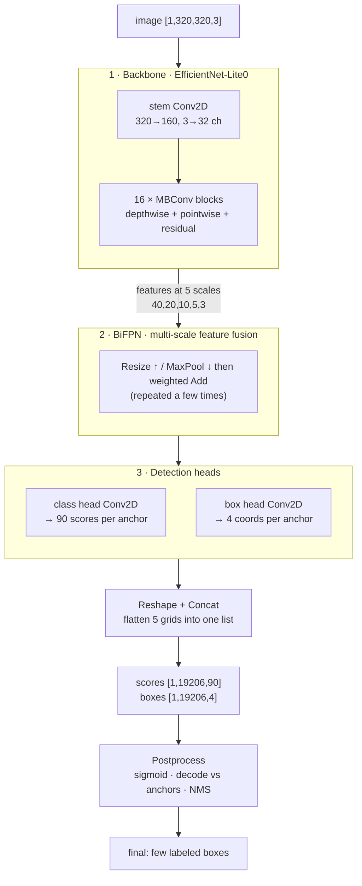
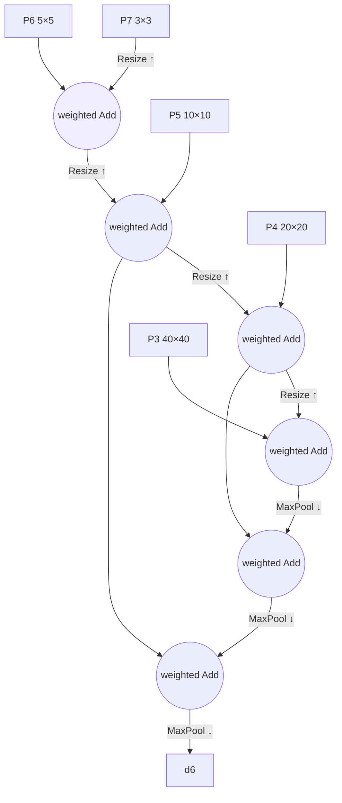

# Chapter 3 — A Vision Model, op by op (EfficientDet-Lite0)

*Read the badges that match you: 🌱 **Idea** (anyone, no code) · 🔧 **Build** (a little code) · 🔬 **Deep**
(engine developers). New here? Follow just the 🌱 sections.*

*Goal: follow a **320×320 photo** through an object detector until it outputs labeled boxes
("dog at (x0,y0,x1,y1)"). Different ops than Chapter 2 — but the same idea: a graph of small
kernels on tensors.*

> 🌱 **The big idea.** Last chapter the machine read words; this chapter it looks at a **photo** and
> draws boxes around the things in it ("dog here, bicycle there"). Amazingly, it's the *same kind of
> machine* — a graph of tiny math steps on grids of numbers — just with a different star operation.
> Instead of words looking at each other, a little **filter slides across the picture** hunting for
> patterns (edges, then eyes, then whole dogs). At the end the machine has thousands of guessed
> boxes, and a final cleanup step keeps only the few good ones. Same skeleton as the language model,
> pointed at pixels.

🔧 The model lives in `models/efficientdet_lite0_*/`. **EfficientDet-Lite0** is a compact
[object detector](https://arxiv.org/abs/1911.09070): given an image, it finds *what* objects are
present and *where*. It ships here in three numeric precisions — **fp32, fp16, int8** — that
compute the same thing at different size/speed trade-offs. This chapter traces the **fp32**
version (ops named `Conv2D`); Chapter 6 explains how int8 swaps in `QConv2D`.

> **🌱 Where this model comes from.** EfficientDet-Lite0 isn't trained here either — the weights come
> from **Google's MediaPipe** model store (the public `efficientdet_lite0.tflite`, released in
> fp32/fp16/int8). VolvoxAI **converts** that TFLite model into the two-file graph package (`graph.json` +
> `model.safetensors` + `labels.txt`); `make models_efficientdet` regenerates it from the public source.
> Same pattern as the language model: a real, pretrained model brought into VolvoxAI's format, not
> trained from scratch here. (Details: `docs/models.md`, `examples/efficientdet_lite0/`.)

## 3.1 What the model consumes and produces

> 🌱 **Idea.** In goes one photo. Out comes a huge pile of *candidate* boxes — about 19,000 of them
> — each with a guess of "how likely is this a dog? a car? a person?" Most are junk; we'll throw
> them away at the end and keep the handful that are confident and don't overlap.

🔧

```
INPUT   input0 : shape [1, 320, 320, 3]   one 320×320 RGB image (NHWC)
        (int8 variant takes uint8 pixels 0–255; fp32 takes normalized floats)

OUTPUT  scores : shape [1, 19206, 90]     for each of 19206 candidate boxes, 90 class scores
        boxes  : shape [1, 19206, 4]       for each candidate box, 4 coordinates
```

The network proposes **19,206 candidate boxes** covering the image at many positions and sizes,
scores each against **90 object classes** (the COCO label set — person, car, dog, …), and you
keep the few confident, non-overlapping ones. 🔬 Where does 19,206 come from? Five detection grids
of decreasing resolution, 9 candidate boxes ("anchors") per cell:

```
grid 40×40 × 9 = 14400   (finds small objects)
grid 20×20 × 9 =  3600
grid 10×10 × 9 =   900
grid  5× 5 × 9 =   225
grid  3× 3 × 9 =    81   (finds big objects)
                 ─────
          total  19206
```

🔬 The whole graph is **262 nodes** (265 for int8). Inventory:

```
182 Conv2D   42 Add   14 MaxPool2D   12 ResizeNearest2D   10 Reshape   2 Concat
   └─ of the convs: 102 are "pointwise/regular", 80 are "depthwise" (see §3.3)
```

## 3.2 The pipeline at a glance

> 🌱 **Idea.** Three learned stages, then a cleanup. First a **backbone** boils the photo down into
> "features" (what's where). Then a **mixer** (BiFPN) lets big-picture and fine-detail views share
> notes. Then two **heads** turn features into "what class?" and "what box?" guesses. Finally a
> fixed cleanup turns the raw numbers into the few boxes you actually draw.

🔧



Three learned stages (backbone → BiFPN → heads) produce raw numbers; a fixed postprocess turns
them into boxes you can draw. Let's take them in order — but first, the one op that dominates:
**convolution**.

---

## 3.3 The core op: convolution (`Conv2D`)

> 🌱 **Idea.** Take a tiny stencil — say 3×3 — and slide it across the whole picture. At each spot,
> multiply the stencil's numbers by the pixels underneath and add them up to get one number. Slide
> it everywhere and you get a new picture that "lights up" wherever the stencil's pattern appears.
> One stencil finds vertical edges; another finds a patch of fur; a later one finds an eye. Stack
> enough of these and the machine goes from edges → parts → whole objects. That sliding-stencil
> move is **convolution**, and it's to vision what attention is to language.
>
> *A stencil you can read:* the 3×3 filter `[[-1,0,1],[-1,0,1],[-1,0,1]]` subtracts the left column
> from the right, so its output lights up exactly where the image goes dark→light moving rightward — a
> **vertical-edge detector**. Early layers learn dozens of little filters like this; the machine just
> isn't told in advance which ones to learn.

🔧 Where the language model leans on `MatMul`, a vision model leans on `Conv2D`. A convolution
slides a small **filter** (a little grid of weights, e.g. 3×3) across the image. At each
position it multiplies the filter by the pixels underneath and sums — a **dot product** — to
produce one output value. Slide it everywhere and you get a new image ("feature map") that lights
up wherever that filter's pattern (an edge, a texture, an eye) appears.

```
   input patch        filter (3×3)      one output pixel
   ┌──────────┐       ┌──────────┐
   │ a  b  c  │       │ w1 w2 w3 │      out = a·w1 + b·w2 + c·w3
   │ d  e  f  │   ⊙   │ w4 w5 w6 │  =       + d·w4 + e·w5 + f·w6
   │ g  h  i  │       │ w7 w8 w9 │          + g·w7 + h·w8 + i·w9
   └──────────┘       └──────────┘        (then slide right by `stride` and repeat)
```

🔬 The real reference kernel (`ts/ops/conv2D.ts`) is just those slides written as nested loops —
batch, output-row, output-col, output-channel, then the filter taps:

```javascript
for (let oh = 0; oh < out_h; oh++)
 for (let ow = 0; ow < out_w; ow++)
  for (let oc = 0; oc < out_c; oc++) {
    let sum = 0;
    for (let ic = 0; ic < in_c; ic++)          // over input channels
     for (let kh = 0; kh < k_h; kh++)          // over filter height
      for (let kw = 0; kw < k_w; kw++) {        // over filter width
        const ih = oh*stride_y + kh*dil_y - pad; // which input pixel
        const iw = ow*stride_x + kw*dil_x - pad;
        if (in-bounds) sum += input[…ih,iw,ic…] * weight[…kh,kw,ic,oc…];
      }
    if (bias) sum += bias[oc];
    if (relu) sum = clamp(sum, 0, 6);           // fused ReLU6 activation
    output[…oh,ow,oc…] = sum;
  }
```

> 🔬 **Under the hood: a convolution is a matrix multiply in disguise.** The nested loops are the
> *definition*; fast engines don't run them literally. The usual trick is **im2col** — unfold every
> sliding patch into a row of a big matrix so the whole convolution becomes one **GEMM**, reusing the
> exact tuned code the language model's `MatMul` uses. The native engine even **prepacks** conv weights
> at load time into that GEMM-friendly layout (`prepack_conv_weights`, Chapter 9). And the cost is
> worth carrying: a `Conv2D` does `out_h · out_w · out_c · in_c · k_h · k_w` multiply-adds — the stem
> alone is `160·160·32·3·9 ≈ 22M` — which is why the cheaper convolution in the next paragraph matters
> so much.

🔧 Two flavors of convolution appear, and their combination is the whole efficiency trick of this
model family:

| | **Pointwise** (1×1) | **Depthwise** (3×3, `groups = channels`) |
|---|---|---|
| Filter | 1×1, mixes **channels** | 3×3, mixes **space**, each channel separately |
| Job | "recombine features" | "look at local patterns" |
| Cost | cheap per pixel, but all-to-all channels | very cheap — no channel mixing |

🌱 A regular convolution does both jobs at once, which is expensive. The trick this model uses is
to split them into two cheap halves — one looks at *shape*, the other mixes *colors/features* —
getting almost the same result for a fraction of the work. 🔬 That pairing (**depthwise-separable**
convolution) is the `MBConv` block, the backbone's Lego brick — and why 80 of the 182 convs are
depthwise.

> 🔬 **`groups`** in the code: `groups = in_c` means "each channel is convolved by its own filter"
> (depthwise). `groups = 1` means "every output channel sees every input channel" (regular). The
> same kernel handles both by looping over the right channel range.

> 🔬 **Under the hood: why depthwise-separable is ~8× cheaper.** Replace one regular `C→C` 3×3 conv
> over an `H×W` map — cost `H·W·C·C·9` — with a **depthwise** 3×3 (`H·W·C·9`, no channel mixing) then a
> **pointwise** 1×1 (`H·W·C·C`, no spatial mixing). The cost ratio is `(1/C) + (1/9)`, so at `C = 128`
> the pair runs at about **1/8** of the regular conv for nearly the same modeling power. Do that in all
> 16 MBConv blocks and you get a detector that fits on a phone.

---

## 3.4 Stage 1 — Backbone: image → features

> 🌱 **Idea.** The backbone slowly shrinks the picture while growing the amount of *meaning* it
> carries. Early layers notice edges and colors; middle layers notice textures and parts (an eye, a
> wheel); late layers recognize whole objects. Nobody programmed "this is an eye" — the machine
> *learned* that ladder from examples. It spits out five versions of the picture at different zoom
> levels, because a close-up bird and a giant bus are easiest to spot at different zooms.

🔧 The **backbone** (an *EfficientNet-Lite0*) is a feature extractor. It repeatedly:

1. **Shrinks** the spatial size (via stride-2 convs and pooling) — 320→160→80→40→20→10→…
2. **Grows** the channel count — 3→32→…→320+ — trading "where" for "what."

Early layers detect edges and colors; middle layers detect textures and parts (an eye, a wheel);
late layers detect whole objects. This hierarchy is *learned*, not programmed.

> 🔬 **Under the hood: the inverted residual (MBConv).** Each MBConv block is **expand → depthwise →
> project**: a 1×1 conv first *widens* the channels (often 4×), a cheap depthwise 3×3 does the spatial
> work in that wide space, then a 1×1 conv *projects* back down, with a residual `Add` when the shapes
> match. It's called an **inverted** residual because — unlike a classic bottleneck with a thin middle —
> the middle is the *widest* part and the ends are thin. The five feature maps are tapped at strides
> **8 / 16 / 32 / 64 / 128**, so P3 reacts to ~8-pixel regions and P7 to ~128-pixel regions: the
> zoom ladder is literally built from where you tap the backbone.

```
stem:      [1,320,320,  3]  --Conv2D stride2-->  [1,160,160, 32]
MBConv ×16: … depthwise + pointwise + residual Add …   (channels grow, size shrinks)
outputs 5 feature maps at strides 8,16,32,64,128:
   P3 [1,40,40,C]   P4 [1,20,20,C]   P5 [1,10,10,C]   P6 [1,5,5,C]   P7 [1,3,3,C]
```

The **residual `Add`** inside each MBConv is the same trick as the transformer: add the block's
output back onto its input so deep stacks stay trainable. Same idea, different domain.

🌱 Why five feature maps instead of one? **Scale.** A fine 40×40 map is great for tiny objects; a
coarse 3×3 map takes in the whole scene, great for big objects. Looking at several zooms is how one
network finds both a distant bird and a close-up bus.

---

## 3.5 Stage 2 — BiFPN: mix the scales together

> 🌱 **Idea.** The zoomed-out view knows *"there's something big here"* but is blurry; the zoomed-in
> view is sharp but doesn't see the big picture. BiFPN just lets these views **trade notes** — shrink
> or grow maps until they line up, then add them together — so every zoom level ends up both sharp
> *and* wise. It's built from ops you already know: resize, pool, add. No new math.

🔧 A small feature map knows *"there's an object here"* but is spatially coarse; a large one is
precise but semantically shallow. The **BiFPN** (Bi-directional Feature Pyramid Network) lets the
five scales exchange information, top-down and bottom-up, so every scale gets both fine detail
and high-level meaning. It uses exactly three ops you already understand:



- **`ResizeNearest2D`** upsamples a small map to a bigger one (top-down path). *12 of these.*
- **`MaxPool2D`** downsamples a big map to a smaller one (bottom-up path). *14 of these.* The
  kernel (`ts/ops/maxPool2D.ts`) just keeps the max value in each window.
- **`Add`** (often *weighted* — learnable importance per input) fuses two aligned maps. *42
  Adds* across the model do this fusion and the backbone residuals.

That's it — BiFPN is "resize until two maps are the same size, then add them," repeated. No new
math.

> 🔬 **Under the hood: weighted (fast normalized) fusion.** The `Add`s that merge two scales aren't
> plain sums — each input gets a small **learned weight**, kept non-negative and normalized to sum to 1
> (`wᵢ / (Σ wⱼ + ε)`), so the network learns *which* scale to trust at each merge point without the
> weights running away. One full top-down + bottom-up sweep is a single **BiFPN layer**, and
> EfficientDet stacks a few of them — which is why the 12 resizes and 14 pools recur in a regular
> pattern rather than appearing once.

---

## 3.6 Stage 3 — Heads: features → per-anchor predictions

> 🌱 **Idea.** Two small readers scan the mixed features. One guesses *what* is at each spot (dog?
> car?); the other guesses *where* the box should be. Instead of inventing boxes from thin air, they
> start from a fixed set of pre-drawn "reference boxes" and just nudge them — much easier to learn.

🔧 Two small conv stacks (shared across the five scales) read the fused features and, at **every**
grid cell, output predictions for that cell's **9 anchors** (9 reference box shapes of different
sizes/aspect ratios centered on the cell):

- **Class head** → `90` numbers per anchor: a raw score for each object class.
- **Box head** → `4` numbers per anchor: adjustments (dx, dy, dw, dh) to the anchor's position
  and size.

> 🔬 **Anchors** are the clever bit. Rather than predict boxes from nothing, the model predicts
> small *corrections* to a fixed grid of prior boxes. Predicting "shift this reference box a bit"
> is far easier to learn than "invent a box at (173, 92, 240, 210) from scratch."
>
> 🔬 **Under the hood: 9 anchors, shared heads.** The 9 anchors per cell are **3 sizes × 3 aspect
> ratios** (tall, square, wide), so one cell can propose a skinny pedestrian and a wide car at the same
> time. The class and box heads are **shared across all five scales** — the *same* conv weights run on
> P3…P7 — so a single head covers objects from tiny to huge; the scale comes from *which* feature map
> it reads, not from a separate head per size.

---

## 3.7 Stage 4 — Reshape + Concat: flatten five grids into one list

> 🌱 **Idea.** The five zoom levels each produced their guesses in their own little grid. Here we
> just pour them all into one long list of ~19,000 candidates. No math — only rearranging.

🔧 Each of the 5 scales produced predictions in its own grid shape. `Reshape` flattens each grid to
a plain list of anchors, and `Concat` stacks all five lists into one (this is the tail of the
graph — see the real node shapes):

```
class predictions:  [1,40,40,…] → [1,14400,90]  ┐
                    [1,20,20,…] → [1, 3600,90]  │
                    [1,10,10,…] → [1,  900,90]  ├─Concat─▶ scores [1,19206,90]
                    [1, 5, 5,…] → [1,  225,90]  │
                    [1, 3, 3,…] → [1,   81,90]  ┘
box predictions:    … same five grids …        ─Concat─▶ boxes  [1,19206,4]
```

🔬 `Reshape` doesn't move numbers around in memory at all — it just reinterprets the same flat
buffer with a new shape (recall §1.2). In this repo it's a copy-through op. **The network's job
is now done:** two tensors, 19,206 scored candidate boxes.

---

## 3.8 Stage 5 — Postprocess: 19,206 candidates → a few boxes

> 🌱 **Idea.** Now the cleanup. Turn the raw scores into "how confident, 0–100%." Turn each nudged
> reference box into real pixel corners. Then throw away duplicates: when five overlapping boxes all
> shout "dog!", keep the most confident one and delete the rest. What's left is the handful of boxes
> you draw on the photo.
>
> *Two everyday numbers.* **Sigmoid** turns a raw score into a 0–100% confidence — a big positive
> score becomes ~99%, a negative one ~1%. **IoU** ("intersection over union") measures overlap: two
> boxes covering the exact same area score 1.0, boxes that barely touch score near 0. NMS deletes a box
> when its IoU with a stronger box crosses a threshold like 0.5.

🔧 The raw outputs aren't drawable yet. Three fixed (non-learned) steps finish the job:

1. **Sigmoid** the class scores → probabilities in `[0,1]`. (In the int8 export this `Sigmoid`
   was folded away for speed, so `scores` are raw logits; apply sigmoid yourself, or just compare
   them — bigger is still more confident.)
2. **Decode boxes**: turn each anchor's 4 deltas into real pixel corners `(x0,y0,x1,y1)` by
   applying them to that anchor's reference box.
3. **Non-Max Suppression (NMS)**: the same object usually fires several overlapping anchors. NMS
   keeps the highest-scoring box and deletes others that overlap it too much (high *IoU*,
   intersection-over-union), per class. VolvoxAI has this as an op — `ts/ops/nonMaxSuppression.ts`.

> 🔬 **Under the hood: decode and NMS, precisely.** *Decode* turns the 4 box deltas into pixels
> relative to the anchor: the center shifts by `(dy, dx)` scaled to the anchor's size, and the
> width/height scale by `exp(dh)` / `exp(dw)` — the `exp` guarantees a positive size and lets one delta
> express "half" or "double." *NMS* then works per class: sort candidates by score, greedily keep the
> top one, discard any later box whose IoU with a kept box exceeds the threshold, repeat — an `O(n²)`
> sweep in the worst case, which is why a score threshold prunes the ~19,206 candidates to a few dozen
> *before* NMS runs.

```
before NMS:  ▢▢▢  three overlapping "dog" boxes, scores 0.91, 0.88, 0.72
after  NMS:  ▢    keep the 0.91; suppress the two that overlap it > 50%
```

🔬 The opt-in native `detect` example
(`examples/native_task_cli/main.c`, `print_detections`) uses a **simplified**
version of step 3: it takes the top-`max_det` boxes by their best class score
and prints them as a ranked table (label lookup via `labels.txt`):
The `score_pct` column shows the same score as a percentage.

```
rank  index  score   score_pct  class  label    x0     y0     x1     y1
1     4213   0.91    91.00%     17     dog      0.31   0.44   0.62   0.88
2     991    0.86    86.00%      1     bicycle  0.05   0.10   0.40   0.95
```

Draw those rectangles on the original photo and you have object detection.

---

## 3.9 The two models, side by side

> 🌱 **Idea recap.** You've now watched the *same kind of machine* read words and look at pictures.
> Different star operation (attention for words, convolution for pixels), different cleanup — but
> underneath, both are just a graph of tiny math steps on grids of numbers, with learned weights.
> Learn that skeleton once and every model becomes readable.

🔧 You've now traced both worlds. Notice how much they share:

| | TinyStories (language) | EfficientDet-Lite0 (vision) |
|---|---|---|
| Input tensor | tokens `[1,256]` | image `[1,320,320,3]` |
| Dominant op | `MatMul` | `Conv2D` |
| "Mixing" mechanism | attention (`SDPA`) across tokens | convolution across pixels |
| Nonlinearity | `GELU` | `ReLU6` (fused into conv) |
| Deep-stack trick | residual `Add` + `LayerNorm` | residual `Add` (in MBConv) |
| Output | logits `[…,50257]` → next word | scores/boxes `[…,19206,…]` → objects |
| Postprocess | argmax / sampling | sigmoid + decode + NMS |

Same skeleton — *a graph of small tensor ops with learned weights* — solving text and pixels.
That transfer is the whole point: learn the skeleton once and every model becomes readable.

That closes **Part I**. We have now followed two *trained* models — a language model and a
detector — from input to answer, op by op. But we quietly took the hardest thing for granted: the
**weights**, those learned tables that make each op do something useful. Where do they come from?
**Part II** opens that box: the **backward pass**, the optimizer, and the training loop.

*(The fp32 / fp16 / int8 question those three EfficientDet folders raise is answered later, in
Chapter 6, once we have a trained model worth shrinking.)*

**Next:** [Chapter 4 — The Backward Pass →](04-backward-pass.md)
