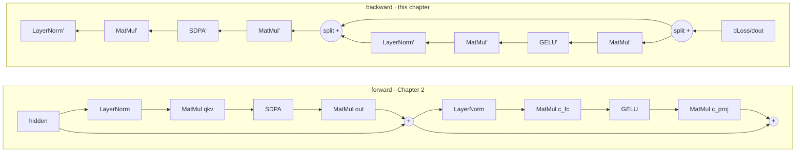

# Chapter 4 — The Backward Pass

*Read the badges that match you: 🌱 **Idea** (anyone, no code) · 🔧 **Build** (a little code) · 🔬 **Deep**
(engine developers). New here? Follow just the 🌱 sections.*

*Goal: understand where the weights come from. We take the exact transformer from Chapter 2, measure
how wrong its prediction was, and push that error **backward** through the graph — computing, for
every weight, the direction that would make it a little less wrong. Every op you met in Part I has a
**backward twin**, and they all live in `native/src/kernels/training_kernels.c` and
`shaders/training/*Backward.wgsl`.*

> 🌱 **The big idea.** So far the machine already knew the "pantry numbers" (the weights). But where
> did they come from? Answer: the machine **practiced**. It made a guess, someone told it the right
> answer, it measured **how wrong** it was (one number, like a golf score — lower is better), and
> then it figured out, for every single knob inside it, *"should I turn this up or down to be a
> little less wrong?"* Do that millions of times and a random machine slowly becomes a smart one.
> This chapter is about that one crucial move: **going backward through the machine to assign a
> little bit of the blame to every knob.** That's called the *backward pass*, and — surprise — it's
> the same graph from Chapter 2, just run in reverse.

🔧 Part I ran models that someone had already trained. We treated the weights as given. This chapter
opens the box. Training is a loop of three steps:

```
   1. FORWARD   run the graph, get an output          (Chapters 1–3)
   2. BACKWARD  measure the error, compute gradients   ← this chapter
   3. UPDATE    nudge every weight down the gradient    (Chapter 5)
```

The surprising part: step 2 is *the same graph run in reverse*, op by op, using kernels that are
near-mirror images of the forward ones. If you understood the forward pass, you already understand
the shape of the backward pass.

## 4.1 The one number: a loss

> 🌱 **Idea.** First we need a **score for how wrong** the guess was — a single number. Think of it
> like a golf score: 0 means perfect, and the bigger it is, the worse the guess. Training is just
> "keep playing until the score gets low." This wrongness-number is called the **loss**.

🔧 The forward pass ends with 50257 logits — a score per vocabulary word. During generation we just
took the `argmax`. During **training** we know the *right* answer (the actual next word in the
training text), so instead we ask a sharper question: **how wrong were these scores?**

A **loss function** collapses the entire output into a single number — bigger means more wrong. For a
language model the loss is **cross-entropy**: it rewards putting high probability on the correct
token and punishes confidence in the wrong ones. 🔬 VolvoxAI computes it in one kernel that returns
both the loss *and* the first gradient (`native/src/kernels/training_kernels.c`):

```c
// volvoxai_training_cross_entropy_f32 — loss AND its gradient in one pass
//   logits[e, :]  the model's scores for example e   (classes = 50257)
//   targets[e]    the correct token id for example e
//   grad          filled with dLoss/dLogits          (same shape as logits)
uint32_t volvoxai_training_cross_entropy_f32(
    const float *logits, const int32_t *rows, const int32_t *targets, float *grad,
    uint32_t examples, uint32_t classes, float gradient_scale,
    float *loss_sum, uint32_t *correct);
```

🔧 Two outputs matter:

- **`loss_sum`** — the scalar "how wrong," which you watch go *down* as training proceeds.
- **`grad`** — for every one of the 50257 logits, `dLoss/dLogit`: *if this score went up by a
  hair, how much would the loss change?* 🔬 For cross-entropy this has a famously clean form,
  `softmax(logits) − onehot(target)`: the predicted probabilities, minus 1.0 on the true token.

That `grad` tensor is the **seed of the backward pass**. Everything from here is about carrying it
backward through the graph until every *weight* has one too.

## 4.2 What a gradient is (and why we want it)

> 🌱 **Idea.** Imagine standing on a hillside in fog, wanting to reach the bottom. You can't see the
> valley, but you *can* feel which way the ground slopes under your feet — and you take a step
> downhill. A **gradient** is exactly that "which way is downhill, and how steep" feeling, but for
> one knob: *"if I turn this knob up a little, does the wrongness go up or down?"* If turning it up
> makes things worse, turn it down instead. Do this for every knob and the whole machine rolls
> downhill toward "less wrong."

🔧 A **gradient** is a slope. For a single weight `w`, its gradient `dLoss/dw` answers: *"if I
increase `w` slightly, does the loss go up or down, and how fast?"*

```
   loss
    │        ●  we are here (w = 0.30), slope dLoss/dw = +4.0
    │       ╱     → loss rises as w rises → so move w the OTHER way (decrease it)
    │      ╱
    │  ___╱
    └───────────────── w
        0.30
```

If we know that slope for **every** weight, we know how to adjust the whole model: step each weight a
little bit *opposite* its gradient, and the loss goes down. That step is Chapter 5. This chapter is
about getting the slopes.

🔧 The obstacle: a weight in layer 1 affects the loss only *through* every layer after it. We can't
read its slope directly. The solution is the **chain rule** — and applying it op by op, from the
output backward, is called **backpropagation**.

## 4.3 Backprop = the chain rule, one op at a time

> 🌱 **Idea.** How do you fairly blame a knob buried deep in the machine for a mistake at the very
> end? You **pass the blame backward, one step at a time.** The last step says "here's how much *my*
> output was off"; it hands that to the step before it, which works out *its* share and passes it
> further back, and so on to the very first step. Like a line of people passing a message backward,
> each adjusting it for their own part. When the blame has traveled all the way back, every knob
> knows how much it contributed — and therefore which way to turn.

🔧 Here is the whole idea in one line. If an op takes input `x` to output `y`, and we already know
`dLoss/dy` (the gradient *arriving* from the ops after it), then the op's backward twin produces
`dLoss/dx` (the gradient to hand to the ops *before* it):

```
   forward:     x ──[ op ]──▶ y
   backward:  dLoss/dx ◀─[ op' ]── dLoss/dy        (op' reuses x and/or y)
```

So the backward pass starts with `dLoss/dlogits` (from §4.1) and walks the node list **in reverse**,
each op converting the gradient of its output into the gradient of its input — and, if the op has
weights, computing `dLoss/dweight` on the way. That is literally all backprop is: a `for` loop over
the graph, backwards, mirroring the forward `for` loop from Chapter 1.

🔬 **Every forward op has a backward twin.** The naming is one-to-one:

| Forward op (Part I) | Backward twin (`training_kernels.c` / `shaders/training/`) | Produces |
|---|---|---|
| `Add` (residual) | `..._add_backward_f32` / `basicBackward.wgsl` | `da`, `db` |
| `MatMul` / Linear | `..._linear_backward_f32` / `matMulBackward.wgsl` | `dx`, `dw`, `db` |
| `GELU` / ReLU / SiLU | `..._activation_backward_f32` / `activationBackward.wgsl` | `dx` |
| `LayerNorm` / RMSNorm | `..._layernorm_backward_f32` / `layerNormBackward.wgsl` | `dx`, `dweight`, `dbias` |
| `SDPA` (attention) | `..._sdpa_backward_f32` / `sdpaBackward.wgsl` | `dqkv` |
| `Embedding` | `..._embedding_backward_f32` / `embeddingBackward.wgsl` | `dw` (the table) |
| `Conv2D` | `..._conv2d_backward_f32` / `conv2DBackward.wgsl` | `dx`, `dw`, `db` |
| `Softmax` | `..._softmax_backward_f32` / `softmaxBackward.wgsl` | `dx` |

(The full list — MoE, cross-attention, dropout, gather, resize, pad, … — is the rest of that header.
There is a `*Backward` for nearly every forward kernel, which is exactly what makes the whole graph
trainable.)

## 4.4 Four backward twins, concretely

> 🌱 **Idea.** You can skip the code below — but here's the gist of four "pass the blame backward"
> rules: **Add** hands the same blame to both of its inputs. **MatMul** (the big multiply) sends
> blame backward *and* notes how to fix its own knobs. **GELU** (a gate) lets blame through where
> it's "open" and blocks it where it's "shut." **Embedding** (the word-lookup table) sends the blame
> back to exactly the word-rows that were used. Different rules, same job.

🔧 Let's read the mirror image of four ops you already know from Chapter 2.

### `Add` — the easiest twin (a residual fork)

Forward, `Add` just sums: `y = a + b`. So nudging `a` by ε nudges `y` by ε, and likewise for `b`.
The gradient therefore flows to **both** inputs unchanged — the backward twin is a copy:

```c
// volvoxai_training_add_backward_f32: gradient of y = a + b
for (uint32_t i = 0; i < n; i++) {
    da[i] += dy[i];    // ∂y/∂a = 1
    db[i] += dy[i];    // ∂y/∂b = 1
}
```

🌱 This is why **residual connections** (`out = x + f(x)`, everywhere in Chapter 2) help training so
much: the `Add` hands the blame *straight back* with full strength, so even very deep stacks keep a
clean path all the way to their early knobs — nobody gets "left out" of the blame.

> 🔬 **Why `+=`, not `=`?** Notice the twins *accumulate* (`da[i] +=`). In the residual stream a
> single tensor feeds several ops (it forks). Each consumer sends back its own share of the gradient,
> and the **total** effect is their sum. Accumulating with `+=` adds those shares up — the
> backward-pass equivalent of a fork in the forward graph. Every VolvoxAI gradient destination
> follows this rule.

### `MatMul` / Linear — the workhorse

Forward: `y = x · W` (the projection that appears four times per transformer block). Its twin returns
*three* gradients — for the input, the weight, and the bias:

```c
// volvoxai_training_linear_backward_f32, in words:
//   dx = dy · Wᵀ            gradient to pass to the previous op
//   dW = xᵀ · dy            gradient of THIS layer's weight   ← what we'll update
//   db = column-sum of dy   gradient of the bias
```

🔬 `dW` is the payoff: it says how to change *this* weight matrix to reduce the loss. Note the
symmetry — the forward pass multiplies by `W`; the backward pass multiplies by `Wᵀ`. A transposed
matmul is a matmul, which is why backward is about as expensive as forward (and reuses the same fast
GEMM).

### `GELU` (and friends) — a local gate

An activation acts element-by-element, so its twin is a per-element multiply by the slope of its
curve at that point:

```c
// volvoxai_training_activation_backward_f32(kind = GELU, …):
dx[i] = dy[i] * gelu_prime(x[i]);   // scale the incoming gradient by the local slope
```

Where the GELU curve is steep, gradient passes through; where it's flat (large negative `x`), the
gradient is throttled toward zero. 🔬 The `kind` argument selects the twin — ReLU, GELU, SiLU,
sigmoid, tanh, hard-swish — matching the forward activations from Parts I and III.

### `Embedding` — a scatter-add back into the table

Forward, `Embedding` *reads* row `token_id` out of the `[50257, 64]` table. Backward, it must *write*
the gradient back into exactly those rows — and if the same token appeared twice, both contributions
add up:

```c
// volvoxai_training_embedding_backward_f32, in words:
for each token t in the sequence:
    dW[ ids[t] , : ] += dy[ t , : ];   // scatter this token's gradient onto its row
```

🌱 Only the word-rows that actually showed up get adjusted this round — which is why rare words learn
slowly (they rarely get their turn). This is the mirror of the table *lookup* from Chapter 2 §2.4.

## 4.5 The transformer block, in reverse

> 🌱 **Idea.** Put it together: take one "thinking room" from Chapter 2 and run it backward. Blame
> enters at the end and flows back through every step, in reverse order, and along the way each
> multiply and each normalize step writes down how to fix its own knobs. Do this for all 8 rooms and
> then back through the word-lookup, and **every knob in the whole machine now has a "turn me this
> way" note.** That's one backward pass.

🔧 Here is one Chapter 2 block, forward and then backward. The backward pass visits the exact same
ops in the opposite order, each replaced by its twin, with gradient accumulating (`+=`) wherever the
forward graph forked:



Read the backward graph right-to-left. Each residual `Add` becomes a **split** that sends the
gradient down both branches (§4.4), the branches recombine with `+=`, and every `MatMul'`,
`LayerNorm'`, and `SDPA'` deposits a `dW` for its weights along the way. Run this for all 8 blocks,
then back through the embedding, and **every weight in the model now has a gradient**.

🔬 `SDPA'` (`volvoxai_training_sdpa_backward_f32`) is the busiest twin — it must route gradient back
through the softmax *and* the Q·K similarities *and* the value blend — but conceptually it is still
just "given `dLoss/d(attention output)`, produce `dLoss/d(qkv)`." The causal mask that blocked
forward information flow (§2.5b) blocks it the same way in reverse.

## 4.6 Where gradients stop

> 🌱 **Idea.** Some steps can't be "blamed" — there's no meaningful up/down slope through them (like
> the final hard choice of *which* word to pick). Training simply doesn't send blame through those;
> it routes around them. VolvoxAI is careful and explicit about where the blame trail ends.

🔬 Not everything is differentiable, and VolvoxAI is explicit about it:

- **Sampling / argmax** — picking the next token is a hard choice with no useful slope. Training
  never backpropagates through the sampler; it backpropagates through the *loss on the logits*
  (§4.1), which is smooth.
- **Casts to integers and quantization** — `volvoxai_training_cast_backward_f32` deliberately
  **stops** the gradient for any integer-involved cast. (Quantization-aware training gets around this
  with a special twin, `volvoxai_training_dequantize_linear_backward_f32` — that's Chapter 7.)
- **Non-finite guards** — `volvoxai_training_all_finite_f32` lets the trainer detect a NaN/Inf
  gradient (from a too-large learning rate or numerical blow-up) *before* it corrupts the weights.

## 4.7 What you just learned

> 🌱 **Idea recap.** A machine learns by practicing: guess → measure how wrong (the **loss**) → send
> the blame **backward** so every knob learns which way to turn → nudge the knobs (next chapter) →
> repeat. The backward pass is just the forward machine run in reverse, passing blame step by step.
> No magic — the same little math, going the other direction.

🔧

- **Training = forward → backward → update.** This chapter is the middle step.
- A **loss** (cross-entropy for the LM) turns the whole output into one number — *how wrong* — and
  its gradient w.r.t. the logits is the **seed** of the backward pass.
- **Backpropagation** is the chain rule applied op by op, walking the graph in **reverse**. Every
  forward op has a **backward twin** that turns `dLoss/d(output)` into `dLoss/d(input)` and, for
  ops with weights, a `dLoss/dweight`.
- The twins mirror the forward kernels: `Add` copies the gradient to both branches (so residuals
  keep gradients healthy), `MatMul` multiplies by `Wᵀ`, activations scale by a local slope,
  `Embedding` scatter-adds back into the table. Forks in the forward graph become `+=` in reverse.
- After one backward pass, **every weight has a gradient** — a direction to move. Turning those
  directions into an actual improvement is the optimizer's job.

**Next:** [Chapter 5 — The Optimizer & the Training Loop →](05-optimizer-and-training-loop.md)
