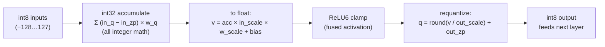

# Chapter 4 — Precision & Quantization (fp32 / fp16 / int8)

*Goal: understand why the same detector ships in three folders, how numbers are stored as bits,
and the exact integer math that makes the int8 model 4× smaller — with almost no accuracy loss.*

Look at the three EfficientDet folders. Same architecture (Chapter 3), same 262-ish nodes,
**very different file sizes**:

| Folder | Weights store each number as… | `model.safetensors` | Relative |
|---|---|---|---|
| `efficientdet_lite0_fp32` | 32-bit float | **12.67 MB** | 1.0× |
| `efficientdet_lite0_fp16` | 16-bit float | **6.34 MB** | 0.50× |
| `efficientdet_lite0_int8` | 8-bit integer | **3.39 MB** | 0.27× |

The *model* is identical. Only the **number format** — the **precision** — changed. Smaller
numbers → smaller downloads, less memory, and (with the right hardware) faster math. This chapter
is about that trade.

---

## 4.1 How a computer stores a number

A neural net weight like `0.10125` has to become a fixed pattern of bits. There are two families.

### Floating-point (fp32, fp16): "scientific notation in binary"

A float splits its bits into a **sign**, an **exponent** (how big), and a **mantissa** (the
precise digits). More bits → more precision and more range.

```
fp32  (4 bytes)  [S][ 8-bit exponent ][      23-bit mantissa      ]   ~7 decimal digits
fp16  (2 bytes)  [S][ 5-bit exp ][   10-bit mantissa   ]              ~3 decimal digits
```

- **fp32** ("single precision") is the default everywhere — huge range, ~7 digits of precision.
  It's what training uses and what VolvoxAI uses for activations.
- **fp16** ("half precision") halves the storage. Plenty precise for inference, but its range is
  smaller (big/small values can overflow/underflow), and — crucially — a GPU must *support*
  fp16 math to get a speedup. (See §4.5 for why Volvox is cautious with it in browsers.)

### Integer (int8): "a ruler with 256 evenly-spaced ticks"

An **int8** stores a whole number from **−128 to 127** — just 256 possible values, 1 byte. That's
far too coarse to hold `0.10125` directly. The trick — **quantization** — is to store a cheap
integer plus a *recipe* for turning it back into a float.

---

## 4.2 Quantization: the scale + zero-point recipe

Real weights in a layer live in some range, say `−0.4 … +0.4`. Quantization stretches the int8
ruler (`−128 … 127`) across that range with two numbers:

- **`scale`** — the size of one tick (real units per integer step).
- **`zero_point`** — which integer represents real `0.0`.

```
real value  r  ≈  (q − zero_point) × scale          ← DEQUANTIZE (int → float)
integer     q  =  round(r / scale) + zero_point      ← QUANTIZE   (float → int)

  real:  -0.4         -0.2          0.0          0.2          0.4
          │            │            │            │            │
  int8: -128         -64            0           64          127     (scale ≈ 0.4/127)
```

Both formulas are *in the codebase, verbatim*. Dequantize (`js/ops/dequantizeLinear.js`):

```javascript
out[i] = (in[i] - zero_point) * scale;     // int8 → float
```

Quantize (`native/quant_cpu_opt.c`, `quantize_scalar_i8`):

```c
q = clamp_i8( lrintf(x / scale) + zero_point );   // float → int8, clamped to [-128,127]
```

That's the whole idea. An int8 weight is a *ticket*; `scale` and `zero_point` tell you what it's
worth. Storing the ticket costs 1 byte; the recipe is shared across a whole channel, so it's
nearly free.

> **Per-channel scales.** A single scale for a whole layer would be crude — one big weight would
> stretch the ruler and crush everyone else's precision. So each output **channel** gets its own
> `weight_scale` (you saw `weight_scale: "w1"` as a *tensor* input to `QConv2D`). This
> "per-channel quantization" is what keeps int8 accuracy within ~1% of fp32.

---

## 4.3 A worked example (real numbers from the model)

The int8 EfficientDet's first node is `QuantizeLinear` with `input_scale = 0.0078125` (which is
exactly `1/128`) — it turns incoming pixels into int8. Then the first `QConv2D` has
`output_scale = 0.0235294`, `output_zero_point = -128`. Let's quantize one weight and one output.

```
Quantize a weight  r = 0.101,  scale = 0.008,  zero_point = 0:
   q = round(0.101 / 0.008) + 0 = round(12.625) = 13        → stored as the byte 13

Later, recover it:
   r ≈ (13 - 0) × 0.008 = 0.104                              → 0.104 vs 0.101, error 0.003
```

The 0.003 error is **quantization noise**. Spread across a big dot product, these tiny rounding
errors mostly cancel — which is why an 8-bit model still detects dogs correctly.

---

## 4.4 How int8 convolution actually runs (`QConv2D`)

Here's the payoff. A quantized conv does its heavy multiply-accumulate loop in **cheap integer
arithmetic**, and only converts back to a real number once at the very end. The pipeline for one
output value (`native/quant_cpu_opt.c`):



1. **Integer accumulate.** Multiply int8×int8, sum into an **int32** accumulator. Integer
   multiply-add is fast and cheap on every CPU (and vectorizes 8–32 lanes wide with AVX2/NEON).
2. **Requantize.** Convert the int32 sum back to the layer's int8 scale in one step. The real
   code composes all the scales into one multiply:

   ```c
   // acc (int32) → float → relu6 → int8, for one output element:
   float v = acc * (input_scale * weight_scale) + bias;   // combined rescale
   int8   q = requantize_i8(v, output_scale, output_zp, relu);
   //        = clamp_i8( round( relu6(v) / output_scale ) + output_zp );
   ```

The key insight: **activations stay int8 from layer to layer** ("a quantized island"), so the
whole backbone runs in bytes. Only at the very end does `DequantizeLinear` turn the final
`scores`/`boxes` back into floats you can read. This is exactly what VolvoxAI's native CPU path
does (`native/quant_cpu_opt.c`); the browser tiers instead fold int8 conv weights back to fp32 at
load time (simpler, still small on disk).

---

## 4.5 Why each format exists — the trade-off

```
        SMALLER / FASTER  ◀───────────────────────────────▶  MORE ACCURATE / SIMPLER
             int8                      fp16                      fp32
        1 byte/weight              2 bytes/weight            4 bytes/weight
        integer math              needs fp16 HW             works everywhere
        ~4× smaller               ~2× smaller               reference accuracy
        tiny accuracy dip         ~lossless                 lossless
```

| Question | fp32 | fp16 | int8 |
|---|---|---|---|
| Disk / memory | biggest | half | quarter |
| Accuracy vs fp32 | reference | ~identical | usually within ~1% |
| Needs special hardware? | no | **yes** (fp16 units) | no (integer is universal) |
| Best when… | max accuracy, or you'll quantize later | GPU has fp16 & you want easy 2× | edge/mobile/browser, size & speed matter |

**Why VolvoxAI leans on fp32 + int8 and is wary of fp16 (from the README):**

- **fp16** needs the WebGPU `shader-f16` extension, which isn't universal on consumer devices —
  so a browser engine can't rely on it. (The fp16 folder here is mainly for platforms/formats
  that do support it.)
- **int8** gives a 4× size cut with near-zero accuracy loss, and integer math runs fast on *any*
  CPU/GPU — the sweet spot for portable inference. Volvox skips **int4** because 4-bit needs
  fiddly bit-unpacking that hurts low-end mobile GPUs.

---

## 4.6 The three configs, side by side

Because precision is a *storage* choice, the graphs are nearly identical — only the conv op and a
little quant bookkeeping differ:

```
fp32 / fp16 graph:            int8 graph:
  input (float)                 input (uint8)
     │                             │  QuantizeLinear   ← float/uint8 → int8 (once)
  Conv2D ─┐                     QConv2D ─┐             ← integer conv, int8 in/out
  Conv2D  │ 182 float convs     QConv2D  │ 182 int8 convs (stays int8 the whole way)
   …      │                      …       │
  Add / MaxPool / Resize        Add / MaxPool / Resize (int8-aware)
     │                             │  DequantizeLinear ← int8 → float (twice, at the end)
  scores, boxes (float)         scores, boxes (float)
```

That's why the int8 config has **3 extra nodes** (1 `QuantizeLinear` + 2 `DequantizeLinear`) and
its 182 convs are `QConv2D` instead of `Conv2D`. Same detector, three sizes — you pick the point
on the curve your device needs.

---

## 4.7 What you just learned

- **Precision** is how many bits each number gets: fp32 (4 B), fp16 (2 B), int8 (1 B).
- **Quantization** maps floats onto the 256-value int8 ruler with a `scale` + `zero_point`; the
  formulas `(q−zp)×scale` and `round(r/scale)+zp` are the whole trick, and they're in the repo.
- **int8 conv** accumulates in cheap int32 and requantizes once — activations stay int8 layer to
  layer, giving ~4× smaller + faster with ~1% accuracy cost.
- You **choose** the format per deployment: fp32 for fidelity, int8 for the edge, fp16 when the
  hardware supports it.

Next: how VolvoxAI takes any of these graphs and runs it *fast* — the four hardware tiers, the
jump from a naive kernel to an optimized one, and operator fusion.

**Next:** [Chapter 5 — Inside the Engine →](05-inside-the-engine.md)
