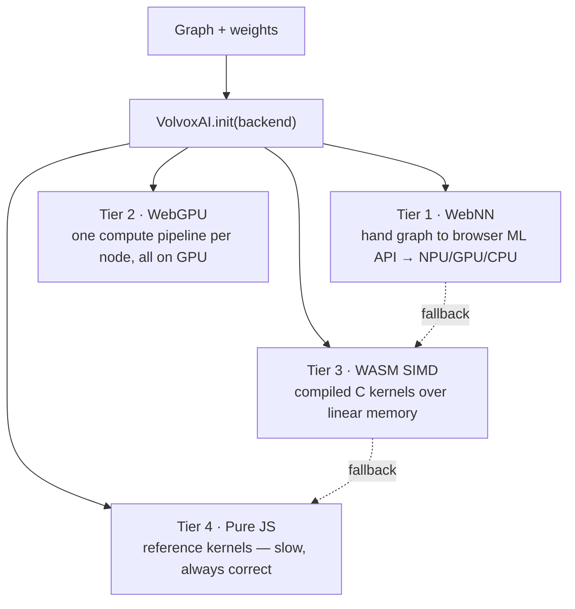

# Chapter 5 — Inside the Engine

*Goal: understand how VolvoxAI turns "a list of ops" into something that runs **fast** on real
hardware — the four tiers, the leap from a naive kernel to an optimized one, and operator fusion.*

You now know *what* the models compute. This chapter is about *making it fast* — the engineering
that separates a textbook implementation from a shippable one. This is where a lot of real AI
systems work lives.

---

## 5.1 One graph, four engines (the tiers)

Recall from Chapter 1: VolvoxAI can run the same graph four ways in the browser (plus a native
binary). They differ only in **who does the arithmetic** and **where the tensors live**.



- **Tier 4 — Pure JS** (`js/ops/*.js`): the naive kernels we read all book. Slow but simple and
  dependency-free. **It is the ground truth**: every faster tier is checked against it.
- **Tier 3 — WASM** (`js/WasmEngine.js` + `native/kernels/*.c`): the *same* ops compiled to
  WebAssembly with SIMD. A bump allocator drops every tensor into one flat block of linear
  memory; `execute()` calls a compiled C kernel per node. Often 5–50× faster than pure JS.
- **Tier 2 — WebGPU** (`js/GraphExecutor.js` + `shaders/*.wgsl`): each op becomes a GPU **compute
  shader**. At compile time it uploads all weights to VRAM and builds *one pipeline per node*;
  `execute()` replays them in a single command stream, **with no CPU round-trip between nodes**,
  so the whole model stays resident on the GPU. If a needed shader is missing, the current
  executor warns and skips that node; use WASM/CPU for models that require unsupported ops.
- **Tier 1 — WebNN** (`js/WebNNEngine.js`): hands the graph to the browser's own neural-network
  API, which may dispatch to a dedicated **NPU**. Falls through to a lower tier for any op it
  doesn't support.

The design principle: **choose a viable backend up front.** WebNN can fall through when graph
compilation fails, and WASM can fall back to pure JS helpers. WebGPU should be used for graphs
whose ops are covered by shaders.

---

## 5.2 Why the naive kernel is slow

Reread the naive `Conv2D` from Chapter 3: seven nested loops, one multiply at a time. It is
*correct*, but a modern CPU hates it, for two reasons:

1. **It wastes the SIMD units.** A CPU core can multiply 8 (AVX2) or more floats in a *single*
   instruction. The naive loop does them one… at… a… time, using a fraction of the silicon.
2. **It thrashes the cache.** RAM is ~100× slower than the CPU. Cores keep recently used data in
   a tiny fast **cache**. The naive conv jumps all over memory (strided image reads), so it
   constantly waits on RAM instead of computing.

The result: the naive kernel might use **2–5%** of the chip's real throughput. Optimization is
about feeding the SIMD units and respecting the cache.

---

## 5.3 From naive to fast: the same math, rearranged

Optimized kernels never change *what* is computed (the output is identical to Tier 4) — they
change *the order and layout* of the work. VolvoxAI's hot paths live in `native/conv_f32_opt.c`
(fp32) and `native/quant_cpu_opt.c` (int8). The main techniques:

| Technique | Idea | Payoff |
|---|---|---|
| **im2col + GEMM** | Unfold conv patches into a big matrix, then call a fast matrix-multiply | reuses decades of tuned matmul; feeds SIMD |
| **Pointwise GEMM** | 1×1 convs *are* a matrix multiply — treat them as one directly | biggest single win (most convs are 1×1) |
| **Weight prepacking** | Re-lay-out weights once at load into the exact order the inner loop reads | turns cache-miss reads into sequential reads |
| **Blocking / tiling** | Process small tiles that fit in cache before moving on | data is reused while it's still hot |
| **SIMD (AVX2/NEON)** | Do 8–32 multiply-adds per instruction | ~8–32× the arithmetic per cycle |
| **Multithreading** | Split output rows across CPU cores | ~Ncores× on top of everything |

```
naive conv                      optimized conv (im2col + GEMM)
 for each output pixel:          [1] unfold input patches → one big matrix  (once)
   for each filter tap:          [2] one big, cache-friendly, SIMD, threaded
     one scalar multiply             matrix-multiply against prepacked weights
 (scattered memory, 1 lane)      (sequential memory, many lanes, many cores)
```

> **A real result from this repo.** The memory notes for this project record that adding an
> *arena buffer-reuse planner* (reusing scratch memory instead of allocating fresh per node) cut
> peak memory from **88.8 MB → 18.8 MB** and, combined with a pointwise-GEMM path, sped the
> EfficientDet forward pass up meaningfully — closing the gap with Google's TFLite/XNNPACK to
> ~1.16× (warm). Same numbers out; dramatically less memory and time. *That* is kernel
> engineering.

The lesson: **correctness lives in the naive kernel; performance lives in memory layout.**
Read `js/ops/conv2D.js`, then diff it against `native/conv_f32_opt.c` to see the two
halves of the craft.

---

## 5.4 Operator fusion: stop touching memory so much

Between ops, results get written to memory and read back by the next op. For big feature maps,
*moving* the data can cost more than the math. **Operator fusion** merges adjacent ops so the
data is touched once. VolvoxAI runs a compile-time fusion pass (`native/graph_opt_fusion.c`):

```
before fusion:  Conv2D ─▶ [write feature map] ─▶ ReLU6 ─▶ [write again]
after  fusion:  Conv2D+ReLU6 ─▶ [write once, already activated]
```

Fusion patterns it applies (see `docs/operator_fusion_patterns.md`):

- **Conv + ReLU6** → clamp right inside the conv's requantize step (you saw `relu` folded into the
  kernel in Chapters 3–4).
- **Chained `Add`** → sum several residuals in one pass.
- **Depthwise → Pointwise** → run the MBConv pair back-to-back without spilling the intermediate.
- **Concat + Sigmoid**, **alias elision** (drop no-op copies like some `Reshape`s).

Each fused pair is one fewer full read+write of a big tensor. Across 262 nodes, that adds up.

---

## 5.5 Memory: tensors are temporary

A subtle but important point: most tensors in a forward pass are **scratch** — needed briefly,
then never again (e.g. `ln1_0` is dead once the attention MatMul consumed it). A naive engine
allocates a fresh buffer for every node (simple, but wasteful). A smart one **plans** which
buffers can share memory, because their lifetimes don't overlap — the **arena buffer-reuse
planner** mentioned above. This is why VolvoxAI can run a model whose tensors *sum* to hundreds of
MB in a fraction of that peak RAM: the same physical bytes are recycled node after node.

```
node lifetimes (─ = alive):     buffer reuse:
  A: ───                          A and C never overlap → give them the SAME buffer
  B:   ─────                      B and D never overlap → share a buffer
  C:      ────
  D:          ───                 4 tensors, 2 physical buffers
```

---

## 5.6 The whole engine, in one sentence

> **VolvoxAI walks the graph's node list, dispatches each node to the fastest available backend's
> kernel, and does so while reusing memory buffers and fusing adjacent ops — producing the exact
> same numbers as the naive reference, just far faster and smaller.**

That's the entire system. Everything else is one more op, one more backend, or one more
optimization on this skeleton.

> **This chapter covered the four *browser* tiers.** VolvoxAI also ships a full **native** engine
> (a freestanding C binary spanning CPU + Vulkan / OpenGL / Metal / Android NNAPI) that runs the
> *same blueprint*. That's the whole next chapter.

**Next:** [Chapter 6 — The Native Engine →](06-native-engine-architecture.md)
