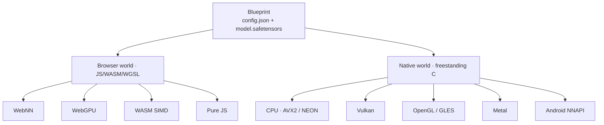
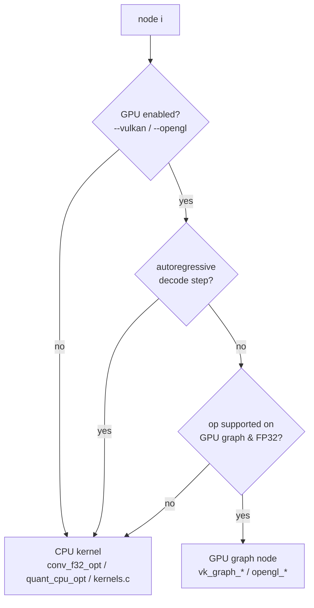

# Chapter 6 — The Native Engine (CPU + multi-backend GPU)

*Goal: understand VolvoxAI's **native** side — a freestanding C program that runs the **same
blueprint** as the browser, on desktops and phones, across CPU and several GPU/NPU backends —
and the design ideas that make that possible.*

Chapters 1–5 mostly read the JavaScript tiers because they're the clearest teaching text. But
that's only half of VolvoxAI. The other half is `native/`: a **bare-metal C engine** that takes
the *identical* `config.json` + `.safetensors` and runs it with no browser, no Node, and — this
is the striking part — **no statically linked GPU SDK**. This chapter is the architecture and the
"why" behind it.

---

## 6.1 The core idea: one blueprint, two worlds

The whole project is organized around a single principle:

> **Write the model once as a blueprint; run it anywhere.**



The browser world was Chapter 5. The native world is a standalone executable (`native/volvoxai`)
you run from a terminal:

```bash
./native/volvoxai generate models/tinystories_1m --prompt "Once upon a time, Lily" --max-new 50
./native/volvoxai detect   models/efficientdet_lite0_int8 --image input0=photo.png \
                           --image-normalize raw-255 --boxes boxes --scores scores
```

Same files the browser loads. That symmetry is the design.

---

## 6.2 The freestanding philosophy (why it's unusual)

Two deliberate constraints shape the native engine:

1. **No Emscripten / no heavy runtime.** The WASM module is built with plain
   `clang --target=wasm32 -msimd128` — a *freestanding* build with `--no-entry`, no libc runtime.
   The native binary is ordinary `clang -O3 -mavx2 -mfma -pthread`. There is no framework
   underneath; the engine *is* the code in `native/`.
2. **No static GPU dependency.** The binary does **not** link `libvulkan` or an OpenGL SDK at
   build time. Instead it **`dlopen`s** the GPU driver *at runtime* and looks up entry points by
   name. If the driver is present, you get GPU acceleration; if not, the exact same binary runs on
   CPU. One artifact, portable across machines with wildly different GPU stacks.

Here is that runtime loading, verbatim (`native/vulkan_engine.c`, `native/opengl_engine.c`):

```c
// Vulkan: try the platform's loader names, in order, at runtime.
const char* names[] = { "libvulkan.so.1", "libvulkan.so", "vulkan-1.dll" };
for (i = 0; i < 3; i++) vulkan_lib = dlopen(names[i], RTLD_NOW | RTLD_LOCAL);
vkGetInstanceProcAddr = (PFN_vkGetInstanceProcAddr)dlsym(vulkan_lib, "vkGetInstanceProcAddr");

// OpenGL/GLES: likewise dlopen libEGL + libGLESv2/libGL (or *.dll on Windows).
```

That's the whole trick behind "runs on Vulkan/OpenGL/Metal/NNAPI with no GPU SDK linkage." The
`-ldl` in the build command is the only price.

---

## 6.3 One kernel source, two machines (the shared ABI)

VolvoxAI avoids maintaining two copies of every kernel. The portable C in `native/kernels/*.c`
(bundled by `native/kernels.c`) compiles **both** to WebAssembly (Tier 3 in the browser) **and**
to the native binary. The trick is a **`uintptr_t` heap-pointer ABI**: kernels address memory
through integer offsets into one flat heap, so the same source works whether that heap is WASM
linear memory or a native `malloc` arena. The compiler then auto-vectorizes it to **AVX2 on x86**
and **NEON on arm64**.

```
                       ┌─────────────────────────────┐
   native/kernels/*.c  │  portable C, uintptr_t heap │
                       └───────────┬─────────────────┘
             clang --target=wasm32 │ clang -O3 -mavx2 (x86) / -march=…(arm64)
                    ┌──────────────┴───────────────┐
              volvoxai.wasm                   native/volvoxai
             (browser Tier 3)              (desktop/Android CPU)
```

The pure-JS ops (`js/ops/*.js`) remain the reference these are validated against — so there are
really **three** expressions of each op (JS reference, portable C, and — for hot ops — an
*optimized* C kernel), all required to agree.

---

## 6.4 The engine lifecycle (`native/engine.c`)

The native engine is a small, explicit state machine. Its public API (`native/engine.h`) is the C
counterpart of the JS `compile()` / `execute()`:

```c
int    engine_init(const char* config_path, const char* weights_path);  // load + build ONCE
float* engine_input_ptr(const char* name, long* numel);                 // poke an input tensor
int    engine_forward(void);                                            // run the whole graph
const float* engine_last_logits(int* count);                            // read the output row
void   engine_free_ctx(void);                                           // tear down
// autoregressive helpers:
int    engine_prefill(int n_tokens);   // process a prompt, fill K/V caches
int    engine_decode(int pos);         // process one new token via the cache
```

`engine_init` does the one-time heavy lifting (`native/engine.c`):

```c
int engine_init(const char* config_path, const char* weights_path) {
    load_weights(weights_path);        // mmap/parse the .safetensors blob
    build_graph(config_path);          // parse config.json → g_t[] tensors, g_n[] nodes
    prepack_qconv_weights();           // re-lay-out int8 conv weights for the fast kernel (§5.3)
    prepack_conv_weights();            // re-lay-out fp32 conv weights (im2col/GEMM order)
    g_loaded = 1;
}
```

Then `engine_forward` is the familiar loop — walk the node list, dispatch each:

```c
for (int i = 0; i < g_nn; i++)
    run_node(&g_n[i], i, /*is_last=*/ i == g_nn - 1);
```

The graph is built **once**; forwards are cheap and repeatable. This is what lets `generate` run
hundreds of forward passes without reloading weights.

---

## 6.5 Per-node backend selection (`native/engine_runtime.c`)

`run_node` is where "multi-backend" actually happens. For each node it decides *who computes it*,
and the decision is per-node, not per-model:



Key rules baked into the dispatcher:

- **GPU is opt-in** via CLI flags (`--vulkan`, `--opengl`, `--nnapi`); default is CPU. If the
  driver can't load, it prints e.g. `Backend: CPU (Vulkan unavailable)` and continues.
- **GPU backends are FP32-only.** `QConv2D` (int8) nodes always stay on the CPU's quantized
  island (`quant_cpu_opt.c`) even with `--vulkan` — so the int8 detector runs its convs on CPU and
  only FP32 ops offload.
- **Generation mostly stays on CPU.** The Vulkan/OpenGL graph path is skipped during
  `engine_decode`/`engine_prefill`, because token-by-token decode is latency-bound. Large
  MatMul/Gemm/Linear nodes can still use one-shot Vulkan/OpenGL offload when the work is big
  enough; small decode-time MatMuls stay on CPU to avoid dispatch overhead.
- Every node records which backend ran it (`"vulkan-graph"`, `"cpu-qconv"`, …) for the `--debug`
  profile report.

---

## 6.6 The GPU path is a deferred command graph

The native GPU backends don't execute op-by-op with a CPU round-trip each time. Like the WebGPU
tier, they **build a command graph and replay it**, keeping data resident on the device. The
`vk_graph_*` interface (`native/vulkan_engine.h`) shows the shape of it:

```c
vk_graph_begin_forward();                        // start recording
vk_graph_conv2d_f32(in, out, w, b, …);           // record a conv
vk_graph_add_relu_f32(a, b, out, n, relu);       // record a fused add+relu
vk_graph_maxpool2d_f32(…); vk_graph_resize_nearest_f32(…);
vk_graph_layernorm_f32(…); vk_graph_gelu_f32(…); vk_graph_softmax_f32(…);
vk_graph_end_forward();                          // submit + wait once
```

Two supporting ideas make this correct:

- **Host/device sync tracking.** `vk_graph_mark_host()` / `vk_graph_sync_host()` track which
  buffers the CPU touched, so data is uploaded/downloaded only when actually needed — not every
  node. Weights upload once; activations stay on the GPU between nodes.
- **Fusion carries over.** The dispatcher records fused nodes (`add+relu`, `concat+sigmoid`) as
  single GPU ops, so the graph-level fusion pass (§6.8) pays off on the GPU too.

The OpenGL/GLES backend mirrors this API (`opengl_graph_*`). Android **NNAPI**
(`nnapi_engine.c`) has its own selection branch for large dense layers. Metal
(`metal_engine.m`) has Apple-only graph dispatch for selected F32 ops such as attention,
Conv1D, elementwise Mul/Sub/Div, Split, DequantizeLinear, NMS, and custom profile ops. The
exact native GPU op matrix lives in
[`docs/operation_list.md`](../operation_list.md).

---

## 6.7 The shader pipeline (WGSL is the single source)

You might expect the native GPU backends to need hand-written Vulkan/Metal/GLSL shaders. They
don't — VolvoxAI keeps **WGSL as the one shader language** and *cross-compiles* it. `make
compile_shaders` runs `tools/compile_shaders.sh`, which uses Mozilla's **`naga`** to translate
every `shaders/*.wgsl` into the formats each native backend wants:

```
shaders/*.wgsl ──naga──▶ native/shaders/spv/   (SPIR-V  → Vulkan)
                        native/shaders/glsl/  (GLSL    → desktop OpenGL)
                        native/shaders/gles/  (GLSL ES → Android/embedded)
                        native/shaders/metal/ (MSL     → Apple Metal)
```

Write a kernel's shader once in WGSL, then translate it to the native shader formats. Runtime
support still needs a backend wrapper and dispatcher call: today Vulkan/OpenGL wire selected
generated shaders, and Metal wires a smaller Apple-only subset through `metal_graph_*`.
That's the same "one source, many targets" discipline as the C kernels (§6.3), applied to shaders,
with wiring tracked separately from generation.

---

## 6.8 Compile-time operator fusion (`native/graph_opt_fusion.c`)

Before the first forward, the native engine runs a fusion pass over the parsed graph (the design
from Chapter 5, here at the C level). It rewrites the node list in place — flagging
`fuse_relu6`, marking `skip` on elided nodes, tagging `concat_sigmoid_fuse`:

- **Conv + ReLU6** → clamp inside the conv's write (`fuse_relu6`).
- **Chained `Add`** → collapse sequential residual adds.
- **Depthwise → Pointwise** → run the MBConv pair without spilling the middle tensor.
- **Concat + Sigmoid** → fuse the detector's class-head tail.
- **Alias elision** → drop no-op `Reshape`/copy nodes (`skip`).

Fewer nodes, fewer full passes over big feature maps — the single biggest lever after SIMD.

---

## 6.9 Task runtimes: from tensors to usefulness

`native/main.c` is a CLI that wraps the tensor engine into real tasks. The dispatcher is a plain
`switch` on `argv[1]`:

| Command | What it does | Extra machinery |
|---|---|---|
| `run` | Raw graph runner: feed input tensors/images, dump output tensors | `image_io.c` (stb_image PNG/JPEG → NHWC) |
| `generate` | Autoregressive text (TinyStories) | `tokenizer.c` (BPE) + prefill/decode + KV-cache |
| `classify` | Top-K image classification | argmax + `labels.txt` |
| `detect` | Object detection → ranked boxes | anchor scoring + labels |
| `ctc` | CTC sequence decoding (e.g. OCR) | CTC collapse |
| `seq2seq` / `chat` | Encoder–decoder / chat loops | cross-attention runtime |

Two supporting runtimes deserve a mention: **`tokenizer.c`** (a from-scratch byte-level BPE
tokenizer reading the same `vocab.bin` + `merges.txt` as `js/Tokenizer.js`) and
**`kie_runtime.c`** (a receipt key-information-extraction task). Everything sits on the one
`engine_forward` core.

---

## 6.10 KV-cache orchestration (native generation)

Chapter 2 introduced the KV-cache conceptually; the native engine is where it's implemented. Each
attention node owns a Key and Value cache (`g_kcache[i]`, `g_vcache[i]` in
`native/engine_internal.h`). Generation splits into two phases:

```
engine_prefill(n_tokens):   run the graph over the whole prompt once, filling every K/V cache
loop:
  engine_last_logits() ─▶ argmax ─▶ next token
  engine_decode(pos):       run the graph for ONE new position, reading cached K/V,
                            appending this token's K/V   (O(seq) work, not O(seq²))
```

This is exactly the prefill/decode split that production LLM servers use — implemented in a few
hundred lines of C here, which makes it unusually readable.

---

## 6.11 Building the native engine

One `clang` line builds the whole thing (from the `Makefile`):

```bash
clang -O3 -mavx2 -mfma -pthread -Inative \
  native/cJSON.c native/safetensors.c native/kernels.c \
  native/quant_cpu_opt.c native/conv_f32_opt.c native/tensor_f32_opt.c \
  native/engine_runtime.c native/engine.c native/image_io.c native/kie_runtime.c \
  native/vulkan_engine.c native/opengl_engine.c native/tokenizer.c native/nnapi_engine.c \
  native/main.c -o native/volvoxai -lm -ldl
```

- `make build_native` — desktop build (CPU + Vulkan/OpenGL via runtime `dlopen`).
- `make build_android` — adds `-DUSE_NNAPI` and links `nnapi_engine.c` for Android arm64.
- `make compile_shaders` — regenerate SPIR-V/GLSL/GLES/Metal from WGSL.

Notice there is **no** `-lvulkan` / `-lGL`: the only GPU-related flag is `-ldl`. That single
absence is the whole "no static GPU dependency" promise, made concrete.

---

## 6.12 The design, in one picture

```
                     ┌───────────────────────── native/volvoxai ─────────────────────────┐
  config.json ──▶  build_graph ──▶ fusion pass ──▶ prepack weights ──▶ engine_forward loop │
  .safetensors ─▶  load_weights                                          │                  │
                                                              per node: run_node()          │
                                                              ├─ CPU: conv_f32_opt /         │
                                                              │       quant_cpu_opt /        │
                                                              │       kernels.c (AVX2/NEON)  │
                                                              └─ GPU/NPU (dlopen'd):          │
                                                                 vulkan / opengl / nnapi     │
                                                                 metal on Apple platforms    │
                     └────────────────────────────────────────────────────────────────────┘
                          task wrappers: run · generate · classify · detect · ctc · seq2seq · chat
```

**The takeaways:**

- VolvoxAI is **dual-target by design**: one blueprint feeds both the browser tiers and a
  freestanding native binary.
- The native engine is **portable without being generic**: no Emscripten, no static GPU SDK —
  GPU drivers are `dlopen`'d at runtime, so one binary spans very different machines.
- **Reuse is enforced across three axes**: one C kernel source (WASM + native), one shader
  language (WGSL → generated native shader formats, wired per backend), one blueprint
  (all backends) — with the pure-JS reference as the correctness oracle.
- Everything still reduces to the Chapter 1 loop: **walk the graph, dispatch each node to the best
  available backend.** Native just adds more backends and sharper kernels.

**Next:** [Chapter 7 — Glossary & Next Steps →](07-glossary-and-next-steps.md)
