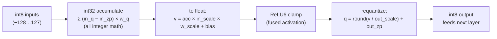

# Chapter 6 — Precision & Quantization (fp32 / fp16 / int8)

*Read the badges that match you: 🌱 **Idea** (anyone, no code) · 🔧 **Build** (a little code) · 🔬 **Deep**
(engine developers). New here? Follow just the 🌱 sections.*

*Goal: understand why the same detector ships in three folders, how numbers are stored as bits,
and the exact integer math that makes the int8 model 4× smaller — with almost no accuracy loss.*

> 🌱 **The big idea.** A trained model is just a giant pile of numbers. If we store each number very
> precisely, the file is big; if we **round the numbers off** to something coarser, the file gets
> much smaller — and, on the right hardware, faster too. That's the whole idea of **quantization**:
> trade a tiny bit of precision for a model that's up to **4× smaller**, so it fits in a browser tab,
> on a phone, or on a robot. This chapter shows the same object detector saved three ways — precise
> and chunky, or rounded and tiny — and reveals that the "rounding" is really just measuring numbers
> against a **ruler with 256 evenly-spaced ticks** instead of a fancy infinite one.

🔧 Look at the three EfficientDet folders. Same architecture (Chapter 3), same 262-ish nodes,
**very different file sizes**:

| Folder | Weights store each number as… | `model.safetensors` | Relative |
|---|---|---|---|
| `efficientdet_lite0_fp32` | 32-bit float | **12.67 MB** | 1.0× |
| `efficientdet_lite0_fp16` | 16-bit float | **6.34 MB** | 0.50× |
| `efficientdet_lite0_int8` | 8-bit integer | **3.39 MB** | 0.27× |

The *model* is identical. Only the **number format** — the **precision** — changed. Smaller
numbers → smaller downloads, less memory, and (with the right hardware) faster math. This chapter
is about that trade.

---

## 6.1 How a computer stores a number

> 🌱 **Idea.** A computer has two main ways to write down a number. A **float** is like scientific
> notation — very flexible, handles tiny and huge values, but takes more space. An **integer** is
> just a plain whole number and takes little space. Quantization is about swapping expensive floats
> for cheap integers wherever we can get away with it.

🔧 A neural net weight like `0.10125` has to become a fixed pattern of bits. There are two families.

### Floating-point (fp32, fp16): "scientific notation in binary"

A float splits its bits into a **sign**, an **exponent** (how big), and a **mantissa** (the
precise digits). More bits → more precision and more range.

```
fp32  (4 bytes)  [S][ 8-bit exponent ][      23-bit mantissa      ]   ~7 decimal digits
fp16  (2 bytes)  [S][ 5-bit exp ][   10-bit mantissa   ]              ~3 decimal digits
```

- **fp32** ("single precision") is the default everywhere — huge range, ~7 digits of precision.
  It's what training uses and what VolvoxAI uses for activations.
- **fp16** ("half precision") halves the storage. Plenty precise for inference, but its range is
  smaller (big/small values can overflow/underflow), and — crucially — a GPU must *support*
  fp16 math to get a speedup. (See §6.5 for why Volvox is cautious with it in browsers.)

> 🔬 **Under the hood: floats bend the ruler; ints don't.** A float's value is
> `sign × 1.mantissa × 2^(exp − bias)`, so its ticks are **not** evenly spaced — they're dense near
> zero and spread out for large magnitudes (about 7 significant digits *wherever* you are). That suits
> weights, which cluster near 0 but occasionally spike. `int8` is the opposite: **256 evenly-spaced**
> ticks, so you must place the ruler carefully (§6.2). fp16 also trades range for size — its exponent
> tops out near **±65504**, so a value that's fine in fp32 can overflow to infinity in fp16, which is
> why mixing fp16 in needs care.

### Integer (int8): "a ruler with 256 evenly-spaced ticks"

> 🌱 **Idea.** An **int8** can only be a whole number from −128 to 127 — just 256 choices. That's way
> too coarse to write `0.10125` directly. The trick: keep a cheap little ticket (the nearest tick on
> a 256-tick ruler) plus a short recipe for turning the ticket back into the real number. The ticket
> costs 1 byte; the recipe is shared, so it's basically free.

🔧 An **int8** stores a whole number from **−128 to 127** — just 256 possible values, 1 byte. That's
far too coarse to hold `0.10125` directly. The trick — **quantization** — is to store a cheap
integer plus a *recipe* for turning it back into a float.

---

## 6.2 Quantization: the scale + zero-point recipe

> 🌱 **Idea.** Stretch the 256-tick ruler across the range of numbers you actually have (say −0.4 to
> +0.4). Then every real number becomes "which tick is nearest," and the recipe to turn a tick back
> into a real number is just two facts: **how far apart the ticks are** (`scale`) and **which tick
> means zero** (`zero_point`). That's the entire idea — two numbers and a round.

🔧 Real weights in a layer live in some range, say `−0.4 … +0.4`. Quantization stretches the int8
ruler (`−128 … 127`) across that range with two numbers:

- **`scale`** — the size of one tick (real units per integer step).
- **`zero_point`** — which integer represents real `0.0`.

```
real value  r  ≈  (q − zero_point) × scale          ← DEQUANTIZE (int → float)
integer     q  =  round(r / scale) + zero_point      ← QUANTIZE   (float → int)

  real:  -0.4         -0.2          0.0          0.2          0.4
          │            │            │            │            │
  int8: -128         -64            0           64          127     (scale ≈ 0.4/127)
```

🔬 Both formulas are implemented by the shipping providers. Dequantize, in pseudocode:

```javascript
out[i] = (in[i] - zero_point) * scale;     // int8 → float
```

Quantize (`native/src/kernels/quant_cpu_isa.c`, `quantize_scalar_i8`):

```c
q = clamp_i8( lrintf(x / scale) + zero_point );   // float → int8, clamped to [-128,127]
```

That's the whole idea. An int8 weight is a *ticket*; `scale` and `zero_point` tell you what it's
worth. Storing the ticket costs 1 byte; the recipe is shared across a whole channel, so it's
nearly free.

> **Per-channel scales.** 🌱 One ruler for a whole layer is crude — a single huge value would stretch
> the ruler so much that everyone else loses precision. So we give each **channel** its own ruler. 🔬
> Each output channel gets its own `weight_scale` (you saw `weight_scale: "w1"` as a *tensor* input
> to `QConv2D`). This "per-channel quantization" is what keeps int8 accuracy within ~1% of fp32.

> 🔬 **Under the hood: symmetric vs asymmetric.** When `zero_point = 0` the map is **symmetric** — real
> 0 lands exactly on integer 0 — the usual choice for **weights** (they're roughly centered on 0),
> often over the *narrow* range `[−127, 127]` so it stays balanced. **Activations** are frequently
> one-sided (a ReLU output is ≥ 0), so they use an **asymmetric** map with a non-zero `zero_point` to
> spend all 256 ticks on the range actually used. VolvoxAI's authoring path offers both — the symmetric
> and asymmetric schemes you met in [Chapter 9C §9C.12](09c-cuda-backend.md).

---

## 6.3 A worked example (real numbers from the model)

> 🌱 **Idea.** Watch one number make the round trip: a real weight gets rounded to its nearest tick,
> then later turned back — and it comes out *almost* the same, off by a hair. That tiny error is the
> price of shrinking. Spread over a huge sum, these little errors mostly cancel out, which is why a
> rounded model still recognizes dogs just fine.

🔬 The int8 EfficientDet's first node is `QuantizeLinear` with `input_scale = 0.0078125` (which is
exactly `1/128`) — it turns incoming pixels into int8. Then the first `QConv2D` has
`output_scale = 0.0235294`, `output_zero_point = -128`. Let's quantize one weight and one output.

```
Quantize a weight  r = 0.101,  scale = 0.008,  zero_point = 0:
   q = round(0.101 / 0.008) + 0 = round(12.625) = 13        → stored as the byte 13

Later, recover it:
   r ≈ (13 - 0) × 0.008 = 0.104                              → 0.104 vs 0.101, error 0.003
```

The 0.003 error is **quantization noise**. Spread across a big dot product, these tiny rounding
errors mostly cancel — which is why an 8-bit model still detects dogs correctly.

> 🔬 **Under the hood: round-half-to-even.** The `round()` here is **banker's rounding**
> (round-half-to-even): `12.5 → 12`, `13.5 → 14`. Using it — rather than always rounding halves up —
> keeps the quantization error **unbiased**, so the 0.003-sized noises really do cancel over a long sum
> instead of all leaning the same way. Every backend rounds identically on purpose (the CUDA authoring
> kernel uses `cvt.rni`, round-to-nearest-even, for exactly this — Chapter 9C §9C.12).

---

## 6.4 How int8 convolution actually runs (`QConv2D`)

> 🌱 **Idea.** Here's the payoff. Because the numbers are now cheap integers, the machine can do its
> mountain of multiply-and-add in fast *integer* arithmetic, and only convert back to a real number
> once at the very end. The whole picture stays in "ticket" form from layer to layer — a "quantized
> island" — which is what makes int8 both small *and* fast.
>
> *Why integers are faster:* a chip can pack many int8 multiply-adds into a single instruction (8, 16,
> even 32 at once) where only a few floats would fit — so int8 isn't merely smaller on disk, it lets
> the same hardware do more multiply-adds per clock tick.

🔬 A quantized conv does its heavy multiply-accumulate loop in **cheap integer arithmetic**, and
only converts back to a real number once at the very end. The pipeline for one output value
(`native/src/kernels/quant_cpu_isa.c`):



1. **Integer accumulate.** Multiply int8×int8, sum into an **int32** accumulator. Integer
   multiply-add is fast and cheap on every CPU (and vectorizes 8–32 lanes wide with AVX2/NEON).
2. **Requantize.** Convert the int32 sum back to the layer's int8 scale in one step. The real
   code composes all the scales into one multiply:

   ```c
   // acc (int32) → float → relu6 → int8, for one output element:
   float v = acc * (input_scale * weight_scale) + bias;   // combined rescale
   int8   q = requantize_i8(v, output_scale, output_zp, relu);
   //        = clamp_i8( round( relu6(v) / output_scale ) + output_zp );
   ```

The key insight: **activations stay int8 from layer to layer** ("a quantized island"), so the
whole backbone runs in bytes. Only at the very end does `DequantizeLinear` turn the final
`scores`/`boxes` back into floats you can read. This typed W8A8 contract is implemented by the
portable C kernels used by native CPU and WASM, with qualified packed-byte routes in WebGPU and
native GPU providers. An unsupported descriptor is rejected; it is not silently widened to fp32 or
sent to another provider.

> 🔬 **Under the hood: why int32, and the requantize multiplier.** The accumulator is **int32** because
> a dot product of int8s can grow large — up to `K · 127 · 255` for a `K`-tap conv — which overflows
> int8/int16 but sits comfortably in int32. The rescale factor `M = in_scale · w_scale / out_scale` is a
> real number in `(0, 1)`; VolvoxAI applies it in **float** for simplicity, but integer-only
> accelerators implement the *same* `M` as a **fixed-point multiply-plus-shift** so the layer never
> touches a float. Either way the zero-points are subtracted *inside* the integer accumulate, not after.

---

## 6.5 Why each format exists — the trade-off

> 🌱 **Idea.** Three formats, one dial: smaller-and-faster on one end, more-precise-and-simpler on the
> other. **int8** for phones, robots, and browsers (small, fast, runs anywhere). **fp32** when you
> want maximum accuracy or plan to shrink later. **fp16** in the middle — but only if the hardware
> supports it, which isn't guaranteed.

🔧

```
        SMALLER / FASTER  ◀───────────────────────────────▶  MORE ACCURATE / SIMPLER
             int8                      fp16                      fp32
        1 byte/weight              2 bytes/weight            4 bytes/weight
        integer math              needs fp16 HW             works everywhere
        ~4× smaller               ~2× smaller               reference accuracy
        tiny accuracy dip         ~lossless                 lossless
```

| Question | fp32 | fp16 | int8 |
|---|---|---|---|
| Disk / memory | biggest | half | quarter |
| Accuracy vs fp32 | reference | ~identical | usually within ~1% |
| Needs special hardware? | no | **yes** (fp16 units) | no (integer is universal) |
| Best when… | max accuracy, or you'll quantize later | GPU has fp16 & you want easy 2× | edge/mobile/browser, size & speed matter |

🔬 **Why VolvoxAI leans on fp32 + int8 and is wary of fp16 (from the README):**

- **fp16** needs the WebGPU `shader-f16` extension, which isn't universal on consumer devices —
  so a browser engine can't rely on it. (The fp16 folder here is mainly for platforms/formats
  that do support it.)
- **int8** gives a 4× size cut with near-zero accuracy loss, and integer math runs fast on *any*
  CPU/GPU — the sweet spot for portable inference. Volvox skips **int4** because 4-bit needs
  fiddly bit-unpacking that hurts low-end mobile GPUs.

> 🔬 **Under the hood: "smaller" is guaranteed, "faster" isn't automatic.** The 4× is a **storage** win
> you get everywhere. The *speed* win needs hardware that multiplies bytes wide — `DP4A` on NVIDIA,
> dot-product instructions on ARM, `VNNI` on x86 — otherwise int8 is unpacked to wider ints and you
> keep the size win but not the throughput win. And that 4× is about **weights on disk**; activation
> memory at run time depends on whether the graph keeps a typed W8A8 island or crosses an explicit
> dequantization boundary (§6.4), plus the selected provider's qualified implementation.

---

## 6.6 The three graphs, side by side

🔬 Because precision is a *storage* choice, the graphs are nearly identical — only the conv op and a
little quant bookkeeping differ:

```
fp32 / fp16 graph:            int8 graph:
  input (float)                 input (uint8)
     │                             │  QuantizeLinear   ← float/uint8 → int8 (once)
  Conv2D ─┐                     QConv2D ─┐             ← integer conv, int8 in/out
  Conv2D  │ 182 float convs     QConv2D  │ 182 int8 convs (stays int8 the whole way)
   …      │                      …       │
  Add / MaxPool / Resize        Add / MaxPool / Resize (int8-aware)
     │                             │  DequantizeLinear ← int8 → float (twice, at the end)
  scores, boxes (float)         scores, boxes (float)
```

That's why the int8 graph has **3 extra nodes** (1 `QuantizeLinear` + 2 `DequantizeLinear`) and
its 182 convs are `QConv2D` instead of `Conv2D`. Same detector, three sizes — you pick the point
on the curve your device needs.

---

## 6.7 What you just learned

> 🌱 **Idea recap.** A model is a pile of numbers; **quantization** rounds those numbers onto a coarse
> 256-tick ruler to make the model up to 4× smaller and faster, at the cost of a tiny bit of
> accuracy. The recipe to un-round is just two numbers per ruler (spacing + which tick is zero).
> That's how a model that was too big for your phone suddenly fits.

🔧

- **Precision** is how many bits each number gets: fp32 (4 B), fp16 (2 B), int8 (1 B).
- **Quantization** maps floats onto the 256-value int8 ruler with a `scale` + `zero_point`; the
  formulas `(q−zp)×scale` and `round(r/scale)+zp` are the whole trick, and they're in the repo.
- **int8 conv** accumulates in cheap int32 and requantizes once — activations stay int8 layer to
  layer, giving ~4× smaller + faster with ~1% accuracy cost.
- You **choose** the format per deployment: fp32 for fidelity, int8 for the edge, fp16 when the
  hardware supports it.

So far quantization has been a *storage fact* — the int8 detector simply *exists* in its folder.
But someone had to **produce** it: observe real activation ranges, choose per-channel scales, and
decide which layers can tolerate int8 at all. That process — post-training quantization and
quantization-aware training — is the next chapter.

**Next:** [Chapter 7 — Producing a Quantized Model →](07-producing-a-quantized-model.md)
