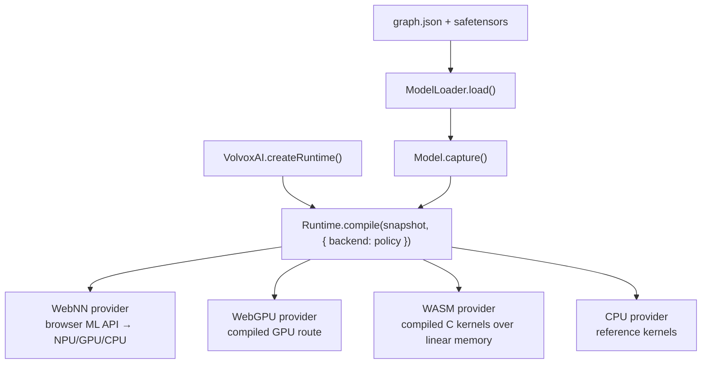

# Chapter 8 — Inside the Browser Engine

*Read the badges that match you: 🌱 **Idea** (anyone, no code) · 🔧 **Build** (a little code) · 🔬 **Deep**
(engine developers). New here? Follow just the 🌱 sections.*

*Goal: understand how VolvoxAI turns "a list of ops" into something that runs **fast** on real
hardware — the four tiers, the leap from a naive kernel to an optimized one, and operator fusion.*

> 🌱 **The big idea.** You already know *what* a model computes: a list of tiny math steps. This
> chapter is about making that list run **fast** without changing the answer. Two everyday tricks do
> most of the work. First, **use every worker you have**: a modern chip can do many multiplications
> at once (and has several cores, and often a GPU) — the naive one-at-a-time loop wastes almost all
> of it. Second, **stop shuffling paper**: moving numbers in and out of memory is slow, so glue
> neighboring steps together and reuse the same scratch paper instead of grabbing a fresh sheet
> every time. Same numbers out — just far faster and lighter. This is the engineering that turns a
> textbook model into something that runs smoothly in a browser tab.

🔧 You now know *what* the models compute. This chapter is about *making it fast* — the engineering
that separates a textbook implementation from a shippable one. This is where a lot of real AI
systems work lives.

---

## 8.1 One graph, four providers (the tiers)

> 🌱 **Idea.** The same model can be run four ways in a browser, from "fanciest hardware" down to
> "always works everywhere," and VolvoxAI picks the best one your device offers. They all compute
> the *same* answer — they just differ in *who* does the arithmetic (a neural chip, the GPU, or the
> CPU) and *where* the numbers live.

🔧 Recall from Chapter 1: VolvoxAI can run the same graph four ways in the browser (plus a native
binary). They differ only in **who does the arithmetic** and **where the tensors live**.



- **Tier 4 — Pure JS** (`ts/ops/*.ts`): the naive kernels we read all book. Slow but simple and
  dependency-free. **It is the ground truth**: every faster tier is checked against it.
- **Tier 3 — WASM**: the *same* ops compiled to WebAssembly with SIMD. A bump allocator drops every
  tensor into one flat block of linear memory; context execution calls compiled C kernels. Often
  5–50× faster than pure JS.
- **Tier 2 — WebGPU**: supported ops become GPU **compute shaders**. Compilation uploads weights to
  VRAM and builds the selected route; execution replays it with no host readback between adjacent
  GPU nodes. A required unsupported route makes compilation fail unless the caller's compile policy
  explicitly allows operator fallback. Execution never silently skips a node.
- **Tier 1 — WebNN**: hands supported graph regions to the browser's own neural-network API, which
  may dispatch to a dedicated **NPU**.

🔬 The design principle: **choose and prove a viable route at compile time.** The compile report
records the selected provider, route evidence, and provider-reported device identity when available.
That route stays fixed for the compiled model; an execution error is reported instead of silently
trying another backend.

---

## 8.2 Why the naive kernel is slow

> 🌱 **Idea.** The simple loop we've been reading does one multiply at a time and jumps all over
> memory looking for numbers. That's like a cashier with eight hands using only one, and walking to
> the back of the store for each item. The chip is mostly *waiting*, not computing — using maybe a
> couple percent of what it could.

🔧 Reread the naive `Conv2D` from Chapter 3: seven nested loops, one multiply at a time. It is
*correct*, but a modern CPU hates it, for two reasons:

1. **It wastes the SIMD units.** A CPU core can multiply 8 (AVX2) or more floats in a *single*
   instruction. The naive loop does them one… at… a… time, using a fraction of the silicon.
2. **It thrashes the cache.** RAM is ~100× slower than the CPU. Cores keep recently used data in
   a tiny fast **cache**. The naive conv jumps all over memory (strided image reads), so it
   constantly waits on RAM instead of computing.

The result: the naive kernel might use **2–5%** of the chip's real throughput. Optimization is
about feeding the SIMD units and respecting the cache.

> 🔬 **Under the hood: compute-bound vs memory-bound (the roofline).** Every kernel is capped by one of
> two ceilings — how many multiply-adds the chip can do per second, or how fast it can move bytes from
> RAM. Which one bites is decided by **arithmetic intensity**: FLOPs per byte loaded. A 1×1 conv reuses
> each loaded weight across many pixels (high intensity → compute-bound, so SIMD helps), while an
> elementwise `Add` touches each byte once (low intensity → memory-bound, where more SIMD does
> *nothing*). That's why fusion (§8.4) and buffer reuse (§8.5) matter as much as a fast matmul: they
> attack the memory ceiling, not the compute one. The cache hierarchy is the same story in miniature —
> an L1 hit is a few cycles, a trip to RAM is a couple hundred.

---

## 8.3 From naive to fast: the same math, rearranged

> 🌱 **Idea.** The fast version computes *exactly* the same thing — it just reorganizes the work so
> the chip's many hands stay busy and the numbers it needs are already close by. Line up the data
> neatly, hand it to a matrix-multiply the chip is superb at, do many multiplies per instruction,
> and split the work across cores. Correctness lives in the simple version; *speed lives in the
> layout.*
>
> *Same total, faster path:* adding up a column of numbers gives the same sum whether you go
> top-to-bottom or group them in pairs — but one order might let you use both hands at once. Fast
> kernels only change the *order and grouping* of the adds, never the total.

🔧 Optimized kernels never change *what* is computed (the output is identical to Tier 4) — they
change *the order and layout* of the work. VolvoxAI's hot paths include
`native/src/kernels/gemm_f32.c` and `packed_quant_gemm.c` for dense layers,
`conv_f32_opt.c` (fp32 convolution), and `quant_cpu_opt.c` (int8 convolution). The main
techniques:

| Technique | Idea | Payoff |
|---|---|---|
| **im2col + GEMM** | Unfold conv patches into a big matrix, then call a fast matrix-multiply | reuses decades of tuned matmul; feeds SIMD |
| **Pointwise GEMM** | 1×1 convs *are* a matrix multiply — treat them as one directly | biggest single win (most convs are 1×1) |
| **Weight prepacking** | Re-lay-out weights once at load into the exact order the inner loop reads | turns cache-miss reads into sequential reads |
| **Blocking / tiling** | Process small tiles that fit in cache before moving on | data is reused while it's still hot |
| **SIMD (AVX2/NEON)** | Do 8–32 multiply-adds per instruction | ~8–32× the arithmetic per cycle |
| **Multithreading** | Split output rows across CPU cores | ~Ncores× on top of everything |

```
naive conv                      optimized conv (im2col + GEMM)
 for each output pixel:          [1] unfold input patches → one big matrix  (once)
   for each filter tap:          [2] one big, cache-friendly, SIMD, threaded
     one scalar multiply             matrix-multiply against prepacked weights
 (scattered memory, 1 lane)      (sequential memory, many lanes, many cores)
```

> **A real result from this repo.** 🌱 One memory-saving change made the detector use **~5× less
> RAM** and run noticeably faster — same answers, far lighter. 🔬 Adding an *arena buffer-reuse
> planner* (reusing scratch memory instead of allocating fresh per node) cut peak memory from
> **88.8 MB → 18.8 MB** and, combined with a pointwise-GEMM path, sped the EfficientDet forward pass
> up meaningfully — closing the gap with Google's TFLite/XNNPACK to ~1.16× (warm). *That* is kernel
> engineering.

The lesson: **correctness lives in the naive kernel; performance lives in memory layout.**
Read `ts/ops/conv2D.ts`, then diff it against `native/src/kernels/conv_f32_opt.c` to see the two
halves of the craft.

> 🔬 **Under the hood: im2col isn't free — so the fast path often skips it.** Materializing the unfolded
> patch matrix inflates the input by roughly `k_h · k_w ×` (a 3×3 conv → ~9× the memory, briefly).
> That's fine for one big conv, but for the *many* 1×1 convs here there's nothing to unfold — a 1×1 conv
> already *is* a matrix multiply — which is why "pointwise GEMM" is the single biggest win. Production
> kernels also use **implicit im2col**: index straight into the original tensor from inside the GEMM
> loop, getting the matmul's speed without ever building the big matrix.

### 🔬 Anatomy of the dense matrix multiply

The same pattern now appears directly in `MatMul`/`Linear`/`Gemm`. Native CPU and WASM
pack an immutable weight once into eight-output panels, compute four rows by eight columns
in registers, and walk K in chunks sized to stay below 75% of a conservative 32 KiB L1D.
On that fallback cache, the F32 kernel chooses `KC=496`, using 23,936 of its 24,576-byte
budget. Native detects and caches the host L1D policy automatically; WASM keeps the
portable 32 KiB assumption because browsers do not expose cache topology.

GPUs solve the same reuse problem differently. An 8x8 workgroup cooperatively loads a
16x16 A/B tile into workgroup memory and produces a 16x16 output tile. That is **tiling**,
not persistent CPU-style weight packing. Single-token decode (`M=1`) and tiny matrices keep
a simpler scalar shader or specialized CPU microkernel because filling a shared tile can
cost more than it saves. The pure-JS kernel stays as the easy-to-study reference.

That last choice matters: "optimized MatMul" is not one clever loop. It is a dispatcher
between packing, cache blocking, register tiling, workgroup tiling, and low-overhead decode
paths, selected by data type, shape, and device.

---

## 8.4 Operator fusion: stop touching memory so much

> 🌱 **Idea.** Between steps, the machine normally writes its result down and the next step reads it
> back — a lot of wasted trips for big data. **Fusion** glues neighboring steps so the data is
> touched once: "multiply *and* clamp in the same pass," instead of two. Across hundreds of steps,
> skipping all those write-then-reread trips adds up to real speed.

🔧 Between ops, results get written to memory and read back by the next op. For big feature maps,
*moving* the data can cost more than the math. **Operator fusion** merges adjacent ops so the
data is touched once. VolvoxAI runs a compile-time fusion pass (`native/src/runtime/graph_opt_fusion.inc`):

```
before fusion:  Conv2D ─▶ [write feature map] ─▶ ReLU6 ─▶ [write again]
after  fusion:  Conv2D+ReLU6 ─▶ [write once, already activated]
```

🔬 Fusion patterns it applies (see `docs/operator_fusion_patterns.md`):

- **Conv + ReLU6** → clamp right inside the conv's requantize step (you saw `relu` folded into the
  kernel in Chapters 3–4).
- **Chained `Add`** → sum several residuals in one pass.
- **Depthwise → Pointwise** → run the MBConv pair back-to-back without spilling the intermediate.
- **Concat + Sigmoid**, **alias elision** (drop no-op copies like some `Reshape`s).

Each fused pair is one fewer full read+write of a big tensor. Across 262 nodes, that adds up.

---

## 8.5 Memory: tensors are temporary

> 🌱 **Idea.** Most of the numbers a model makes are scratch work — needed for a moment, then never
> again. Instead of grabbing a fresh sheet of paper for every step (and needing a huge stack), the
> engine notices when old scratch is finished and **reuses the same sheet**. That's how a model
> whose numbers add up to hundreds of megabytes can actually run in a small fraction of that memory.

🔧 A subtle but important point: most tensors in a forward pass are **scratch** — needed briefly,
then never again (e.g. `ln1_0` is dead once the attention MatMul consumed it). A naive engine
allocates a fresh buffer for every node (simple, but wasteful). A smart one **plans** which
buffers can share memory, because their lifetimes don't overlap — the **arena buffer-reuse
planner** mentioned above. This is why VolvoxAI can run a model whose tensors *sum* to hundreds of
MB in a fraction of that peak RAM: the same physical bytes are recycled node after node.

> 🔬 **Under the hood: buffer reuse is graph-coloring.** The planner computes each tensor's **live
> interval** — from the node that writes it to the last node that reads it — then hands two tensors the
> same buffer only when their intervals don't overlap. It's the *exact* problem a compiler solves when
> it packs many variables into few CPU registers (register allocation / interval coloring). That's how
> peak memory for the detector fell from **88.8 MB → 18.8 MB**: not fewer tensors, just fewer
> *simultaneously live* ones sharing the same physical bytes.

```
node lifetimes (─ = alive):     buffer reuse:
  A: ───                          A and C never overlap → give them the SAME buffer
  B:   ─────                      B and D never overlap → share a buffer
  C:      ────
  D:          ───                 4 tensors, 2 physical buffers
```

---

## 8.6 The whole engine, in one sentence

> 🌱 **Idea recap.** Same answers, made fast: use all the chip's hands (many multiplies at once,
> many cores, the GPU), glue neighboring steps together, and reuse scratch memory. Nothing about
> *what* the model computes changed — only *how efficiently* the chip does it.

🔧

> **VolvoxAI walks the graph's node list, dispatches each node to the fastest available backend's
> kernel, and does so while reusing memory buffers and fusing adjacent ops — producing the exact
> same numbers as the naive reference, just far faster and smaller.**

That's the entire system. Everything else is one more op, one more backend, or one more
optimization on this skeleton.

> **This chapter covered the four *browser* tiers.** VolvoxAI also ships a full **native** engine
> (a freestanding C binary spanning CPU + Vulkan / OpenGL / opt-in CUDA / Metal / Android NNAPI) that runs the
> *same graph package* on a desktop, a phone, or a robot. That's the whole next chapter.

**Next:** [Chapter 9 — The Native Engine →](09-native-engine-architecture.md)
