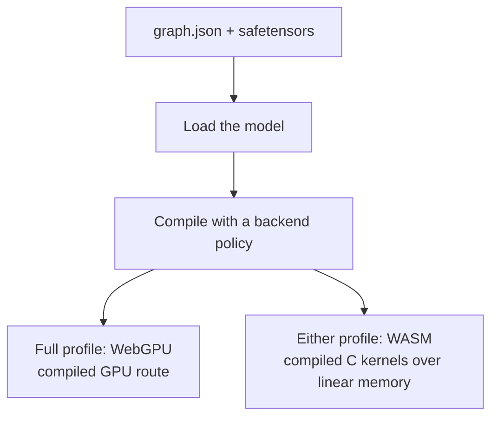

# Chapter 8 — Inside the Browser Engine

*Read the badges that match you: 🌱 **Idea** (anyone, no code) · 🔧 **Build** (a little code) · 🔬 **Deep**
(engine developers). New here? Follow just the 🌱 sections.*

*Goal: understand how VolvoxAI turns "a list of ops" into something that runs **fast** on real
hardware — the explicit providers, the leap from a baseline kernel to an optimized one, operator fusion, and
how a bounded shape domain is proved once and bound per request.*

> 🌱 **The big idea.** You already know *what* a model computes: a list of tiny math steps. This
> chapter is about making that list run **fast** without changing the answer. Two everyday tricks do
> most of the work. First, **use every worker you have**: a modern chip can do many multiplications
> at once (and has several cores, and often a GPU) — the naive one-at-a-time loop wastes almost all
> of it. Second, **stop shuffling paper**: moving numbers in and out of memory is slow, so glue
> neighboring steps together and reuse the same scratch paper instead of grabbing a fresh sheet
> every time. Same numbers out — just far faster and lighter. This is the engineering that turns a
> textbook model into something that runs smoothly in a browser tab.

🔧 You now know *what* the models compute. This chapter is about *making it fast* — the engineering
that separates a textbook implementation from a shippable one. This is where a lot of real AI
systems work lives.

---

## 8.1 One graph, two browser providers

> 🌱 **Idea.** The same model can run through WASM on the CPU or WebGPU on the GPU.
> The ordinary browser package uses WASM; the full package also offers WebGPU when you
> request it. They compute the *same* model — they differ in *who* does the arithmetic
> and *where* the numbers live.

🔧 Recall from Chapter 1: VolvoxAI can run the same graph two ways in the browser (plus a native
binary). They differ only in **who does the arithmetic** and **where the tensors live**.



- **WASM**: the *same* ops compiled to WebAssembly with SIMD. A bump allocator drops every
  tensor into one flat block of linear memory; context execution calls compiled C kernels.
- **WebGPU**: supported ops become GPU **compute shaders**. Compilation uploads weights to
  VRAM and builds the selected route; execution replays it with no host readback between adjacent
  GPU nodes. If the complete graph is unsupported, a required WebGPU compilation fails.
  A preference list such as `['webgpu', 'wasm']` can select WASM for the whole model at
  compile time. The browser GPU route does not mix in CPU nodes during execution.

🔬 The design principle: **choose and prove a viable route at compile time.** The compile report
records the selected provider, route evidence, and provider-reported device identity when available.
That route stays fixed for the compiled model; an execution error is reported instead of silently
trying another backend.

### 🔬 What the compiler is allowed to assume about shape

That principle only works if the compiler can see the *whole* set of shapes a model will ever be
asked to run. Proving a route for one sample shape proves nothing about the next request. So the
graph has to state its shape domain up front, and it does that with two properties that have to
arrive together.

A dimension symbol is **named**. When the graph writes `["B", "S"]` for the token ids and
`["B", "S", 768]` for the embeddings, the `S` in both is *one* extent — not two numbers that happen
to be equal on the day you tested. The compiler can use that equality as a fact.

A dimension symbol is also **bounded**: `{ "S": { "min": 1, "max": 2048 } }`. The domain is finite,
so "the largest activation this graph can ever need" is a number the compiler can actually compute,
and a backend can check it against its real buffer, binding, and dispatch limits.

Neither half works alone, which is the interesting part:

- **Bounds without names.** You know every axis stays under 2048, but nothing says the sequence axis
  of the ids and the sequence axis of the embeddings are the same 2048. The attention op that
  contracts them finds the mismatch — at execution time, in a kernel, which is exactly where you
  don't want to find things.
- **Names without bounds.** You know the two axes are the same `S`, but `S` has no maximum, so the
  worst-case tensor is infinite. There is no number to attest, so the only honest thing left is to
  wait for a real request and specialize then. That is the silent-fallback behaviour the whole
  design is built to avoid.

Together they make the question decidable, and that is what buys the guarantee in the paragraph
above: once compilation succeeds, every shape in the declared domain has a proved route, and
execution never has to go looking for a second one.

The trade you are making is visible and deliberate — you now have to *declare* your bounds, and a
graph that lies about them is rejected at compile time rather than limping along. For a model that
ships to a browser tab or a robot, being told "no" at build time is the cheap outcome.

---

## 8.2 Why the naive kernel is slow

> 🌱 **Idea.** The simple loop we've been reading does one multiply at a time and jumps all over
> memory looking for numbers. That's like a cashier with eight hands using only one, and walking to
> the back of the store for each item. The chip is mostly *waiting*, not computing — using maybe a
> couple percent of what it could.

🔧 Reread the naive `Conv2D` from Chapter 3: seven nested loops, one multiply at a time. It is
*correct*, but a modern CPU hates it, for two reasons:

1. **It wastes the SIMD units.** A CPU core can multiply 8 (AVX2) or more floats in a *single*
   instruction. The naive loop does them one… at… a… time, using a fraction of the silicon.
2. **It thrashes the cache.** RAM is ~100× slower than the CPU. Cores keep recently used data in
   a tiny fast **cache**. The naive conv jumps all over memory (strided image reads), so it
   constantly waits on RAM instead of computing.

The result: the naive kernel might use **2–5%** of the chip's real throughput. Optimization is
about feeding the SIMD units and respecting the cache.

> 🔬 **Under the hood: compute-bound vs memory-bound (the roofline).** Every kernel is capped by one of
> two ceilings — how many multiply-adds the chip can do per second, or how fast it can move bytes from
> RAM. Which one bites is decided by **arithmetic intensity**: FLOPs per byte loaded. A 1×1 conv reuses
> each loaded weight across many pixels (high intensity → compute-bound, so SIMD helps), while an
> elementwise `Add` touches each byte once (low intensity → memory-bound, where more SIMD does
> *nothing*). That's why fusion (§8.4) and buffer reuse (§8.5) matter as much as a fast matmul: they
> attack the memory ceiling, not the compute one. The cache hierarchy is the same story in miniature —
> an L1 hit is a few cycles, a trip to RAM is a couple hundred.

---

## 8.3 From naive to fast: the same math, rearranged

> 🌱 **Idea.** The fast version computes *exactly* the same thing — it just reorganizes the work so
> the chip's many hands stay busy and the numbers it needs are already close by. Line up the data
> neatly, hand it to a matrix-multiply the chip is superb at, do many multiplies per instruction,
> and split the work across cores. Correctness lives in the simple version; *speed lives in the
> layout.*
>
> *Same total, faster path:* adding up a column of numbers gives the same sum whether you go
> top-to-bottom or group them in pairs — but one order might let you use both hands at once. Fast
> kernels only change the *order and grouping* of the adds, never the total.

🔧 Optimized kernels never change *what* is computed (the output still obeys the operator contract) — they
change *the order and layout* of the work. VolvoxAI's hot paths include
`native/src/kernels/gemm_f32.c` and `packed_quant_gemm.c` for dense layers,
`conv_f32_isa.c` (fp32 convolution), and `quant_cpu_isa.c` (int8 convolution). The main
techniques:

| Technique | Idea | Payoff |
|---|---|---|
| **im2col + GEMM** | Unfold conv patches into a big matrix, then call a fast matrix-multiply | reuses decades of tuned matmul; feeds SIMD |
| **Pointwise GEMM** | 1×1 convs *are* a matrix multiply — treat them as one directly | biggest single win (most convs are 1×1) |
| **Weight prepacking** | Re-lay-out weights once at load into the exact order the inner loop reads | turns cache-miss reads into sequential reads |
| **Blocking / tiling** | Process small tiles that fit in cache before moving on | data is reused while it's still hot |
| **SIMD (AVX2/NEON)** | Do 8–32 multiply-adds per instruction | ~8–32× the arithmetic per cycle |
| **Multithreading** | Split output rows across CPU cores | ~Ncores× on top of everything |

```
naive conv                      optimized conv (im2col + GEMM)
 for each output pixel:          [1] unfold input patches → one big matrix  (once)
   for each filter tap:          [2] one big, cache-friendly, SIMD, threaded
     one scalar multiply             matrix-multiply against prepacked weights
 (scattered memory, 1 lane)      (sequential memory, many lanes, many cores)
```

> **A real result from this repo.** 🌱 One memory-saving change made the detector use **~5× less
> RAM** and run noticeably faster — same answers, far lighter. 🔬 Adding an *arena buffer-reuse
> planner* (reusing scratch memory instead of allocating fresh per node) cut peak memory from
> **88.8 MB → 18.8 MB** and, combined with a pointwise-GEMM path, sped the EfficientDet forward pass
> up meaningfully — closing the gap with Google's TFLite/XNNPACK to ~1.16× (warm). *That* is kernel
> engineering.

The lesson: **correctness lives in the baseline kernel; performance lives in memory layout.**
Read `native/src/kernels/conv_f32_isa_baseline.c`, then compare it with
`native/src/kernels/conv_f32_isa.c` to see the two halves of the craft.

> 🔬 **Under the hood: im2col isn't free — so the fast path often skips it.** Materializing the unfolded
> patch matrix inflates the input by roughly `k_h · k_w ×` (a 3×3 conv → ~9× the memory, briefly).
> That's fine for one big conv, but for the *many* 1×1 convs here there's nothing to unfold — a 1×1 conv
> already *is* a matrix multiply — which is why "pointwise GEMM" is the single biggest win. Production
> kernels also use **implicit im2col**: index straight into the original tensor from inside the GEMM
> loop, getting the matmul's speed without ever building the big matrix.

### 🔬 Anatomy of the dense matrix multiply

The same pattern now appears directly in `MatMul`/`Linear`/`Gemm`. Native CPU and WASM
pack an immutable weight once into eight-output panels, compute four rows by eight columns
in registers, and walk K in chunks sized to stay below 75% of a conservative 32 KiB L1D.
On that fallback cache, the F32 kernel chooses `KC=496`, using 23,936 of its 24,576-byte
budget. Native detects and caches the host L1D policy automatically; WASM keeps the
portable 32 KiB assumption because browsers do not expose cache topology.

GPUs solve the same reuse problem differently. An 8x8 workgroup cooperatively loads a
16x16 A/B tile into workgroup memory and produces a 16x16 output tile. That is **tiling**,
not persistent CPU-style weight packing. Single-token decode (`M=1`) and tiny matrices keep
a simpler scalar shader or specialized CPU microkernel because filling a shared tile can
cost more than it saves. The portable C path remains the clearest implementation to study.

That last choice matters: "optimized MatMul" is not one clever loop. It is a dispatcher
between packing, cache blocking, register tiling, workgroup tiling, and low-overhead decode
paths, selected by data type, shape, and device.

---

## 8.4 Operator fusion: stop touching memory so much

> 🌱 **Idea.** Between steps, the machine normally writes its result down and the next step reads it
> back — a lot of wasted trips for big data. **Fusion** glues neighboring steps so the data is
> touched once: "multiply *and* clamp in the same pass," instead of two. Across hundreds of steps,
> skipping all those write-then-reread trips adds up to real speed.

🔧 Between ops, results get written to memory and read back by the next op. For big feature maps,
*moving* the data can cost more than the math. **Operator fusion** merges adjacent ops so the
data is touched once. VolvoxAI runs a compile-time fusion pass (`native/src/runtime/graph_opt_fusion.inc`):

```
before fusion:  Conv2D ─▶ [write feature map] ─▶ ReLU6 ─▶ [write again]
after  fusion:  Conv2D+ReLU6 ─▶ [write once, already activated]
```

🔬 Fusion patterns it applies (see `docs/operator_fusion_patterns.md`):

- **Conv + ReLU6** → clamp right inside the conv's requantize step (you saw `relu` folded into the
  kernel in Chapters 3–4).
- **Chained `Add`** → sum several residuals in one pass.
- **Depthwise → Pointwise** → run the MBConv pair back-to-back without spilling the intermediate.
- **Concat + Sigmoid**, **alias elision** (drop no-op copies like some `Reshape`s).

Each fused pair is one fewer full read+write of a big tensor. Across 262 nodes, that adds up.

---

## 8.5 Memory: tensors are temporary

> 🌱 **Idea.** Most of the numbers a model makes are scratch work — needed for a moment, then never
> again. Instead of grabbing a fresh sheet of paper for every step (and needing a huge stack), the
> engine notices when old scratch is finished and **reuses the same sheet**. That's how a model
> whose numbers add up to hundreds of megabytes can actually run in a small fraction of that memory.

🔧 A subtle but important point: most tensors in a forward pass are **scratch** — needed briefly,
then never again (e.g. `ln1_0` is dead once the attention MatMul consumed it). A naive engine
allocates a fresh buffer for every node (simple, but wasteful). A smart one **plans** which
buffers can share memory, because their lifetimes don't overlap — the **arena buffer-reuse
planner** mentioned above. This is why VolvoxAI can run a model whose tensors *sum* to hundreds of
MB in a fraction of that peak RAM: the same physical bytes are recycled node after node.

> 🔬 **Under the hood: buffer reuse is graph-coloring.** The planner computes each tensor's **live
> interval** — from the node that writes it to the last node that reads it — then hands two tensors the
> same buffer only when their intervals don't overlap. It's the *exact* problem a compiler solves when
> it packs many variables into few CPU registers (register allocation / interval coloring). That's how
> peak memory for the detector fell from **88.8 MB → 18.8 MB**: not fewer tensors, just fewer
> *simultaneously live* ones sharing the same physical bytes.

```
node lifetimes (─ = alive):     buffer reuse:
  A: ───                          A and C never overlap → give them the SAME buffer
  B:   ─────                      B and D never overlap → share a buffer
  C:      ────
  D:          ───                 4 tensors, 2 physical buffers
```

🔧 One thing that diagram quietly assumes: it knows how *big* A, B, C, and D are. With a symbolic
`S` in the graph, it doesn't — not until a request says so. Which lifetime overlaps which is fixed
by the topology and settled at compile time; how many bytes each slot needs is not. Splitting those
two questions apart is what the next section is about.

---

## 8.6 Per request: binding one shape

> 🌱 **Idea.** §8.1 was the factory inspection: before the machine ships, prove it can handle every
> order it will ever accept. This section is a single order arriving. The machine already knows it
> *can* do this job, so there is nothing left to figure out — it just measures out the right amount
> of workspace and runs. And because most orders look like the last one, it keeps the measurements
> from recent jobs on a small shelf instead of redoing them.

🔧 A request arrives with concrete inputs. Before a single byte is written to backend state, the
context does this, in order:

1. **Validate** every declared public input — name, dtype, rank, each dimension against its bounds
   and `multiple_of`, and exact byte count. Missing an input is an error; there is no shape inferred
   from buffer length.
2. **Bind** the symbols. `tokens` arriving as `[1, 6]` binds `S = 6`. A second input claiming
   `S = 5` is a conflict, and it is rejected here rather than inside an attention kernel.
3. **Resolve** every intermediate and output shape from that binding, checking each node's output
   assertion as it goes.
4. **Preflight** operator, quantization, arithmetic, and memory limits for this concrete size.
5. **Commit** the binding and any capacity growth atomically.
6. *Only then* copy inputs, dispatch kernels, and snapshot outputs.

The ordering is the point. A failure anywhere in 1–4 leaves the previous successful binding,
capacities, and decode state fully usable — you get an error, not a half-mutated context.

### 🔧 The plan cache: don't re-derive what you just derived

Steps 2–4 are pure metadata work, but they are not free, and a server answering similar requests
would redo them constantly. So each context keeps a small **plan cache** keyed by the exact
**shape signature** — a canonical string built from every public input's name, rank, and axes. For
TinyStories at `S = 6` (inputs in canonical byte order, each field prefixed by its length):

```text
v1|9:positions|2:1,6|6:tokens|2:1,6
```

Same signature → reuse the resolved plan. The cache is per context (two contexts never share one),
LRU, and bounded on **both** entry count and metadata bytes — the current WASM and WebGPU providers
use 8 entries and 1 MiB. A plan too large for
the byte budget is simply not cached rather than evicting everything else.

> 🔬 **Why a string and not a hash.** The signature *is* the correctness key; implementations may hash
> it for lookup, but a hash collision must never be allowed to establish shape equality. Note also
> the three distinct identities here: the exact `ShapeSignature` decides *correctness*, a narrower
> tactic signature can decide *which kernel variant*, and a coarser capacity class decides *which
> allocation to reuse*. Collapsing them into one key would either over-specialize or silently reuse
> the wrong plan.

### 🔧 The capacity pool: allocate for the high-water mark, not for the maximum

Now back to §8.5's unanswered question. The engine will not allocate for `S = 256` when you have
been sending `S = 6` — that would reintroduce padding's memory cost through the back door. Instead
each context owns one **capacity pool**:

- A tensor slot's capacity grows only when a binding needs more than it currently holds.
- Growth is **geometric** (×2 by default), so a workload that drifts upward reallocates a handful of
  times, not once per request.
- Capacities never shrink during the context's life, so a steady workload stops allocating entirely
  after its first few runs.
- Growth is transactional and bounded (512 MiB by default): if a legal shape cannot fit its budget,
  you get `OUT_OF_MEMORY` with the candidate state rolled back, not a partially grown context.
- Results are copied out to exact logical storage, so a caller never sees the unused tail of a
  capacity buffer.

```text
request 1: S=6    capacity  6 rows   grow (first touch)
request 2: S=5    capacity  6 rows   reuse — no allocation
request 3: S=7    capacity 12 rows   grow ×2 (7 needed, 12 taken)
request 4: S=11   capacity 12 rows   reuse — no allocation
request 5: S=64   capacity 96 rows   grow: double from 12 until 64 fits (24, 48, 96)
request 6: S=11   capacity 96 rows   reuse — plan cache hit, no allocation
```

That is a real trace, not an illustration: on TinyStories those six requests move activation capacity
1,221,576 → 1,221,576 → 2,443,152 → 2,443,152 → 19,545,216 bytes over three grow events, and the
last request is a plan-cache hit with none.

🔬 The counters are inspectable rather than folklore: `planCacheHits` / `misses` / `evictions` /
`oversizeSkips`, and `activationCapacityBytes`, `activationCapacityHighWaterBytes`,
`activationGrowCount`, `grownTensorCount`. The native engine tracks the same idea under
`dynamic_arena_capacity_bytes` / `_high_water_bytes` / `_grow_count` (`native/src/runtime/runtime_state.h`).
When you want to know whether a workload is thrashing its cache or has settled, read those — do not
guess from wall-clock time.

> 🔬 **Two cases that skip most of this.** A **constant-only** graph — no symbols at all, like the
> EfficientDet packages of Chapter 3 — has exactly one legal binding, so compilation resolves it once
> and execution keeps a static fast path that validates the input views and then skips symbol
> binding, graph-wide inference, and cache lookup entirely. **Decode** is the other: the sequence
> grows by one per token, so re-binding per token would mean re-specializing per token. Instead
> decode allocates KV to a bounded capacity and tracks an active length inside it (Chapter 2, §2.8).
> Neither is a shortcut around the contract; both are consequences of it.

🌱 **The trade, plainly.** Dynamic shape moves work out of every request and into the build, and it
stops you paying for tokens you never sent. What it costs is that the *first* request at a new size
does real work — resolve a plan, maybe grow a buffer. That is the cold/warm gap you will see in any
honest benchmark, and it is why the reports in `docs/dynamic-shape-baseline.md` record cold and warm
numbers separately instead of quoting one figure.

---

## 8.7 The whole engine, in one sentence

> 🌱 **Idea recap.** Same answers, made fast: use all the chip's hands (many multiplies at once,
> many cores, the GPU), glue neighboring steps together, reuse scratch memory, and size the work to
> the request you actually got. Nothing about *what* the model computes changed — only *how
> efficiently* the chip does it.

🔧

> **VolvoxAI proves one compiled route over the graph's whole declared shape domain, then walks the
> node list per request — binding one concrete shape, dispatching each node through the selected
> route's qualified kernel, reusing memory buffers and fusing adjacent ops — producing the exact same numbers
> as the naive reference, just far faster and smaller.**

That's the entire system. Everything else is one more op, one more backend, or one more
optimization on this skeleton.

> **This chapter covered the two browser providers.** VolvoxAI also ships a full **native** engine
> (a freestanding C binary spanning CPU + Vulkan / OpenGL / opt-in CUDA / Metal) that runs the
> *same graph package* on a desktop, a phone, or a robot. That's the whole next chapter.

**Next:** [Chapter 9 — The Native Engine →](09-native-engine-architecture.md)
