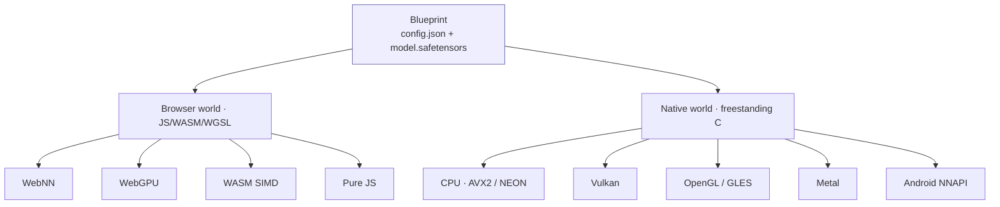
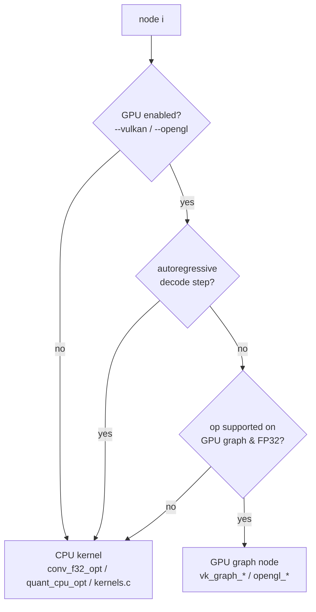

# Chapter 9 — The Native Engine (on-device AI: desktop, phone, robot)

*Read the badges that match you: 🌱 **Idea** (anyone, no code) · 🔧 **Build** (a little code) · 🔬 **Deep**
(engine developers). New here? Follow just the 🌱 sections.*

*Goal: understand VolvoxAI's **native** side — a freestanding C program that runs the **same
blueprint** as the browser, on desktops and phones, across CPU and several GPU/NPU backends —
and the design ideas that make that possible.*

> 🌱 **The big idea.** Everything so far could run in a web browser. This chapter is about running
> the *same model* as a small standalone program — **directly on a device, with no browser and no
> internet.** That's what people mean by **on-device** or **edge AI**: the intelligence lives on the
> gadget itself — your laptop, your phone, a camera, a drone, a **robot** — so it's private (data
> never leaves), always available (works offline), and instant (no round-trip to a server). The
> clever part is that this is *one small program* that, when it starts, looks around the device,
> finds whatever chip it has (a plain CPU, a GPU, a neural chip), and uses it — without needing that
> chip's software kit bundled in. Same blueprint as the browser, now running on bare metal.

🔧 Chapters 1–5 mostly read the JavaScript tiers because they're the clearest teaching text. But
that's only half of VolvoxAI. The other half is `native/`: a **bare-metal C engine** that takes
the *identical* `config.json` + `.safetensors` and runs it with no browser, no Node, and — this
is the striking part — **no statically linked GPU SDK**. This chapter is the architecture and the
"why" behind it.

---

## 9.0 Why on-device matters (edge AI & robots)

> 🌱 **Idea.** Why not just call a big AI in the cloud? Three reasons a robot or a phone often
> *can't*:
>
> - **Privacy.** The camera feed, the microphone, the receipt — none of it has to leave the device.
> - **Offline & reliable.** A robot in a warehouse, a drone in a field, a car in a tunnel: no Wi-Fi,
>   no problem. On-device AI keeps working with no signal.
> - **Speed & control.** A robot deciding where to step can't wait 300 ms for a server to answer.
>   Running locally is instant and predictable.
>
> The price is that the device is *small* — a modest chip, limited memory, a battery. That's exactly
> why the earlier chapters mattered: **quantization** (Chapter 6–7) shrank the model to fit, and the
> **fast kernels** (Chapter 8) make it run on a weak chip. This chapter is where those pay off: the
> same tiny model, running on the robot itself.

🔬 The robot/edge story in this book is *architectural*, not a bundled robotics demo: VolvoxAI gives
you a freestanding binary that drops onto an edge device and runs the blueprint. Wiring it to a
specific robot's sensors and motors is application code that lives outside the engine (see the
frontends in §9.9). A runnable end-to-end robot example is future work; what follows is the engine
that makes it possible.

---

## 9.1 The core idea: one blueprint, two worlds

> 🌱 **Idea.** The whole project rests on one promise: **describe the model once; run it anywhere.**
> The exact same two files (recipe + pantry, from Chapter 1) that a web page loads are the files the
> on-device program loads. Nothing is re-exported or re-trained for the robot — it's literally the
> same model.

🔧 The whole project is organized around a single principle:

> **Write the model once as a blueprint; run it anywhere.**



The browser world was Chapter 8. The fixed native executable
(`native/volvoxai`) is a model-agnostic raw tensor runner. Task-oriented image
and vocabulary policy lives in a separate example application:

```bash
make -C examples native_task_cli
examples/target/bin/volvoxai-tasks generate models/tinystories_1m \
  --prompt "Once upon a time, Lily" --max-new 50
examples/target/bin/volvoxai-tasks detect models/efficientdet_lite0_int8 \
  --image input0=photo.png --image-normalize raw-255 --boxes boxes --scores scores
```

Same files the browser loads. That symmetry is the design.

---

## 9.2 The freestanding philosophy (why it's unusual)

> 🌱 **Idea.** Two unusual rules make this work on a robot. **One:** there's no big framework
> underneath — the engine *is* the small pile of C code, so there's nothing heavy to install.
> **Two:** it doesn't bundle any GPU's software kit. Instead, when the program starts, it *asks the
> device* "do you have a GPU driver? a neural chip?" and plugs into whatever it finds — at that
> moment, at runtime. So a **single** program file works on a fancy machine with a GPU *and* on a
> bare CPU-only board, without rebuilding. That portability is exactly what edge devices need.

🔧 Two deliberate constraints shape the native engine:

1. **No Emscripten / no heavy runtime.** The WASM module is built with plain
   `clang --target=wasm32 -msimd128` — a *freestanding* build with `--no-entry`, no libc runtime.
   The native binary is ordinary `clang -O3 -mavx2 -mfma -pthread`. There is no framework
   underneath; the engine *is* the code in `native/`.
2. **No static GPU dependency.** The binary does **not** link `libvulkan` or an OpenGL SDK at
   build time. Instead it **`dlopen`s** the GPU driver *at runtime* and looks up entry points by
   name. If the driver is present, you get GPU acceleration; if not, the exact same binary runs on
   CPU. One artifact, portable across machines with wildly different GPU stacks.

🔬 Here is that runtime loading, verbatim (`native/src/backends/vulkan_engine.c`, `native/src/backends/opengl_engine.c`):

```c
// Vulkan: try the platform's loader names, in order, at runtime.
const char* names[] = { "libvulkan.so.1", "libvulkan.so", "vulkan-1.dll" };
for (i = 0; i < 3; i++) vulkan_lib = dlopen(names[i], RTLD_NOW | RTLD_LOCAL);
vkGetInstanceProcAddr = (PFN_vkGetInstanceProcAddr)dlsym(vulkan_lib, "vkGetInstanceProcAddr");

// OpenGL/GLES: likewise dlopen libEGL + libGLESv2/libGL (or *.dll on Windows).
```

That's the whole trick behind "runs on Vulkan/OpenGL/Metal/NNAPI with no GPU SDK linkage." The
`-ldl` in the build command is the only price.

---

## 9.3 One kernel source, two machines (the shared ABI)

> 🌱 **Idea.** Writing every math step twice — once for the browser, once for the device — would be a
> nightmare to keep in sync. VolvoxAI writes each step's C code **once** and compiles it both ways.
> One source of truth, fewer bugs, identical answers on your laptop and on the robot.

🔧 VolvoxAI avoids maintaining two copies of every kernel. The portable C in `native/src/kernels/*.c`
(bundled by `native/src/kernels/kernels.c`) compiles **both** to WebAssembly (Tier 3 in the browser) **and**
to the native binary. 🔬 The trick is a **`uintptr_t` heap-pointer ABI**: kernels address memory
through integer offsets into one flat heap, so the same source works whether that heap is WASM
linear memory or a native `malloc` arena. The compiler then auto-vectorizes it to **AVX2 on x86**
and **NEON on arm64** (the chip family in most phones and robots).

```
                       ┌─────────────────────────────┐
   native/src/kernels/*.c  │  portable C, uintptr_t heap │
                       └───────────┬─────────────────┘
             clang --target=wasm32 │ clang -O3 -mavx2 (x86) / -march=…(arm64)
                    ┌──────────────┴───────────────┐
       dist/<version>/volvoxai.wasm            native/volvoxai
       dist/<version>/volvoxai.full.wasm       native/volvoxai-full
             (browser forward/full)        (desktop/Android CPU/full)
```

The pure-JS ops (`ts/ops/*.ts`) remain the reference these are validated against — so there are
really **three** expressions of each op (JS reference, portable C, and — for hot ops — an
*optimized* C kernel), all required to agree.

---

## 9.4 The engine lifecycle (`native/src/runtime/engine.c`)

> 🌱 **Idea.** Using the engine is three moves: **load** the model once (the slow part — read the
> files, lay out memory), then **run** it as many times as you want (fast), and **shut down**. On a
> robot that means: load once at startup, then run the model on every camera frame, cheaply, for as
> long as the robot is on.

🔬 The native engine is a small, explicit state machine. Its public API (`native/include/volvoxai.h`) is the C
counterpart of the JS `compile()` / `execute()`:

```c
int    volvoxai_engine_configure(const VolvoxAIEngineOptions* options);           // choose backend/debug/thread policy
int    volvoxai_engine_init(const char* config_path, const char* weights_path);  // load + build ONCE
float* volvoxai_engine_input_ptr(const char* name, long* numel);                 // poke an input tensor
int    volvoxai_engine_forward(void);                                            // run the whole graph
const char* volvoxai_engine_graph_output_name(int index);                        // inspect declared outputs
const float* volvoxai_engine_tensor_row_f32(const char* name, int row,
                                             int* count);                         // read an explicit F32 row
void   volvoxai_engine_shutdown(void);                                           // tear down
// generic sequence helpers:
int    volvoxai_engine_forward_prefix(int row_count); // process a prefix, fill row/KV caches
int    volvoxai_engine_forward_row(int row);          // process one row via the cache
int    volvoxai_engine_forward_incremental(void);     // seed dependency-aware execution
int    volvoxai_engine_incremental_row_supported(void);
int    volvoxai_engine_forward_incremental_row(int row);
```

`volvoxai_engine_init` does the one-time heavy lifting (`native/src/runtime/engine.c`):

```c
int volvoxai_engine_init(const char* config_path, const char* weights_path) {
    load_weights(weights_path);        // mmap/parse the .safetensors blob
    build_graph(config_path);          // parse config.json → g_t[] tensors, g_n[] nodes
    prepack_conv_weights();            // re-lay-out fp32 conv weights (im2col/GEMM order)
    g_loaded = 1;
}
```

Then `volvoxai_engine_forward` is the familiar loop — walk the node list, dispatch each:

```c
for (int i = 0; i < g_nn; i++)
    run_node(&g_n[i], i, /*is_last=*/ i == g_nn - 1);
```

The graph is built **once**; forwards are cheap and repeatable. This is what lets `generate` run
hundreds of forward passes without reloading weights.

---

## 9.5 Per-node backend selection (`native/src/runtime/engine_runtime.c`)

> 🌱 **Idea.** For each step, the engine decides *who should do it* — the GPU (great for big batches
> of math) or the CPU (better for small, quick steps). It decides step by step, and if you ask for a
> GPU that isn't there, it tells you rather than silently pretending. This is how one program makes
> good use of whatever hardware a given robot or phone happens to have.

🔧 `run_node` is where "multi-backend" actually happens. For each node it decides *who computes it*,
and the decision is per-node, not per-model:



🔬 Key rules baked into the dispatcher:

- **GPU is opt-in** via one client flag (`--vulkan`, `--opengl`, `--metal`, or `--nnapi`); default is
  CPU. The fixed runner and task example pass that policy to
  `volvoxai_engine_configure()`. An explicitly requested backend that is unavailable fails instead
  of silently selecting CPU.
- **Backend coverage is operator- and dtype-specific.** Supported FP32 and physical W8A8 nodes
  can stay device-resident; an unsupported node uses the CPU reference path.
- **Generation mostly stays on CPU.** The Vulkan/OpenGL graph path is skipped during
  `volvoxai_engine_forward_prefix()`/`volvoxai_engine_forward_row()`, because token-by-token decode
  is latency-bound. Large MatMul/Gemm/Linear nodes can still use one-shot Vulkan/OpenGL offload
  when the work is big enough; small decode-time MatMuls stay on CPU to avoid dispatch overhead.
- Every node records which backend ran it (`"vulkan-graph"`, `"cpu-qconv"`, …) for the `--debug`
  profile report.

---

## 9.6 The GPU path is a deferred command graph

> 🌱 **Idea.** Talking to a GPU has overhead, so instead of chatting one step at a time, the engine
> writes the *whole* to-do list, hands it over once, and lets the GPU rip through it while the data
> stays on the GPU the entire time. Fewer trips = more speed — the same "stop shuffling paper" idea
> as Chapter 8, one level up.

🔬 The native GPU backends don't execute op-by-op with a CPU round-trip each time. Like the WebGPU
tier, they **build a command graph and replay it**, keeping data resident on the device. The
`vk_graph_*` interface (`native/src/backends/vulkan_engine.h`) shows the shape of it:

```c
vk_graph_begin_forward();                        // start recording
vk_graph_conv2d_f32(in, out, w, b, …);           // record a conv
vk_graph_add_relu_f32(a, b, out, n, relu);       // record a fused add+relu
vk_graph_maxpool2d_f32(…); vk_graph_resize_nearest_f32(…);
vk_graph_layernorm_f32(…); vk_graph_gelu_f32(…); vk_graph_softmax_f32(…);
vk_graph_end_forward();                          // submit + wait once
```

Two supporting ideas make this correct:

- **Host/device sync tracking.** `vk_graph_mark_host()` / `vk_graph_sync_host()` track which
  buffers the CPU touched, so data is uploaded/downloaded only when actually needed — not every
  node. Weights upload once; activations stay on the GPU between nodes.
- **Fusion carries over.** The dispatcher records fused nodes (`add+relu`, `concat+sigmoid`) as
  single GPU ops, so the graph-level fusion pass (§9.8) pays off on the GPU too.

The OpenGL/GLES backend mirrors this API (`opengl_graph_*`). Android **NNAPI**
(`nnapi_engine.c`) has its own selection branch for large dense layers. Metal
(`metal_engine.m`) has Apple-only graph dispatch for selected F32 ops such as attention,
Conv1D, elementwise Mul/Sub/Div, Split, DequantizeLinear, NMS, and custom profile ops. The
exact native GPU op matrix lives in
[`docs/operation_list.md`](../operation_list.md).

---

## 9.7 The shader pipeline (WGSL is the single source)

> 🌱 **Idea.** GPUs from different makers speak different "shader" dialects. Rather than hand-write
> the math four times, VolvoxAI writes each GPU program **once** and auto-translates it to every
> dialect. Same one-source-of-truth discipline as the C kernels — less code, fewer bugs.

🔬 You might expect the native GPU backends to need hand-written Vulkan/Metal/GLSL shaders. They
don't — VolvoxAI keeps **WGSL as the one shader language** and *cross-compiles* it. `make
compile_shaders` runs `tools/compile_shaders.sh`, which uses Mozilla's **`naga`** to translate
every `shaders/{inference,training}/*.wgsl` into the formats each native backend wants:

```
shaders/{inference,training}/*.wgsl ──naga──▶ native/shaders/spv/   (SPIR-V  → Vulkan)
                        native/shaders/glsl/  (GLSL    → desktop OpenGL)
                        native/shaders/gles/  (GLSL ES → Android/embedded)
                        native/shaders/metal/ (MSL     → Apple Metal)
```

Write a kernel's shader once in WGSL, then translate it to the native shader formats. Runtime
support still needs a backend wrapper and dispatcher call: today Vulkan/OpenGL wire selected
generated shaders, and Metal wires a smaller Apple-only subset through `metal_graph_*`.
That's the same "one source, many targets" discipline as the C kernels (§9.3), applied to shaders,
with wiring tracked separately from generation.

---

## 9.8 Compile-time operator fusion (`native/src/runtime/graph_opt_fusion.inc`)

> 🌱 **Idea.** Same "glue neighboring steps together" trick from Chapter 8, done here in C before the
> first run. Fewer steps, less memory shuffling — the single biggest speed lever after using the
> chip's many hands.

🔬 Before the first forward, the native engine runs a fusion pass over the parsed graph (the design
from Chapter 8, here at the C level). It rewrites the node list in place — flagging
`fuse_relu6`, marking `skip` on elided nodes, tagging `concat_sigmoid_fuse`:

- **Conv + ReLU6** → clamp inside the conv's write (`fuse_relu6`).
- **Chained `Add`** → collapse sequential residual adds.
- **Depthwise → Pointwise** → run the MBConv pair without spilling the middle tensor.
- **Concat + Sigmoid** → fuse the detector's class-head tail.
- **Alias elision** → drop no-op `Reshape`/copy nodes (`skip`).

Fewer nodes, fewer full passes over big feature maps — the single biggest lever after SIMD.

---

## 9.9 Frontends: keeping tensor execution separate from task policy

> 🌱 **Idea.** The engine only knows about *numbers in, numbers out*. Turning a photo into input
> numbers, or turning output numbers into "dog at these coordinates" or into words — that's *task*
> code, kept separate. This is the seam where you'd bolt the engine onto a specific robot: the
> engine stays generic; your app decides what the numbers *mean*.

🔬 `native/cli/main.c` is the fixed, model-agnostic entry. Both release binaries
expose raw tensor `run`, and the full binary additionally exposes generic
`train`; their only other entry points are help and version output.

`examples/native_task_cli/main.c` is an opt-in application with a plain
`switch` on `argv[1]`. It demonstrates how public APIs can be composed into
image, vocabulary, generation, and postprocessing policy:

| Command | What it does | Example machinery |
|---|---|---|
| `generate` | Autoregressive text (TinyStories) | `tokenizer.c` (BPE) + prefix/row execution + KV-cache |
| `classify` | Top-K image classification | argmax + `labels.txt` |
| `detect` | Object detection → ranked boxes | anchor scoring + labels |
| `ctc` | CTC sequence decoding (e.g. OCR) | CTC collapse |
| `seq2seq` / `chat` | Encoder–decoder / chat loops | cross-attention runtime |

The shared `examples/native_support/image_io.c` decodes PNG/JPEG through
stb_image, while the example chooses an
explicit NHWC normalization mode. The public **`tokenizer.c`** runtime provides
a from-scratch byte-level BPE tokenizer compatible with the same `vocab.bin` +
`merges.txt` as `ts/core/Tokenizer.ts`; the example, not the engine, decides
which vocabulary files to open. Every task still sits on the one public engine
core, while the fixed binaries remain free of those policies.

---

## 9.10 Generic row APIs and task-example generation

> 🌱 **Idea.** For text, redoing all the work for every new word would be wasteful, so the engine
> remembers what it already computed and only does the *new* bit each step. That "remember and
> extend" trick (a KV-cache) is exactly what makes on-device chat feel responsive instead of
> sluggish. You can skip the code — the point is that the same efficiency used by big cloud chat
> servers is here, in a few hundred readable lines of C.

🔬 Chapter 2 introduced the KV-cache conceptually; the native engine is where it's implemented. Each
attention node owns a Key and Value cache (`g_kcache[i]`, `g_vcache[i]` in
`native/src/runtime/engine_internal.h`). Generation splits into two phases:

```
output = volvoxai_engine_graph_output_name(0)
volvoxai_engine_forward_prefix(n_tokens): run the graph over the prompt rows, filling every K/V cache
pos = n_tokens - 1
loop:
  volvoxai_engine_tensor_row_f32(output, pos) ─▶ argmax ─▶ next token
  pos += 1
  volvoxai_engine_forward_row(pos): run the graph for ONE new row, reading cached K/V,
                                    appending this row's K/V   (O(seq) work, not O(seq²))
```

This is exactly the prefill/decode split that production LLM servers use — implemented in a few
hundred lines of C here, which makes it unusually readable.

Dependency-aware clients use the same model-neutral vocabulary: seed retained intermediates with
`volvoxai_engine_forward_incremental()`, check
`volvoxai_engine_incremental_row_supported()`, then refresh an eligible row with
`volvoxai_engine_forward_incremental_row()`. The runtime owns the cache; callers own the meaning of
the row. Between the seed and that refresh, modified row-shaped inputs may differ only at the
selected row. Multi-row changes require an incremental reset followed by a whole incremental
forward.

---

## 9.11 Building the native engine

> 🌱 **Idea.** One command builds the on-device program. The notable thing is what's *missing* from
> the build: it doesn't link any GPU's software kit. That single absence is the whole "runs on any
> device, finds the hardware at runtime" promise, made concrete.

🔧 The Makefile keeps the complete compiler source lists and generated-asset steps
in one place:

```bash
make build_native   # native/volvoxai + native/volvoxai-full
```

The build compiles WGSL, generates each profile-specific compressed shader
pack, and links the shader store plus XZ decoder into the executables.

- `make build_native` — desktop build (CPU + Vulkan/OpenGL via runtime `dlopen`).
- Android — cross-compile with the NDK CMake toolchain (see
  `native/CMakeLists.txt`): NNAPI inference for arm64 API 29 by default. *(arm64 is the chip family
  in most phones, tablets, and single-board robot computers.)*
- `make compile_shaders` — regenerate the external development-override
  SPIR-V/GLSL/GLES/Metal tree from WGSL.

🔬 Notice there is **no** `-lvulkan` / `-lGL`: the only GPU-related flag is `-ldl`. That single
absence is the whole "no static GPU dependency" promise, made concrete.

---

## 9.12 Running backward: native training (learning on the device)

> 🌱 **Idea.** The on-device program can do more than *run* a model — it can **train** one too, right
> on the device. That's what lets a gadget *adapt* to you (or a robot to its environment) without
> sending your data to a server. And it's strict: if you ask it to train on the GPU, it either does
> the whole job on the GPU or tells you it failed — no silently cutting corners.

🔬 The native engine doesn't only run *forward*. The same freestanding binary implements the
**backward pass** of Part II across its backends: the training kernels in
`native/src/kernels/training_kernels.c` for CPU, and a `*Backward` WGSL shader (compiled through the
same `naga` pipeline as §9.7) for the GPU path — `shaders/training/matMulBackward.wgsl`,
`sdpaBackward.wgsl`, `conv2DBackward.wgsl`, and the rest. Tests such as
`native/tests/test_vulkan_training.c` and `test_opengl_training.c` exercise those GPU backward
kernels directly.

The training entry points (`volvoxai_engine_train_step`, AdamW updates, LoRA persistence, optimizer
checkpoints) sit on top of the *same* graph, backend dispatch, and memory arena as inference — so a
caller selects the training backend explicitly:

```
--backend cpu       forward + backward on native CPU kernels (the latency baseline)
--backend vulkan    the complete backward plan must run on Vulkan, or the step fails
--backend opengl    likewise on OpenGL/GLES
--backend metal     likewise on Apple's Metal (requires an Apple runtime build)
```

The strictness is deliberate (`volvoxai_engine_require_training_backend`): a run either executes its
whole backward plan on the requested device or reports failure, rather than silently finishing on CPU
and hiding a gap. This is the `tiny_receipt_vqa_train` flow from Chapter 5, running on the very engine
this chapter describes — which is what makes on-device *training* (not just inference) possible.

---

## 9.13 The design, in one picture

> 🌱 **Idea recap.** The same model you ran in a browser also runs as one small, self-contained
> program on a device — offline, private, and instant. It figures out the device's hardware at
> startup and uses it, needs no GPU kit bundled in, shares its math with the browser version so
> answers match, and can even *learn* on-device. That's the foundation for putting real AI on a
> phone, a camera, or a robot.

🔧

```
                     ┌──────────────────────── native engine ────────────────────────────┐
  config.json ──▶  build_graph ──▶ fusion pass ──▶ prepack weights ──▶ volvoxai_engine_forward loop │
  .safetensors ─▶  load_weights                                          │                  │
                                                              per node: run_node()          │
                                                              ├─ CPU: conv_f32_opt /         │
                                                              │       quant_cpu_opt /        │
                                                              │       kernels.c (AVX2/NEON)  │
                                                              └─ GPU/NPU (dlopen'd):          │
                                                                 vulkan / opengl / nnapi     │
                                                                 metal on Apple platforms    │
                     └────────────────────────────────────────────────────────────────────┘
                       fixed CLIs: run · full-only train · help/version
                       opt-in example: generate · classify · detect · ctc · seq2seq · chat
```

🔬 **The takeaways:**

- VolvoxAI is **dual-target by design**: one blueprint feeds both the browser tiers and a
  freestanding native binary.
- The native engine is **portable without being generic**: no Emscripten, no static GPU SDK —
  GPU drivers are `dlopen`'d at runtime, so one binary spans very different machines.
- **Reuse is enforced across three axes**: one C kernel source (WASM + native), one shader
  language (WGSL → generated native shader formats, wired per backend), one blueprint
  (all backends) — with the pure-JS reference as the correctness oracle.
- Everything still reduces to the Chapter 1 loop: **walk the graph, dispatch each node to the best
  available backend.** Native just adds more backends and sharper kernels.

**Next:** [Chapter 11 — Glossary & Next Steps →](11-glossary-and-next-steps.md)

*(Part V — Chapter 10, "Tiny Receipt VQA, end to end," the capstone that trains, quantizes, and
runs one multimodal model — is forthcoming.)*
