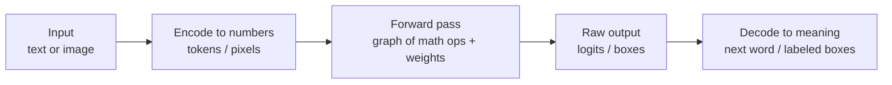

# How AI Actually Works — A VolvoxAI Textbook

*🌐 Language: **English** · [한국어](ko/README.md)*

> A hands-on tour of neural-network **inference**, built around the real code in this
> repository. We take two working models — a **language model** (TinyStories) and an
> **object detector** (EfficientDet-Lite0, in fp32 / fp16 / int8) — and follow a single
> input all the way to an answer, one operation at a time.

By the end you will be able to read any modern model as a **graph of small math
operations**, know what each operation actually computes, and understand the engineering
choices (memory layout, quantization, GPU vs CPU) that make it run fast on real hardware.
That is the working knowledge this textbook builds: inference mechanics and runtime
engineering.

---

## Scope and current gaps

This textbook is centered on **inference**: loading trained weights, executing a model
graph, decoding outputs, quantizing weights, and mapping ops to browser/native backends.
It does **not** yet cover the broader training and research stack:

| Missing area | What is currently absent |
|---|---|
| Training | Backpropagation, autograd, loss functions, optimizers such as Adam, learning-rate schedules, initialization, and regularization. |
| Math foundations | Linear algebra derivations, calculus for chain rule/gradients, probability, and information theory. |
| Data | Dataset construction, input pipelines, augmentation, tokenizer training, train/validation/test splits, and leakage checks. |
| Evaluation & experimentation | Metrics, validation methodology, ablations, overfitting, and bias-variance analysis. |
| Architecture breadth | Diffusion models, GNNs, RNN/LSTM, reinforcement learning, VAE/GAN, retrieval and embeddings, multimodal models, MoE, and SSMs. |
| Modern LLM training stack | Pretraining, supervised fine-tuning, LoRA/adapters, RLHF/DPO, distributed training, and FlashAttention internals. |
| Research practice | Reproducing papers, deriving results, reasoning about inductive biases, and scaling laws. |

Chapter 7 turns this list into a concrete map of what would need to be added next.

---

## How to read this book

The chapters build on each other. Read them in order the first time.

1. **[Foundations](01-foundations.md)** — What inference is. Tensors, graphs, operations.
   The VolvoxAI mental model and its four "tiers." How a model is stored as a *blueprint*.
2. **[A Language Model, op by op (TinyStories)](02-tinystories-language-model.md)** —
   Follow the sentence *"Once upon a time, Lily"* through a GPT-style transformer until it
   predicts the next word. Tokenize → embed → attention → feed-forward → logits → sample → repeat.
3. **[A Vision Model, op by op (EfficientDet-Lite0)](03-efficientdet-vision-model.md)** —
   Follow a 320×320 photo through a convolutional detector until it outputs boxes and labels.
   Backbone → feature pyramid → detection heads → decode.
4. **[Precision & Quantization (fp32 / fp16 / int8)](04-precision-and-quantization.md)** —
   How numbers are stored as bits, why the same detector ships in three sizes, and the exact
   integer math that makes the int8 version 4× smaller.
5. **[Inside the Engine](05-inside-the-engine.md)** — How VolvoxAI runs a graph in the *browser*:
   the four hardware tiers, the leap from a *naive* kernel to a *fast* one, and operator fusion.
6. **[The Native Engine](06-native-engine-architecture.md)** — The *other* half: a freestanding C
   binary running the same blueprint on CPU + Vulkan/OpenGL/Metal/NNAPI, with GPU drivers loaded
   at runtime. The overall dual-target architecture and its design choices.
7. **[Glossary & Next Steps](07-glossary-and-next-steps.md)** — Every term in one place, a
   suggested learning path, exercises that use this repo, and the current gaps beyond inference.

> **About the diagrams.** Flowcharts are written in [Mermaid](https://mermaid.js.org/), which
> renders as an image on GitHub, in VS Code (with the Markdown Preview Mermaid extension), and
> in most Markdown viewers. Data-layout pictures use plain ASCII so they render everywhere.

---

## The one-paragraph version

A neural network is not magic and it is not a brain. It is a **fixed list of arithmetic
operations** — mostly multiply-and-add — applied to a big grid of numbers (your input) using
another big grid of numbers (the **weights**, learned during training). Running the list once,
from input to output, is called a **forward pass** or **inference**. VolvoxAI is an engine that
does exactly this: it reads the list of operations (the *graph*), reads the weights, and
computes the output. Training — the separate, harder process that *discovers* good weights — is
not in this repo. We study the part that turns a trained model into an answer.

Turn to **[Chapter 1: Foundations](01-foundations.md)** to start.
