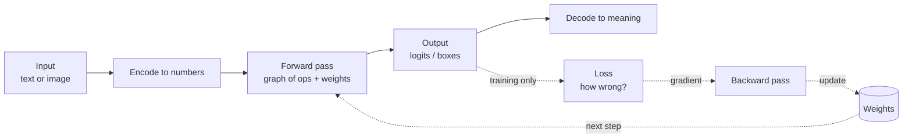

# How AI Actually Works — A VolvoxAI Textbook

*🌐 Language: **English** · [한국어](ko/README.md)*

> A hands-on tour of how a neural network is **found, run, and shrunk**, built around the real code
> in this repository. We take two working models — a **language model** (TinyStories) and an
> **object detector** (EfficientDet-Lite0) — and follow a single input all the way to an answer,
> one operation at a time. Then we turn the model around: follow the **gradient backward**, watch an
> **optimizer** improve the weights, and **quantize** the trained result down to int8.

---

## 📖 Three ways to read this book

This book is written in **three depths at once**. Every section is tagged, so you read only as deep
as you want and skip the rest without losing the thread:

| Badge | Who it's for | What it gives you |
|:---:|---|---|
| 🌱 **Idea** | **Anyone** — no coding, no math. A curious 11-year-old can follow it. | What each thing *is*, in plain words and analogies. |
| 🔧 **Build** | You can read a little code. Students, hobbyists, tinkerers. | The real thing — graphs, JavaScript, operators. |
| 🔬 **Deep** | Developers building on the engine. | The internals — quantization, native/edge, optimization, training. |

**How to pick your path:**

- 🌱 **"I just want to understand what AI is."** Read only the **🌱 Idea** sections, straight
  through every chapter. No code, no math — you'll still come out understanding what a model is,
  how it runs, how it learns, and how it fits on a phone or a robot.
- 🔧 **"I can code a little and want to see it work."** Read 🌱 **+** 🔧. You'll be able to open any
  file in `ts/ops/` and know exactly what it does.
- 🔬 **"I'm a developer who wants to work on the engine."** Read everything, and keep
  [ARCHITECTURE.md](../../ARCHITECTURE.md) open beside it.

> The 🌱 thread is designed to be read **on its own, from the first page to the last.** No part is
> ever too hard to follow — even training and quantization get a plain-words version. Depth is
> optional; the *story* is complete at every level.

---

## What this book covers

VolvoxAI implements the **whole loop**. It runs the **forward pass** — loading trained weights and
computing an answer (inference) — and also the **backward pass** (a `*Backward` twin for essentially
every op, in `shaders/training/` and `native/src/kernels/training_kernels.c`), **optimizers**
(AdamW/SGD, gradient accumulation, checkpointing), **LoRA** fine-tuning, and a **quantization**
subsystem (calibration/PTQ and quantization-aware training). So the book follows the whole loop:

```
   Part I  FORWARD  ───▶  Part II  BACKWARD  ───▶  Part III  OPTIMIZE  ───▶  Part IV  ENGINE
   what a model is        where the weights        make it small & fast      how it all executes
   and how it runs        come from (training)      (precision + quantize)    (browser · edge · robot)
                                                                                     │
                                                          Part V  SYNTHESIS  ◀────────┘
                                                     one real multimodal model,
                                                     trained → quantized → run
```

It still does **not** try to be a complete ML-research curriculum — dataset pipelines, formal
evaluation, RLHF/DPO, distributed training, and architecture breadth (diffusion, GNNs, SSMs, …)
remain out of scope. Chapter 11 turns what's left into a concrete map.

---

## The chapters

The chapters build on each other. Read them in order the first time. The badges on each line show
which rungs that chapter carries.

### Part I — Forward: what a model is and how it runs

1. **[Foundations](01-foundations.md)** 🌱🔧🔬 — What a forward pass is. Tensors, graphs,
   operations. The VolvoxAI mental model and its three "tiers." How a model is stored as `graph.json`
   plus weights, and how that file declares the *range* of shapes it accepts.
2. **[A Language Model, op by op (TinyStories)](02-tinystories-language-model.md)** 🌱🔧🔬 — Follow
   the sentence *"Once upon a time, Lily"* through a GPT-style transformer. Tokenize → embed →
   attention → feed-forward → logits → sample → repeat.
3. **[A Vision Model, op by op (EfficientDet-Lite0)](03-efficientdet-vision-model.md)** 🌱🔧🔬 —
   Follow a 320×320 photo through a convolutional detector. Backbone → feature pyramid → detection
   heads → decode.

### Part II — Backward: where the weights come from

4. **[The Backward Pass](04-backward-pass.md)** 🌱🔧🔬 — How a model *learns*. A loss measures the
   error; gradients flow *backward*, and every forward op you met has a **backward twin**. We
   re-walk Chapter 2's transformer block in reverse.
5. **[The Optimizer & the Training Loop](05-optimizer-and-training-loop.md)** 🌱🔧🔬 — Turning
   gradients into better weights: SGD/AdamW, learning rate, gradient accumulation, train-vs-eval
   mode, checkpoints, and **LoRA** fine-tuning.

### Part III — Optimization: making models small and fast

6. **[Precision & Quantization](06-precision-and-quantization.md)** 🌱🔧🔬 — How numbers are stored
   as bits, why the same detector ships in three sizes, and the exact integer math that makes int8
   4× smaller.
7. **[Producing a Quantized Model](07-producing-a-quantized-model.md)** 🌱🔧🔬 — Quantization as a
   *process*: observers and calibration, post-training quantization (PTQ), and quantization-aware
   training (QAT).

### Part IV — The engine: how it all executes (browser · edge · robot)

8. **[Inside the Browser Engine](08-inside-the-engine.md)** 🌱🔧🔬 — The three hardware tiers, the
   leap from a *naive* kernel to a *fast* one, operator fusion, and the two halves of the shape
   system: proving the whole bounded domain at compile time, then binding one concrete shape per
   request.
9. **[The Native Engine](09-native-engine-architecture.md)** 🌱🔧🔬 — A freestanding C binary
   running the same graph package on a desktop, a phone, or a **robot** — CPU +
   Vulkan/OpenGL/CUDA/Metal, with GPU drivers loaded at runtime. This is the
   *on-device / edge AI* chapter.
   - **9C. [Inside the CUDA Backend](09c-cuda-backend.md)** 🌱🔧🔬 — A front-to-back companion that
     zooms all the way into the **NVIDIA GPU** path: borrowing only the driver, baking PTX kernels,
     keeping numbers resident on the card, recording graphs for replay, strict FP32, and — in the
     full build — training and W8 authoring. Deep, but readable straight through the
     🌱 thread.

### Part V — Synthesis

10. **Tiny Receipt VQA, end to end** *(forthcoming)* — The capstone: one real multimodal model that
    uses every part of the book — vision + transformer + cross-attention, LoRA fine-tuning, W8A8
    quantization — walked through its full lifecycle: train → checkpoint → quantize → run.

### Reference

11. **[Glossary & Next Steps](11-glossary-and-next-steps.md)** 🌱🔧🔬 — Every term in one place, a
    suggested learning path **for each track**, exercises that use this repo, and the gaps beyond
    what's covered here.

> **About the diagrams.** Flowcharts are written in [Mermaid](https://mermaid.js.org/), which renders
> as an image on GitHub, in VS Code (with the Markdown Preview Mermaid extension), and in most
> Markdown viewers. Data-layout pictures use plain ASCII so they render everywhere.

---

## The one-paragraph version (🌱 everyone)

A neural network is not magic and it is not a brain. It is a **fixed list of arithmetic operations** —
mostly multiply-and-add — applied to a big grid of numbers (your input) using another big grid of
numbers (the **weights**). Running the list once, input to output, is a **forward pass** or
**inference**. *Training* is the reverse: run the forward pass, measure how wrong the output was with
a **loss**, then push that error **backward** through the same ops to get a **gradient** for every
weight, and let an **optimizer** nudge each weight to be a little less wrong — millions of times.
Once the weights are good, **quantization** shrinks them from 32-bit floats to 8-bit integers with
almost no accuracy loss, so the model fits in a browser tab, on a phone, or on a robot. VolvoxAI
implements all of this, and this book reads the real code for each step.



Turn to **[Chapter 1: Foundations](01-foundations.md)** to start.
