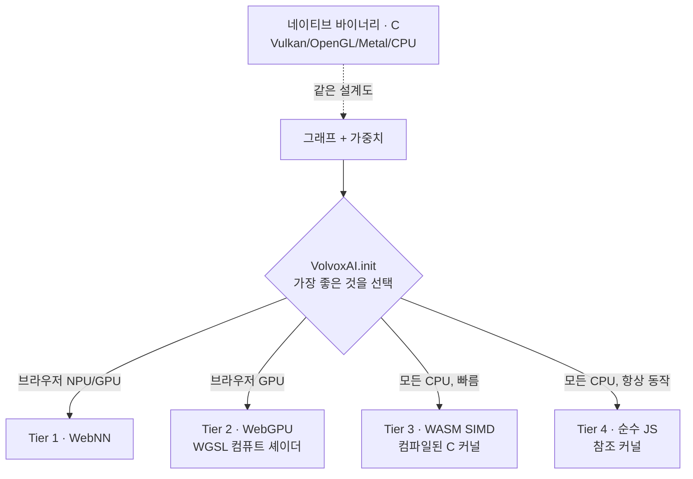

# 1장 — 기초

*자신에게 맞는 배지를 읽으세요: 🌱 **아이디어**(누구나, 코드 없이) · 🔧 **만들기**(코드 조금) · 🔬
**심화**(엔진 개발자). 처음이신가요? 🌱 부분만 따라가세요 — 책 전체를 관통합니다.*

*목표: 이 장을 마치면 어떤 모델이든 **텐서 위의 연산 그래프(graph of operations on tensors)** 로
바라볼 수 있고, VolvoxAI가 그것을 실행하기 위해 쓰는 구성 요소들을 이해하게 됩니다.*

> 🌱 **핵심 아이디어.** "AI"는 두뇌도 아니고 마법도 아닙니다. 그것은 **아주 많은 작은 산술** — 대개
> "이 숫자들을 곱하고, 더해라" — 을 정해진 순서로 계속 반복하는 기계입니다. 숫자를 넣으면(사진이나
> 문장을 숫자로 바꿔서), 기계가 작은 덧셈 더미를 처리하고, 반대편으로 숫자가 나옵니다(라벨, 단어,
> 고양이를 감싼 박스). 이 장은 그 기계를 이루는 네 개의 레고 조각에 이름을 붙일 뿐입니다:
> **격자에 담긴 숫자(텐서)**, **작은 수학 한 단계(연산)**, **그 단계들을 이어 붙인 목록(그래프)**,
> 그리고 **저장된 조리법(설계도)**. 이것이 전체 어휘입니다. 책의 나머지는 전부 세부일 뿐입니다.

---

## 1.1 "AI를 실행한다"는 것의 실제 의미

> 🌱 **아이디어.** 아주 긴 **조리법(recipe)** 을 떠올려 보세요. 재료(당신의 질문이나 사진을 숫자로
> 바꾼 것)를 건넵니다. 조리법은 *젓기, 넣기, 섞기* 같은 단순한 단계들의 목록이고, 각 단계는 미리
> 계량해 둔 숫자들이 가득한 커다란 창고(**가중치**)에도 손을 뻗습니다. 조리법을 한 번 끝까지 따르면
> 요리, 즉 답이 나옵니다. 조리법을 한 번 실행하는 것을 **순전파(forward pass)** 라고 합니다. "AI를
> 실행한다"는 건 그게 전부입니다.

🔧 AI 모델을 사용할 때 실제로는 세 가지 일이 일어납니다.

1. 당신의 입력(텍스트, 이미지, 오디오)이 **숫자**로 바뀝니다.
2. 그 숫자들이 긴 **산술 연산(arithmetic operations)** 목록을 통과합니다. 각 연산은
   **가중치(weights)** 라 부르는, 미리 계산된 큰 숫자 표도 함께 사용합니다.
3. 마지막 숫자들이 다시 의미 있는 것(단어, 박스, 라벨)으로 바뀝니다.

2번 단계가 곧 모델입니다. 이것을 한 번 실행하는 것을 **순전파(forward pass)** 또는
**추론(inference)** 이라고 합니다. 추론은 그게 전부입니다. 누군가가 유용하도록 *학습시킨* 특정
순서로 배열된, 곱하고 더하는 파이프라인이지요.

> **학습(training) vs. 추론(inference).** 🌱 *추론* 은 완성된 조리법으로 **요리하는** 것입니다(1부).
> *학습* 은 그 조리법을 애초에 **쓰는** 것입니다(2부): 요리를 하고, 얼마나 틀렸는지 맛보고, 양을
> 조금 바꾸고, 좋아질 때까지 수천 번 반복합니다. 🔬 정확히 말하면: 추론은 완성된 가중치로 답을
> 계산하고, 학습은 그 가중치를 *발견* 합니다 — 많은 예제를 보여주고, 얼마나 틀렸는지 재고, 모든
> 가중치를 조금 덜 틀리도록 조정합니다. VolvoxAI는 **둘 다** 합니다: 순전파를 실행할 뿐 아니라, 모델을
> 만들고 줄이는 역전파·최적화기·양자화까지 구현합니다. 이 책은 전체 루프를 따라갑니다.

---

## 1.2 텐서: 당신이 알아야 할 유일한 자료구조

> 🌱 **아이디어.** 신경망을 흐르는 모든 숫자는 **텐서(tensor)** 안에 담깁니다. 커다란 **달걀판** 을
> 떠올려 보세요: 작은 컵들의 격자이고, 각 컵에 숫자 하나가 들어 있으며, 판이 어떤 모양인지(예:
> 2행 × 3컵) 알려주는 라벨이 붙어 있습니다. 사진, 문장, 소리 — 컴퓨터는 이 모두를 숫자 달걀판으로
> 바꿉니다. 기계를 흐르는 "재료"는 이것뿐입니다. "라벨 붙은 숫자 격자"를 그릴 수 있으면 다 된
> 겁니다.

🔧 신경망을 흐르는 모든 숫자는 **텐서(tensor)** 안에 담깁니다. 텐서란 그저 다차원 배열(숫자 격자)에,
각 차원의 크기를 알려주는 **형태(shape)** 가 붙은 것입니다.

```
scalar   3.14                         shape []            (숫자 하나)
vector   [3.14, 2.71, 1.62]           shape [3]           (리스트)
matrix   [[1, 2, 3],                   shape [2, 3]        (표: 2행 3열)
          [4, 5, 6]]
tensor   224x224 RGB 이미지 8장         shape [8, 224, 224, 3]
```

마지막 형태 `[8, 224, 224, 3]` 은 이렇게 읽습니다: **8** 장의 이미지, 각각 높이 **224** 픽셀,
너비 **224** 픽셀, **3** 개의 색 채널(빨강, 초록, 파랑). 숫자 네 개가 수백만 개의 값을 완전히
설명합니다.

**이 저장소에서** 텐서는 아주 작은 객체(`ts/core/Tensor.ts`)입니다 — 이름, 형태, 자료형, 그리고 숫자들의
평평한(flat) 버퍼로 이루어집니다:

```javascript
// ts/core/Tensor.ts (요약)
class Tensor {
  name;      // 예: "hidden_0"
  shape;     // 예: [1, 256, 64]
  dtype;     // "float32" | "int8" | "int32"
  buffer;    // shape의 곱만큼의 숫자를 담은 평평한 Float32Array / Int8Array
  isWeight;  // 학습으로 얻은 값이면 true (추론 시 읽기 전용)
}
```

### 🔬 텐서는 평평하게 저장된다

컴퓨터의 메모리는 하나의 긴 바이트 줄일 뿐 — "행"과 "열" 같은 개념을 모릅니다. 형태 `[2, 3]` 인
텐서는 **한 줄에 6개의 숫자**로 저장되고, 원소 `[row, col]` 이 *어디에* 있는지는 인덱스 계산으로
알아냅니다:

```
논리적 관점            실제 메모리(실제로 존재하는 것)
[[a, b, c],           [ a, b, c, d, e, f ]
 [d, e, f]]             0  1  2  3  4  5

  원소 [row, col]     →  flat index = row * 3 + col
  원소 [1, 2] = 'f'   →  1 * 3 + 2 = 5   ✓
```

이 정확한 패턴 — `((b * H + y) * W + x) * C + c` — 을 커널 곳곳에서 보게 됩니다. 4차원 이미지
텐서를 1차원 배열 안에서 주소 지정하는 방식이지요. 형태를 외우면 인덱스 계산은 자연히 따라옵니다.

> 🔬 **NHWC vs NCHW.** 차원의 *순서* 가 중요합니다. VolvoxAI의 비전 모델은 **NHWC**(배치, 높이, 너비,
> 채널)를 씁니다 — 한 픽셀의 색 채널들이 메모리에서 서로 붙어 있습니다. PyTorch는 보통 **NCHW**를
> 씁니다. 같은 데이터, 다른 메모리 배치일 뿐이며, 커널들은 어느 쪽을 읽는지 서로 합의해야 합니다.
> (이 저장소의 변환기는 모든 비전 `config.json` 에 `"internal_layout": "NHWC"` 를 기록합니다.)

---

## 1.3 연산: 작고 잘 정의된 하나의 일

> 🌱 **아이디어.** **연산(operation)** 은 조리법의 한 단계입니다 — "이 두 숫자 판을 컵 하나씩 짝지어
> 더해라" 같은 하나의 작은 일이지요. 각 연산은 그 자체로는 민망할 만큼 단순합니다. 지능은 어느 한
> 단계에 있는 게 아니라, 이런 작은 단계 *수천 개* 를 올바른 순서로 하는 데서 나옵니다. 이 책 전체의
> 핵심 한 줄: **마법이나 설명 불가능한 일이 일어나는 단계는 어디에도 없습니다.** 전부 작은
> 덧셈입니다.

🔧 **연산(operation, 줄여서 op, 또는 layer)** 은 입력 텐서 하나 이상을 받아, 정해진 수학 계산을 하고,
출력 텐서 하나 이상을 씁니다. 앞으로 만날 예시들:

| 연산 | 한마디로 | 사용처 |
|---|---|---|
| `MatMul` | 행렬 곱 — 특징을 "섞는" 핵심 | 두 모델 모두 |
| `Conv2D` | 작은 필터를 이미지 위로 슬라이드 | 탐지기 |
| `Add` | 두 텐서를 원소별로 더하기 | 두 모델 모두 |
| `LayerNorm` | 벡터를 잘 다뤄지도록 재중심화·재스케일 | 언어 모델(LM) |
| `SDPA` | 스케일드 닷-프로덕트 어텐션 — "어떤 단어가 어떤 단어를 보는가" | LM |
| `GELU` / `ReLU` | 비선형 압축 함수 | 두 모델 모두 |
| `MaxPool2D` | 각 패치에서 가장 큰 값만 남겨 이미지 축소 | 탐지기 |

VolvoxAI의 모든 연산은 `ts/ops/` 에 쉬운 말로 된 **참조 구현(reference implementation)** 을
가집니다. 파일 하나에 하나씩이지요. 다음은 `Add` 연산의 *전부* 입니다 — 단순화한 것이 아니라 실제
코드입니다:

```javascript
// ts/ops/add.ts — 브로드캐스팅을 포함한 원소별 덧셈
for (let i = 0; i < out.length; i++) {
  out[i] = a[i] + b[i % b.length];   // b.length가 더 작을 수 있음 ("브로드캐스트")
}
```

이것이 비밀의 전부입니다. 모델이란 이런 연산 수천 개가, 각각은 사소하지만, 사슬처럼 이어진
것입니다. **설명 불가능한 무언가가 일어나는 단계는 없습니다.**

---

## 1.4 그래프: 연산들을 서로 연결하기

> 🌱 **아이디어.** 모델은 **서로 연결된 단계들의 목록** 입니다 — 조립 라인, 또는 도미노 사슬처럼요.
> 각 단계의 출력이 다음 단계의 입력이 됩니다. "모델을 실행한다"는 건 컴퓨터가 목록을 따라 내려가며
> 각 단계를 차례로 하는 것뿐입니다. 그래서 AI 엔진은 그 심장에서 **"다음 단계 해, 다음 단계 해,
> 다음 단계 해"** 를 목록이 끝날 때까지 반복하는 루프입니다. 정말로요.

🔧 모델은 **그래프(graph)** 입니다 — 각 연산의 출력이 뒤의 연산의 입력이 되는 연산 목록이지요.
VolvoxAI는 이것을 `Graph` 객체(`ts/core/Graph.ts`)로 저장합니다: **텐서**들의 집합과 **노드(node)**
목록(연산 + 그 입력/출력 텐서 + 파라미터).

모든 연산이 자신의 입력과 출력을 *이름으로* 선언하기 때문에, 그래프는 단순한 장부 정리일 뿐입니다:

```
tokens ─┐
        ├─▶ [Embedding] ─▶ emb_tok ─┐
wte  ───┘                           ├─▶ [Add] ─▶ hidden_0 ─▶ [LayerNorm] ─▶ ...
positions ─▶ [Embedding] ─▶ emb_pos ┘
```

그래프를 **실행**하려면, VolvoxAI는 그저 노드 목록을 위에서 아래로 훑으며 각 연산을 실행합니다.
실행기(executor) 루프 전체가 이만큼 읽기 쉽습니다(`ts/backends/CPUEngine.ts`):

```javascript
// ts/backends/CPUEngine.ts — 엔진의 심장
for (const node of graph.nodes) {
  this._runNode(node);      // node.opType로 분기 → 알맞은 커널 호출
}
```

🔬 `_runNode` 는 연산 종류에 대한 커다란 `switch` 입니다(`"MatMul"` → matmul 커널, `"Conv2D"` → conv
커널, …). 그게 전부입니다. **신경망 엔진이란 함수 호출 목록을 도는 `for` 루프입니다.** 나머지는 그
함수들을 빠르게 만들고(8장), 수치적으로 작게 만들고(6–7장), 그리고 — 2부에서 — 애초에 가중치를
발견하기 위해 그것들을 *거꾸로* 실행하는 일일 뿐입니다.

---

## 1.5 설계도: 모델이 저장되는 방식

> 🌱 **아이디어.** 저장된 모델은 그저 **두 개의 파일** 입니다: **조리법 카드**(순서 있는 단계 목록)와
> **창고**(단계들이 쓰는, 미리 계량된 모든 숫자). 이 두 파일을 엔진에 건네면 요리를 할 수 있습니다.
> 숨겨진 게 없습니다 — 비밀의 두뇌도, 클라우드 마법도 없습니다. 파일 두 개입니다.

🔧 디스크 위의 VolvoxAI 모델은 두 개의 파일입니다:

```
model/
  config.json          # 그래프: 연산 노드 목록 (토폴로지 + 파라미터 + 형태)
  model.safetensors    # 가중치: 학습된 숫자들, 표준 바이너리 형식
```

- **`config.json`** 이 곧 *설계도(blueprint)* 입니다: 순서가 있는 노드 목록이지요. 각 노드는 자신의
  연산, 입력/출력 텐서, 파라미터, 그리고 정확한 출력 형태(엔진이 절대 추측하지 않도록 익스포터가 미리
  계산해 둠)를 이름 붙입니다. 다음은 TinyStories의 실제 노드 하나입니다:

  ```json
  {
    "op": "LayerNorm",
    "inputs":  { "input": "hidden_0", "weight": "h.0.ln_1.weight", "bias": "h.0.ln_1.bias" },
    "outputs": { "out": "ln1_0" },
    "outputs_shape": { "out": [1, 256, 64] },
    "params": { "eps": 1e-05, "d_model": 64 }
  }
  ```

- **`model.safetensors`** 는 원시 가중치 텐서(`h.0.ln_1.weight`, `wte.weight`, …)를
  [safetensors](https://github.com/huggingface/safetensors) 형식으로 담습니다 — ML 세계 전반에서
  쓰이는 단순하고 안전한 표준 레이아웃입니다.

🔬 `ts/core/GraphLoader.ts` 가 둘 다 읽어 `Graph` 를 만들고 엔진에 넘깁니다 — 추론 시점에 PyTorch도,
ONNX Runtime도, 어떤 의존성도 없이 말이지요. 다른 곳에서 **학습한 모델을 익스포트** 해 이 설계도로
가져올 수도 있고, 또는 — 2부에서 보듯 — VolvoxAI가 **직접 학습해 설계도를 써낼** 수도 있습니다.

---

## 1.6 하나의 모델, 실행하는 네 가지 방법 ("계층")

> 🌱 **아이디어.** 같은 조리법을 다른 주방에서 요리할 수 있습니다: 빠르고 근사한 오븐, 평범한 가스레인지,
> 아주 작은 캠핑 스토브 — 요리는 똑같이 나오고, 속도만 빠르거나 느릴 뿐입니다. VolvoxAI는 *같은* 모델을
> 브라우저 탭, 노트북, 폰, 심지어 **로봇** 위에서도 실행할 수 있고, 기기가 가진 가장 빠른 "주방"을
> 자동으로 고릅니다. 어디서나 같은 답 — 그래서 이 책이 계속 VolvoxAI가 "브라우저 *와* 엣지에서"
> 돈다고 말하는 것입니다.

🔧 같은 그래프를 아주 다른 하드웨어에서 실행할 수 있습니다. VolvoxAI는 사용 가능한 가장 좋은
**계층(tier)** 을 자동으로 고르며, 모든 계층은 *같은* 결과를 계산합니다:



- **Tier 4 (순수 JS, `ts/ops/*.ts`)** 는 *참조(reference)* 입니다: 느리지만 명백히 올바르며, 다른 모든
  계층이 대조하는 기준(ground truth)입니다. **가장 읽기 쉬워서 이 책의 교재로 사용합니다.**
- **Tier 3 (WASM)** 은 같은 수학을 컴파일된 C로 실행해 크게 빨라집니다.
- **Tier 2 (WebGPU)** 는 각 연산을 GPU 컴퓨트 셰이더(`shaders/{inference,training}/*.wgsl`)로 다시 표현합니다.
- **Tier 1 (WebNN)** 은 그래프를 브라우저 자체의 신경망 API에 넘깁니다(NPU에 도달할 수 있음).
- **네이티브**(`native/`)는 데스크톱, 폰, 또는 로봇에서 *같은* 설계도를 실행하는 독립 C 프로그램이며,
  선택적으로 Vulkan/OpenGL/Metal 위에서 돕니다. **온디바이스 / 엣지 AI** 로 가는 길이며, 9장의 주제입니다.

이 책의 나머지 부분에서 "연산을 따라간다"고 할 때는, *수학이 무엇인지* 를 가장 직접적으로 말해주는
순수 JS 또는 이식성 있는 C 버전을 읽습니다.

---

## 1.7 멘탈 모델, 조립하기

> 🌱 **아이디어 정리.** 숫자가 들어가고 → 기계가 작은 수학 단계들의 긴 목록을 실행하는데, 각 단계는
> 창고에서 미리 계량된 숫자를 꺼내 쓰고 → 숫자가 나오고 → 그것을 단어나 박스로 다시 번역합니다.
> 그게 모델입니다. 모델을 *학습* 시키려면, 실행해 보고, 얼마나 틀렸는지 보고, 창고 숫자를 조금
> 조정합니다 — 그게 학습(2부)입니다. 폰이나 로봇에 들어갈 만큼 *작게* 만들려면 숫자를 반올림합니다 —
> 그게 양자화(3부)입니다. 이제 이 책의 전체 윤곽을 알게 되었습니다.

🔧 이 모두를 합치면 엔진 전체가 그림 하나에 담깁니다:

```
  입력 ──인코딩──▶ 텐서들 ──┐
                          │   graph.nodes의 각 노드마다:
  가중치 (.safetensors에서)─┼──▶   op(inputs, params) → 출력 텐서
                          │
                    (~85개 또는 ~262개 노드 전부 반복)
                          │
                          ▼
                    출력 텐서 ──디코딩──▶ 답
```

어떤 모델이든 두 가지 질문이 정의합니다:

1. **연산은 무엇이며, 어떤 순서인가?** (그래프 / `config.json`)
2. **가중치는 각 연산이 무엇을 하게 만드는가?** (`.safetensors`)

다음 두 장에서 실제 모델 두 개에 대해 이 두 질문에 답합니다 — 그리고 "언어 모델"과 "이미지 탐지기"가
목록 속 연산만 다를 뿐 *같은 아이디어* 임을 보게 될 것입니다.

**다음:** [2장 — 언어 모델 한 연산씩 →](02-tinystories-language-model.md)
