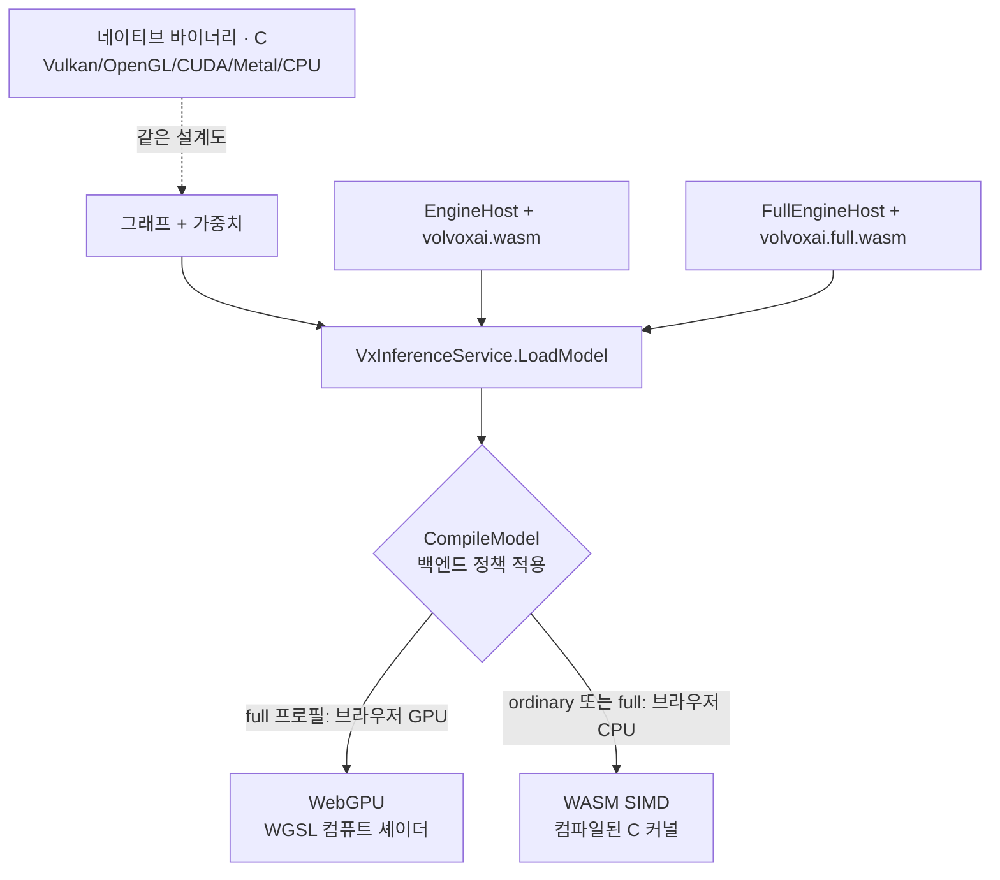

# 1장 — 기초

*자신에게 맞는 배지를 읽으세요: 🌱 **아이디어**(누구나, 코드 없이) · 🔧 **만들기**(코드 조금) · 🔬
**심화**(엔진 개발자). 처음이신가요? 🌱 부분만 따라가세요 — 책 전체를 관통합니다.*

*목표: 이 장을 마치면 어떤 모델이든 **텐서 위의 연산 그래프(graph of operations on tensors)** 로
바라볼 수 있고, VolvoxAI가 그것을 실행하기 위해 쓰는 구성 요소들을 이해하게 됩니다.*

> 🌱 **핵심 아이디어.** "AI"는 두뇌도 아니고 마법도 아닙니다. 그것은 **아주 많은 작은 산술** — 대개
> "이 숫자들을 곱하고, 더해라" — 을 정해진 순서로 계속 반복하는 기계입니다. 숫자를 넣으면(사진이나
> 문장을 숫자로 바꿔서), 기계가 작은 덧셈 더미를 처리하고, 반대편으로 숫자가 나옵니다(라벨, 단어,
> 고양이를 감싼 박스). 이 장은 그 기계를 이루는 네 개의 레고 조각에 이름을 붙일 뿐입니다:
> **격자에 담긴 숫자(텐서)**, **작은 수학 한 단계(연산)**, **그 단계들을 이어 붙인 목록(그래프)**,
> 그리고 **저장된 조리법(설계도)**. 이것이 전체 어휘입니다. 책의 나머지는 전부 세부일 뿐입니다.

---

## 1.1 "AI를 실행한다"는 것의 실제 의미

> 🌱 **아이디어.** 아주 긴 **조리법(recipe)** 을 떠올려 보세요. 재료(당신의 질문이나 사진을 숫자로
> 바꾼 것)를 건넵니다. 조리법은 *젓기, 넣기, 섞기* 같은 단순한 단계들의 목록이고, 각 단계는 미리
> 계량해 둔 숫자들이 가득한 커다란 창고(**가중치**)에도 손을 뻗습니다. 조리법을 한 번 끝까지 따르면
> 요리, 즉 답이 나옵니다. 조리법을 한 번 실행하는 것을 **순전파(forward pass)** 라고 합니다. "AI를
> 실행한다"는 건 그게 전부입니다.
>
> *"숫자로 바꾼다"는 게 무슨 뜻일까요?* 글자는 목록에서의 위치로 숫자가 됩니다(단어 "cat"이 `[3, 1, 20]`이
> 되는 식). 사진은 각 픽셀의 밝기를 읽어 숫자가 됩니다(회색 점 → `0.5`, 순백 → `1.0`). 시시하지만 그게
> 요령입니다: 일단 전부 숫자가 되면, 기계는 산술만 하면 됩니다.

🔧 AI 모델을 사용할 때 실제로는 세 가지 일이 일어납니다.

1. 당신의 입력(텍스트, 이미지, 오디오)이 **숫자**로 바뀝니다.
2. 그 숫자들이 긴 **산술 연산(arithmetic operations)** 목록을 통과합니다. 각 연산은
   **가중치(weights)** 라 부르는, 미리 계산된 큰 숫자 표도 함께 사용합니다.
3. 마지막 숫자들이 다시 의미 있는 것(단어, 박스, 라벨)으로 바뀝니다.

2번 단계가 곧 모델입니다. 이것을 한 번 실행하는 것을 **순전파(forward pass)** 또는
**추론(inference)** 이라고 합니다. 추론은 그게 전부입니다. 누군가가 유용하도록 *학습시킨* 특정
순서로 배열된, 곱하고 더하는 파이프라인이지요.

> 🔬 **뜯어보기.** 일반 실행은 **순수 함수(pure function)** 입니다: 고정된 같은 가중치 + 같은 입력 →
> 같은 출력입니다. 디코드/KV 상태는 명시적이며 하나의 `ExecutionContext` 가 소유합니다. 프로세스
> 전역에 숨지 않습니다. 공급자의 실행 계획은 그래프 노드를 차례로 디스패치하므로 "추론이 얼마나
> 걸리나"는 대부분 "각 연산 시간의 합"입니다 — 6–8장이 개별 연산을 싸게 만드는 데 집중하는
> 이유입니다.

> **학습(training) vs. 추론(inference).** 🌱 *추론* 은 완성된 조리법으로 **요리하는** 것입니다(1부).
> *학습* 은 그 조리법을 애초에 **쓰는** 것입니다(2부): 요리를 하고, 얼마나 틀렸는지 맛보고, 양을
> 조금 바꾸고, 좋아질 때까지 수천 번 반복합니다. 🔬 정확히 말하면: 추론은 완성된 가중치로 답을
> 계산하고, 학습은 그 가중치를 *발견* 합니다 — 많은 예제를 보여주고, 얼마나 틀렸는지 재고, 모든
> 가중치를 조금 덜 틀리도록 조정합니다. VolvoxAI는 **둘 다** 합니다: 순전파를 실행할 뿐 아니라, 모델을
> 만들고 줄이는 역전파·최적화기·양자화까지 구현합니다. 이 책은 전체 루프를 따라갑니다.

---

## 1.2 텐서: 당신이 알아야 할 유일한 자료구조

> 🌱 **아이디어.** 신경망을 흐르는 모든 숫자는 **텐서(tensor)** 안에 담깁니다. 커다란 **달걀판** 을
> 떠올려 보세요: 작은 컵들의 격자이고, 각 컵에 숫자 하나가 들어 있으며, 판이 어떤 모양인지(예:
> 2행 × 3컵) 알려주는 라벨이 붙어 있습니다. 사진, 문장, 소리 — 컴퓨터는 이 모두를 숫자 달걀판으로
> 바꿉니다. 기계를 흐르는 "재료"는 이것뿐입니다. "라벨 붙은 숫자 격자"를 그릴 수 있으면 다 된
> 겁니다.
>
> *라벨이 왜 중요할까요.* 숫자 여섯 개 `1 2 3 4 5 6` 은 3개씩 두 줄(`2×3`)일 수도, 2개씩 세 줄(`3×2`)일
> 수도, 여섯 개짜리 한 줄일 수도 있습니다 — 같은 숫자, 완전히 다른 의미. **형태(shape)** 는 각 단계에게
> 컵을 어떻게 읽어야 하는지 알려주는 판 위의 라벨입니다. 형태가 틀리면 계산은 헛소리가 되므로, 텐서는
> *항상* 자기 형태를 지니고 다닙니다.

🔧 신경망을 흐르는 모든 숫자는 **텐서(tensor)** 안에 담깁니다. 텐서란 그저 다차원 배열(숫자 격자)에,
각 차원의 크기를 알려주는 **형태(shape)** 가 붙은 것입니다.

```
scalar   3.14                         shape []            (숫자 하나)
vector   [3.14, 2.71, 1.62]           shape [3]           (리스트)
matrix   [[1, 2, 3],                   shape [2, 3]        (표: 2행 3열)
          [4, 5, 6]]
tensor   224x224 RGB 이미지 8장         shape [8, 224, 224, 3]
```

마지막 형태 `[8, 224, 224, 3]` 은 이렇게 읽습니다: **8** 장의 이미지, 각각 높이 **224** 픽셀,
너비 **224** 픽셀, **3** 개의 색 채널(빨강, 초록, 파랑). 숫자 네 개가 수백만 개의 값을 완전히
설명합니다.

🔧 텐서에 필요한 것은 이름, 형태, 자료형, 그리고 숫자들의 평평한(flat) 버퍼입니다.
아래는 이해를 돕는 모형이고, 실제 엔진은 텐서 저장 공간을 C에서 관리합니다:

```javascript
// 개념을 설명하는 텐서 모형이며, 런타임이 제공하는 클래스는 아닙니다.
class Tensor {
  name;      // 예: "hidden_0"
  shape;     // 예: [1, 256, 64]
  dtype;     // "float32" | "int8" | "int32"
  buffer;    // shape의 곱만큼의 숫자를 담은 평평한 Float32Array / Int8Array
  isWeight;  // 학습으로 얻은 값이면 true (추론 시 읽기 전용)
}
```

### 🔬 텐서는 평평하게 저장된다

컴퓨터의 메모리는 하나의 긴 바이트 줄일 뿐 — "행"과 "열" 같은 개념을 모릅니다. 형태 `[2, 3]` 인
텐서는 **한 줄에 6개의 숫자**로 저장되고, 원소 `[row, col]` 이 *어디에* 있는지는 인덱스 계산으로
알아냅니다:

```
논리적 관점            실제 메모리(실제로 존재하는 것)
[[a, b, c],           [ a, b, c, d, e, f ]
 [d, e, f]]             0  1  2  3  4  5

  원소 [row, col]     →  flat index = row * 3 + col
  원소 [1, 2] = 'f'   →  1 * 3 + 2 = 5   ✓
```

이 정확한 패턴 — `((b * H + y) * W + x) * C + c` — 을 커널 곳곳에서 보게 됩니다. 4차원 이미지
텐서를 1차원 배열 안에서 주소 지정하는 방식이지요. 형태를 외우면 인덱스 계산은 자연히 따라옵니다.

> 🔬 **뜯어보기: 스트라이드와 dtype.** 위 압축 공식은 흔한 경우일 뿐입니다. 일반 규칙은 각 차원에
> **스트라이드(stride)** — 그 축을 한 칸 움직일 때 건너뛸 숫자 개수 — 를 주고, flat 인덱스는
> `Σ coord[d] × stride[d]` 입니다. 연속(contiguous) `[2, 3]` 텐서의 스트라이드는 `[3, 1]` 이고,
> **전치(transpose)** 는 숫자를 그대로 둔 채 스트라이드만 `[1, 3]` 으로 바꿀 수 있어 reshape/transpose가
> 거의 공짜인 이유가 됩니다. **dtype** 은 각 컵이 몇 바이트를 쓰는지 정합니다 — `float32`=4, `int8`=1,
> `int32`=4 — 그래서 텐서의 메모리 크기는 `product(shape) × bytes(dtype)` 입니다. 6장은 그 둘째 요소를
> 4배 줄이는 이야기 전부입니다.

> 🔬 **NHWC vs NCHW.** 차원의 *순서* 가 중요합니다. VolvoxAI의 비전 모델은 **NHWC**(배치, 높이, 너비,
> 채널)를 씁니다 — 한 픽셀의 색 채널들이 메모리에서 서로 붙어 있습니다. PyTorch는 보통 **NCHW**를
> 씁니다. 같은 데이터, 다른 메모리 배치일 뿐이며, 커널들은 어느 쪽을 읽는지 서로 합의해야 합니다.
> (이 저장소의 변환기는 모든 비전 `graph.json` 에 `"internal_layout": "NHWC"` 를 기록합니다.)

---

## 1.3 연산: 작고 잘 정의된 하나의 일

> 🌱 **아이디어.** **연산(operation)** 은 조리법의 한 단계입니다 — "이 두 숫자 판을 컵 하나씩 짝지어
> 더해라" 같은 하나의 작은 일이지요. 각 연산은 그 자체로는 민망할 만큼 단순합니다. 지능은 어느 한
> 단계에 있는 게 아니라, 이런 작은 단계 *수천 개* 를 올바른 순서로 하는 데서 나옵니다. 이 책 전체의
> 핵심 한 줄: **마법이나 설명 불가능한 일이 일어나는 단계는 어디에도 없습니다.** 전부 작은
> 덧셈입니다.
>
> *연산 하나를 손으로.* `[1, 2, 3]` 과 `[10, 20, 30]` 의 "Add"는 컵 하나씩 짝지어 그냥 `[11, 22, 33]`
> 입니다. `[-2, 5, -1, 3]` 의 "ReLU"는 "음수를 0으로" → `[0, 5, 0, 3]`. 연산 하나의 난이도는 딱 이
> 정도입니다. 모델이 똑똑해 보이는 건 오직 이런 것들을 세심하게 학습된 순서로 수천 개 쌓기 때문입니다.

🔧 **연산(operation, 줄여서 op, 또는 layer)** 은 입력 텐서 하나 이상을 받아, 정해진 수학 계산을 하고,
출력 텐서 하나 이상을 씁니다. 앞으로 만날 예시들:

| 연산 | 한마디로 | 사용처 |
|---|---|---|
| `MatMul` | 행렬 곱 — 특징을 "섞는" 핵심 | 두 모델 모두 |
| `Conv2D` | 작은 필터를 이미지 위로 슬라이드 | 탐지기 |
| `Add` | 두 텐서를 원소별로 더하기 | 두 모델 모두 |
| `LayerNorm` | 벡터를 잘 다뤄지도록 재중심화·재스케일 | 언어 모델(LM) |
| `SDPA` | 스케일드 닷-프로덕트 어텐션 — "어떤 단어가 어떤 단어를 보는가" | LM |
| `GELU` / `ReLU` | 비선형 압축 함수 | 두 모델 모두 |
| `MaxPool2D` | 각 패치에서 가장 큰 값만 남겨 이미지 축소 | 탐지기 |

VolvoxAI의 모든 연산에는 shape/type 계약과 프로바이더 구현이 있습니다. 다음은 `Add` 연산의 *핵심* 을
보여주는 교육용 스케치입니다 — 입력 컵 한 쌍당 출력 컵 하나:

```javascript
// 브로드캐스팅을 포함한 개념적 원소별 덧셈
for (let i = 0; i < out.length; i++) {
  out[i] = a[i] + b[i % b.length];   // b.length가 더 작을 수 있음 ("브로드캐스트")
}
```

이것이 비밀의 전부입니다. 모델이란 이런 연산 수천 개가, 각각은 사소하지만, 사슬처럼 이어진
것입니다. **설명 불가능한 무언가가 일어나는 단계는 없습니다.**

> 🔬 **뜯어보기: 실제 연산은 저 한 줄보다 조금 더 풍부합니다.** 프로바이더 커널은 스트라이드로 진짜
> N차원 **브로드캐스팅** 을 합니다 — 예컨대 `[64]` 편향을 `[1, 256, 64]` 활성화에 늘려 더하지요 —
> 그리고 융합 `relu` 파라미터(`0` 없음, `1` ReLU, `2` ReLU6)를 받아 `Add`
> 바로 뒤에 클램프가 오면 **두 번이 아니라 한 번**에 처리합니다(그 융합은 8장). *수학* 은 여전히
> "더하고, 필요하면 클램프"일 뿐이고, 추가 코드는 임의 형태를 다루고 한 번의 순회를 아끼는 것뿐입니다.
> 공유 계약과 독립 수치 오라클로 WASM·WebGPU·네이티브 구현을 검증합니다.

---

## 1.4 그래프: 연산들을 서로 연결하기

> 🌱 **아이디어.** 모델은 **서로 연결된 단계들의 목록** 입니다 — 조립 라인, 또는 도미노 사슬처럼요.
> 각 단계의 출력이 다음 단계의 입력이 됩니다. "모델을 실행한다"는 건 컴퓨터가 목록을 따라 내려가며
> 각 단계를 차례로 하는 것뿐입니다. 그래서 AI 엔진은 그 심장에서 **"다음 단계 해, 다음 단계 해,
> 다음 단계 해"** 를 목록이 끝날 때까지 반복하는 루프입니다. 정말로요.

🔧 모델은 **그래프(graph)** 입니다 — 각 연산의 출력이 뒤의 연산의 입력이 되는 연산 목록이지요.
VolvoxAI는 그래프를 C로 읽어 들입니다: **텐서**들의 집합과 **노드(node)** 목록
(연산 + 그 입력/출력 텐서 + 파라미터)입니다. 사람이 읽을 수 있는 원본은 `graph.json`입니다.

모든 연산이 자신의 입력과 출력을 *이름으로* 선언하기 때문에, 그래프는 단순한 장부 정리일 뿐입니다:

```
tokens ─┐
        ├─▶ [Embedding] ─▶ emb_tok ─┐
wte  ───┘                           ├─▶ [Add] ─▶ hidden_0 ─▶ [LayerNorm] ─▶ ...
positions ─▶ [Embedding] ─▶ emb_pos ┘
```

그래프를 **실행**하려면, 프로바이더는 준비된 노드 스케줄을 훑으며 각 연산을 실행합니다.
개념적인 실행기(executor) 루프는 이만큼 읽기 쉽습니다:

```javascript
// 개념적인 프로바이더 실행기
for (const node of graph.nodes) {
  this._runNode(node);      // node.opType로 분기 → 알맞은 커널 호출
}
```

🔬 프로바이더 디스패치는 연산 종류를 알맞은 커널에 매핑합니다(`"MatMul"` → matmul 커널,
`"Conv2D"` → conv 커널, …). 핵심에서 **신경망 엔진은 커널 호출 스케줄입니다.** 나머지는 그
함수들을 빠르게 만들고(8장), 수치적으로 작게 만들고(6–7장), 그리고 — 2부에서 — 애초에 가중치를
발견하기 위해 그것들을 *거꾸로* 실행하는 일일 뿐입니다.

> 🔬 **뜯어보기: 배선은 미리 준비한다.** 익스포터가 노드를 의존성 순서로 기록하면 C 로더가
> 실행 전에 이름으로 된 텐서 참조를 연결합니다. 컴파일은 연산과 형태 규칙을 검사하고 실행 경로를
> 준비합니다. 요청 시에는 구체 입력으로 그 순서를 실행합니다. 그래프 편집은 새 계획을 만들고,
> 이미 컴파일된 모델은 이전 리비전을 유지합니다. decode는 변하지 않는 가지와 어텐션 캐시를
> 재사용해 순전파 전체를 매번 반복하는 일을 줄입니다.

---

## 1.5 설계도: 모델이 저장되는 방식

> 🌱 **아이디어.** 저장된 모델은 그저 **두 개의 파일** 입니다: **조리법 카드**(순서 있는 단계 목록)와
> **창고**(단계들이 쓰는, 미리 계량된 모든 숫자). 이 두 파일을 엔진에 건네면 요리를 할 수 있습니다.
> 숨겨진 게 없습니다 — 비밀의 두뇌도, 클라우드 마법도 없습니다. 파일 두 개입니다.
>
> *왜 둘로 나눌까요?* 조리법 카드는 열어서 읽을 수 있는 작은 텍스트이고, 창고는 눈으로 읽을 수 없는(그럴
> 필요도 없는) 큰 원시 숫자 덩어리입니다. 둘을 떼어두면 수백만 개의 학습된 숫자를 건드리지 않고 *계획*
> 만 살펴보거나 고칠 수 있고, 계획을 다시 쓰지 않고 숫자만(미세조정된 창고) 바꿔 끼울 수 있습니다.

🔧 디스크 위의 VolvoxAI 모델은 두 개의 파일입니다:

```
model/
  graph.json          # 그래프: 연산 노드 목록 (토폴로지 + 파라미터 + 형태)
  model.safetensors    # 가중치: 학습된 숫자들, 표준 바이너리 형식
```

- **`graph.json`** 은 그래프 문서입니다. 맨 앞에서 이 모델이 어떤 형태를 받아들이는지 선언하고, 그다음
  노드를 순서대로 나열합니다. TinyStories는 256 토큰까지 *어떤* 길이의 문장이든 받는데, 이를 이름과
  경계를 가진 **차원 심볼(dimension symbol)** 로 적습니다:

  ```json
  {
    "format": "volvox-graph/v1",
    "dimensions": { "S": { "min": 1, "max": 256 } },
    "inputs": {
      "tokens":    { "shape": [1, "S"], "dtype": "int32" },
      "positions": { "shape": [1, "S"], "dtype": "int32" }
    }
  }
  ```

  🌱 `S` 는 조리법에 남겨 둔 빈칸입니다: *"실제로 주는 단어 수만큼 — 최소 1개, 최대 256개."* `S` 를 두
  군데에 쓴다는 건 **두 곳이 같은 숫자** 라는 뜻이라, 12단어짜리 프롬프트는 어디서나 12이고, 고정된 칸을
  채우려고 256까지 패딩할 일이 없습니다.

  그다음 각 노드가 자기 연산, 입출력 텐서, 파라미터, 그리고 같은 심볼을 쓸 수 있는 타입 있는 출력 형태
  단언을 적습니다. 다음은 실제 TinyStories 노드 하나입니다:

  ```json
  {
    "id": "node_3",
    "opType": "LayerNorm",
    "inputs":  { "input": "hidden_0", "weight": "h.0.ln_1.weight", "bias": "h.0.ln_1.bias" },
    "outputs": {
      "out": { "tensor": "ln1_0", "shape": [1, "S", 64], "dtype": "float32" }
    },
    "params": { "eps": 1e-05, "d_model": 64 }
  }
  ```

  🔧 `id` 와 출력 `tensor` 이름은 서로 다른 것입니다: `node_3` 은 *노드* 를 가리키고, `ln1_0` 은 *그
  노드가 쓰는 텐서* 의 이름입니다. 모든 심볼이 이름과 경계를 함께 가지므로, 컴파일은 요청이 오기 전에
  `1..256` 의 모든 길이에 대해 동작하는 경로를 **한 번에** 증명할 수 있습니다 — 8장의 주제입니다.

- **`model.safetensors`** 는 원시 가중치 텐서(`h.0.ln_1.weight`, `wte.weight`, …)를
  [safetensors](https://github.com/huggingface/safetensors) 형식으로 담습니다 — ML 세계 전반에서
  쓰이는 단순하고 안전한 표준 레이아웃입니다.

🔬 C 모델 로더가 둘 다 읽어 그래프와 가중치 리비전을 보관합니다 — 추론 시점에
PyTorch나 ONNX Runtime 의존성 없이 말이지요. 프로바이더는 그 스냅숏을 한 번 컴파일하고, 각
`ExecutionContext` 는 현재의 구체 입력 형태를 자기 안에서 바인딩하고 해석합니다. 다른 곳에서
**학습한 모델을 익스포트** 해 이 설계도로 가져올 수도 있고, 또는 — 2부에서 보듯 — VolvoxAI가
**직접 학습해 설계도를 써낼** 수도 있습니다.

> 🔬 **뜯어보기: `.safetensors` 바이트 레이아웃.** 이 형식은 일부러 파싱이 사소합니다: **8바이트
> 리틀엔디언 길이**, 그다음 각 텐서 이름을 `{ dtype, shape, data_offsets }` 로 매핑하는 **JSON 헤더**,
> 그다음 **원시 텐서 바이트** 가 이어집니다. 로딩 중에 아무 코드도 실행되지 않습니다 — 헤더는 코드가
> 아니라 데이터입니다(Python pickle과 달리 이 안전성이 형식의 핵심). 네이티브 로더는 파일을
> **메모리 매핑**하고 텐서가 그 바이트를 참조하게 해 텐서별 복사를 줄일 수 있습니다
> (`native/src/runtime/safetensors.c`). 검증과 준비 과정에서는 바이트를 읽거나 패킹한 사본을
> 만들 수 있습니다. 브라우저는 바이트를 WASM으로 보내 같은 C 저장 형식 검사를 거칩니다. `graph.json`은
> 경계가 있는 논리 형태와 출력 단언을 기록합니다. 컴파일은 전체 심볼 도메인을 한 번 증명하고,
> 요청 시에는 검사된 바인딩을 대입해 구체 계획을 캐시합니다. 최대 형태 하나를 전체 도메인의 증거로
> 믿지 않습니다.

---

## 1.6 하나의 모델, 명시적인 실행 방법

> 🌱 **아이디어.** 같은 조리법을 다른 주방에서 요리할 수 있습니다: 빠르고 근사한 오븐, 평범한 가스레인지,
> 아주 작은 캠핑 스토브 — 요리는 똑같이 나오고, 속도만 빠르거나 느릴 뿐입니다. VolvoxAI는 *같은* 모델을
> 브라우저 탭, 노트북, 폰, 심지어 **로봇** 위에서도 실행할 수 있습니다. 배포 환경이 어떤 주방을
> 설치할지 정하고, 애플리케이션의 생성된 정책은 그중 사용 가능한 주방을 고릅니다. ordinary 브라우저
> 패키지는 portable WASM만 제공하고, full 패키지는 WebGPU도 제공합니다.
> 어디서나 같은 답 — 그래서 이 책이 계속 VolvoxAI가 "브라우저 *와* 엣지에서" 돈다고 말하는
> 것입니다.

🔧 같은 그래프를 아주 다른 하드웨어에서 실행할 수 있습니다. 선택한 런타임 프로필이 사용 가능한
프로바이더 집합을 정하고, `CompileModel`은 그 집합 안에서 호출자의 생성된 `BackendPolicy`를 적용합니다.
검증된 모든 프로바이더는 *같은* 선언 결과를 계산합니다:



- **WASM** 은 portable C를 WebAssembly로 컴파일해 실행합니다. ordinary 브라우저 프로필에서는 봉인된
  유일한 실행 경로이고, full 프로필에서는 폴백입니다.
- **WebGPU** 는 full 브라우저 프로필에 속하며, C가 요청된 백엔드 정책을 적용해 각 연산을 GPU 컴퓨트 셰이더
  (`shaders/{inference,training}/*.wgsl`)로 다시 표현합니다.
- **네이티브**(`native/`)는 데스크톱, 폰, 또는 로봇에서 *같은* 설계도를 실행하는 독립 C 프로그램이며,
  선택적으로 Vulkan/OpenGL/CUDA/Metal 위에서 돕니다. CUDA는 옵트인 수동 커널 백엔드입니다(순방향 추론,
  그리고 full 빌드에서는 학습까지; 9C장 참고). **온디바이스 / 엣지 AI** 로 가는 길이며, 9장의 주제입니다.

> 🔬 **뜯어보기: 프로바이더는 어떻게 선택되고, 왜 답은 그대로인가.**
> `EngineHost` 는 WASM CPU만 지원합니다. `FullEngineHost` 는 WebGPU도 지원하며 장치 전송용
> `gpuBridge` 옵션을 받습니다. 백엔드 구성은 C 빌드에서 정하고, 두 호스트는 생성된
> `VxInferenceService.CompileModel` 연산을 전달합니다. 이 연산은 비어 있음, 선호, 필수 `BackendPolicy`를 적용하고 실행
> 전에 모든 후보 결과를 기록합니다. 실행 실패 뒤에는 다른
> 공급자로 바꾸지 않습니다. 모든 프로바이더는 *속도* 가 달라도 공유 연산 계약과 교차 프로바이더 검증을 통해
> 같은 선언 출력을 지킵니다. "같은 설계도, 같은 답, 여러 주방"은 런타임 계약이지 폴백 정책이 아닙니다.

🔧 처음부터 끝까지, TinyStories를 토큰 여섯 개로 돌리는 코드는 이만큼입니다:

```javascript
import { EngineHost, VxInferenceServiceClient, pb } from 'volvoxai';

const host = new EngineHost({
  wasmUrl: new URL('./volvoxai.wasm', import.meta.url),
});
const inference = new VxInferenceServiceClient(host);
try {
  const runtime = await inference.createRuntime(new pb.CreateRuntimeRequest());
  const model = await inference.loadModel(new pb.LoadModelRequest({
    runtimeId: runtime.runtimeId,
    graphPath: './models/tinystories_1m/graph.json',
    weightPaths: ['./models/tinystories_1m/model.safetensors'],
  }));
  const compiled = await inference.compileModel(new pb.CompileModelRequest({
    modelId: model.modelId,
    policy: new pb.BackendPolicy({
      mode: pb.BackendPolicyMode.BACKEND_POLICY_MODE_REQUIRE,
      backends: ['wasm'],
      operatorFallback: pb.OperatorFallback.OPERATOR_FALLBACK_ALLOW,
    }),
  }));

  const tokens = Int32Array.from([7454, 2402, 257, 640, 11, 20037]);
  const positions = Int32Array.from([0, 1, 2, 3, 4, 5]);
  const result = await inference.run(new pb.RunRequest({
    compiledModelId: compiled.compiledModelId,
    inputs: [
      new pb.Tensor({ name: 'tokens', dtype: pb.DataType.DATA_TYPE_I32,
        shape: [1n, 6n], inline: new Uint8Array(tokens.buffer) }),
      new pb.Tensor({ name: 'positions', dtype: pb.DataType.DATA_TYPE_I32,
        shape: [1n, 6n], inline: new Uint8Array(positions.buffer) }),
    ],
  }));
  const logits = (await inference.readOutput(new pb.ReadOutputRequest({
    resultId: result.resultId,
    name: 'logits',
  }))).tensor;

  await inference.releaseResult(new pb.ResultRef({ resultId: result.resultId }));
  await inference.releaseCompiledModel(
    new pb.CompiledModelRef({ compiledModelId: compiled.compiledModelId }));
  await inference.releaseModel(new pb.ModelRef({ modelId: model.modelId }));
  await inference.releaseRuntime(new pb.RuntimeRef({ runtimeId: runtime.runtimeId }));
} finally {
  await host.close();
}
```

모든 입력의 형태를 **짐작하지 않고 명시한다** 는 점을 보세요. 생성된 `pb.Tensor`는
이름, dtype, shape, 정확한 바이트를 함께 전달합니다 —
엔진은 "버퍼에 int32가 6개 들었으니까"로 `[1, 6]` 을 추론하지 않습니다. 원소 6개짜리 버퍼는 `[1,6]` 일
수도 `[6,1]` 일 수도 `[2,3]` 일 수도 있고, 그중 하나를 조용히 고르는 것이 틀린 답을 조용한 답으로 만드는
길이니까요. 저 두 개의 `[1, 6]` 이 §1.5의 `S = 6` 을 바인딩합니다.

이 책의 나머지 부분에서 "연산을 따라간다"고 할 때는, *수학이 무엇인지* 를 가장 직접적으로 말해주는
이식성 있는 C 구현과 연산 계약을 읽습니다.

---

## 1.7 멘탈 모델, 조립하기

> 🌱 **아이디어 정리.** 숫자가 들어가고 → 기계가 작은 수학 단계들의 긴 목록을 실행하는데, 각 단계는
> 창고에서 미리 계량된 숫자를 꺼내 쓰고 → 숫자가 나오고 → 그것을 단어나 박스로 다시 번역합니다.
> 그게 모델입니다. 모델을 *학습* 시키려면, 실행해 보고, 얼마나 틀렸는지 보고, 창고 숫자를 조금
> 조정합니다 — 그게 학습(2부)입니다. 폰이나 로봇에 들어갈 만큼 *작게* 만들려면 숫자를 반올림합니다 —
> 그게 양자화(3부)입니다. 이제 이 책의 전체 윤곽을 알게 되었습니다.

🔧 이 모두를 합치면 엔진 전체가 그림 하나에 담깁니다:

```
  입력 ──인코딩──▶ 텐서들 ──┐
                          │   graph.nodes의 각 노드마다:
  가중치 (.safetensors에서)─┼──▶   op(inputs, params) → 출력 텐서
                          │
                    (~85개 또는 ~262개 노드 전부 반복)
                          │
                          ▼
                    출력 텐서 ──디코딩──▶ 답
```

어떤 모델이든 두 가지 질문이 정의합니다:

1. **연산은 무엇이며, 어떤 순서인가?** (그래프 / `graph.json`)
2. **가중치는 각 연산이 무엇을 하게 만드는가?** (`.safetensors`)

> 🔬 **뜯어보기: 세 개의 축, 하나의 객체.** 이 책의 나머지가 하는 모든 일은 *이 하나의 그래프 객체* 에
> 대한 연산입니다. **순전파**(1부)는 그것을 걷습니다. **역전파**(2부)는 그것의 거울상을 거꾸로 걸어
> 기울기를 얻고, 옵티마이저가 가중치 텐서를 제자리에서 고칩니다. **양자화**(3부)는 그 가중치 텐서를
> int8 + `scale`/`zero_point` 로 다시 쓰고 정수 연산으로 갈아 끼웁니다. 같은 그래프, 같은 텐서 — 그것들에
> *하는* 세 가지 다른 일입니다. 이 그림을 붙잡으면 이후 어떤 장도 당신을 놀라게 할 수 없습니다.

다음 두 장에서 실제 모델 두 개에 대해 이 두 질문에 답합니다 — 그리고 "언어 모델"과 "이미지 탐지기"가
목록 속 연산만 다를 뿐 *같은 아이디어* 임을 보게 될 것입니다.

**다음:** [2장 — 언어 모델 한 연산씩 →](02-tinystories-language-model.md)
