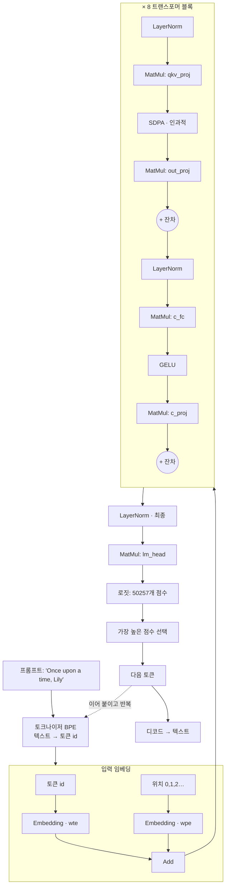
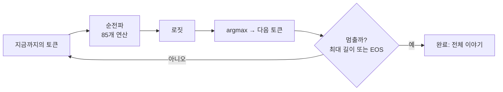

# 2장 — 언어 모델 한 연산씩 (TinyStories)

*목표: 단어 **"Once upon a time, Lily"** 가 실제 GPT 스타일 트랜스포머를 통과해 다음 단어를 예측하는
과정을 따라갑니다. 여기 나오는 모든 연산은 `js/ops/` 의 작은 커널 중 하나입니다.*

이 모델은 `models/tinystories_1m/` 에 있습니다. 쉬운 어린이 이야기 데이터셋인
[TinyStories](https://arxiv.org/abs/2305.07759)로 학습한 아주 작은 GPT(**디코더 전용
트랜스포머, decoder-only transformer**)입니다. "작다"는 말은 진짜입니다: 내부 벡터 폭이 **64**,
층(layer)이 **8** 개인데도 앞뒤가 맞는 짧은 이야기를 씁니다. 이것을 공부하면 GPT-2/3/4, LLaMA,
Mistral 뒤에 있는 *바로 그* 아키텍처를 배우게 됩니다 — 그것들은 이 그래프를 키운 것일 뿐입니다.

## 2.1 모델의 차원 (설계도에서 읽어내기)

`config.json` 에서 하나씩:

| 기호 | 값 | 의미 |
|---|---|---|
| `d_model` | **64** | 토큰마다 실려 다니는 "생각 벡터"의 폭. |
| `n_layers` | **8** | 쌓인 트랜스포머 블록 수. |
| `n_heads` | **16** | 블록당 어텐션 헤드 수 (따라서 `head_dim = 64/16 = 4`). |
| `d_mlp` | **256** | 피드포워드 은닉층의 폭 (`4 × d_model`). |
| `vocab` | **50257** | 아는 서로 다른 토큰의 수 (GPT-2 어휘). |
| `context` | **256** | 한 번에 볼 수 있는 최대 토큰 수. |

> 폴더 이름은 `tinystories_1m`(트랜스포머 파라미터 약 100만 개)이지만 `model.safetensors` 는 약
> 27 MB입니다. 왜일까요? **토큰 임베딩 표**가 `50257 × 64 ≈ 320만` 개의 숫자이고, 그런 표가 두
> 개(입력 + 출력)이기 때문입니다. 작은 LM에서는 *층* 이 아니라 *어휘* 가 파일 크기를 지배합니다.
> 진짜 교훈이지요: 모델 크기 ≠ 모델 깊이.

전체 그래프는 **85개 노드**입니다. 그 내역:

```
33 MatMul   17 LayerNorm   17 Add   8 SDPA   8 GELU   2 Embedding
= 임베딩 2개 + 8블록 × (LayerNorm 2 + MatMul 4 + SDPA 1 + GELU 1 + Add 2) + 마지막 LayerNorm + lm_head 1
```

## 2.2 파이프라인 한눈에 보기



이제 실제 커널과 함께 단계별로 따라가 봅시다.

---

## 2.3 0단계 — 토큰화: 텍스트가 정수가 되다

신경망은 글자를 읽지 못합니다. 숫자를 읽지요. **토크나이저(tokenizer)**(`js/Tokenizer.js`,
`native/tokenizer.c`)는 텍스트를 **토큰(token)**(자주 쓰이는 단어 조각)으로 쪼개고, 어휘 +
**병합 규칙(merge rules)** 목록을 써서 각각을 정수 ID로 매핑합니다(이것이 **바이트 페어
인코딩(Byte-Pair Encoding, BPE)** 입니다).

```
"Once upon a time, Lily"
   │  정규식으로 단어 비슷한 덩어리로 나눈 뒤, BPE가 자주 나오는 바이트 쌍을 병합
   ▼
[ "Once", " upon", " a", " time", ",", " Lily" ]     (설명용 예시)
   │  각 덩어리 → 50257개 어휘 중 하나의 정수 id
   ▼
tokens    = [7454, 2402, 257, 640, 11, 20037, …]     ← 모델의 실제 입력
positions = [   0,    1,   2,   3,  4,     5, …]     ← "나는 몇 번째 자리인가?"
```

정수 텐서 두 개가 그래프에 들어갑니다: **`tokens`**(단어가 무엇인지)와 **`positions`**(그 순서,
`0,1,2,…`). 둘 다 형태 `[1, 256]` 입니다 — 시퀀스는 256 토큰 컨텍스트 창에 맞춰 패딩됩니다.

> **왜 위치가 필요할까?** 아래의 어텐션 수학은 그 자체로는 순서를 모릅니다 — "개가 사람을 문다"와
> "사람이 개를 문다"를 똑같이 취급하지요. 명시적 위치 번호를 넣어주면 모델이 단어 순서를 배울 수
> 있습니다.

---

## 2.4 1단계 — 임베딩: 정수가 벡터가 되다

`20037`("Lily") 같은 ID는 *숫자로서는* 의미가 없습니다(무언가의 20037배가 아니지요). 우리는 이것을
의미를 담은, 학습된 64개 숫자의 **벡터** — 그 토큰의 **임베딩(embedding)** — 으로 대체합니다.
`Embedding` 연산은 순수한 표 조회입니다. 다음이 커널 전부입니다(`js/ops/embedding.js`):

```javascript
for (let i = 0; i < seq_len; i++) {
  const token_id = tokens[i];
  for (let j = 0; j < d_model; j++) {
    out[i * d_model + j] = weight[token_id * d_model + j];   // `token_id` 행을 복사
  }
}
```

가중치 `wte.weight` 는 `[50257, 64]` 표이고, `token_id` 행이 *곧* 그 토큰의 의미 벡터입니다. 이
연산은 **두 번** 실행됩니다:

- `Embedding(tokens, wte)` → `emb_tok` `[1,256,64]` — 각 토큰이 *무엇* 인지.
- `Embedding(positions, wpe)` → `emb_pos` `[1,256,64]` — 그것이 *어디* 에 있는지.

그다음 `Add` 가 둘을 합칩니다: `hidden_0 = emb_tok + emb_pos`. 이제 256개 자리 각각이 *단어 정체성*
과 *위치* 를 섞은 64개 숫자 벡터를 담습니다. 이 텐서 `hidden_0 [1,256,64]` 가 곧 **잔차
스트림(residual stream)** 입니다 — 모든 블록이 읽고 다시 쓰는 "컨베이어 벨트"이지요.

```
hidden_0:  256개 행 (토큰 위치마다 하나), 각각 64개 숫자 벡터

 pos 0 "Once"  [ 0.12, -0.4, ...(64) ]
 pos 1 " upon" [-0.03,  0.9, ...(64) ]
 pos 2 " a"    [ ...                 ]
   ⋮
```

---

## 2.5 2단계 — 트랜스포머 블록 (이것이 8× 반복된다)

각 블록은 두 개의 하위 단계로 잔차 스트림을 다듬습니다: **어텐션(attention)**(토큰들이 정보를
공유)과 **피드포워드 MLP**(각 토큰이 혼자 생각). 둘 다 깊은 신경망을 학습 가능하게 만드는
**사전 정규화(pre-norm) + 잔차(residual)** 패턴으로 감싸여 있습니다.

### 2.5a LayerNorm — 숫자를 정상 범위로 유지

각 하위 단계 전에 `LayerNorm` 은 각 토큰의 64-벡터를 평균 0, 분산 1로 재스케일한 뒤, 학습된 스케일
(`weight`)과 이동(`bias`)을 적용합니다. 이것이 8개 층에 걸쳐 값이 폭발하거나 소멸하는 것을
막습니다. 실제 커널(`js/ops/layerNorm.js`), 토큰 행마다:

```javascript
const mean = sum / d_model;
const variance = sq_sum / d_model - mean * mean;
const inv_std = 1 / Math.sqrt(variance + 1e-5);          // eps는 0으로 나누기 방지
out[j] = (in[j] - mean) * inv_std * weight[j] + bias[j]; // 정규화 후 재스케일/이동
```

### 2.5b 어텐션 — "앞의 어떤 단어가 나에게 중요한가?"

이것이 트랜스포머의 심장입니다. 먼저 하나의 `MatMul` 이 각 64-벡터를 **192** 개 숫자로 투영합니다
(`qkv_proj`, 형태 `[1,256,192]`). 이 192개는 세 개의 64-벡터를 이어 붙인 것입니다: **쿼리(Query)**,
**키(Key)**, **밸류(Value)** (Q, K, V). 직관:

- **Query** = "나는 무엇을 찾고 있는가?"
- **Key** = "나는 무엇을 제공하는가?"
- **Value** = "네가 나를 고르면 넘겨줄 내용."

그다음 `SDPA`(**Scaled Dot-Product Attention**)가 실제로 "보는" 일을 합니다. 각 토큰 *q* 에 대해,
자신의 Query를 앞선 모든 토큰의 Key와 비교하고(내적 = 유사도), 그 유사도를 **소프트맥스(softmax)**
로 가중치로 바꾼 뒤, 그 토큰들의 Value를 가중 혼합해서 돌려줍니다. 실제 인과적(causal) 커널
(`js/ops/sDPA.js`)에 가볍게 주석을 달면:

```javascript
for (let h = 0; h < num_heads; h++) {                 // 16개의 독립적인 헤드
  for (let q = 0; q < seq_len; q++) {                 // 각 쿼리 위치마다
    for (let k = 0; k <= q; k++) {                    // ← k ≤ q 만 봄  (인과적)
      score = dot(Q[q,h], K[k,h]) * scale;            // q와 k의 유사도
    }
    softmax(scores);                                  // 점수를 합이 1인 가중치로 변환
    out[q,h] = Σ_k  weight[k] * V[k,h];               // 혼합된 값
  }
}
```

잠시 짚어볼 두 가지 아이디어:

- **인과적 마스킹(causal masking)** (`k <= q`): 토큰은 자신과 *앞선* 토큰만 볼 수 있고 미래 토큰은
  절대 못 봅니다. 이것이 왼쪽에서 오른쪽으로 가는 텍스트 *생성기* 를 만듭니다 — 위치 3은 위치 4를
  훔쳐볼 수 없습니다.
- **멀티 헤드(multi-head)** (`h`): 64개 차원을 4개씩 16개 그룹으로 나눕니다. 각 "헤드"는 서로 다른
  종류의 관계(예: 하나는 주어를, 다른 하나는 문장부호를 추적)를 병렬로 학습합니다.

```
토큰 " Lily" 의 어텐션 (softmax 후의 설명용 가중치):

  " Lily" 가 주목하는 대상 →  "Once"  " upon"  " a"  " time"  ","   " Lily"
  가중치                      0.05    0.05   0.05   0.30   0.05   0.50
                                                    ▲             ▲
                                       "time"이 관련 있음     대부분 자기 자신
  output = 0.05·V(Once) + … + 0.30·V(time) + 0.50·V(Lily)
```

마지막 `MatMul`(`out_proj`, 편향 포함)이 16개 헤드의 출력을 다시 64-벡터로 섞고, **잔차 `Add`** 가
그것을 스트림에 더합니다: `add1 = hidden + attention_output`. "잔차"란 스트림을 교체하는 대신 블록의
결과를 *더한다* 는 뜻입니다 — 그래서 정보가 절대 손실되지 않고 학습 중 기울기(gradient)가 잘
흐릅니다.

### 2.5c 피드포워드 MLP — 각 토큰이 생각한다

토큰들이 정보를 공유한 뒤, 각 토큰은 2층 MLP로 혼자서 변환됩니다:

```
c_fc  : MatMul 64 → 256   (+편향)     "확장: 계산할 공간을 준다"
GELU  : 비선형성                       "비선형적 결정을 내리게 한다"
c_proj: MatMul 256 → 64   (+편향)     "스트림 폭으로 다시 압축"
Add   : 잔차                          hidden_next = add1 + mlp_output
```

`GELU`(`js/ops/gELU.js`)가 비선형성입니다 — 작은 음수는 조금 새어 나가게 하고 양수는 통과시키는
부드러운 게이트지요. 이런 비선형성이 없다면 MatMul을 쌓아도 하나의 MatMul로 붕괴되어, 신경망은 직선
관계밖에 배우지 못합니다:

```javascript
out[i] = 0.5 * x * (1 + tanh(0.7978845608 * (x + 0.044715 * x*x*x)));   // GELU 곡선
```

블록의 출력 `hidden_next [1,256,64]` 는 입력과 형태가 같습니다 — 바로 이 덕분에 **8** 개를 쌓을 수
있습니다. 각 블록은 스트림을 읽고 조금 더 똑똑해진 버전을 되돌려 씁니다.

---

## 2.6 3단계 — 헤드: 벡터가 단어 점수가 되다

8번째 블록 뒤, 마지막 `LayerNorm`(`ln_f`)이 스트림을 정리합니다. 그다음 **언어 모델 헤드(language-model
head)** — `lm_head.weight [50257, 64]` 로의 단일 `MatMul` — 가 각 64-벡터를 어휘 단어마다 하나씩,
**50257개 점수**로 바꿉니다:

```
final_norm [1,256,64]  ──MatMul lm_head──▶  logits [1,256,50257]
```

이 원시 점수를 **로짓(logits)** 이라 부릅니다. `logits[0, p, w]` = "모델이 `0..p` 토큰을 읽은 상태에서
단어 `w` 가 다음에 올 것이라고 얼마나 강하게 기대하는가." 우리는 **마지막 실제 토큰** 의 행만 신경
씁니다 — 그것이 프롬프트 다음에 올 것에 대한 예측이지요.

---

## 2.7 4단계 — 샘플링: 점수가 다음 단어가 되다

이제 다음 토큰에 대한 50257개 점수가 있습니다. 이 저장소의 생성기(`native/main.c`,
`command_generate`)는 가장 단순한 규칙인 **탐욕적(greedy) / argmax** 를 씁니다 — 그냥 가장 높은 것을
택합니다:

```c
int best_id = 0; float best_val = -1e30f;
for (int i = 0; i < vocab_count; i++)
    if (logits[i] > best_val) { best_val = logits[i]; best_id = i; }   // argmax
// best_id가 다음 토큰; 텍스트로 다시 디코드:
printf("%s", tokenizer_decode(tok, best_id));
```

> **실제 생성기는 무작위성을 더합니다** — *온도(temperature)*(점수를 평평하게/날카롭게), *top-k* /
> *top-p*(가장 그럴듯한 몇 개에서만 샘플링). 이것들은 `softmax` 로 로짓을 확률 분포로 바꾼 뒤 가중된
> 주사위를 굴립니다. ChatGPT가 매번 다른 답을 주는 이유지요. 탐욕적 방식은 결정적(deterministic)인
> 특수 경우이며, 교과서에는 안성맞춤입니다.

---

## 2.8 반복 — 한 번에 한 단어 (자기회귀, autoregression)

트랜스포머는 순전파 한 번에 **하나** 의 토큰을 예측합니다. 문장을 쓰려면 새 토큰을 이어 붙이고 다시
실행합니다. 이것이 **자기회귀 생성(autoregressive generation)** 입니다:



```
step 0:  "Once upon a time, Lily"           → " was"
step 1:  "Once upon a time, Lily was"       → " a"
step 2:  "Once upon a time, Lily was a"     → " little"
step 3:  … → " girl" → " who" → " loved" → " to" → " play" …
```

ChatGPT가 한 단어씩 타이핑하는 방식이 문자 그대로 이것입니다: 이 반복을 돌리며, 새 토큰마다 다시
입력으로 넣는 것이지요.

> **KV-캐시 (앞으로 듣게 될 최적화).** 순진하게 하면 *N* 번째 단계가 매번 *N* 개 토큰 전체에 대한
> 어텐션을 처음부터 다시 계산합니다 — 낭비지요. 실전 엔진은 각 토큰의 Key와 Value를 *캐시* 해서 각
> 단계가 새 토큰의 것만 계산하게 합니다. VolvoxAI의 네이티브 러너는 이 분할을
> `engine_prefill()`(프롬프트 전체를 한 번 처리)과 `engine_decode()`(한 번에 새 토큰 하나)로
> 노출합니다. 수학은 동일하고, 캐시는 그저 반복 작업을 피할 뿐입니다.

---

## 2.9 방금 배운 것

- 언어 모델이란: **토큰화 → 임베딩 → (LayerNorm, 어텐션, MLP) × N → 헤드 → 샘플링 → 반복.** 그
  이상은 없습니다.
- **어텐션**은 토큰들이 정보를 공유하게 하고("앞의 어떤 단어가 나에게 중요한가?"), **MLP**는 각
  토큰이 혼자 계산하게 하며, **잔차 + LayerNorm**은 이 층 쌓기를 학습 가능하고 깊게 만듭니다.
- 모든 연산은 `js/ops/` 의 작은 커널 하나입니다 — `MatMul`, `SDPA`, `LayerNorm`, `GELU`, `Add`,
  `Embedding`. GPT-2/3/4와 LLaMA는 **바로 이 그래프를 더 넓고 깊게** 한 것입니다.

다음 장에서는 영역을 완전히 바꿉니다 — 텍스트에서 픽셀로 — 그리고 *같은 골격*(텐서 위 작은 연산의
그래프)이 전혀 다른 문제를 푸는 것을 보게 됩니다.

**다음:** [3장 — 비전 모델 한 연산씩 →](03-efficientdet-vision-model.md)
