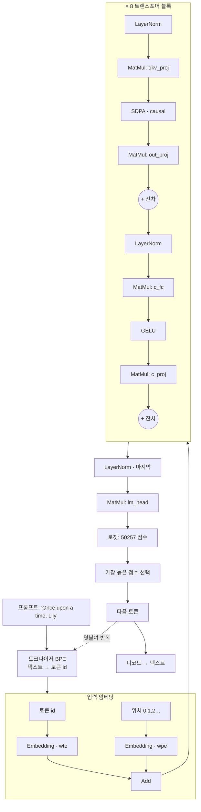
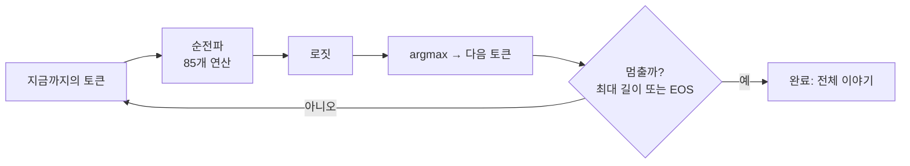

# 2장 — 언어 모델 한 연산씩 (TinyStories)

*자신에게 맞는 배지를 읽으세요: 🌱 **아이디어**(누구나, 코드 없이) · 🔧 **만들기**(코드 조금) · 🔬
**심화**(엔진 개발자). 처음이신가요? 🌱 부분만 따라가세요.*

*목표: **"Once upon a time, Lily"** 라는 단어들이 실제 GPT 스타일 트랜스포머를 통과하며 다음 단어를
예측하는 과정을 따라갑니다. 여기 나오는 모든 연산은 `ts/ops/` 의 작은 커널 중 하나입니다.*

> 🌱 **핵심 아이디어.** 언어 모델은 엄청나게 잘하는 **"다음 단어 맞히기" 기계** 입니다. "Once upon a
> time, Lily" 를 주면 " was" 를 맞힙니다. 그다음 " was" 를 문장 끝에 붙여 다시 물으면 " a" 를
> 맞힙니다. 이걸 계속 반복하면 한 번에 한 단어씩 이야기 전체를 씁니다. ChatGPT가 글자를 타이핑하는
> 방식이 *바로 이것* 입니다. 이 장은 그 기계를 열어, "맞히기"가 사실은 1장의 네 레고 조각 — 작은
> 수학 단계를 흐르는 숫자 격자 — 일 뿐임을 보여줍니다. 유일하게 정말 영리한 단계는 **어텐션
> (attention)** 이라 부르며, 각 단어가 *앞선 단어들을 돌아보며* 다음에 무엇이 올지 정하게 하는 것이
> 그 역할의 전부입니다.

🔧 이 모델은 `models/tinystories_1m/` 에 있습니다. 단순한 아이들 이야기 모음인
[TinyStories](https://arxiv.org/abs/2305.07759) 데이터셋으로 학습한 아주 작은 GPT(**디코더 전용
트랜스포머**)입니다. "작다"는 건 진짜입니다: 내부 벡터 폭이 **64**, 층이 **8** 개인데도 그럴듯한
짧은 이야기를 씁니다. 이것을 공부하면 GPT-2/3/4, LLaMA, Mistral의 *정확한* 아키텍처를 배우게
됩니다 — 그것들은 이 그래프를 키운 것입니다.

> **🌱 이 모델은 어디서 왔나.** 이 가중치를 여기서 학습한 게 아닙니다 — TinyStories-1M은 *실제로
> 공개된* 모델입니다(Hugging Face의 `roneneldan/TinyStories-1M`, GPT-Neo). VolvoxAI의 익스포터가 그
> 체크포인트를 1장의 두 파일 설계도(`graph.json` + `model.safetensors` + 토크나이저 파일)로
> **변환** 합니다. `make models_tinystories` 로 공개 소스에서 다시 생성합니다(`models/` 폴더는 커서
> git 무시되며 배포되지 않음). 그래서 아래는 *남이* 학습한 모델을 읽는 것이고 — VolvoxAI가 스스로
> 학습하는 것은 2부입니다. (자세히: `docs/models.md`, `examples/tinystories/`.)

## 2.1 모델의 차원 (설계도에서 읽어내기)

> 🌱 **아이디어.** 모든 모델에는 몇 개의 "크기 손잡이"가 있습니다 — 생각이 얼마나 넓은지, 사고
> 단계가 몇 개인지, 아는 단어가 몇 개인지. 아래는 이 작은 모델의 손잡이들입니다. 숫자를 외울 필요는
> 없습니다. ChatGPT 같은 큰 모델은 *바로 이 손잡이들을 한껏 키운 것* 이라는 점만 알면 됩니다.

🔧 `graph.json` 에서, 숫자 하나씩:

| 기호 | 값 | 의미 |
|---|---|---|
| `d_model` | **64** | 토큰마다 실어 나르는 "생각 벡터"의 폭. |
| `n_layers` | **8** | 쌓은 트랜스포머 블록 수. |
| `n_heads` | **16** | 블록당 어텐션 헤드 수 (그래서 `head_dim = 64/16 = 4`). |
| `d_mlp` | **256** | 피드포워드 은닉층의 폭 (`4 × d_model`). |
| `vocab` | **50257** | 아는 서로 다른 토큰 수 (GPT-2 어휘). |
| `S` | **1 … 256** | 시퀀스 길이. 고정된 숫자가 아니라 *범위* 입니다. |

🔧 마지막 행은 나머지와 종류가 다릅니다. `d_model` 과 `n_layers` 는 가중치에 구워져 있지만, `S` 는
`graph.json` 이 선언하는 **차원 심볼(dimension symbol)** 입니다:

```json
"dimensions": { "S": { "min": 1, "max": 256 } }
```

실제로 가진 토큰 수만큼 1부터 256까지 주면, 그 실행 내내 `S` 가 그 값을 갖습니다. 이 장의 나머지 형태를
전부 `S` 로 적는 이유가 그것입니다 — `[1, 256, 64]` 가 아니라 `[1, S, 64]`. 컴파일된 모델 하나가 그
범위의 모든 길이를 어떻게 감당하는지는 8장에서 다룹니다.

> 폴더 이름은 `tinystories_1m`(트랜스포머 파라미터 ~100만)이지만 `model.safetensors` 는 ~27 MB입니다.
> 왜일까요? **토큰 임베딩 표** 가 `50257 × 64 ≈ 320만` 개의 숫자이고, 그런 표가 두 개(입력 + 출력)
> 있기 때문입니다. 작은 LM에서는 *층* 이 아니라 *어휘* 가 파일 크기를 좌우합니다. 진짜 교훈이지요:
> 모델 크기 ≠ 모델 깊이.

🔬 전체 그래프는 **85개 노드** 입니다. 그 목록:

```
33 MatMul   17 LayerNorm   17 Add   8 SDPA   8 GELU   2 Embedding
= 임베딩 2 + 블록 8 × (LayerNorm 2 + MatMul 4 + SDPA 1 + GELU 1 + Add 2) + 마지막 LayerNorm + lm_head 1
```

> 🔬 **뜯어보기: 파라미터는 실제로 어디에 있나.** 폴더 이름의 "100만"은 트랜스포머 가중치를 느슨히 센
> 것이고, 27 MB 파일은 **임베딩** 이 좌우합니다. 블록당 가중치 행렬은 `qkv_proj 64×192`,
> `out_proj 64×64`, `c_fc 64×256`, `c_proj 256×64` ≈ 4.9만 개라, 블록 8개를 합쳐도 ~40만 개일 뿐 —
> `50257×64 ≈ 320만` 짜리 임베딩 표 두 개에 압도됩니다. 4바이트씩이면 임베딩이 ~26 MB, 나머지 전부가
> ~1.6 MB입니다. 1장의 교훈이 여기서 수치로 확인됩니다: 작은 LM에서는 깊이가 아니라 *어휘* 가 곧
> 모델입니다.

## 2.2 한눈에 보는 파이프라인

> 🌱 **아이디어.** 프롬프트를 다음 단어로 바꾸는 조립 라인 전체입니다. 위에서 아래로 읽으세요:
> 단어들이 숫자로 바뀌고, 그 숫자들이 똑같은 "생각" 단계 8개를 흐르고, 마지막에 기계가 아는 모든
> 단어에 점수를 매겨 승자를 고릅니다. 이 장의 나머지는 각 단계를 하나씩 걷습니다.

🔧



이제 실제 커널과 함께 단계별로 걷습니다.

---

## 2.3 0단계 — 토큰화: 텍스트가 정수가 되다

> 🌱 **아이디어.** 컴퓨터는 글자를 못 읽고 숫자만 읽습니다. 그래서 먼저 문장을 조각(온전한 단어, 또는
> 흔한 단어 조각)으로 자르고, 각 조각을 그 ID 번호로 바꿉니다 — 옷 보관소 번호표처럼요. "Lily" 는
> `20037` 이 될 수 있습니다. 이제 문장은 기계가 다룰 수 있는 숫자 리스트입니다.

🔧 신경망은 글자를 읽을 수 없고 숫자를 읽습니다. **토크나이저**(`ts/core/Tokenizer.ts`,
`native/src/tokenization/tokenizer.c`)는 텍스트를 **토큰**(흔한 단어 조각)으로 자르고, 어휘 + **병합
규칙(merge rules)** 목록을 써서 각각을 정수 ID로 매핑합니다(이것이 **바이트 페어 인코딩**, BPE).

```
"Once upon a time, Lily"
   │  정규식으로 단어스러운 덩어리로 나눈 뒤, BPE가 빈번한 바이트 쌍을 병합
   ▼
[ "Once", " upon", " a", " time", ",", " Lily" ]     (예시)
   │  각 덩어리 → 50257개 어휘의 정수 id
   ▼
tokens    = [7454, 2402, 257, 640, 11, 20037, …]     ← 모델의 실제 입력
positions = [   0,    1,   2,   3,  4,     5, …]     ← "나는 몇 번째 자리인가?"
```

두 개의 정수 텐서가 그래프에 들어갑니다: **`tokens`**(무슨 단어인지)와 **`positions`**(그 순서,
`0,1,2,…`). 둘 다 형태 `[1, S]` 입니다. 여섯 토큰짜리 프롬프트는 `S = 6` 을 바인딩하므로 두 텐서는
정말로 길이 6입니다 — **256까지 패딩하지 않습니다.** 양쪽에 `S` 를 적었으니 엔진이 둘이 같은지도
확인합니다: 토큰 6개에 위치 5개면 커널이 돌기 전에 거절됩니다.

> 🌱 **왜 중요한가.** 답이 여섯 단어인데도 빈칸 256줄을 다 채워야 하는 서식을 떠올려 보세요 — 그리고
> 누군가는 그 256줄을 다 읽어야 합니다. 패딩이 정확히 그것입니다: 가짜 데이터에 하는 가짜 일이지요.
> 대신 모델에게 "이번엔 여섯"이라고 알려주면 여섯 줄어치 일만 하면 됩니다.

> 🔬 **뜯어보기: 바이트 수준 BPE.** BPE는 256개 원시 **바이트** 를 기본 토큰으로 시작하므로 어떤 입력도
> 결코 "모르는 단어"가 되지 않습니다 — 최악의 경우 희귀 문자를 한 바이트씩 풀어 씁니다. GPT-2식
> 정규식이 먼저 텍스트를 단어스러운 덩어리로 나누고(앞 공백을 유지해 토큰이 `"upon"` 이 아니라
> `" upon"` 으로 찍히는 이유), 그다음 **병합 규칙** 을 **랭크 순서** 로 적용해 가장 빈번한 바이트 쌍을
> 더 적용할 게 없을 때까지 탐욕적으로 붙입니다. `native/src/tokenization/tokenizer.c` 는 이를 처음부터
> 다시 구현하며 브라우저와 *같은* `vocab.bin` + `merges.txt` 를 읽어, 프롬프트가 모든 백엔드에서 동일한
> id로 토큰화됩니다 — 1장 패리티 점검의 전제 조건입니다.

> **왜 위치인가?** 🌱 다음 단계(어텐션)는 방 안의 모두가 동시에 떠드는 것과 같아서 — 그 자체로는
> 누가 *먼저* 말했는지 알 수 없습니다. 그래서 각 단어에 좌석 번호를 붙입니다. 🔬 어텐션 수학은 그
> 자체로 순서를 보지 못해 "dog bites man" 과 "man bites dog" 를 똑같이 취급합니다. 명시적인 위치
> 번호를 넣어 주면 모델이 어순을 배울 수 있습니다.

---

## 2.4 1단계 — 임베딩: 정수가 벡터가 되다

> 🌱 **아이디어.** `20037` 같은 ID 번호는 그냥 번호표일 뿐 — 그 자체로는 아무 *의미* 도 없습니다.
> 그래서 각 단어를 큰 표에서 찾아, 그 *의미* 를 담은 64개 숫자의 작은 리스트로 바꿉니다(비슷한
> 의미의 단어는 비슷한 리스트를 갖습니다). 이 "의미 리스트"를 **임베딩(embedding)** 이라 합니다.
> 이제 모든 단어는 기계가 실제로 다룰 수 있는 작은 숫자 구름입니다.
>
> *"비슷한 단어는 비슷한 리스트"가 주는 이점.* "dog"가 `[0.8, -0.2, …]` 이고 "puppy"가
> `[0.79, -0.18, …]` 이면 둘은 가까이 자리 잡아, 모델이 한쪽에 대해 배운 것이 다른 쪽으로 얼마간
> 공짜로 옮겨갑니다. 이 표는 손으로 쓰는 게 아니라 학습이 이 64개 숫자 의미를 *발견* 합니다(2부).

🔧 `20037`("Lily") 같은 ID는 *숫자로서는* 의미가 없습니다(무언가의 20037배가 아니지요). 우리는 그것을
의미를 인코딩하는 64개 숫자의 학습된 **벡터** — 그 **임베딩** — 으로 바꿉니다. `Embedding` 연산은
순수한 표 조회입니다. 다음이 커널의 전부입니다(`ts/ops/embedding.ts`):

```javascript
for (let i = 0; i < seq_len; i++) {
  const token_id = tokens[i];
  for (let j = 0; j < d_model; j++) {
    out[i * d_model + j] = weight[token_id * d_model + j];   // token_id 행을 복사
  }
}
```

가중치 `wte.weight` 는 `[50257, 64]` 표이며, `token_id` 행이 *바로* 그 토큰의 의미 벡터입니다. 이 연산은
**두 번** 실행됩니다:

- `Embedding(tokens, wte)` → `emb_tok` `[1,S,64]` — 각 토큰이 *무엇인지*.
- `Embedding(positions, wpe)` → `emb_pos` `[1,S,64]` — 그것이 *어디에* 있는지.

그다음 `Add` 가 둘을 합칩니다: `hidden_0 = emb_tok + emb_pos`. 이제 `S` 개 자리마다 *단어 정체성* 과
*위치* 를 섞은 64개 숫자 벡터가 들어 있습니다.

🔧 `S` 가 어디서 왔는지 보세요. 아무도 `emb_tok` 의 서술자에 `S = 6` 을 써넣지 않았습니다 — 그래프는
`emb_tok` 을 `[1,"S",64]` 로 선언하고, `S` 는 `tokens` 가 여섯 개를 들고 도착했을 때 **한 번**
바인딩됐습니다. 그 바인딩이 85개 노드 전체로 흘러갑니다. 심볼에 경계만 주지 않고 이름을 준 대가입니다.

> 🔬 **뜯어보기: 지금은 gather, 나중엔 scatter.** `Embedding` 은 순수한 **gather** — 표에서 `token_id`
> 행을 복사 — 라 산술을 전혀 하지 않습니다. 그 학습 쌍둥이는 반대인 **scatter-add** 입니다: 한 토큰이
> 나타난 모든 자리에서 그 기울기를 그 한 행에 더합니다(4장). 여기서 `wte`(입력)와 `lm_head`(출력)는
> *별개의* `50257×64` 표 둘입니다; 많은 GPT-2 계열 모델은 임베딩 비용을 반으로 줄이려 이 둘을
> **묶지만(tie)**, 이 익스포트는 따로 둡니다 — 위 노트에서 봤듯 그게 27 MB의 대부분입니다. 이 텐서 `hidden_0 [1,S,64]` 가 **잔차 스트림
(residual stream)** — 모든 블록이 읽고 다시 써넣는 "컨베이어 벨트" — 입니다.

```
hidden_0:  S개 행(토큰 위치마다 하나), 각각 64개 숫자 벡터

 pos 0 "Once"  [ 0.12, -0.4, ...(64) ]
 pos 1 " upon" [-0.03,  0.9, ...(64) ]
 pos 2 " a"    [ ...                 ]
   ⋮
```

---

## 2.5 2단계 — 트랜스포머 블록 (이 일이 8번 일어난다)

> 🌱 **아이디어.** 이제 단어들이 똑같은 "생각하는 방" 8개를 차례로 지나갑니다. 각 방은 두 가지를
> 합니다: 먼저 단어들이 **서로 이야기** 하고(어텐션 — "앞선 단어들을 볼 때 나에게 중요한 건
> 무엇인가?"), 그다음 각 단어가 잠시 **혼자 생각** 합니다(작은 계산). 8개의 방을 지나면 단어들은 다음에
> 무엇이 올지 알아낼 만큼 충분히 조용히 쪽지를 주고받은 셈입니다.

🔧 각 블록은 두 하위 단계로 잔차 스트림을 다듬습니다: **어텐션**(토큰들이 정보를 공유)과 **피드포워드
MLP**(각 토큰이 혼자 계산). 둘 다 깊은 신경망을 학습 가능하게 만드는 **프리놈 + 잔차(pre-norm +
residual)** 패턴으로 감싸여 있습니다.

### 2.5a LayerNorm — 숫자를 정상 범위로

> 🌱 **아이디어.** 각 단계 전에, 숫자들이 너무 커지거나 0에 가깝게 줄어들지 않도록 정돈합니다 — 트랙
> 볼륨을 정규화해 귀가 먹먹하지도 들리지 않지도 않게 하는 것처럼요. 이 덕분에 쌓인 방 8개가
> 안정적으로 유지됩니다.

🔧 각 하위 단계 전에 `LayerNorm` 은 각 토큰의 64-벡터를 평균 0, 분산 1로 재스케일한 뒤, 학습된
스케일(`weight`)과 이동(`bias`)을 적용합니다. 이는 8개 층에 걸쳐 값이 폭발하거나 소실되는 것을
막습니다. 실제 커널(`ts/ops/layerNorm.ts`), 토큰 행마다:

```javascript
const mean = sum / d_model;
const variance = sq_sum / d_model - mean * mean;
const inv_std = 1 / Math.sqrt(variance + 1e-5);          // eps가 0으로 나눔 방지
out[j] = (in[j] - mean) * inv_std * weight[j] + bias[j]; // 정규화 후 재스케일/이동
```

> 🔬 **뜯어보기: LayerNorm이 무엇을 정규화하나, 그리고 왜 "프리놈".** 한 토큰의 **64개 특징 차원** 에
> 걸쳐, 토큰마다 독립적으로 정규화합니다 — 토큰들 사이나 배치에 걸쳐서가 아니라(그건 BatchNorm, 3장).
> 분산은 **편향된(biased)** 추정(÷ `d_model`, ÷ `d_model−1` 아님)이고, √ 안의 `eps = 1e-5` 가 평평한
> 벡터에서 0으로 나눔을 막습니다. 이 모델은 LayerNorm을 각 하위 층 **앞** 에 둡니다(**프리놈**), 뒤가
> 아니라(포스트놈); 프리놈은 입력에서 출력까지 곧게 뻗는 깨끗한 비정규화 잔차 고속도로를 남겨, 신호가
> 폭발하지 않고 8개(또는 96개) 블록이 학습되게 합니다. LLaMA류 모델은 평균 중심화를 아예 뺀 더 값싼
> 사촌 **RMSNorm** 을 씁니다.

### 2.5b 어텐션 — "앞선 어떤 단어가 나에게 중요한가?"

> 🌱 **아이디어.** 여기가 영리한 부분입니다. 각 단어가 소리 내어 질문을 던진다고 상상하세요 — *"여기서
> 나와 관련 있는 게 누구지?"* — 그러면 앞선 모든 단어가 팻말을 듭니다. 질문과 잘 맞는 팻말의 단어는
> 더 귀담아듣고, 안 맞는 단어는 무시합니다. 그래서 모델이 "Lily" 에 이르면, 뒤를 돌아보고 지금은
> "time" 과 "Lily" 가 가장 중요하다는 걸 알아차려 다음에 올 것을 추측합니다. "뒤를 돌아보고 앞선
> 단어들에 가중치를 준다"는 이 동작이 **어텐션** 이며, 모든 대형 언어 모델의 심장입니다.
>
> *"더/덜 듣는다"가 숫자가 되는 법:* **소프트맥스** 는 원시 매칭 점수 — 예컨대 `[2, 1, 0]` — 를
> 지수화해 합으로 나눠, 합이 1인 양의 가중치로 바꿉니다 — 여기선 대략 `[0.67, 0.24, 0.09]`. 점수가
> 높을수록 더 큰 몫의 듣기를 가져갑니다. 어텐션에서 이 소프트맥스만이 평범한 곱셈-덧셈이 *아닌* 유일한
> 단계입니다.

🔧 이것이 트랜스포머의 심장입니다. 먼저 하나의 `MatMul` 이 각 64-벡터를 **192** 개 숫자로
투영합니다(`qkv_proj`, 형태 `[1,S,192]`). 그 192개는 64-벡터 셋을 이어 붙인 것입니다: **Query**,
**Key**, **Value**(Q, K, V). 직관:

- **Query** = "나는 무엇을 찾고 있나?"
- **Key** = "나는 무엇을 제공하나?"
- **Value** = "나를 고른다면 건네줄 것."

그다음 `SDPA`(**스케일드 닷-프로덕트 어텐션**)가 실제로 "보는" 일을 합니다. 각 토큰 *q* 에 대해, 그
Query를 앞선 모든 토큰의 Key와 비교하고(닷 프로덕트 = 유사도), 그 유사도를 **소프트맥스** 로
가중치로 바꾼 뒤, 그 토큰들의 Value를 가중 혼합해 돌려줍니다. 실제 인과(causal) 커널
(`ts/ops/sDPA.ts`), 가볍게 주석 달아:

```javascript
for (let h = 0; h < num_heads; h++) {                 // 16개 독립 헤드
  for (let q = 0; q < seq_len; q++) {                 // 각 query 위치마다
    for (let k = 0; k <= q; k++) {                    // ← k ≤ q 만 봄  (인과, CAUSAL)
      score = dot(Q[q,h], K[k,h]) * scale;            // q와 k의 유사도
    }
    softmax(scores);                                  // 점수를 합이 1인 가중치로
    out[q,h] = Σ_k  weight[k] * V[k,h];               // 혼합된 값
  }
}
```

잠시 멈춰 볼 두 아이디어:

- **인과 마스킹(causal masking)** (`k <= q`): 🌱 단어는 자기 자신과 *앞선* 단어만 들을 수 있고, 절대
  앞을 엿볼 수 없습니다 — 글을 쓸 때 아직 다음에 무엇이 올지 모르니까요. 이 일방향 규칙이 그것을
  좌→우 *작가* 로 만듭니다.
- **멀티 헤드(multi-head)** (`h`): 🌱 여러 "청취자" 가 동시에 돌며, 각자 다른 종류의 관계(하나는
  *누가 무엇을 했나*, 다른 하나는 문장부호)에 주목하고, 그 쪽지들이 합쳐집니다. 🔬 64개 차원을 4개짜리
  16개 그룹으로 나눠, 각 헤드가 독립적으로 어텐션합니다.

```
토큰 " Lily" 에 대한 어텐션 (소프트맥스 후 예시 가중치):

  " Lily" 가 주목 →     "Once"  " upon"  " a"  " time"  ","   " Lily"
  가중치                  0.05    0.05   0.05   0.30   0.05   0.50
                                                  ▲             ▲
                                       "time" 이 관련됨    대부분 자기 자신
  output = 0.05·V(Once) + … + 0.30·V(time) + 0.50·V(Lily)
```

마지막 `MatMul`(`out_proj`, 바이어스 포함)이 16개 헤드의 출력을 다시 64-벡터로 섞고, **잔차 `Add`**
가 그것을 스트림에 더합니다: `add1 = hidden + attention_output`. 🌱 "잔차" 란 그저 이미 가진 것을
덮어쓰지 않고 새 통찰을 *위에 더한다* 는 뜻입니다 — 그래서 아무것도 잃지 않습니다. 🔬 학습 중
기울기도 깔끔하게 흐르게 해 줍니다.

> 🔬 **뜯어보기: 스케일, 마스크, 그리고 비용.** `scale` 은 `1/√head_dim`(여기선 `1/√4 = 0.5`)입니다:
> 이게 없으면 닷 프로덕트가 `head_dim` 에 따라 커져 소프트맥스를 거의 원-핫 스파이크로 밀어붙여 학습이
> 나빠집니다. **인과 마스킹** 은 모든 `k > q` 점수를 `−∞` 로 두어 그 소프트맥스 가중치가 *정확히* 0이
> 되게 구현합니다 — 미래는 "건너뛰는" 게 아니라 마스킹됩니다. 소프트맥스는 또 지수화 전에 각 행의
> **최댓값** 을 빼서 큰 점수가 `exp` 를 넘치지 않게 합니다([9C장 §9C.1](09c-cuda-backend.md)의 CUDA
> 커널이 쓰는 바로 그 요령). 그리고 비용은 층마다 **O(seq² · d)** 입니다 — 모든 query가 모든 key를
> 살핍니다 — KV 캐시(§2.8)와 플래시 어텐션이 공략하는 그 이차 항입니다.

### 2.5c 피드포워드 MLP — 각 토큰이 생각한다

> 🌱 **아이디어.** 단어들이 쪽지를 주고받은 뒤, 각 단어가 혼자서 잠시 생각합니다: 계산할 공간으로
> 넓혔다가, 비선형적인 결정을 내리고, 다시 압축합니다. 그 "비선형" 부분이 중요합니다 — 그게 없으면
> 단계를 쌓아도 지루한 직선 한 단계로 뭉개져, 모델은 흥미로운 패턴을 결코 배우지 못합니다.

🔧 토큰들이 정보를 공유한 뒤, 각 토큰은 2층 MLP로 혼자 변환됩니다:

```
c_fc  : MatMul 64 → 256   (+bias)     "확장: 계산할 공간을 준다"
GELU  : 비선형                         "비선형 결정을 내리게 한다"
c_proj: MatMul 256 → 64   (+bias)     "스트림 폭으로 다시 압축"
Add   : 잔차                           hidden_next = add1 + mlp_output
```

`GELU`(`ts/ops/gELU.ts`)가 비선형입니다 — 작은 음수는 새어 나가게 하고 양수는 통과시키는 매끄러운
게이트입니다. 이런 비선형이 없으면 MatMul을 쌓아도 하나의 MatMul로 무너져, 신경망은 직선 관계만 배울
수 있습니다:

```javascript
out[i] = 0.5 * x * (1 + tanh(0.7978845608 * (x + 0.044715 * x*x*x)));   // GELU 곡선
```

> 🔬 **뜯어보기: 마법 상수와 4× 폭.** `0.7978845608` 은 `√(2/π)` 입니다 — 이건 GELU의 **tanh 근사**
> 이고, 정확한 형태는 오차 함수 `erf` 를 씁니다; 근사가 훨씬 값싸고 소수 몇 자리까지 맞으며, 모든
> 백엔드가 *같은* 근사를 써서 답이 일치합니다. 은닉 폭은 `d_mlp = 4 × d_model` — 4배 공간으로 넓혔다가,
> 비선형 결정을 한 번 하고, 되접는 거의 보편적인 트랜스포머 비율입니다. 그리고 비선형이 *필요한* 이유:
> 선형 사상을 쌓아도 여전히 하나의 선형 사상입니다 — `A(Bx) = (AB)x` — 그래서 GELU 같은 굽힘이 없으면
> 8블록 탑 전체가 행렬 하나로 무너져 직선만 그릴 수 있습니다.

블록의 출력 `hidden_next [1,S,64]` 는 입력과 같은 형태입니다 — 그래서 **8** 개를 쌓을 수 있습니다.
각 블록은 스트림을 읽고 조금 더 똑똑한 버전을 다시 써넣습니다.

---

## 2.6 3단계 — 헤드: 벡터가 단어 점수가 되다

> 🌱 **아이디어.** 8개 방을 지나면 기계는 마지막 생각을 **아는 모든 단어에 대한 점수** 로 바꿉니다 —
> 5만 257개 점수, 단어마다 하나씩. 높은 점수는 "이 단어가 좋은 다음 단어" 라는 뜻입니다. 우리는
> 프롬프트의 *마지막* 단어 뒤에 놓인 점수만 신경 씁니다: 그게 예측입니다.

🔧 8번째 블록 뒤에, 마지막 `LayerNorm`(`ln_f`)이 스트림을 정리합니다. 그다음 **언어 모델 헤드** — `lm_head.weight [50257, 64]` 하나의 `MatMul` — 가 각 64-벡터를 어휘 단어마다 하나씩 **50257개
점수** 로 바꿉니다:

```
final_norm [1,S,64]  ──MatMul lm_head──▶  logits [1,S,50257]
```

이 원시 점수를 **로짓(logits)** 이라 합니다. `logits[0, p, w]` = "모델이 토큰 `0..p` 를 읽고, 단어
`w` 가 다음에 올 것이라 얼마나 강하게 기대하는가." 우리는 **마지막** 토큰의 행만 신경 씁니다 — 그게
프롬프트 다음에 올 것에 대한 예측입니다.

> 🔬 **뜯어보기: 낭비는 두 종류였고, 이제 하나만 남았다.** `lm_head` 는 바이어스 없는
> `MatMul`(행렬 `[50257, 64]`)이고, 64-벡터 하나를 5만 257개 행에 곱하는 것이 순전파 전체에서 가장 큰
> matmul이라 어휘 크기가 파일 크기 *와* 토큰당 계산량을 함께 좌우합니다. 그러니 행을 실제로 몇 개나
> 계산하는지 물어볼 값어치가 있습니다.
>
> 첫 번째 낭비는 **패딩** 이었습니다: 고정 `[1, 256, …]` 그래프에서는 여섯 토큰짜리 프롬프트도 85개 노드
> 전부에 256개 행을 밀어 넣었고, 그중 250개는 아무것도 담고 있지 않았습니다. `S = 6` 바인딩이 이 낭비를
> 통째로 지웁니다 — 텐서가 어디서나 *진짜로* 여섯 행입니다. `tools/padded_static_baseline.mjs` 가 이때
> 사라지는 상한을 측정합니다: `S = 64` 를 512로 패딩하면 폭 128 시퀀스 Linear가 패딩본에서 **7.9배 느립니다**
> (p50 2.76 ms → 21.87 ms). 활성 영역 출력은 바이트 단위로 동일합니다.
>
> 두 번째 낭비는 여전히 남아 있습니다: 헤드가 계산한 `S` 개 행 중 생성이 읽는 것은 마지막 하나뿐입니다.
> 동적 shape는 `S` 를 줄일 뿐 이 비율을 바꾸지 않으며, 그래서 네이티브 행 API(§2.8)가 존재합니다 — 새 행
> 하나에 대해서만 헤드를 계산하지요. **텐서를 알맞은 크기로 만드는 것과 그중 더 적은 행을 계산하는 것은
> 별개의 이득** 이고, 둘 다 필요합니다.

---

## 2.7 4단계 — 샘플링: 점수가 다음 단어가 되다

> 🌱 **아이디어.** 이제 모든 단어에 점수가 있으니, 하나를 고릅니다. 가장 단순한 규칙은 "그냥 가장 높은
> 점수를 택한다" 이고, 이 저장소가 하는 것이 그것입니다. 진짜 챗봇은 대신 살짝 가중된 주사위를 굴려
> 서, ChatGPT가 물을 때마다 조금씩 다른 답을 주는 것입니다.

🔧 이제 다음 토큰에 대한 50257개 점수가 있습니다. 이 저장소의 선택형 생성기
(`examples/native_task_cli/main.c`, `command_generate`)는 가장 단순한 규칙, **탐욕/argmax** 를
씁니다 — 그냥 가장 높은 것을 택합니다:

```c
int best_id = 0; float best_val = -1e30f;
for (int i = 0; i < vocab_count; i++)
    if (logits[i] > best_val) { best_val = logits[i]; best_id = i; }   // argmax
// best_id가 다음 토큰; 다시 텍스트로 디코드:
printf("%s", volvoxai_tokenizer_decode(tok, best_id));
```

> 🔬 **진짜 생성기는 무작위성을 더합니다** — *온도(temperature)*(점수를 평평하게/날카롭게),
> *top-k* / *top-p*(가장 유력한 소수에서만 샘플링). 이들은 `softmax` 로 로짓을 확률 분포로 바꾸고
> 가중된 주사위를 굴립니다 — 그래서 ChatGPT가 매번 다른 답을 줍니다. 탐욕은 결정론적 특수 경우로,
> 교과서에는 딱 좋습니다.

---

## 2.8 루프 — 한 번에 한 단어씩 (자기회귀)

> 🌱 **아이디어.** 기계는 언제나 **한** 단어만 예측합니다. 이야기 전체를 얻으려면, 그 새 단어를 문장
> 끝에 붙이고 기계를 다시 돌립니다 — 또, 또, 또. 출력을 다시 입력으로 넣는 이 루프가 "스스로
> 타이핑되는 것 같은" 글의 전체 비결입니다.

🔧 트랜스포머는 순전파 한 번에 토큰 **하나** 를 예측합니다. 문장을 쓰려면 새 토큰을 덧붙여 다시
돌립니다. 이것이 **자기회귀 생성(autoregressive generation)** 입니다:



```
step 0:  "Once upon a time, Lily"           → " was"
step 1:  "Once upon a time, Lily was"       → " a"
step 2:  "Once upon a time, Lily was a"     → " little"
step 3:  … → " girl" → " who" → " loved" → " to" → " play" …
```

이것이 문자 그대로 ChatGPT가 단어 단위로 타이핑하는 방식입니다: 이 루프를 돌리고, 새 토큰마다 다시
입력으로 넣습니다.

> 🔬 **KV 캐시(듣게 될 최적화).** 소박하게는 단계 *N* 이 매번 *N* 개 토큰 전체에 대해 어텐션을 처음부터
> 다시 계산합니다 — 낭비지요. 프로덕션 엔진은 각 토큰의 Key와 Value를 *캐시* 해 각 단계가 새 토큰
> 것만 계산하게 합니다. VolvoxAI에서는 각 디코드 스트림이 자기 `ExecutionContext` 를 가집니다.
> `context.decode.seed()` 는 프롬프트를 처리하고 `context.decode.step()` 은 한 위치를 진행합니다.
> 각 호출은 이름이 붙은 안정적인 `ExecutionResult` 를 반환합니다. 수학은 동일하고, 캐시는 반복
> 작업만 피할 뿐입니다. 대가는 메모리입니다: 캐시는
> `2 × n_layers × seq × d_model` 개의 float를 담으므로 긴 컨텍스트는 RAM을 씁니다.
>
> 디코드는 8장의 shape 시스템을 순진하게 읽으면 어긋나는 지점이기도 합니다. 시퀀스가 단계마다 하나씩
> 자라니, "토큰마다 새 shape를 바인딩하고 다시 계획한다"면 200단어를 쓰려고 200번 재특수화하게 됩니다.
> 그렇게 동작하지 않습니다: 디코드 경로는 KV를 **경계가 있는 용량(bounded capacity)** 까지 한 번
> 확보하고, 그 안에서 **활성 길이(active length)** 를 따로 추적합니다. 그 길이를 늘리는 것은 카운터
> 갱신이지 새 shape 바인딩이 아닙니다.

---

## 2.9 방금 배운 것

> 🌱 **아이디어 정리.** 언어 모델은 다음 단어 맞히기 기계입니다. 단어를 숫자로 바꾸고, 단어들이 여러
> 생각 단계를 거치며 서로를 돌아보게 하고(**어텐션**), 가능한 모든 다음 단어에 점수를 매기고, 하나를
> 골라, 붙이고, 반복합니다. ChatGPT는 이 똑같은 기계를, 훨씬 크게 만든 것입니다.

🔧

- 언어 모델은: **토큰화 → 임베딩 → (LayerNorm, 어텐션, MLP) × N → 헤드 → 샘플링 → 루프.** 그 이상은
  없습니다.
- **어텐션** 은 토큰들이 정보를 공유하게 하고("앞선 어떤 단어가 나에게 중요한가?"), **MLP** 는 각
  토큰이 혼자 계산하게 하며, **잔차 + LayerNorm** 은 스택을 학습 가능하고 깊게 만듭니다.
- 모든 연산은 `ts/ops/` 의 작은 커널 하나입니다 — `MatMul`, `SDPA`, `LayerNorm`, `GELU`, `Add`,
  `Embedding`. GPT-2/3/4와 LLaMA는 **이 똑같은 그래프를 넓고 깊게** 한 것입니다.

다음은 영역을 완전히 바꿉니다 — 텍스트에서 픽셀로 — 그리고 *같은 골격*(텐서 위 작은 연산 그래프)이
전혀 다른 문제를 푸는 것을 보게 됩니다.

**다음:** [3장 — 비전 모델 한 연산씩 →](03-efficientdet-vision-model.md)
