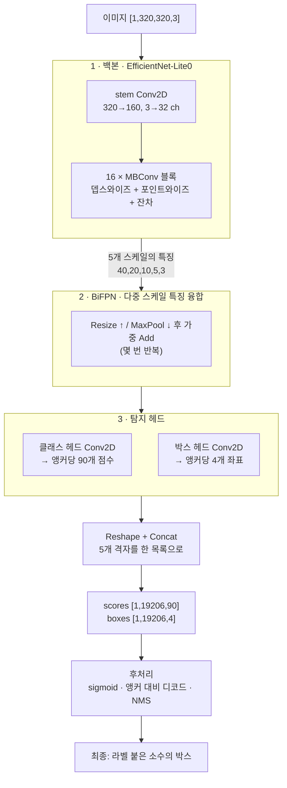
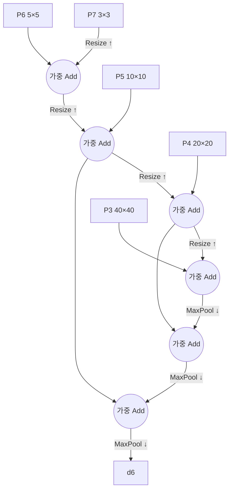

# 3장 — 비전 모델 한 연산씩 (EfficientDet-Lite0)

*자신에게 맞는 배지를 읽으세요: 🌱 **아이디어**(누구나, 코드 없이) · 🔧 **만들기**(코드 조금) · 🔬
**심화**(엔진 개발자). 처음이신가요? 🌱 부분만 따라가세요.*

*목표: **320×320 사진** 이 객체 탐지기를 통과해 라벨 붙은 박스("개, (x0,y0,x1,y1)")를 낼 때까지
따라갑니다. 2장과 다른 연산들이지만 — 아이디어는 같습니다: 텐서 위 작은 커널들의 그래프.*

> 🌱 **핵심 아이디어.** 지난 장에서 기계는 단어를 읽었고, 이 장에서는 **사진** 을 보고 그 안의
> 것들에 박스를 그립니다("여기 개, 저기 자전거"). 놀랍게도 이건 *같은 종류의 기계* 입니다 — 숫자
> 격자 위 작은 수학 단계의 그래프 — 다만 주연 연산이 다를 뿐입니다. 단어들이 서로를 보는 대신,
> 작은 **필터가 그림 위를 미끄러지며** 패턴(먼저 가장자리, 그다음 눈, 그다음 개 전체)을 찾습니다.
> 마지막에 기계는 수천 개의 추측 박스를 갖게 되고, 마지막 정리 단계가 좋은 몇 개만 남깁니다. 언어
> 모델과 같은 골격을, 픽셀에 겨눈 것입니다.

🔧 이 모델은 `models/efficientdet_lite0_*/` 에 있습니다. **EfficientDet-Lite0** 은 소형
[객체 탐지기](https://arxiv.org/abs/1911.09070)입니다: 이미지가 주어지면 *무슨* 객체가 있고
*어디에* 있는지 찾습니다. 여기서는 세 가지 정밀도 — **fp32, fp16, int8** — 로 배포되며, 크기/속도
절충만 다를 뿐 같은 것을 계산합니다. 이 장은 **fp32** 버전(연산 이름 `Conv2D`)을 따라가며, 6장이
int8이 `QConv2D` 로 바뀌는 방식을 설명합니다.

## 3.1 모델이 소비하고 생산하는 것

> 🌱 **아이디어.** 사진 한 장이 들어갑니다. 그리고 *후보* 박스 더미가 나옵니다 — 약 19,000개 —
> 각각 "이건 개일 확률이 얼마? 차? 사람?" 이라는 추측이 붙습니다. 대부분은 쓰레기입니다. 마지막에
> 버리고, 확신 있고 서로 겹치지 않는 소수만 남깁니다.

🔧

```
INPUT   input0 : shape [1, 320, 320, 3]   320×320 RGB 이미지 한 장 (NHWC)
        (int8 변형은 uint8 픽셀 0–255를 받고, fp32는 정규화된 실수를 받음)

OUTPUT  scores : shape [1, 19206, 90]     후보 박스 19206개 각각에 대한 90개 클래스 점수
        boxes  : shape [1, 19206, 4]       각 후보 박스에 대한 4개 좌표
```

이 네트워크는 이미지를 여러 위치·크기로 덮는 **후보 박스 19,206개** 를 제안하고, 각각을 **90개
객체 클래스**(COCO 라벨 집합 — 사람, 차, 개, …)에 대해 점수 매긴 뒤, 확신 있고 겹치지 않는 소수만
남깁니다. 🔬 19,206은 어디서 올까요? 해상도가 줄어드는 다섯 개의 탐지 격자, 셀마다 9개의 후보
박스("앵커"):

```
격자 40×40 × 9 = 14400   (작은 객체를 찾음)
격자 20×20 × 9 =  3600
격자 10×10 × 9 =   900
격자  5× 5 × 9 =   225
격자  3× 3 × 9 =    81   (큰 객체를 찾음)
                 ─────
          합계   19206
```

🔬 전체 그래프는 **262개 노드**(int8은 265개)입니다. 목록:

```
182 Conv2D   42 Add   14 MaxPool2D   12 ResizeNearest2D   10 Reshape   2 Concat
   └─ conv 중: 102개는 "포인트와이즈/일반", 80개는 "뎁스와이즈" (§3.3 참고)
```

## 3.2 한눈에 보는 파이프라인

> 🌱 **아이디어.** 학습된 세 단계, 그다음 정리. 먼저 **백본** 이 사진을 "특징"(무엇이 어디에)으로
> 졸입니다. 그다음 **믹서**(BiFPN)가 큰 그림 시야와 세부 시야가 쪽지를 나누게 합니다. 그다음 두 개의
> **헤드** 가 특징을 "무슨 클래스?"·"어디 박스?" 추측으로 바꿉니다. 마지막으로 고정된 정리가 원시
> 숫자를 실제로 그릴 몇 개의 박스로 바꿉니다.

🔧



학습된 세 단계(백본 → BiFPN → 헤드)가 원시 숫자를 만들고, 고정된 후처리가 그것을 그릴 수 있는 박스로
바꿉니다. 순서대로 봅시다 — 다만 먼저, 지배적인 연산 하나: **합성곱**.

---

## 3.3 핵심 연산: 합성곱 (`Conv2D`)

> 🌱 **아이디어.** 작은 스텐실 — 예: 3×3 — 을 그림 전체 위로 미끄러뜨립니다. 각 지점에서 스텐실의
> 숫자에 아래 픽셀을 곱해 더해 숫자 하나를 얻습니다. 어디서나 미끄러뜨리면, 스텐실의 패턴이 나타나는
> 곳마다 "빛나는" 새 그림이 나옵니다. 어떤 스텐실은 세로 가장자리를 찾고, 다른 건 털 조각을, 나중
> 것은 눈을 찾습니다. 이런 걸 충분히 쌓으면 기계는 가장자리 → 부분 → 객체 전체로 나아갑니다. 이
> 미끄러지는 스텐실 동작이 **합성곱** 이며, 언어에서 어텐션이 하는 역할을 비전에서 합니다.

🔧 언어 모델이 `MatMul` 에 기대는 곳에서, 비전 모델은 `Conv2D` 에 기댑니다. 합성곱은 작은
**필터**(작은 가중치 격자, 예: 3×3)를 이미지 위로 미끄러뜨립니다. 각 위치에서 필터에 아래 픽셀을
곱하고 더해 — **닷 프로덕트** — 출력 값 하나를 만듭니다. 어디서나 미끄러뜨리면, 그 필터의
패턴(가장자리, 질감, 눈)이 나타나는 곳마다 빛나는 새 이미지("특징 맵")가 나옵니다.

```
   입력 패치           필터 (3×3)        출력 픽셀 하나
   ┌──────────┐       ┌──────────┐
   │ a  b  c  │       │ w1 w2 w3 │      out = a·w1 + b·w2 + c·w3
   │ d  e  f  │   ⊙   │ w4 w5 w6 │  =       + d·w4 + e·w5 + f·w6
   │ g  h  i  │       │ w7 w8 w9 │          + g·w7 + h·w8 + i·w9
   └──────────┘       └──────────┘        (그다음 `stride` 만큼 오른쪽으로 밀고 반복)
```

🔬 실제 참조 커널(`ts/ops/conv2D.ts`)은 그 미끄러짐을 중첩 루프로 쓴 것뿐입니다 — 배치, 출력 행,
출력 열, 출력 채널, 그다음 필터 탭:

```javascript
for (let oh = 0; oh < out_h; oh++)
 for (let ow = 0; ow < out_w; ow++)
  for (let oc = 0; oc < out_c; oc++) {
    let sum = 0;
    for (let ic = 0; ic < in_c; ic++)          // 입력 채널
     for (let kh = 0; kh < k_h; kh++)          // 필터 높이
      for (let kw = 0; kw < k_w; kw++) {        // 필터 너비
        const ih = oh*stride_y + kh*dil_y - pad; // 어느 입력 픽셀
        const iw = ow*stride_x + kw*dil_x - pad;
        if (in-bounds) sum += input[…ih,iw,ic…] * weight[…kh,kw,ic,oc…];
      }
    if (bias) sum += bias[oc];
    if (relu) sum = clamp(sum, 0, 6);           // 융합된 ReLU6 활성화
    output[…oh,ow,oc…] = sum;
  }
```

🔧 두 종류의 합성곱이 나오며, 그 조합이 이 모델 계열의 효율 비결 전부입니다:

| | **포인트와이즈** (1×1) | **뎁스와이즈** (3×3, `groups = 채널`) |
|---|---|---|
| 필터 | 1×1, **채널** 을 섞음 | 3×3, **공간** 을 섞되 채널마다 따로 |
| 역할 | "특징을 재조합" | "국소 패턴을 봄" |
| 비용 | 픽셀당 저렴하나 채널 전대전 | 매우 저렴 — 채널 섞음 없음 |

🌱 일반 합성곱은 두 일을 한 번에 해서 비쌉니다. 이 모델의 비결은 그것을 저렴한 반쪽 둘로 나누는
것입니다 — 하나는 *모양* 을 보고, 다른 하나는 *색/특징* 을 섞어 — 훨씬 적은 일로 거의 같은 결과를
냅니다. 🔬 그 짝(**뎁스와이즈-분리** 합성곱)이 `MBConv` 블록, 백본의 레고 조각이며, 182개 conv 중
80개가 뎁스와이즈인 이유입니다.

> 🔬 **`groups`** 코드에서: `groups = in_c` 는 "각 채널을 자기 필터로 합성곱"(뎁스와이즈)을
> 뜻합니다. `groups = 1` 은 "모든 출력 채널이 모든 입력 채널을 봄"(일반)입니다. 같은 커널이 알맞은
> 채널 범위를 돌며 둘 다 처리합니다.

---

## 3.4 1단계 — 백본: 이미지 → 특징

> 🌱 **아이디어.** 백본은 그림을 서서히 줄이면서 담긴 *의미* 는 키웁니다. 초기 층은 가장자리와 색을,
> 중간 층은 질감과 부분(눈, 바퀴)을, 후기 층은 객체 전체를 알아봅니다. 아무도 "이건 눈이다" 를
> 프로그래밍하지 않았습니다 — 기계가 예제에서 그 사다리를 *배웠습니다*. 백본은 그림을 서로 다른 다섯
> 확대 수준으로 뱉는데, 가까운 새와 거대한 버스가 서로 다른 확대에서 가장 잘 보이기 때문입니다.

🔧 **백본**(*EfficientNet-Lite0*)은 특징 추출기입니다. 반복적으로:

1. 공간 크기를 **줄이고**(stride-2 conv와 풀링으로) — 320→160→80→40→20→10→…
2. 채널 수를 **키웁니다** — 3→32→…→320+ — "어디" 를 "무엇" 과 맞바꿉니다.

초기 층은 가장자리와 색을, 중간 층은 질감과 부분(눈, 바퀴)을, 후기 층은 객체 전체를 탐지합니다. 이
계층은 프로그래밍된 게 아니라 *학습된* 것입니다.

```
stem:      [1,320,320,  3]  --Conv2D stride2-->  [1,160,160, 32]
MBConv ×16: … 뎁스와이즈 + 포인트와이즈 + 잔차 Add …   (채널은 늘고, 크기는 줄고)
stride 8,16,32,64,128의 5개 특징 맵을 출력:
   P3 [1,40,40,C]   P4 [1,20,20,C]   P5 [1,10,10,C]   P6 [1,5,5,C]   P7 [1,3,3,C]
```

각 MBConv 안의 **잔차 `Add`** 는 트랜스포머와 같은 비결입니다: 블록의 출력을 입력에 더해 깊은 스택이
학습 가능하게 유지합니다. 같은 아이디어, 다른 영역.

🌱 왜 하나가 아니라 다섯 개의 특징 맵일까요? **스케일.** 세밀한 40×40 맵은 아주 작은 객체에 좋고,
거친 3×3 맵은 장면 전체를 담아 큰 객체에 좋습니다. 여러 확대를 보는 것이, 한 네트워크가 먼 새와
가까운 버스를 모두 찾는 방법입니다.

---

## 3.5 2단계 — BiFPN: 스케일들을 함께 섞기

> 🌱 **아이디어.** 확대를 뺀 시야는 *"여기 뭔가 크다"* 는 걸 알지만 흐릿하고, 확대한 시야는 선명하지만
> 큰 그림을 못 봅니다. BiFPN은 이 시야들이 **쪽지를 나누게** 할 뿐입니다 — 맵들이 서로 크기가 맞을
> 때까지 줄이거나 키운 뒤 더합니다 — 그래서 모든 확대 수준이 선명하면서도 지혜롭게 됩니다. 이미 아는
> 연산으로 만들어집니다: resize, pool, add. 새 수학은 없습니다.

🔧 작은 특징 맵은 *"여기 객체가 있다"* 를 알지만 공간적으로 거칠고, 큰 것은 정밀하지만 의미적으로
얕습니다. **BiFPN**(양방향 특징 피라미드 네트워크)은 다섯 스케일이 위→아래, 아래→위로 정보를
교환하게 해, 모든 스케일이 세부와 고수준 의미를 둘 다 얻게 합니다. 이미 이해한 연산 셋만 씁니다:



- **`ResizeNearest2D`** 는 작은 맵을 큰 맵으로 업샘플(위→아래 경로). *12개.*
- **`MaxPool2D`** 는 큰 맵을 작은 맵으로 다운샘플(아래→위 경로). *14개.* 커널
  (`ts/ops/maxPool2D.ts`)은 각 창에서 최댓값만 남깁니다.
- **`Add`**(종종 *가중* — 입력마다 학습되는 중요도)가 정렬된 두 맵을 융합. *42개의 Add* 가 이 융합과
  백본 잔차를 담당합니다.

그게 전부입니다 — BiFPN은 "두 맵이 같은 크기가 될 때까지 resize한 뒤 더하기" 를 반복한 것입니다. 새
수학 없음.

---

## 3.6 3단계 — 헤드: 특징 → 앵커별 예측

> 🌱 **아이디어.** 두 개의 작은 판독기가 섞인 특징을 훑습니다. 하나는 각 지점에 *무엇* 이 있는지(개?
> 차?), 다른 하나는 박스가 *어디* 여야 하는지 추측합니다. 허공에서 박스를 발명하는 대신, 미리 그려둔
> "참조 박스" 집합에서 시작해 살짝 밀 뿐입니다 — 배우기 훨씬 쉽습니다.

🔧 두 개의 작은 conv 스택(다섯 스케일에 걸쳐 공유)이 융합된 특징을 읽고, **모든** 격자 셀에서 그
셀의 **9개 앵커**(셀을 중심으로 한 서로 다른 크기/종횡비의 참조 박스 9개)에 대한 예측을 냅니다:

- **클래스 헤드** → 앵커당 `90` 개 숫자: 각 객체 클래스에 대한 원시 점수.
- **박스 헤드** → 앵커당 `4` 개 숫자: 앵커 위치·크기에 대한 조정(dx, dy, dw, dh).

> 🔬 **앵커** 가 영리한 부분입니다. 아무것도 없이 박스를 예측하기보다, 모델은 고정된 사전 박스 격자에
> 대한 작은 *보정* 을 예측합니다. "이 참조 박스를 조금 밀어라" 를 예측하는 것이 "(173, 92, 240, 210)
> 에 박스를 처음부터 발명해라" 보다 훨씬 배우기 쉽습니다.

---

## 3.7 4단계 — Reshape + Concat: 다섯 격자를 한 목록으로

> 🌱 **아이디어.** 다섯 확대 수준이 각자 자기 작은 격자에 추측을 냈습니다. 여기서 그 모두를 ~19,000개
> 후보의 긴 목록 하나로 붓습니다. 수학 없음 — 재배열뿐입니다.

🔧 5개 스케일 각각이 자기 격자 형태로 예측을 냈습니다. `Reshape` 가 각 격자를 앵커의 평평한 목록으로
펴고, `Concat` 이 다섯 목록을 하나로 쌓습니다(그래프의 꼬리 — 실제 노드 형태 참고):

```
클래스 예측:        [1,40,40,…] → [1,14400,90]  ┐
                    [1,20,20,…] → [1, 3600,90]  │
                    [1,10,10,…] → [1,  900,90]  ├─Concat─▶ scores [1,19206,90]
                    [1, 5, 5,…] → [1,  225,90]  │
                    [1, 3, 3,…] → [1,   81,90]  ┘
박스 예측:          … 같은 다섯 격자 …           ─Concat─▶ boxes  [1,19206,4]
```

🔬 `Reshape` 는 메모리에서 숫자를 전혀 옮기지 않습니다 — 같은 평평한 버퍼를 새 형태로 재해석할
뿐입니다(§1.2 상기). 이 저장소에서는 복사-통과 연산입니다. **이제 네트워크의 일은 끝났습니다:** 두
텐서, 점수 매겨진 후보 박스 19,206개.

---

## 3.8 5단계 — 후처리: 후보 19,206개 → 박스 몇 개

> 🌱 **아이디어.** 이제 정리. 원시 점수를 "얼마나 확신하나, 0–100%" 로 바꿉니다. 밀어둔 각 참조
> 박스를 실제 픽셀 모서리로 바꿉니다. 그다음 중복을 버립니다: 겹치는 다섯 박스가 모두 "개!" 라고
> 외치면, 가장 확신 있는 하나만 남기고 나머지는 지웁니다. 남은 것이 사진 위에 그리는 소수의
> 박스입니다.

🔧 원시 출력은 아직 그릴 수 없습니다. 학습되지 않은 고정된 세 단계가 마무리합니다:

1. **Sigmoid** 로 클래스 점수를 `[0,1]` 확률로. (int8 익스포트에서는 이 `Sigmoid` 를 속도를 위해
   접어 없애서 `scores` 가 원시 로짓입니다. 직접 sigmoid를 적용하거나, 그냥 비교하세요 — 클수록 여전히
   더 확신입니다.)
2. **박스 디코드**: 각 앵커의 4개 델타를 그 앵커의 참조 박스에 적용해 실제 픽셀 모서리
   `(x0,y0,x1,y1)` 로 바꿉니다.
3. **비최대 억제(NMS)**: 같은 객체가 대개 겹치는 앵커 여럿을 발화시킵니다. NMS는 클래스별로 가장
   점수 높은 박스를 남기고, 그것과 너무 많이 겹치는(높은 *IoU*, 교집합/합집합) 다른 것들을 지웁니다.
   VolvoxAI는 이것을 연산으로 가집니다 — `ts/ops/nonMaxSuppression.ts`.

```
NMS 전:  ▢▢▢  겹치는 "개" 박스 셋, 점수 0.91, 0.88, 0.72
NMS 후:  ▢    0.91을 남기고, 50% 초과로 겹치는 둘을 억제
```

🔬 선택형 네이티브 `detect` 예제(`examples/native_task_cli/main.c`, `print_detections`)는 3단계의
**단순화** 버전을 씁니다: 최고 클래스 점수 기준 상위 `max_det` 개 박스를 골라 순위 표로
출력합니다(`labels.txt` 로 라벨 조회): `score_pct` 열은 같은 점수를 퍼센트로 보여줍니다.

```
rank  index  score   score_pct  class  label    x0     y0     x1     y1
1     4213   0.91    91.00%     17     dog      0.31   0.44   0.62   0.88
2     991    0.86    86.00%      1     bicycle  0.05   0.10   0.40   0.95
```

이 직사각형들을 원본 사진 위에 그리면 객체 탐지가 됩니다.

---

## 3.9 두 모델, 나란히

> 🌱 **아이디어 정리.** 이제 *같은 종류의 기계* 가 단어를 읽고 그림을 보는 것을 봤습니다. 주연 연산은
> 다르고(단어엔 어텐션, 픽셀엔 합성곱), 정리도 다르지만 — 아래로 내려가면 둘 다 학습된 가중치를 지닌,
> 숫자 격자 위 작은 수학 단계의 그래프일 뿐입니다. 그 골격을 한 번 배우면 모든 모델이 읽힙니다.

🔧 이제 두 세계를 모두 따라갔습니다. 얼마나 많이 공유하는지 보세요:

| | TinyStories (언어) | EfficientDet-Lite0 (비전) |
|---|---|---|
| 입력 텐서 | 토큰 `[1,256]` | 이미지 `[1,320,320,3]` |
| 지배적 연산 | `MatMul` | `Conv2D` |
| "섞기" 메커니즘 | 토큰 간 어텐션(`SDPA`) | 픽셀 간 합성곱 |
| 비선형 | `GELU` | `ReLU6`(conv에 융합) |
| 깊은 스택 비결 | 잔차 `Add` + `LayerNorm` | 잔차 `Add`(MBConv 안) |
| 출력 | 로짓 `[…,50257]` → 다음 단어 | 점수/박스 `[…,19206,…]` → 객체 |
| 후처리 | argmax / 샘플링 | sigmoid + 디코드 + NMS |

같은 골격 — *학습된 가중치를 지닌 작은 텐서 연산의 그래프* — 이 텍스트와 픽셀을 풉니다. 그 전이가
핵심입니다: 골격을 한 번 배우면 모든 모델이 읽히게 됩니다.

이로써 **1부** 가 닫힙니다. 이제 학습된 모델 두 개 — 언어 모델과 탐지기 — 를 입력에서 답까지 한
연산씩 따라갔습니다. 하지만 우리는 가장 어려운 것을 조용히 당연시했습니다: 각 연산이 유용한 일을
하게 만드는 학습된 표, **가중치** 입니다. 그것들은 어디서 올까요? **2부** 가 그 상자를 엽니다:
**역전파**, 최적화기, 그리고 학습 루프.

*(그 세 EfficientDet 폴더가 던지는 fp32 / fp16 / int8 질문은 나중에 6장에서, 줄일 가치가 있는
학습된 모델을 갖게 된 뒤 답합니다.)*

**다음:** [4장 — 역전파 →](04-backward-pass.md)
