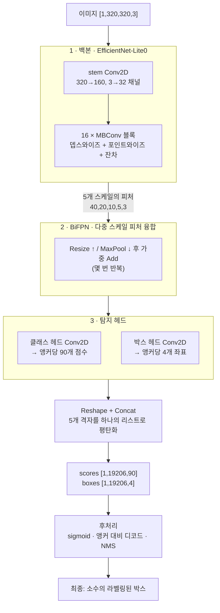
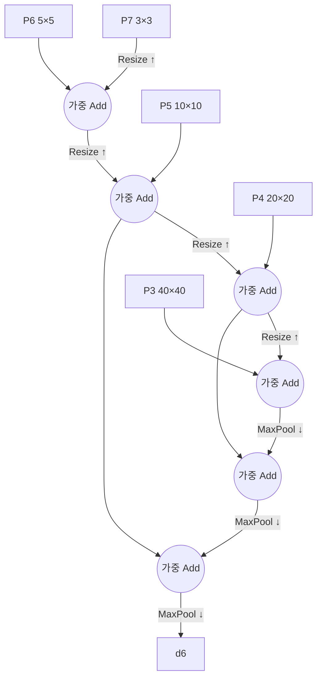

# 3장 — 비전 모델 한 연산씩 (EfficientDet-Lite0)

*목표: **320×320 사진** 이 객체 탐지기를 통과해 라벨링된 박스("(x0,y0,x1,y1)에 개")를 내놓기까지를
따라갑니다. 2장과는 다른 연산들이지만 — 아이디어는 같습니다: 텐서 위 작은 커널들의 그래프.*

이 모델은 `models/efficientdet_lite0_*/` 에 있습니다. **EfficientDet-Lite0** 는 소형
[객체 탐지기](https://arxiv.org/abs/1911.09070)입니다: 이미지가 주어지면 *무엇* 이 있고 *어디* 에
있는지 찾아냅니다. 여기서는 세 가지 수치 정밀도 — **fp32, fp16, int8** — 로 배포되며, 같은 것을
서로 다른 크기/속도 절충으로 계산합니다. 이 장은 **fp32** 버전(`Conv2D` 라는 연산)을 따라가고,
int8이 `QConv2D` 로 어떻게 바뀌는지는 4장에서 설명합니다.

## 3.1 모델이 받아들이고 내놓는 것

```
입력   input0 : shape [1, 320, 320, 3]   320×320 RGB 이미지 한 장 (NHWC)
       (int8 변형은 uint8 픽셀 0–255를 받고, fp32는 정규화된 float를 받음)

출력   scores : shape [1, 19206, 90]     19206개 후보 박스 각각에 대해 90개 클래스 점수
       boxes  : shape [1, 19206, 4]      후보 박스마다 4개 좌표
```

신경망은 이미지를 여러 위치와 크기로 덮는 **19,206개의 후보 박스**를 제안하고, 각각을 **90개 객체
클래스**(COCO 라벨 집합 — 사람, 자동차, 개, …)에 대해 채점하며, 당신은 확신도가 높고 겹치지 않는
소수를 남깁니다. 19,206은 어디서 나올까요? 해상도가 점점 작아지는 다섯 개 탐지 격자, 셀마다 9개의
후보 박스("앵커, anchor"):

```
격자 40×40 × 9 = 14400   (작은 객체를 찾음)
격자 20×20 × 9 =  3600
격자 10×10 × 9 =   900
격자  5× 5 × 9 =   225
격자  3× 3 × 9 =    81   (큰 객체를 찾음)
                 ─────
             합   19206
```

전체 그래프는 **262개 노드**(int8은 265개)입니다. 내역:

```
182 Conv2D   42 Add   14 MaxPool2D   12 ResizeNearest2D   10 Reshape   2 Concat
   └─ conv 중: 102개는 "포인트와이즈/일반", 80개는 "뎁스와이즈" (§3.3 참고)
```

## 3.2 파이프라인 한눈에 보기



학습된 세 단계(백본 → BiFPN → 헤드)가 원시 숫자를 만들고, 고정된 후처리가 그것을 그릴 수 있는
박스로 바꿉니다. 순서대로 살펴봅시다 — 하지만 먼저, 압도적으로 지배적인 연산 하나: **합성곱**.

---

## 3.3 핵심 연산: 합성곱 (`Conv2D`)

언어 모델이 `MatMul` 에 기대는 것처럼, 비전 모델은 `Conv2D` 에 기댑니다. 합성곱은 작은
**필터(filter)**(가중치의 작은 격자, 예: 3×3)를 이미지 위로 슬라이드합니다. 각 위치에서 필터와 그
아래의 픽셀을 곱해 합합니다 — **내적(dot product)** — 그렇게 출력 값 하나를 만듭니다. 이것을 온
사방으로 슬라이드하면, 그 필터의 패턴(모서리, 질감, 눈)이 나타나는 곳마다 불이 켜지는 새 이미지
("피처 맵, feature map")를 얻습니다.

```
   입력 패치           필터 (3×3)        출력 픽셀 하나
   ┌──────────┐       ┌──────────┐
   │ a  b  c  │       │ w1 w2 w3 │      out = a·w1 + b·w2 + c·w3
   │ d  e  f  │   ⊙   │ w4 w5 w6 │  =       + d·w4 + e·w5 + f·w6
   │ g  h  i  │       │ w7 w8 w9 │          + g·w7 + h·w8 + i·w9
   └──────────┘       └──────────┘        (그다음 `stride`만큼 오른쪽으로 슬라이드하고 반복)
```

실제 참조 커널(`js/ops/conv2D.js`)은 그 슬라이드를 중첩 루프로 쓴 것일 뿐입니다 — 배치, 출력 행,
출력 열, 출력 채널, 그다음 필터 탭:

```javascript
for (let oh = 0; oh < out_h; oh++)
 for (let ow = 0; ow < out_w; ow++)
  for (let oc = 0; oc < out_c; oc++) {
    let sum = 0;
    for (let ic = 0; ic < in_c; ic++)          // 입력 채널에 대해
     for (let kh = 0; kh < k_h; kh++)          // 필터 높이에 대해
      for (let kw = 0; kw < k_w; kw++) {        // 필터 너비에 대해
        const ih = oh*stride_y + kh*dil_y - pad; // 어느 입력 픽셀인지
        const iw = ow*stride_x + kw*dil_x - pad;
        if (in-bounds) sum += input[…ih,iw,ic…] * weight[…kh,kw,ic,oc…];
      }
    if (bias) sum += bias[oc];
    if (relu) sum = clamp(sum, 0, 6);           // 융합된 ReLU6 활성화
    output[…oh,ow,oc…] = sum;
  }
```

두 종류의 합성곱이 등장하며, 그 조합이 이 모델 계열의 효율성 비결 전부입니다:

| | **포인트와이즈** (1×1) | **뎁스와이즈** (3×3, `groups = 채널 수`) |
|---|---|---|
| 필터 | 1×1, **채널**을 섞음 | 3×3, **공간**을 섞음, 채널마다 따로 |
| 역할 | "특징을 재조합" | "국소 패턴을 봄" |
| 비용 | 픽셀당은 저렴하나 채널 간 전결합 | 매우 저렴 — 채널 혼합 없음 |

일반 conv는 둘을 한 번에 합니다(비쌈). **뎁스와이즈 분리형(depthwise-separable)** 합성곱은 이를
뎁스와이즈(공간) + 포인트와이즈(채널) 쌍으로 나눠, 거의 같은 성능을 몇 분의 일 비용에 냅니다. 이
쌍이 곧 `MBConv` 블록, 백본의 레고 블록이며 — 182개 conv 중 80개가 뎁스와이즈인 이유입니다.

> 코드의 **`groups`**: `groups = in_c` 는 "각 채널이 자기만의 필터로 합성곱됨"(뎁스와이즈)을
> 뜻합니다. `groups = 1` 은 "모든 출력 채널이 모든 입력 채널을 봄"(일반)입니다. 같은 커널이 올바른
> 채널 범위를 도는 것으로 둘 다 처리합니다.

---

## 3.4 1단계 — 백본: 이미지 → 피처

**백본(backbone)**(*EfficientNet-Lite0*)은 피처 추출기입니다. 반복적으로:

1. 공간 크기를 **줄이고**(stride-2 conv와 풀링으로) — 320→160→80→40→20→10→…
2. 채널 수를 **늘립니다** — 3→32→…→320+ — "어디"를 "무엇"과 맞바꾸지요.

초기 층은 모서리와 색을 감지하고, 중간 층은 질감과 부품(눈, 바퀴)을, 후기 층은 온전한 객체를
감지합니다. 이 계층 구조는 프로그래밍된 것이 아니라 *학습된* 것입니다.

```
stem:      [1,320,320,  3]  --Conv2D stride2-->  [1,160,160, 32]
MBConv ×16: … 뎁스와이즈 + 포인트와이즈 + 잔차 Add …   (채널 증가, 크기 감소)
stride 8,16,32,64,128에서 5개 피처 맵 출력:
   P3 [1,40,40,C]   P4 [1,20,20,C]   P5 [1,10,10,C]   P6 [1,5,5,C]   P7 [1,3,3,C]
```

각 MBConv 안의 **잔차 `Add`** 는 트랜스포머와 같은 기법입니다: 블록의 출력을 입력에 다시 더해 깊은
층 쌓기가 학습 가능한 상태를 유지하게 하지요. 같은 아이디어, 다른 영역.

왜 하나가 아니라 다섯 개의 피처 맵일까요? **스케일** 때문입니다. 40×40 맵은 세밀한 디테일을
가지고(작은 객체에 유리), 3×3 맵은 거대한 수용 영역(receptive field)을 봅니다(큰 객체에 유리).
여러 스케일에서 탐지하는 것이 하나의 신경망으로 멀리 있는 새와 가까이 있는 버스를 모두 찾는
방법입니다.

---

## 3.5 2단계 — BiFPN: 스케일들을 섞다

작은 피처 맵은 *"여기 객체가 있다"* 는 것은 알지만 공간적으로 거칠고, 큰 맵은 정밀하지만 의미적으로
얕습니다. **BiFPN**(Bi-directional Feature Pyramid Network)은 다섯 개 스케일이 위→아래, 아래→위로
정보를 교환하게 해, 모든 스케일이 세밀한 디테일과 고수준 의미를 모두 얻게 합니다. 당신이 이미 아는
정확히 세 가지 연산을 씁니다:



- **`ResizeNearest2D`** 는 작은 맵을 큰 맵으로 업샘플링합니다(위→아래 경로). *12개.*
- **`MaxPool2D`** 는 큰 맵을 작은 맵으로 다운샘플링합니다(아래→위 경로). *14개.* 커널
  (`js/ops/maxPool2D.js`)은 각 창(window)에서 최댓값만 남깁니다.
- **`Add`**(흔히 *가중* — 입력마다 학습 가능한 중요도)는 정렬된 두 맵을 융합합니다. 모델 전체의
  *42개 Add* 가 이 융합과 백본 잔차를 담당합니다.

그게 전부입니다 — BiFPN은 "두 맵이 같은 크기가 될 때까지 resize한 뒤 더하기"의 반복입니다. 새로운
수학은 없습니다.

---

## 3.6 3단계 — 헤드: 피처 → 앵커별 예측

두 개의 작은 conv 스택(다섯 스케일에서 공유)이 융합된 피처를 읽고, **모든** 격자 셀에서 그 셀의
**9개 앵커**(셀 중심의, 크기/종횡비가 다른 9개 기준 박스 모양)에 대한 예측을 출력합니다:

- **클래스 헤드** → 앵커당 `90`개 숫자: 객체 클래스마다의 원시 점수.
- **박스 헤드** → 앵커당 `4`개 숫자: 앵커의 위치와 크기에 대한 조정값(dx, dy, dw, dh).

> **앵커(anchor)** 가 영리한 부분입니다. 아무것도 없는 데서 박스를 예측하는 대신, 모델은 고정된
> 기준 박스 격자에 대한 작은 *보정값* 을 예측합니다. "이 기준 박스를 조금 옮겨라"를 배우는 것이
> "(173, 92, 240, 210)에 박스를 처음부터 만들어라"보다 훨씬 쉽습니다.

---

## 3.7 4단계 — Reshape + Concat: 다섯 격자를 하나의 리스트로 평탄화

다섯 스케일 각각은 자기 격자 형태로 예측을 만들었습니다. `Reshape` 가 각 격자를 앵커의 단순한
리스트로 평탄화하고, `Concat` 이 다섯 리스트를 하나로 쌓습니다(이것이 그래프의 꼬리 부분 — 실제 노드
형태를 보세요):

```
클래스 예측:  [1,40,40,…] → [1,14400,90]  ┐
             [1,20,20,…] → [1, 3600,90]  │
             [1,10,10,…] → [1,  900,90]  ├─Concat─▶ scores [1,19206,90]
             [1, 5, 5,…] → [1,  225,90]  │
             [1, 3, 3,…] → [1,   81,90]  ┘
박스 예측:    … 같은 다섯 격자 …            ─Concat─▶ boxes  [1,19206,4]
```

`Reshape` 는 메모리에서 숫자를 전혀 옮기지 않습니다 — 같은 평평한 버퍼를 새 형태로 재해석할 뿐이죠
(§1.2 참고). 이 저장소에서는 통과 복사(copy-through) 연산입니다. **이제 신경망의 일은 끝났습니다:**
텐서 두 개, 채점된 후보 박스 19,206개.

---

## 3.8 5단계 — 후처리: 후보 19,206개 → 소수의 박스

원시 출력은 아직 그릴 수 없습니다. 학습되지 않은 고정 단계 세 개가 마무리합니다:

1. 클래스 점수에 **시그모이드(Sigmoid)** → `[0,1]` 범위의 확률. (int8 익스포트에서는 이 `Sigmoid`
   가 속도를 위해 접혀 없어졌으므로 `scores` 는 원시 로짓입니다. 직접 시그모이드를 적용하거나, 그냥
   비교만 해도 됩니다 — 여전히 클수록 확신도가 높습니다.)
2. **박스 디코드**: 각 앵커의 4개 델타를, 그 앵커의 기준 박스에 적용해 실제 픽셀 모서리
   `(x0,y0,x1,y1)` 로 변환.
3. **비최대 억제(Non-Max Suppression, NMS)**: 같은 객체는 보통 여러 개의 겹치는 앵커를 발화시킵니다.
   NMS는 점수가 가장 높은 박스를 남기고 그것과 너무 많이 겹치는(높은 *IoU*, 교집합/합집합) 다른
   박스들을 클래스별로 지웁니다. VolvoxAI에는 이것이 연산으로 있습니다 —
   `js/ops/nonMaxSuppression.js`.

```
NMS 전:  ▢▢▢  겹치는 "개" 박스 세 개, 점수 0.91, 0.88, 0.72
NMS 후:  ▢    0.91을 남기고; 그것과 50% 넘게 겹치는 둘을 억제
```

네이티브 `detect` 명령(`native/main.c`, `print_detections`)은 데모를 위해 3단계의 **단순화된**
버전을 씁니다: 최상위 `max_det` 개 박스를 최고 클래스 점수 기준으로 뽑아 순위 표로 출력합니다
(라벨 조회는 `labels.txt` 로):

```
rank  index  score   class  x0     y0     x1     y1
1     4213   0.91    17     0.31   0.44   0.62   0.88     ← "dog"
2     991    0.86     2     0.05   0.10   0.40   0.95     ← "bicycle"
```

그 사각형들을 원본 사진 위에 그리면 객체 탐지가 완성됩니다.

---

## 3.9 두 모델, 나란히 놓고 보기

이제 두 세계를 모두 따라가 봤습니다. 얼마나 많이 공유하는지 보세요:

| | TinyStories (언어) | EfficientDet-Lite0 (비전) |
|---|---|---|
| 입력 텐서 | tokens `[1,256]` | image `[1,320,320,3]` |
| 지배적 연산 | `MatMul` | `Conv2D` |
| "혼합" 메커니즘 | 토큰 간 어텐션(`SDPA`) | 픽셀 간 합성곱 |
| 비선형성 | `GELU` | `ReLU6` (conv에 융합) |
| 깊은 층 쌓기 기법 | 잔차 `Add` + `LayerNorm` | 잔차 `Add` (MBConv 안) |
| 출력 | 로짓 `[…,50257]` → 다음 단어 | scores/boxes `[…,19206,…]` → 객체 |
| 후처리 | argmax / 샘플링 | sigmoid + 디코드 + NMS |

같은 골격 — *학습된 가중치를 가진 작은 텐서 연산의 그래프* — 이 텍스트와 픽셀을 풉니다. 이 전이가
핵심입니다: 골격을 한 번 배우면 모든 모델이 읽히게 됩니다.

마지막 큰 질문은 세 개의 EfficientDet 폴더가 던지는 것입니다: **fp32 vs fp16 vs int8.** 그것들은
무엇이고, 왜 같은 모델을 세 번 배포할까요? 그것이 4장입니다.

**다음:** [4장 — 정밀도와 양자화 →](04-precision-and-quantization.md)
