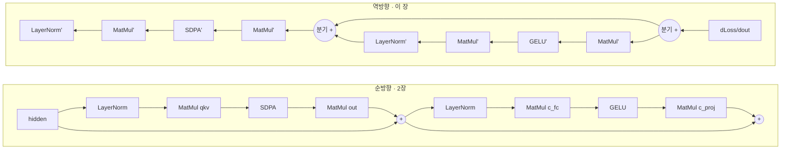

# 4장 — 역전파

*자신에게 맞는 배지를 읽으세요: 🌱 **아이디어**(누구나, 코드 없이) · 🔧 **만들기**(코드 조금) · 🔬
**심화**(엔진 개발자). 처음이신가요? 🌱 부분만 따라가세요.*

*목표: 가중치가 어디서 오는지 이해합니다. 2장의 바로 그 트랜스포머를 가져와, 예측이 얼마나 틀렸는지
재고, 그 오차를 그래프를 통해 **거꾸로** 밀어 — 모든 가중치에 대해, 조금 덜 틀리게 만들 방향을
계산합니다. 1부에서 만난 모든 연산에는 **역방향 쌍(backward twin)** 이 있으며, 모두
`native/src/kernels/training_kernels.c` 와 `shaders/training/*Backward.wgsl` 에 있습니다.*

> 🌱 **핵심 아이디어.** 지금까지 기계는 이미 "창고 숫자"(가중치)를 알고 있었습니다. 하지만 그건
> 어디서 왔을까요? 답: 기계가 **연습** 했습니다. 추측을 하고, 누군가 정답을 알려주고, **얼마나
> 틀렸는지** 를 하나의 숫자로 재고(골프 점수처럼 — 낮을수록 좋음), 그다음 내부의 모든 손잡이 하나
> 하나에 대해 *"조금 덜 틀리려면 이걸 올려야 하나 내려야 하나?"* 를 알아냅니다. 이걸 수백만 번 하면
> 무작위 기계가 서서히 똑똑한 기계가 됩니다. 이 장은 그 결정적 동작에 관한 것입니다: **기계를 거꾸로
> 지나가며 모든 손잡이에 책임을 조금씩 나눠 주기.** 이것을 *역전파(backward pass)* 라 하며 — 놀랍게도
> — 2장의 그래프를 그냥 거꾸로 돌린 것입니다.

🔧 1부는 누군가 이미 학습시킨 모델을 실행했습니다. 가중치를 주어진 것으로 다뤘지요. 이 장이 그 상자를
엽니다. 학습은 세 단계의 루프입니다:

```
   1. 순전파   그래프를 실행해 출력을 얻는다          (1–3장)
   2. 역전파   오차를 재고 기울기를 계산한다          ← 이 장
   3. 갱신     모든 가중치를 기울기 반대로 민다         (5장)
```

놀라운 점: 2단계는 *같은 그래프를 거꾸로 실행한 것* 이며, 순방향과 거의 거울상인 커널을 씁니다.
순전파를 이해했다면 역전파의 모양은 이미 이해한 것입니다.

## 4.1 하나의 숫자: 손실

> 🌱 **아이디어.** 먼저 추측이 얼마나 틀렸는지를 **하나의 숫자** 로 잴 필요가 있습니다 — 골프 점수처럼
> 요. 0이면 완벽하고, 클수록 나쁩니다. 학습은 그저 "점수가 낮아질 때까지 계속 치기" 입니다. 이
> 틀림-숫자를 **손실(loss)** 이라 합니다.

🔧 순전파는 50257개의 로짓으로 끝납니다 — 어휘 단어마다 하나의 점수. 생성 때는 그냥 `argmax` 를
택했습니다. **학습** 때는 *정답*(학습 텍스트의 실제 다음 단어)을 알기에, 더 날카로운 질문을
합니다: **이 점수들이 얼마나 틀렸나?**

**손실 함수** 는 전체 출력을 하나의 숫자로 뭉갭니다 — 클수록 더 틀림. 언어 모델의 손실은
**교차 엔트로피(cross-entropy)** 입니다: 정답 토큰에 높은 확률을 두면 보상하고, 틀린 것에 확신하면
벌합니다. 🔬 VolvoxAI는 이것을 손실 *과* 첫 기울기를 함께 돌려주는 커널 하나로 계산합니다
(`native/src/kernels/training_kernels.c`):

```c
// volvoxai_training_cross_entropy_f32 — 손실 AND 그 기울기를 한 번에
//   logits[e, :]  예제 e에 대한 모델 점수   (classes = 50257)
//   targets[e]    예제 e의 정답 토큰 id
//   grad          dLoss/dLogits로 채워짐    (logits와 같은 형태)
uint32_t volvoxai_training_cross_entropy_f32(
    const float *logits, const int32_t *rows, const int32_t *targets, float *grad,
    uint32_t examples, uint32_t classes, float gradient_scale,
    float *loss_sum, uint32_t *correct);
```

🔧 두 출력이 중요합니다:

- **`loss_sum`** — "얼마나 틀렸나" 스칼라. 학습이 진행되며 *내려가는* 것을 지켜봅니다.
- **`grad`** — 50257개 로짓 각각에 대한 `dLoss/dLogit`: *이 점수가 아주 조금 오르면 손실은 얼마나
  변하나?* 🔬 교차 엔트로피에서는 유명하게 깔끔한 형태 `softmax(logits) − onehot(target)` 을
  가집니다: 예측 확률에서, 정답 토큰에만 1.0을 뺀 것.

그 `grad` 텐서가 **역전파의 씨앗** 입니다. 여기부터는 그것을 그래프를 통해 거꾸로 날라, 모든
*가중치* 도 하나씩 갖게 하는 일입니다.

## 4.2 기울기란 무엇인가 (그리고 왜 원하는가)

> 🌱 **아이디어.** 안개 낀 언덕에 서서 바닥으로 내려가고 싶다고 상상하세요. 계곡은 안 보이지만, 발
> 밑 땅이 어느 쪽으로 기우는지는 *느낄 수* 있고 — 내리막으로 한 걸음 딛습니다. **기울기(gradient)**
> 는 정확히 그 "어느 쪽이 내리막이고 얼마나 가파른가" 느낌이되, 손잡이 하나에 대한 것입니다: *"이
> 손잡이를 조금 올리면 틀림이 늘어나나 줄어드나?"* 올리는 게 나빠지면 대신 내립니다. 모든 손잡이에
> 대해 이걸 하면 기계 전체가 "덜 틀림" 을 향해 내리막을 굴러갑니다.

🔧 **기울기(gradient)** 는 기울기(slope)입니다. 가중치 `w` 하나에 대해, 그 기울기 `dLoss/dw` 는:
*"`w` 를 살짝 늘리면 손실이 오르나 내리나, 얼마나 빨리?"*

```
   loss
    │        ●  지금 여기 (w = 0.30), 기울기 dLoss/dw = +4.0
    │       ╱     → w가 오르면 손실이 오름 → 그러니 w를 반대로(줄이기)
    │      ╱
    │  ___╱
    └───────────────── w
        0.30
```

**모든** 가중치에 대해 그 기울기를 알면 모델 전체를 어떻게 조정할지 알게 됩니다: 각 가중치를 그
기울기 *반대로* 조금씩 딛으면 손실이 내려갑니다. 그 걸음이 5장입니다. 이 장은 기울기를 얻는
것입니다.

🔧 장애물: 1층의 가중치는 그 뒤의 모든 층을 *통해서만* 손실에 영향을 줍니다. 그 기울기를 직접 읽을 수
없습니다. 해법은 **연쇄 법칙(chain rule)** 이며 — 그것을 출력에서 거꾸로 연산 하나씩 적용하는 것을
**역전파(backpropagation)** 라 합니다.

## 4.3 역전파 = 연쇄 법칙, 한 번에 한 연산

> 🌱 **아이디어.** 기계 깊숙이 묻힌 손잡이를, 맨 끝에서 난 실수에 대해 어떻게 공정하게 탓할까요? 답:
> **책임을 한 단계씩 거꾸로 넘긴다.** 마지막 단계가 "내 출력이 이만큼 어긋났다" 고 말하고, 그것을
> 앞 단계에 넘기면 그 단계가 *자기* 몫을 계산해 더 뒤로 넘기고 — 맨 첫 단계까지. 사람들이 줄지어
> 메시지를 뒤로 넘기며 각자 자기 몫만큼 고치는 것처럼요. 책임이 끝까지 되돌아가면 모든 손잡이가 자기
> 기여도를 알게 되고 — 따라서 어느 쪽으로 돌릴지 알게 됩니다.

🔧 전체 아이디어를 한 줄로. 어떤 연산이 입력 `x` 를 출력 `y` 로 바꾸고, 우리가 이미 `dLoss/dy`(그
뒤 연산들에서 *도착한* 기울기)를 안다면, 그 연산의 역방향 쌍은 `dLoss/dx`(그 *앞* 연산들에게 건넬
기울기)를 만듭니다:

```
   순방향:     x ──[ op ]──▶ y
   역방향:  dLoss/dx ◀─[ op' ]── dLoss/dy        (op' 은 x 그리고/또는 y를 재사용)
```

그래서 역전파는 `dLoss/dlogits`(§4.1)에서 시작해 노드 목록을 **역순** 으로 걷고, 각 연산이 자기
출력의 기울기를 자기 입력의 기울기로 바꾸며 — 연산에 가중치가 있으면 그 길에 `dLoss/dweight` 를
계산합니다. 역전파는 문자 그대로 그게 전부입니다: 그래프를 거꾸로 도는 `for` 루프, 1장의 순방향 `for`
루프의 거울상.

🔬 **모든 순방향 연산에는 역방향 쌍이 있습니다.** 이름이 일대일 대응합니다:

| 순방향 연산 (1부) | 역방향 쌍 (`training_kernels.c` / `shaders/training/`) | 생산 |
|---|---|---|
| `Add` (잔차) | `..._add_backward_f32` / `basicBackward.wgsl` | `da`, `db` |
| `MatMul` / Linear | `..._linear_backward_f32` / `matMulBackward.wgsl` | `dx`, `dw`, `db` |
| `GELU` / ReLU / SiLU | `..._activation_backward_f32` / `activationBackward.wgsl` | `dx` |
| `LayerNorm` / RMSNorm | `..._layernorm_backward_f32` / `layerNormBackward.wgsl` | `dx`, `dweight`, `dbias` |
| `SDPA` (어텐션) | `..._sdpa_backward_f32` / `sdpaBackward.wgsl` | `dqkv` |
| `Embedding` | `..._embedding_backward_f32` / `embeddingBackward.wgsl` | `dw` (표) |
| `Conv2D` | `..._conv2d_backward_f32` / `conv2DBackward.wgsl` | `dx`, `dw`, `db` |
| `Softmax` | `..._softmax_backward_f32` / `softmaxBackward.wgsl` | `dx` |

(전체 목록 — MoE, 크로스 어텐션, dropout, gather, resize, pad, … — 은 그 헤더의 나머지입니다. 거의
모든 순방향 커널에 `*Backward` 가 있고, 그것이 바로 그래프 전체를 학습 가능하게 만듭니다.)

## 4.4 역방향 쌍 네 개, 구체적으로

> 🌱 **아이디어.** 아래 코드는 건너뛰어도 됩니다 — 하지만 "책임을 거꾸로 넘기는" 네 규칙의 요지는
> 이렇습니다: **Add** 는 두 입력 모두에 같은 책임을 건넵니다. **MatMul**(큰 곱)은 책임을 뒤로 보내고
> *동시에* 자기 손잡이를 어떻게 고칠지 적어 둡니다. **GELU**(게이트)는 "열린" 곳에선 책임을 통과시키고
> "닫힌" 곳에선 막습니다. **Embedding**(단어 조회 표)은 사용된 바로 그 단어 행들에 책임을 되돌려
> 보냅니다. 규칙은 다르지만, 하는 일은 같습니다.

🔧 2장에서 이미 아는 연산 네 개의 거울상을 읽어 봅시다.

### `Add` — 가장 쉬운 쌍 (잔차 분기)

순방향으로 `Add` 는 그냥 더합니다: `y = a + b`. `a` 를 ε만큼 밀면 `y` 도 ε만큼 밀리고, `b` 도
마찬가지입니다. 따라서 기울기는 **양쪽** 입력에 그대로 흐릅니다 — 역방향 쌍은 복사입니다:

```c
// volvoxai_training_add_backward_f32: y = a + b의 기울기
for (uint32_t i = 0; i < n; i++) {
    da[i] += dy[i];    // ∂y/∂a = 1
    db[i] += dy[i];    // ∂y/∂b = 1
}
```

🌱 이것이 **잔차 연결**(`out = x + f(x)`, 2장 곳곳)이 학습을 그렇게 돕는 이유입니다: `Add` 가 책임을
*그대로 되돌려* 온전한 세기로 넘기므로, 아주 깊은 스택도 초기 손잡이까지 깨끗한 길을 유지합니다 —
아무도 책임에서 "빠지지" 않습니다.

> 🔬 **왜 `=` 가 아니라 `+=` 인가?** 쌍들이 *누적* 하는 것을 보세요(`da[i] +=`). 잔차 스트림에서 한
> 텐서가 여러 연산에 공급됩니다(분기). 각 소비자가 자기 몫의 기울기를 되보내고, **총** 효과는 그
> 합입니다. `+=` 로 누적하는 것은 순방향 그래프의 분기에 대응하는 역방향 동작입니다. VolvoxAI의 모든
> 기울기 목적지가 이 규칙을 따릅니다.

### `MatMul` / Linear — 일꾼

순방향: `y = x · W`(트랜스포머 블록마다 네 번 나오는 투영). 그 쌍은 세 가지 기울기를 돌려줍니다 —
입력, 가중치, 바이어스:

```c
// volvoxai_training_linear_backward_f32, 말로:
//   dx = dy · Wᵀ            앞 연산에 넘길 기울기
//   dW = xᵀ · dy            이 층 가중치의 기울기   ← 우리가 갱신할 것
//   db = dy의 열 합          바이어스의 기울기
```

🔬 `dW` 가 성과입니다: 손실을 줄이려면 *이* 가중치 행렬을 어떻게 바꿀지 알려줍니다. 대칭에
주목하세요 — 순방향은 `W` 를 곱하고, 역방향은 `Wᵀ` 를 곱합니다. 전치 행렬 곱도 행렬 곱이라서,
역방향이 순방향과 대략 같은 비용이며(같은 빠른 GEMM을 재사용).

### `GELU` (와 친구들) — 국소 게이트

활성화는 원소별로 작용하므로, 그 쌍은 그 점에서 곡선의 기울기로 원소별 곱하는 것입니다:

```c
// volvoxai_training_activation_backward_f32(kind = GELU, …):
dx[i] = dy[i] * gelu_prime(x[i]);   // 도착한 기울기를 국소 기울기로 스케일
```

GELU 곡선이 가파른 곳에선 기울기가 통과하고, 평평한 곳(큰 음수 `x`)에선 0에 가깝게 조입니다. 🔬
`kind` 인자가 쌍을 고릅니다 — ReLU, GELU, SiLU, sigmoid, tanh, hard-swish — 1·3부의 순방향
활성화와 대응.

### `Embedding` — 표로 되돌리는 scatter-add

순방향으로 `Embedding` 은 `[50257, 64]` 표에서 `token_id` 행을 *읽습니다*. 역방향으로는 기울기를 바로
그 행들에 *써넣어야* 하고 — 같은 토큰이 두 번 나오면 두 기여가 더해집니다:

```c
// volvoxai_training_embedding_backward_f32, 말로:
시퀀스의 각 토큰 t에 대해:
    dW[ ids[t] , : ] += dy[ t , : ];   // 이 토큰의 기울기를 그 행에 흩뿌려 더함
```

🌱 이번에 실제로 등장한 단어 행만 조정됩니다 — 그래서 드문 단어는 느리게 배웁니다(차례가 드무니까요).
이것이 2장 §2.4의 표 *조회* 의 거울상입니다.

## 4.5 트랜스포머 블록, 역순으로

> 🌱 **아이디어.** 종합: 2장의 "생각하는 방" 하나를 가져와 거꾸로 돌립니다. 책임이 끝에서 들어와 모든
> 단계를 역순으로 거꾸로 흐르고, 그 길에 각 곱셈과 정규화 단계가 자기 손잡이를 어떻게 고칠지 적어
> 둡니다. 이걸 8개 방 모두, 그다음 단어 조회까지 하면 **기계 전체의 모든 손잡이에 "이 쪽으로 돌려라"
> 쪽지가 붙습니다.** 그게 한 번의 역전파입니다.

🔧 2장 블록 하나를 순방향, 그다음 역방향으로. 역방향은 정확히 같은 연산들을 반대 순서로 방문하며, 각
연산은 그 쌍으로 바뀌고, 순방향 그래프가 분기한 곳마다 기울기가 누적(`+=`)됩니다:



역방향 그래프를 오른쪽에서 왼쪽으로 읽으세요. 각 잔차 `Add` 는 기울기를 두 갈래로 보내는
**분기(split)** 가 되고(§4.4), 갈래들은 `+=` 로 재결합하며, 모든 `MatMul'`, `LayerNorm'`, `SDPA'`
가 그 길에 자기 가중치의 `dW` 를 남깁니다. 이걸 8개 블록 전부, 그다음 임베딩까지 거슬러 실행하면
**모델의 모든 가중치가 이제 기울기를 갖습니다**.

🔬 `SDPA'`(`volvoxai_training_sdpa_backward_f32`)가 가장 바쁜 쌍입니다 — 기울기를 소프트맥스 *와*
Q·K 유사도 *와* value 혼합을 통해 되돌려야 하니까요 — 하지만 개념적으로는 여전히 "`dLoss/d(어텐션
출력)` 이 주어지면 `dLoss/d(qkv)` 를 만든다" 일 뿐입니다. 순방향 정보 흐름을 막던 인과 마스크(§2.5b)
가 역방향에서도 똑같이 막습니다.

## 4.6 기울기가 멈추는 곳

> 🌱 **아이디어.** 어떤 단계는 "탓할" 수 없습니다 — 그것을 통과하는 의미 있는 오르내림 기울기가
> 없습니다(어떤 단어를 고를지의 마지막 강한 선택처럼). 학습은 그런 단계에는 책임을 보내지 않고,
> 우회합니다. VolvoxAI는 책임의 자취가 어디서 끝나는지 조심스럽고 명시적으로 다룹니다.

🔬 모든 것이 미분 가능하지는 않으며, VolvoxAI는 이에 대해 명시적입니다:

- **샘플링 / argmax** — 다음 토큰을 고르는 것은 쓸모 있는 기울기가 없는 강한 선택입니다. 학습은
  샘플러를 통해 역전파하지 않고, *로짓에 대한 손실*(§4.1)을 통해 역전파합니다. 그건 매끄럽습니다.
- **정수 캐스트와 양자화** — `volvoxai_training_cast_backward_f32` 는 정수가 관여하는 캐스트에 대해
  기울기를 일부러 **멈춥니다**. (양자화 인지 학습은 특별한 쌍
  `volvoxai_training_dequantize_linear_backward_f32` 로 이를 우회합니다 — 7장.)
- **비유한 값 가드** — `volvoxai_training_all_finite_f32` 는 (너무 큰 학습률이나 수치 폭주로 인한)
  NaN/Inf 기울기를, 가중치를 오염시키기 *전에* 트레이너가 탐지하게 합니다.

## 4.7 방금 배운 것

> 🌱 **아이디어 정리.** 기계는 연습으로 배웁니다: 추측 → 얼마나 틀렸는지 재기(**손실**) → 모든
> 손잡이가 어느 쪽으로 돌지 알도록 책임을 **거꾸로** 보내기 → 손잡이를 살짝 밀기(다음 장) → 반복.
> 역전파는 그저 순방향 기계를 거꾸로 돌리며 책임을 단계별로 넘기는 것입니다. 마법 없음 — 같은 작은
> 수학이, 반대 방향으로.

🔧

- **학습 = 순전파 → 역전파 → 갱신.** 이 장은 가운데 단계입니다.
- **손실**(LM은 교차 엔트로피)이 전체 출력을 하나의 숫자 — *얼마나 틀렸나* — 로 바꾸고, 로짓에 대한
  그 기울기가 역전파의 **씨앗** 입니다.
- **역전파** 는 그래프를 **역순** 으로 걸으며 연산마다 적용한 연쇄 법칙입니다. 모든 순방향 연산에는
  `dLoss/d(출력)` 을 `dLoss/d(입력)` 으로, 그리고 가중치 있는 연산엔 `dLoss/dweight` 로 바꾸는
  **역방향 쌍** 이 있습니다.
- 쌍들은 순방향 커널을 반영합니다: `Add` 는 기울기를 양 갈래로 복사(그래서 잔차가 기울기를 건강하게
  유지), `MatMul` 은 `Wᵀ` 를 곱하고, 활성화는 국소 기울기로 스케일하며, `Embedding` 은 표로
  scatter-add. 순방향의 분기는 역방향에서 `+=` 가 됩니다.
- 한 번의 역전파 뒤, **모든 가중치가 기울기를 갖습니다** — 움직일 방향. 그 방향들을 실제 개선으로
  바꾸는 것이 최적화기의 일입니다.

**다음:** [5장 — 최적화기와 학습 루프 →](05-optimizer-and-training-loop.md)
