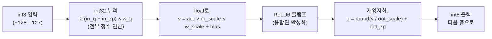

# 4장 — 정밀도와 양자화 (fp32 / fp16 / int8)

*목표: 같은 탐지기가 왜 세 개의 폴더로 배포되는지, 숫자가 비트로 어떻게 저장되는지, 그리고 int8
모델을 4배 작게 만드는 — 정확도 손실은 거의 없이 — 정확한 정수 연산을 이해합니다.*

세 개의 EfficientDet 폴더를 보세요. 같은 아키텍처(3장), 같은 262개 남짓 노드, 그런데 **파일 크기는
매우 다릅니다**:

| 폴더 | 각 숫자를 이렇게 저장… | `model.safetensors` | 상대 크기 |
|---|---|---|---|
| `efficientdet_lite0_fp32` | 32비트 float | **12.67 MB** | 1.0× |
| `efficientdet_lite0_fp16` | 16비트 float | **6.34 MB** | 0.50× |
| `efficientdet_lite0_int8` | 8비트 정수 | **3.39 MB** | 0.27× |

*모델* 은 동일합니다. 바뀐 것은 **숫자 형식** — **정밀도(precision)** — 뿐입니다. 더 작은 숫자 →
더 작은 다운로드, 더 적은 메모리, 그리고 (알맞은 하드웨어라면) 더 빠른 연산. 이 장은 그 절충에 대한
것입니다.

---

## 4.1 컴퓨터는 숫자를 어떻게 저장하는가

`0.10125` 같은 신경망 가중치는 고정된 비트 패턴이 되어야 합니다. 두 가지 계열이 있습니다.

### 부동소수점 (fp32, fp16): "이진법의 과학적 표기법"

float는 비트를 **부호(sign)**, **지수(exponent)**(얼마나 큰가), **가수(mantissa)**(정밀한 자릿수)로
나눕니다. 비트가 많을수록 → 더 높은 정밀도와 더 넓은 범위.

```
fp32  (4바이트)  [S][ 8비트 지수 ][      23비트 가수      ]   ~소수 7자리
fp16  (2바이트)  [S][ 5비트 지수 ][   10비트 가수   ]         ~소수 3자리
```

- **fp32**("단정밀도")는 어디서나 기본값입니다 — 넓은 범위, 약 7자리 정밀도. 학습이 쓰는 형식이자
  VolvoxAI가 활성값(activation)에 쓰는 형식입니다.
- **fp16**("반정밀도")은 저장 공간을 절반으로 줄입니다. 추론에는 충분히 정밀하지만, 범위가 더
  작고(큰/작은 값이 오버플로/언더플로할 수 있음), 결정적으로 — 속도 향상을 얻으려면 GPU가 fp16
  연산을 *지원* 해야 합니다. (브라우저에서 Volvox가 fp16에 신중한 이유는 §4.5 참고.)

### 정수 (int8): "256개의 균등 눈금이 있는 자"

**int8** 은 **−128부터 127까지**의 정수를 저장합니다 — 가능한 값 256개, 1바이트뿐이죠. `0.10125`
를 직접 담기에는 너무 거칩니다. 비결 — **양자화(quantization)** — 은 저렴한 정수 하나에, 그것을 다시
float로 되돌리는 *레시피* 를 함께 저장하는 것입니다.

---

## 4.2 양자화: 스케일 + 제로포인트 레시피

한 층의 실제 가중치는 어떤 범위, 예컨대 `−0.4 … +0.4` 안에 있습니다. 양자화는 int8 자
(`−128 … 127`)를 그 범위에 걸쳐 늘리며, 두 개의 숫자를 씁니다:

- **`scale`(스케일)** — 눈금 하나의 크기(정수 한 칸당 실제 단위).
- **`zero_point`(제로포인트)** — 어떤 정수가 실제 `0.0` 을 나타내는가.

```
실제 값     r  ≈  (q − zero_point) × scale          ← 역양자화 (정수 → float)
정수        q  =  round(r / scale) + zero_point      ← 양자화   (float → 정수)

  실제:  -0.4         -0.2          0.0          0.2          0.4
          │            │            │            │            │
  int8: -128         -64            0           64          127     (scale ≈ 0.4/127)
```

두 공식 모두 *코드베이스에 그대로* 있습니다. 역양자화(`js/ops/dequantizeLinear.js`):

```javascript
out[i] = (in[i] - zero_point) * scale;     // int8 → float
```

양자화(`native/quant_cpu_opt.c`, `quantize_scalar_i8`):

```c
q = clamp_i8( lrintf(x / scale) + zero_point );   // float → int8, [-128,127]로 클램프
```

아이디어의 전부입니다. int8 가중치는 *표* 이고, `scale` 과 `zero_point` 가 그 값어치를 알려줍니다.
표를 저장하는 데는 1바이트가 들고, 레시피는 채널 전체가 공유하므로 거의 공짜입니다.

> **채널별 스케일(per-channel scales).** 층 전체에 스케일 하나만 쓰면 거칠어집니다 — 큰 가중치 하나가
> 자를 늘려 나머지 모두의 정밀도를 뭉개버리지요. 그래서 각 출력 **채널** 이 자기만의 `weight_scale`
> 을 가집니다(§`weight_scale: "w1"` 이 `QConv2D` 의 *텐서* 입력이었던 것 기억나죠). 이 "채널별
> 양자화"가 int8 정확도를 fp32의 약 1% 이내로 유지하는 비결입니다.

---

## 4.3 실제 계산 예시 (모델의 진짜 숫자)

int8 EfficientDet의 첫 노드는 `QuantizeLinear` 로, `input_scale = 0.0078125`(정확히 `1/128`)입니다
— 들어오는 픽셀을 int8로 바꾸지요. 그다음 첫 `QConv2D` 는 `output_scale = 0.0235294`,
`output_zero_point = -128` 입니다. 가중치 하나와 출력 하나를 양자화해 봅시다.

```
가중치 양자화  r = 0.101,  scale = 0.008,  zero_point = 0:
   q = round(0.101 / 0.008) + 0 = round(12.625) = 13        → 바이트 13으로 저장

나중에 복원:
   r ≈ (13 - 0) × 0.008 = 0.104                              → 0.104 vs 0.101, 오차 0.003
```

이 0.003 오차가 **양자화 잡음(quantization noise)** 입니다. 큰 내적에 걸쳐 퍼지면 이 작은 반올림
오차들이 대부분 상쇄됩니다 — 8비트 모델이 여전히 개를 제대로 탐지하는 이유지요.

---

## 4.4 int8 합성곱은 실제로 어떻게 도는가 (`QConv2D`)

여기가 보상을 받는 지점입니다. 양자화된 conv는 무거운 곱-누적(multiply-accumulate) 루프를
**저렴한 정수 연산** 으로 하고, 맨 마지막에 딱 한 번만 실제 숫자로 되돌립니다. 출력 값 하나의
파이프라인(`native/quant_cpu_opt.c`):



1. **정수 누적.** int8×int8을 곱해 **int32** 누산기에 합합니다. 정수 곱-덧셈은 모든 CPU에서 빠르고
   저렴하며(AVX2/NEON으로 8–32 레인 폭으로 벡터화됨).
2. **재양자화(requantize).** int32 합을 한 단계로 그 층의 int8 스케일로 되돌립니다. 실제 코드는 모든
   스케일을 하나의 곱으로 합성합니다:

   ```c
   // acc (int32) → float → relu6 → int8, 출력 원소 하나에 대해:
   float v = acc * (input_scale * weight_scale) + bias;   // 결합된 재스케일
   int8   q = requantize_i8(v, output_scale, output_zp, relu);
   //        = clamp_i8( round( relu6(v) / output_scale ) + output_zp );
   ```

핵심 통찰: **활성값이 층에서 층으로 int8로 유지됩니다**("양자화 섬, quantized island"). 그래서 백본
전체가 바이트 단위로 돕니다. 맨 마지막에서야 `DequantizeLinear` 가 최종 `scores`/`boxes` 를 읽을 수
있는 float로 바꿉니다. 이것이 정확히 VolvoxAI의 네이티브 CPU 경로가 하는 일입니다
(`native/quant_cpu_opt.c`). 브라우저 계층은 대신 int8 conv 가중치를 로드 시점에 fp32로 접습니다(더
단순하지만 디스크에서는 여전히 작음).

---

## 4.5 각 형식이 존재하는 이유 — 절충

```
        더 작음 / 더 빠름  ◀───────────────────────────────▶  더 정확함 / 더 단순함
             int8                      fp16                      fp32
        가중치당 1바이트           가중치당 2바이트          가중치당 4바이트
        정수 연산                 fp16 HW 필요             어디서나 동작
        ~4× 작음                  ~2× 작음                 기준 정확도
        미세한 정확도 하락         ~무손실                  무손실
```

| 질문 | fp32 | fp16 | int8 |
|---|---|---|---|
| 디스크 / 메모리 | 가장 큼 | 절반 | 4분의 1 |
| fp32 대비 정확도 | 기준 | ~동일 | 보통 ~1% 이내 |
| 특수 하드웨어 필요? | 아니오 | **예** (fp16 유닛) | 아니오 (정수는 보편적) |
| 언제 최선인가… | 최대 정확도, 또는 나중에 양자화할 때 | GPU에 fp16이 있고 손쉬운 2×를 원할 때 | 엣지/모바일/브라우저, 크기·속도가 중요할 때 |

**VolvoxAI가 fp32 + int8에 기대고 fp16에 신중한 이유 (README에서):**

- **fp16** 은 WebGPU `shader-f16` 확장이 필요한데, 이것이 소비자 기기 전반에 보편적이지 않습니다 —
  그래서 브라우저 엔진이 이에 의존할 수 없습니다. (여기 fp16 폴더는 주로 그것을 지원하는
  플랫폼/형식을 위한 것입니다.)
- **int8** 은 정확도 손실이 거의 없이 크기를 4배 줄이고, 정수 연산은 *어떤* CPU/GPU에서도 빠르게
  돕니다 — 이식성 있는 추론의 스위트 스폿이지요. Volvox는 **int4** 를 건너뜁니다. 4비트는 성가신
  비트 언패킹이 필요해 저사양 모바일 GPU에 부담이 되기 때문입니다.

---

## 4.6 세 개의 config, 나란히 놓고 보기

정밀도는 *저장* 선택이므로 그래프는 거의 동일합니다 — conv 연산과 약간의 양자화 장부만 다릅니다:

```
fp32 / fp16 그래프:           int8 그래프:
  input (float)                 input (uint8)
     │                             │  QuantizeLinear   ← float/uint8 → int8 (한 번)
  Conv2D ─┐                     QConv2D ─┐             ← 정수 conv, int8 입출력
  Conv2D  │ float conv 182개    QConv2D  │ int8 conv 182개 (내내 int8 유지)
   …      │                      …       │
  Add / MaxPool / Resize        Add / MaxPool / Resize (int8 인식)
     │                             │  DequantizeLinear ← int8 → float (끝에서 두 번)
  scores, boxes (float)         scores, boxes (float)
```

그래서 int8 config에는 **노드 3개가 더** 있고(`QuantizeLinear` 1 + `DequantizeLinear` 2), 182개
conv가 `Conv2D` 대신 `QConv2D` 입니다. 같은 탐지기, 세 가지 크기 — 당신의 기기가 필요로 하는
곡선 위의 지점을 고르는 것이지요.

---

## 4.7 방금 배운 것

- **정밀도** 는 각 숫자가 몇 비트를 받는가입니다: fp32(4 B), fp16(2 B), int8(1 B).
- **양자화** 는 `scale` + `zero_point` 로 float를 256개 값의 int8 자에 매핑합니다. 공식
  `(q−zp)×scale` 와 `round(r/scale)+zp` 가 비결의 전부이며, 저장소에 실제로 있습니다.
- **int8 conv** 는 저렴한 int32로 누적하고 한 번 재양자화합니다 — 활성값이 층마다 int8로 유지되어,
  약 1% 정확도 비용으로 ~4× 작고 빠릅니다.
- 형식은 배포마다 **당신이 선택** 합니다: 충실도를 위한 fp32, 엣지를 위한 int8, 하드웨어가 지원할 때의
  fp16.

다음: VolvoxAI가 이 그래프들을 *빠르게* 실행하는 방법 — 네 개의 하드웨어 계층, 소박한 커널에서
최적화된 커널로의 도약, 그리고 연산 융합.

**다음:** [5장 — 엔진 내부 →](05-inside-the-engine.md)
