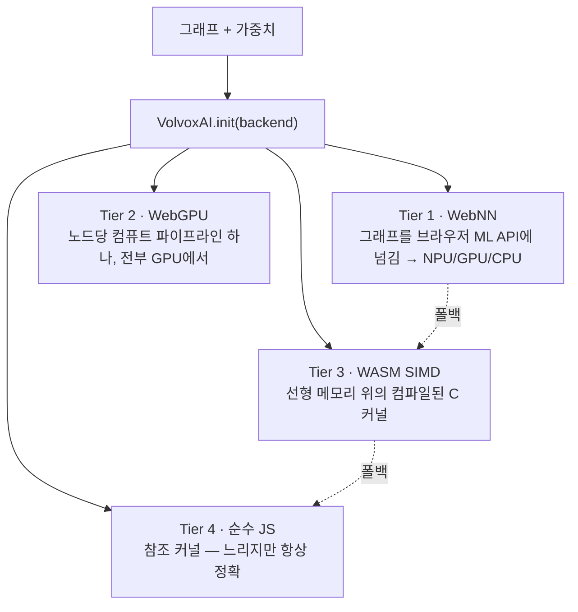

# 5장 — 엔진 내부

*목표: VolvoxAI가 "연산 목록"을 실제 하드웨어에서 **빠르게** 도는 무언가로 바꾸는 방법을 이해합니다
— 네 개의 계층, 소박한 커널에서 최적화된 커널로의 도약, 그리고 연산 융합.*

이제 모델이 *무엇을* 계산하는지 알게 되었습니다. 이 장은 *그것을 빠르게 만드는* 것에 대한
것입니다 — 교과서적 구현과 출시 가능한 구현을 가르는 엔지니어링이지요. 실제 AI 시스템 작업의 많은
부분이 여기에 있습니다.

---

## 5.1 하나의 그래프, 네 개의 엔진 (계층)

1장을 떠올려 보세요: VolvoxAI는 같은 그래프를 브라우저에서 네 가지 방법으로(그리고 네이티브
바이너리로) 실행할 수 있습니다. 이들은 오직 **누가 산술을 하는가** 와 **텐서가 어디에 사는가** 만
다릅니다.



- **Tier 4 — 순수 JS** (`js/ops/*.js`): 이 책 내내 읽은 소박한 커널들. 느리지만 단순하고 의존성이
  없습니다. **기준(ground truth)** 입니다: 더 빠른 모든 계층이 이것과 대조됩니다.
- **Tier 3 — WASM** (`js/WasmEngine.js` + `native/kernels/*.c`): *같은* 연산을 SIMD와 함께
  WebAssembly로 컴파일한 것. 범프 할당기(bump allocator)가 모든 텐서를 하나의 평평한 선형 메모리
  블록에 넣고, `execute()` 가 노드마다 컴파일된 C 커널을 호출합니다. 흔히 순수 JS보다 5–50× 빠릅니다.
- **Tier 2 — WebGPU** (`js/GraphExecutor.js` + `shaders/*.wgsl`): 각 연산이 GPU **컴퓨트
  셰이더** 가 됩니다. 컴파일 시점에 모든 가중치를 VRAM에 올리고 *노드당 파이프라인 하나* 를
  만듭니다. `execute()` 는 이들을 하나의 명령 스트림으로 재생하며, **노드 사이에 CPU 왕복이 없어서**
  모델 전체가 GPU에 상주합니다. 필요한 셰이더가 없으면 현재 executor는 경고를 내고 그 노드를
  건너뜁니다. 지원되지 않는 연산이 필요한 모델은 WASM/CPU를 써야 합니다.
- **Tier 1 — WebNN** (`js/WebNNEngine.js`): 그래프를 브라우저 자체의 신경망 API에 넘기며, 이것은
  전용 **NPU** 로 디스패치될 수 있습니다. 지원하지 않는 연산이 있으면 하위 계층으로 넘어갑니다.

설계 원칙: **실행 가능한 백엔드를 먼저 고르기.** WebNN은 그래프 컴파일에 실패하면 하위 계층으로
넘어갈 수 있고, WASM은 순수 JS helper로 보완될 수 있습니다. WebGPU는 필요한 연산이 셰이더로
덮여 있는 그래프에 써야 합니다.

---

## 5.2 소박한 커널이 느린 이유

3장의 소박한 `Conv2D` 를 다시 보세요: 일곱 겹 중첩 루프, 한 번에 곱셈 하나. *정확* 하지만, 현대
CPU는 두 가지 이유로 이것을 싫어합니다:

1. **SIMD 유닛을 낭비합니다.** CPU 코어는 *하나의* 명령으로 float 8개(AVX2) 이상을 곱할 수 있습니다.
   소박한 루프는 그것을 하나… 씩… 차례로 하며, 실리콘의 일부만 씁니다.
2. **캐시를 망가뜨립니다(thrash).** RAM은 CPU보다 ~100× 느립니다. 코어는 최근 쓴 데이터를 작고 빠른
   **캐시(cache)** 에 둡니다. 소박한 conv는 메모리 곳곳을 뛰어다녀서(스트라이드된 이미지 읽기),
   계산 대신 끊임없이 RAM을 기다립니다.

결과: 소박한 커널은 칩 실제 처리량의 **2–5%** 만 쓸 수 있습니다. 최적화란 SIMD 유닛에 먹이를 주고
캐시를 존중하는 것입니다.

---

## 5.3 소박함에서 빠름으로: 같은 수학, 재배치

최적화된 커널은 *무엇을* 계산하는지는 절대 바꾸지 않습니다(출력은 Tier 4와 동일) — 작업의 *순서와
배치* 를 바꿉니다. VolvoxAI의 핫 경로는 `native/conv_f32_opt.c`(fp32)와
`native/quant_cpu_opt.c`(int8)에 있습니다. 주요 기법:

| 기법 | 아이디어 | 이득 |
|---|---|---|
| **im2col + GEMM** | conv 패치를 큰 행렬로 펼친 뒤 빠른 행렬 곱을 호출 | 수십 년간 튜닝된 matmul 재사용; SIMD에 먹이 공급 |
| **포인트와이즈 GEMM** | 1×1 conv는 *곧* 행렬 곱 — 바로 그렇게 취급 | 단일 최대 이득 (대부분의 conv가 1×1) |
| **가중치 사전 패킹(prepacking)** | 로드 시점에 가중치를 내부 루프가 읽는 정확한 순서로 재배치 | 캐시 미스 읽기를 순차 읽기로 전환 |
| **블로킹 / 타일링** | 캐시에 들어가는 작은 타일을 다 쓰고 넘어감 | 데이터가 뜨거울 때 재사용 |
| **SIMD (AVX2/NEON)** | 명령당 8–32개 곱-덧셈 | 사이클당 ~8–32× 산술 |
| **멀티스레딩** | 출력 행을 CPU 코어들에 분배 | 그 위에 ~코어 수× |

```
소박한 conv                      최적화된 conv (im2col + GEMM)
 각 출력 픽셀마다:                [1] 입력 패치를 펼침 → 큰 행렬 하나  (한 번)
   각 필터 탭마다:                [2] 크고, 캐시 친화적, SIMD, 스레드된
     스칼라 곱 하나                   사전 패킹된 가중치와의 행렬 곱
 (흩어진 메모리, 1 레인)         (순차 메모리, 여러 레인, 여러 코어)
```

> **이 저장소의 실제 결과.** 이 프로젝트의 메모 기록에 따르면, *아레나 버퍼 재사용 플래너*(노드마다
> 새로 할당하는 대신 스크래치 메모리를 재사용)를 추가하니 최대 메모리가 **88.8 MB → 18.8 MB** 로
> 줄었고, 포인트와이즈 GEMM 경로와 결합해 EfficientDet 순전파를 의미 있게 빠르게 만들어 — Google
> TFLite/XNNPACK과의 격차를 (warm) ~1.16× 까지 좁혔습니다. 나오는 숫자는 같고, 메모리와 시간은
> 극적으로 줄었죠. *그것이* 곧 커널 엔지니어링입니다.

교훈은 간단합니다: **정확성은 소박한 커널에 살고, 성능은 메모리 배치에 산다.**
`js/ops/conv2D.js` 를 읽은 뒤 `native/conv_f32_opt.c` 와 비교해 보면 이 기술의 두 반쪽을 보게 됩니다.

---

## 5.4 연산 융합: 메모리를 그만 건드리기

연산과 연산 사이에서 결과는 메모리에 쓰이고 다음 연산이 다시 읽습니다. 큰 피처 맵에서는 데이터를
*옮기는* 것이 계산보다 더 비쌀 수 있습니다. **연산 융합(operator fusion)** 은 인접 연산을 병합해
데이터를 한 번만 건드리게 합니다. VolvoxAI는 컴파일 시점 융합 패스를 실행합니다
(`native/graph_opt_fusion.c`):

```
융합 전:  Conv2D ─▶ [피처 맵 쓰기] ─▶ ReLU6 ─▶ [다시 쓰기]
융합 후:  Conv2D+ReLU6 ─▶ [한 번 쓰기, 이미 활성화됨]
```

적용하는 융합 패턴(`docs/operator_fusion_patterns.md` 참고):

- **Conv + ReLU6** → conv의 재양자화 단계 안에서 바로 클램프(3–4장에서 `relu` 가 커널에 접혀 들어간
  것을 봤죠).
- **연쇄 `Add`** → 여러 잔차를 한 패스에 합산.
- **뎁스와이즈 → 포인트와이즈** → 중간 텐서를 흘리지 않고 MBConv 쌍을 연달아 실행.
- **Concat + Sigmoid**, **별칭 제거(alias elision)**(일부 `Reshape` 같은 무의미한 복사 제거).

각 융합 쌍은 큰 텐서의 전체 읽기+쓰기를 하나씩 줄입니다. 262개 노드에 걸치면 쌓이지요.

---

## 5.5 메모리: 텐서는 일시적이다

미묘하지만 중요한 점: 순전파의 대부분 텐서는 **스크래치(scratch)** 입니다 — 잠깐 필요하고 다시는 안
쓰이지요(예: 어텐션 MatMul이 소비한 뒤 `ln1_0` 은 죽습니다). 소박한 엔진은 노드마다 새 버퍼를
할당합니다(단순하지만 낭비). 똑똑한 엔진은 어느 버퍼들이 메모리를 공유할 수 있는지 **계획** 합니다,
그 수명이 겹치지 않기 때문이죠 — 앞서 언급한 **아레나 버퍼 재사용 플래너** 입니다. 이것이 VolvoxAI가
텐서 총합이 수백 MB인 모델을 그 최대치의 일부 RAM으로 돌릴 수 있는 이유입니다: 같은 물리 바이트를
노드마다 재활용하지요.

```
노드 수명 (─ = 살아있음):        버퍼 재사용:
  A: ───                          A와 C는 절대 겹치지 않음 → 같은 버퍼를 줌
  B:   ─────                      B와 D는 절대 겹치지 않음 → 버퍼 공유
  C:      ────
  D:          ───                 텐서 4개, 물리 버퍼 2개
```

---

## 5.6 엔진 전체를 한 문장으로

> **VolvoxAI는 그래프의 노드 목록을 훑으며 각 노드를 사용 가능한 가장 빠른 백엔드의 커널로 디스패치하고,
> 그렇게 하면서 메모리 버퍼를 재사용하고 인접 연산을 융합합니다 — 소박한 참조와 정확히 같은 숫자를,
> 훨씬 빠르고 작게 만들어 냅니다.**

그것이 시스템 전부입니다. 나머지는 이 골격 위에 연산 하나 더, 백엔드 하나 더, 또는 최적화 하나 더일
뿐입니다.

> **이 장은 네 개의 *브라우저* 계층을 다뤘습니다.** VolvoxAI는 *같은 설계도* 를 실행하는 완전한
> **네이티브** 엔진(CPU + Vulkan / OpenGL / Metal / Android NNAPI를 아우르는 독립형 C 바이너리)도
> 제공합니다. 그것이 다음 장 전체의 내용입니다.

**다음:** [6장 — 네이티브 엔진 →](06-native-engine-architecture.md)
