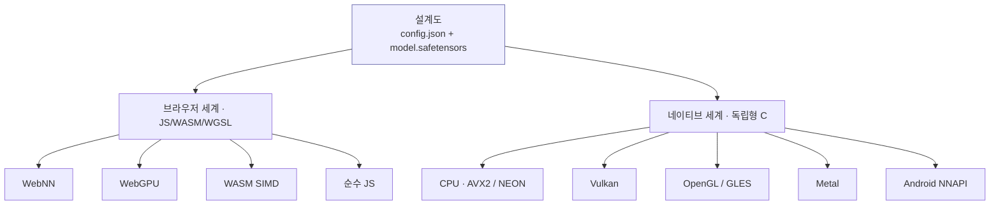
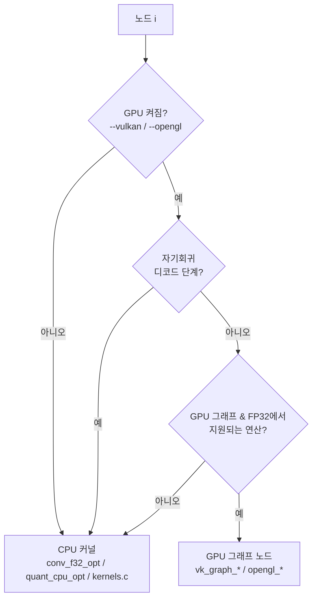

# 6장 — 네이티브 엔진 (CPU + 다중 백엔드 GPU)

*목표: VolvoxAI의 **네이티브** 쪽 — 브라우저와 **같은 설계도** 를 데스크톱과 폰에서, CPU와 여러
GPU/NPU 백엔드에 걸쳐 실행하는 독립형(freestanding) C 프로그램 — 과 이를 가능하게 하는 설계
아이디어를 이해합니다.*

1–5장은 주로 JavaScript 계층을 읽었습니다. 가장 명료한 교재이기 때문이죠. 하지만 그것은 VolvoxAI의
절반일 뿐입니다. 나머지 절반은 `native/`: *동일한* `config.json` + `.safetensors` 를 받아, 브라우저도
Node도 없이 — 그리고 이것이 놀라운 부분인데 — **정적으로 링크된 GPU SDK 없이** 실행하는
**베어메탈(bare-metal) C 엔진** 입니다. 이 장은 그 아키텍처와 "왜"에 대한 것입니다.

---

## 6.1 핵심 아이디어: 하나의 설계도, 두 개의 세계

프로젝트 전체가 하나의 원칙을 중심으로 구성됩니다:

> **모델을 설계도로 한 번 작성하고, 어디서든 실행한다.**



브라우저 세계는 5장이었습니다. 네이티브 세계는 터미널에서 실행하는 독립 실행 파일
(`native/volvoxai`)입니다:

```bash
./native/volvoxai generate models/tinystories_1m --prompt "Once upon a time, Lily" --max-new 50
./native/volvoxai detect   models/efficientdet_lite0_int8 --image input0=photo.png \
                           --image-normalize raw-255 --boxes boxes --scores scores
```

브라우저가 로드하는 것과 같은 파일들입니다. 이 대칭성이 곧 설계입니다.

---

## 6.2 독립형 철학 (왜 특이한가)

두 개의 의도적 제약이 네이티브 엔진을 규정합니다:

1. **Emscripten 없음 / 무거운 런타임 없음.** WASM 모듈은 순수
   `clang --target=wasm32 -msimd128` 로 빌드됩니다 — `--no-entry`, libc 런타임 없는 *독립형*
   빌드지요. 네이티브 바이너리는 평범한 `clang -O3 -mavx2 -mfma -pthread` 입니다. 아래에 프레임워크가
   없습니다. 엔진이 *곧* `native/` 의 코드입니다.
2. **정적 GPU 의존성 없음.** 바이너리는 빌드 시점에 `libvulkan` 이나 OpenGL SDK를 링크하지
   **않습니다**. 대신 GPU 드라이버를 *실행 시점에* **`dlopen`** 하고 진입점을 이름으로 찾습니다.
   드라이버가 있으면 GPU 가속을 얻고, 없으면 정확히 같은 바이너리가 CPU에서 돕니다. 하나의 산출물이,
   GPU 스택이 크게 다른 기계들에 걸쳐 이식됩니다.

다음이 그 실행 시점 로딩입니다, 원문 그대로(`native/vulkan_engine.c`, `native/opengl_engine.c`):

```c
// Vulkan: 플랫폼의 로더 이름을 순서대로, 실행 시점에 시도.
const char* names[] = { "libvulkan.so.1", "libvulkan.so", "vulkan-1.dll" };
for (i = 0; i < 3; i++) vulkan_lib = dlopen(names[i], RTLD_NOW | RTLD_LOCAL);
vkGetInstanceProcAddr = (PFN_vkGetInstanceProcAddr)dlsym(vulkan_lib, "vkGetInstanceProcAddr");

// OpenGL/GLES: 마찬가지로 libEGL + libGLESv2/libGL(윈도우에서는 *.dll)을 dlopen.
```

이것이 "GPU SDK 링크 없이 Vulkan/OpenGL/Metal/NNAPI에서 실행"의 비결 전부입니다. 빌드 명령의
`-ldl` 이 유일한 대가입니다.

---

## 6.3 하나의 커널 소스, 두 개의 기계 (공유 ABI)

VolvoxAI는 모든 커널을 두 벌로 유지하는 것을 피합니다. `native/kernels/*.c`(`native/kernels.c` 로
묶임)의 이식성 있는 C가 WebAssembly(브라우저의 Tier 3)로 **그리고** 네이티브 바이너리로 **둘 다**
컴파일됩니다. 비결은 **`uintptr_t` 힙-포인터 ABI** 입니다: 커널이 하나의 평평한 힙에 대한 정수
오프셋으로 메모리를 주소 지정하므로, 그 힙이 WASM 선형 메모리든 네이티브 `malloc` 아레나든 같은
소스가 동작합니다. 그러면 컴파일러가 **x86에서는 AVX2**, **arm64에서는 NEON** 으로 자동
벡터화합니다.

```
                       ┌─────────────────────────────┐
   native/kernels/*.c  │  이식성 C, uintptr_t 힙       │
                       └───────────┬─────────────────┘
             clang --target=wasm32 │ clang -O3 -mavx2 (x86) / -march=…(arm64)
                    ┌──────────────┴───────────────┐
              volvoxai.wasm                   native/volvoxai
             (브라우저 Tier 3)              (데스크톱/안드로이드 CPU)
```

순수 JS 연산(`js/ops/*.js`)은 이들을 검증하는 기준으로 남습니다 — 그래서 각 연산에는 실제로 **세**
가지 표현(JS 참조, 이식성 C, 그리고 핫 연산의 경우 *최적화된* C 커널)이 있고, 모두 일치해야 합니다.

---

## 6.4 엔진 수명 주기 (`native/engine.c`)

네이티브 엔진은 작고 명시적인 상태 기계입니다. 그 공개 API(`native/engine.h`)는 JS의
`compile()` / `execute()` 에 대응하는 C 버전입니다:

```c
int    engine_init(const char* config_path, const char* weights_path);  // 로드 + 빌드 한 번
float* engine_input_ptr(const char* name, long* numel);                 // 입력 텐서에 값 넣기
int    engine_forward(void);                                            // 그래프 전체 실행
const float* engine_last_logits(int* count);                            // 출력 행 읽기
void   engine_free_ctx(void);                                           // 정리
// 자기회귀 보조:
int    engine_prefill(int n_tokens);   // 프롬프트 처리, K/V 캐시 채우기
int    engine_decode(int pos);         // 캐시로 새 토큰 하나 처리
```

`engine_init` 이 일회성 무거운 작업을 합니다(`native/engine.c`):

```c
int engine_init(const char* config_path, const char* weights_path) {
    load_weights(weights_path);        // .safetensors 블롭을 mmap/파싱
    build_graph(config_path);          // config.json 파싱 → g_t[] 텐서, g_n[] 노드
    prepack_qconv_weights();           // 빠른 커널용으로 int8 conv 가중치 재배치 (§5.3)
    prepack_conv_weights();            // fp32 conv 가중치 재배치 (im2col/GEMM 순서)
    g_loaded = 1;
}
```

그다음 `engine_forward` 는 익숙한 루프입니다 — 노드 목록을 훑으며 각각을 디스패치:

```c
for (int i = 0; i < g_nn; i++)
    run_node(&g_n[i], i, /*is_last=*/ i == g_nn - 1);
```

그래프는 **한 번** 빌드되고, 순전파는 저렴하고 반복 가능합니다. 이것이 `generate` 가 가중치를 다시
로드하지 않고 수백 번의 순전파를 돌리게 해줍니다.

---

## 6.5 노드별 백엔드 선택 (`native/engine_runtime.c`)

`run_node` 가 "다중 백엔드"가 실제로 일어나는 곳입니다. 각 노드마다 *누가 그것을 계산할지* 를
결정하며, 결정은 모델 단위가 아니라 노드 단위입니다:



디스패처에 새겨진 핵심 규칙:

- **GPU는 옵트인** 입니다, CLI 플래그(`--vulkan`, `--opengl`, `--nnapi`)로. 기본은 CPU입니다.
  드라이버를 로드할 수 없으면 예컨대 `Backend: CPU (Vulkan unavailable)` 을 출력하고 계속합니다.
- **GPU 백엔드는 FP32 전용** 입니다. `QConv2D`(int8) 노드는 `--vulkan` 이 있어도 항상 CPU의 양자화
  섬(`quant_cpu_opt.c`)에 머뭅니다 — 그래서 int8 탐지기는 conv를 CPU에서 돌리고 FP32 연산만
  오프로드합니다.
- **생성은 대부분 CPU에 머뭅니다.** `engine_decode`/`engine_prefill` 동안에는 Vulkan/OpenGL 그래프
  경로를 건너뜁니다. 토큰별 디코드는 지연(latency)에 민감하기 때문입니다. 다만 작업량이 충분히 큰
  MatMul/Gemm/Linear 노드는 일회성 Vulkan/OpenGL 오프로드를 쓸 수 있고, 작은 디코드 MatMul은
  디스패치 오버헤드를 피하려고 CPU에 남습니다.
- 모든 노드는 어떤 백엔드가 실행했는지 기록합니다(`"vulkan-graph"`, `"cpu-qconv"`, …), `--debug`
  프로파일 보고를 위해.

---

## 6.6 GPU 경로는 지연 실행되는 명령 그래프다

네이티브 GPU 백엔드는 매번 CPU 왕복을 하며 연산별로 실행하지 않습니다. WebGPU 계층처럼, **명령
그래프를 만들어 재생** 하며 데이터를 기기에 상주시킵니다. `vk_graph_*` 인터페이스
(`native/vulkan_engine.h`)가 그 형태를 보여줍니다:

```c
vk_graph_begin_forward();                        // 기록 시작
vk_graph_conv2d_f32(in, out, w, b, …);           // conv 기록
vk_graph_add_relu_f32(a, b, out, n, relu);       // 융합된 add+relu 기록
vk_graph_maxpool2d_f32(…); vk_graph_resize_nearest_f32(…);
vk_graph_layernorm_f32(…); vk_graph_gelu_f32(…); vk_graph_softmax_f32(…);
vk_graph_end_forward();                          // 제출 + 한 번 대기
```

이것을 올바르게 만드는 두 가지 보조 아이디어:

- **호스트/기기 동기화 추적.** `vk_graph_mark_host()` / `vk_graph_sync_host()` 가 CPU가 건드린
  버퍼를 추적해, 데이터가 매 노드가 아니라 실제로 필요할 때만 업로드/다운로드되게 합니다. 가중치는
  한 번 업로드되고, 활성값은 노드 사이에 GPU에 머뭅니다.
- **융합이 이어집니다.** 디스패처는 융합된 노드(`add+relu`, `concat+sigmoid`)를 단일 GPU 연산으로
  기록하므로, 그래프 수준 융합 패스(§6.8)가 GPU에서도 이득을 냅니다.

OpenGL/GLES 백엔드는 이 API(`opengl_graph_*`)를 그대로 반영합니다. 안드로이드 **NNAPI**
(`nnapi_engine.c`)는 큰 dense 계층을 위한 별도 선택 분기를 가집니다. Metal(`metal_engine.m`)은
attention, Conv1D, Mul/Sub/Div, Split, DequantizeLinear, NMS, custom profile ops 같은 선택된
F32 연산에 대해 Apple 전용 그래프 디스패치를 제공합니다. 정확한 네이티브 GPU 연산 지원표는
[`docs/operation_list.md`](../../operation_list.md)에 있습니다.

---

## 6.7 셰이더 파이프라인 (WGSL이 유일한 소스)

네이티브 GPU 백엔드가 손으로 쓴 Vulkan/Metal/GLSL 셰이더를 필요로 할 것이라 예상할 수 있습니다.
그렇지 않습니다 — VolvoxAI는 **WGSL을 유일한 셰이더 언어** 로 유지하고 그것을 *교차 컴파일* 합니다.
`make compile_shaders` 가 `tools/compile_shaders.sh` 를 실행하는데, 이는 Mozilla의 **`naga`** 를 써서
모든 `shaders/*.wgsl` 을 각 네이티브 백엔드가 원하는 형식으로 번역합니다:

```
shaders/*.wgsl ──naga──▶ native/shaders/spv/   (SPIR-V  → Vulkan)
                        native/shaders/glsl/  (GLSL    → 데스크톱 OpenGL)
                        native/shaders/gles/  (GLSL ES → 안드로이드/임베디드)
                        native/shaders/metal/ (MSL     → 애플 Metal)
```

커널의 셰이더를 WGSL로 한 번 쓰고, 그것을 네이티브 셰이더 형식으로 번역합니다. 하지만 런타임
지원에는 백엔드 래퍼와 디스패처 호출이 따로 필요합니다. 현재 Vulkan/OpenGL은 선택된 생성 셰이더를
연결하고, Metal은 더 작은 Apple 전용 부분집합을 `metal_graph_*` 로 연결합니다. C 커널(§6.3)과 같은
"하나의 소스, 여러 타깃" 원칙을 셰이더에 적용하되, 생성과 연결 상태를 별도로 추적하는 구조입니다.

---

## 6.8 컴파일 시점 연산 융합 (`native/graph_opt_fusion.c`)

첫 순전파 전에, 네이티브 엔진은 파싱된 그래프에 융합 패스를 실행합니다(5장의 설계를, 여기서는 C
수준으로). 노드 목록을 제자리에서 다시 씁니다 — `fuse_relu6` 를 표시하고, 제거된 노드에 `skip` 을
표시하고, `concat_sigmoid_fuse` 로 태그를 답니다:

- **Conv + ReLU6** → conv의 쓰기 안에서 클램프(`fuse_relu6`).
- **연쇄 `Add`** → 순차 잔차 덧셈을 하나로 접기.
- **뎁스와이즈 → 포인트와이즈** → 중간 텐서를 흘리지 않고 MBConv 쌍을 실행.
- **Concat + Sigmoid** → 탐지기의 클래스-헤드 꼬리를 융합.
- **별칭 제거(alias elision)** → 무의미한 `Reshape`/복사 노드를 제거(`skip`).

노드가 줄고, 큰 피처 맵을 훑는 전체 패스가 줄어듭니다 — SIMD 다음으로 가장 큰 지렛대입니다.

---

## 6.9 태스크 런타임: 텐서에서 쓸모로

`native/main.c` 는 텐서 엔진을 실제 작업으로 감싸는 CLI입니다. 디스패처는 `argv[1]` 에 대한 단순한
`switch` 입니다:

| 명령 | 하는 일 | 추가 장치 |
|---|---|---|
| `run` | 원시 그래프 러너: 입력 텐서/이미지를 넣고 출력 텐서를 덤프 | `image_io.c` (stb_image PNG/JPEG → NHWC) |
| `generate` | 자기회귀 텍스트 (TinyStories) | `tokenizer.c` (BPE) + prefill/decode + KV-캐시 |
| `classify` | Top-K 이미지 분류 | argmax + `labels.txt` |
| `detect` | 객체 탐지 → 순위 박스 | 앵커 채점 + 라벨 |
| `ctc` | CTC 시퀀스 디코딩 (예: OCR) | CTC 병합 |
| `seq2seq` / `chat` | 인코더–디코더 / 챗 루프 | 크로스 어텐션 런타임 |

언급할 가치가 있는 두 보조 런타임: **`tokenizer.c`**(`js/Tokenizer.js` 와 같은 `vocab.bin` +
`merges.txt` 를 읽는, 처음부터 만든 바이트 수준 BPE 토크나이저)와 **`kie_runtime.c`**(영수증 핵심
정보 추출 작업). 모든 것이 하나의 `engine_forward` 코어 위에 놓입니다.

---

## 6.10 KV-캐시 오케스트레이션 (네이티브 생성)

2장에서 KV-캐시를 개념적으로 소개했습니다. 네이티브 엔진이 그것이 구현된 곳입니다. 각 어텐션 노드는
Key와 Value 캐시(`native/engine_internal.h` 의 `g_kcache[i]`, `g_vcache[i]`)를 가집니다. 생성은 두
단계로 나뉩니다:

```
engine_prefill(n_tokens):   프롬프트 전체에 대해 그래프를 한 번 실행, 모든 K/V 캐시를 채움
반복:
  engine_last_logits() ─▶ argmax ─▶ 다음 토큰
  engine_decode(pos):       새 위치 하나에 대해 그래프 실행, 캐시된 K/V를 읽고,
                            이 토큰의 K/V를 추가   (O(seq) 작업, O(seq²) 아님)
```

이것이 정확히 실전 LLM 서버가 쓰는 prefill/decode 분할입니다 — 여기서는 몇백 줄의 C로 구현되어,
유난히 읽기 쉽습니다.

---

## 6.11 네이티브 엔진 빌드하기

하나의 `clang` 줄이 전체를 빌드합니다(`Makefile` 에서):

```bash
clang -O3 -mavx2 -mfma -pthread -Inative \
  native/cJSON.c native/safetensors.c native/kernels.c \
  native/quant_cpu_opt.c native/conv_f32_opt.c native/tensor_f32_opt.c \
  native/engine_runtime.c native/engine.c native/image_io.c native/kie_runtime.c \
  native/vulkan_engine.c native/opengl_engine.c native/tokenizer.c native/nnapi_engine.c \
  native/main.c -o native/volvoxai -lm -ldl
```

- `make build_native` — 데스크톱 빌드(CPU + 실행 시점 `dlopen` 을 통한 Vulkan/OpenGL).
- `make build_android` — `-DUSE_NNAPI` 를 추가하고 안드로이드 arm64용 `nnapi_engine.c` 를 링크.
- `make compile_shaders` — WGSL에서 SPIR-V/GLSL/GLES/Metal을 재생성.

`-lvulkan` / `-lGL` 이 **없다** 는 점에 주목하세요: GPU 관련 플래그는 `-ldl` 하나뿐입니다. 그 하나의
부재가 "정적 GPU 의존성 없음" 약속 전체를, 구체적으로 실현한 것입니다.

---

## 6.12 설계, 그림 하나로

```
                     ┌───────────────────────── native/volvoxai ─────────────────────────┐
  config.json ──▶  build_graph ──▶ 융합 패스 ──▶ 가중치 사전 패킹 ──▶ engine_forward 루프  │
  .safetensors ─▶  load_weights                                          │                  │
                                                              노드마다: run_node()          │
                                                              ├─ CPU: conv_f32_opt /         │
                                                              │       quant_cpu_opt /        │
                                                              │       kernels.c (AVX2/NEON)  │
                                                              └─ GPU/NPU (dlopen됨):          │
                                                                 vulkan / opengl / nnapi     │
                                                                 Apple 플랫폼의 metal        │
                     └────────────────────────────────────────────────────────────────────┘
                          태스크 래퍼: run · generate · classify · detect · ctc · seq2seq · chat
```

**핵심 요점:**

- VolvoxAI는 **설계상 이중 타깃(dual-target)** 입니다: 하나의 설계도가 브라우저 계층과 독립형
  네이티브 바이너리 둘 다에 공급됩니다.
- 네이티브 엔진은 **범용화하지 않으면서 이식성 있습니다**: Emscripten 없음, 정적 GPU SDK 없음 — GPU
  드라이버는 실행 시점에 `dlopen` 되므로, 하나의 바이너리가 매우 다른 기계들을 아우릅니다.
- **재사용이 세 축에 걸쳐 강제됩니다**: 하나의 C 커널 소스(WASM + 네이티브), 하나의 셰이더 언어
  (WGSL → 생성된 네이티브 셰이더 형식, 백엔드별 연결), 하나의 설계도(모든 백엔드) — 순수 JS 참조를
  정확성의 기준(oracle)으로 두고서.
- 모든 것은 여전히 1장의 루프로 환원됩니다: **그래프를 훑고, 각 노드를 사용 가능한 최선의 백엔드로
  디스패치한다.** 네이티브는 단지 백엔드를 더하고 커널을 더 날카롭게 할 뿐입니다.

**다음:** [7장 — 용어집과 다음 단계 →](07-glossary-and-next-steps.md)
