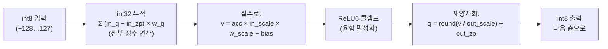

# 6장 — 정밀도와 양자화 (fp32 / fp16 / int8)

*자신에게 맞는 배지를 읽으세요: 🌱 **아이디어**(누구나, 코드 없이) · 🔧 **만들기**(코드 조금) · 🔬
**심화**(엔진 개발자). 처음이신가요? 🌱 부분만 따라가세요.*

*목표: 같은 탐지기가 왜 세 폴더로 배포되는지, 숫자가 비트로 저장되는 방식, 그리고 int8 모델을 4배
작게 만드는 정확한 정수 연산을 — 정확도 손실은 거의 없이 — 이해합니다.*

> 🌱 **핵심 아이디어.** 학습된 모델은 그저 거대한 숫자 더미입니다. 각 숫자를 아주 정밀하게 저장하면
> 파일이 크고, 숫자를 더 거칠게 **반올림** 하면 파일이 훨씬 작아집니다 — 그리고 알맞은 하드웨어에선
> 더 빨라집니다. 그것이 **양자화(quantization)** 의 전부입니다: 아주 약간의 정밀도를 내주고, 최대
> **4배 작은** 모델을 얻어, 브라우저 탭, 폰, 로봇에 넣습니다. 이 장은 같은 객체 탐지기를 세 가지로
> 저장한 것 — 정밀하고 큰 것, 반올림하고 작은 것 — 을 보여주고, 그 "반올림" 이 사실은 화려한 무한
> 자 대신 **눈금 256개가 고르게 찍힌 자** 로 숫자를 재는 것임을 밝힙니다.

🔧 세 EfficientDet 폴더를 보세요. 같은 아키텍처(3장), 같은 262개 남짓 노드, **아주 다른 파일 크기**:

| 폴더 | 각 숫자를 저장하는 방식… | `model.safetensors` | 상대 크기 |
|---|---|---|---|
| `efficientdet_lite0_fp32` | 32비트 실수 | **12.67 MB** | 1.0× |
| `efficientdet_lite0_fp16` | 16비트 실수 | **6.34 MB** | 0.50× |
| `efficientdet_lite0_int8` | 8비트 정수 | **3.39 MB** | 0.27× |

*모델* 은 동일합니다. **숫자 형식** — **정밀도(precision)** — 만 바뀌었습니다. 작은 숫자 → 작은
다운로드, 적은 메모리, 그리고 (알맞은 하드웨어로) 빠른 연산. 이 장은 그 절충에 관한 것입니다.

---

## 6.1 컴퓨터가 숫자를 저장하는 방식

> 🌱 **아이디어.** 컴퓨터가 숫자를 적는 주요 방법은 둘입니다. **실수(float)** 는 과학적 표기법 같아서 —
> 아주 유연하고 작은 값과 큰 값을 다루지만 공간을 더 씁니다. **정수(integer)** 는 그냥 평범한 정수로
> 공간을 거의 안 씁니다. 양자화는 가능한 곳마다 비싼 실수를 값싼 정수로 바꾸는 일입니다.

🔧 `0.10125` 같은 신경망 가중치는 고정된 비트 패턴이 되어야 합니다. 두 계열이 있습니다.

### 부동소수점 (fp32, fp16): "이진 과학적 표기법"

실수는 비트를 **부호(sign)**, **지수(exponent)**(크기), **가수(mantissa)**(정확한 자릿수)로 나눕니다.
비트가 많을수록 정밀도와 범위가 커집니다.

```
fp32  (4바이트)  [S][ 8비트 지수 ][      23비트 가수      ]   ~십진 7자리
fp16  (2바이트)  [S][ 5비트 지수 ][   10비트 가수   ]          ~십진 3자리
```

- **fp32**("단정밀도")는 어디서나 기본 — 큰 범위, ~7자리 정밀도. 학습이 쓰고 VolvoxAI가 활성화에
  씁니다.
- **fp16**("반정밀도")은 저장을 절반으로. 추론엔 충분히 정밀하지만 범위가 작고(큰/작은 값이
  넘침/언더플로), 결정적으로 — GPU가 fp16 연산을 *지원해야* 속도가 납니다. (브라우저에서 Volvox가
  신중한 이유는 §6.5.)

> 🔬 **뜯어보기: 실수는 자를 구부리고, 정수는 아니다.** 실수의 값은 `부호 × 1.가수 × 2^(지수 − 바이어스)`
> 라, 그 눈금은 고르게 배치되지 **않습니다** — 0 근처는 촘촘하고 큰 값에서는 벌어집니다(어디서나
> 유효숫자 약 7자리). 0 근처에 몰리되 가끔 튀는 가중치에 딱 맞지요. `int8` 은 반대: **고르게 256눈금**
> 이라, 자를 신중히 놓아야 합니다(§6.2). fp16도 범위를 크기와 맞바꿉니다 — 지수가 **±65504** 부근에서
> 한계라, fp32에서 멀쩡한 값이 fp16에서 무한대로 넘칠 수 있어 fp16을 섞을 땐 주의가 필요합니다.

### 정수 (int8): "눈금 256개가 고르게 찍힌 자"

> 🌱 **아이디어.** **int8** 은 −128에서 127까지의 정수만 될 수 있습니다 — 딱 256가지. `0.10125` 를
> 그대로 적기엔 너무 거칩니다. 비결: 값싼 작은 번호표(256눈금 자에서 가장 가까운 눈금)에, 그 번호표를
> 실제 숫자로 되돌리는 짧은 레시피를 함께 둡니다. 번호표는 1바이트, 레시피는 공유돼 사실상 공짜입니다.

🔧 **int8** 은 **−128에서 127** 까지의 정수를 저장합니다 — 딱 256가지 값, 1바이트. `0.10125` 를 그대로
담기엔 너무 거칠지요. 비결 — **양자화** — 은 값싼 정수에, 그것을 실수로 되돌리는 *레시피* 를 함께
저장하는 것입니다.

---

## 6.2 양자화: 스케일 + 제로포인트 레시피

> 🌱 **아이디어.** 256눈금 자를 당신이 실제로 가진 숫자 범위(예: −0.4에서 +0.4)에 걸쳐 늘입니다.
> 그러면 모든 실수는 "가장 가까운 눈금은 어디" 가 되고, 눈금을 실수로 되돌리는 레시피는 딱 두
> 사실입니다: **눈금 간격**(`scale`)과 **어느 눈금이 0을 뜻하는지**(`zero_point`). 그게 전부입니다 —
> 숫자 둘과 반올림 하나.

🔧 한 층의 실제 가중치는 어떤 범위(예: `−0.4 … +0.4`)에 있습니다. 양자화는 int8 자(`−128 … 127`)를 그
범위에 걸쳐 두 숫자로 늘입니다:

- **`scale`** — 눈금 하나의 크기(정수 한 칸당 실수 단위).
- **`zero_point`** — 어느 정수가 실수 `0.0` 을 나타내는지.

```
실수  r  ≈  (q − zero_point) × scale          ← 역양자화 (정수 → 실수)
정수  q  =  round(r / scale) + zero_point      ← 양자화   (실수 → 정수)

  실수:  -0.4         -0.2          0.0          0.2          0.4
          │            │            │            │            │
  int8: -128         -64            0           64          127     (scale ≈ 0.4/127)
```

🔬 두 공식 모두 *코드베이스에 그대로* 있습니다. 역양자화(`ts/ops/dequantizeLinear.ts`):

```javascript
out[i] = (in[i] - zero_point) * scale;     // int8 → 실수
```

양자화(`native/src/kernels/quant_cpu_opt.c`, `quantize_scalar_i8`):

```c
q = clamp_i8( lrintf(x / scale) + zero_point );   // 실수 → int8, [-128,127]로 클램프
```

그게 아이디어의 전부입니다. int8 가중치는 *번호표* 이고, `scale` 과 `zero_point` 가 그 값을
알려줍니다. 번호표는 1바이트, 레시피는 채널 전체가 공유해 사실상 공짜입니다.

> **채널별 스케일.** 🌱 한 층에 자 하나는 거칩니다 — 유독 큰 값 하나가 자를 너무 늘려 나머지 모두가
> 정밀도를 잃습니다. 그래서 각 **채널** 에 자기 자를 줍니다. 🔬 각 출력 채널이 자기 `weight_scale`
> 을 갖습니다(`QConv2D` 의 *텐서* 입력으로 `weight_scale: "w1"` 을 봤지요). 이 "채널별 양자화" 가
> int8 정확도를 fp32의 ~1% 이내로 유지합니다.

> 🔬 **뜯어보기: 대칭 대 비대칭.** `zero_point = 0` 이면 매핑이 **대칭** — 실수 0이 정수 0에 정확히
> 놓임 — 이라, 대략 0을 중심으로 하는 **가중치** 의 흔한 선택이며, 균형을 유지하려 종종 *좁은* 범위
> `[−127, 127]` 을 씁니다. **활성화** 는 흔히 한쪽으로 치우쳐(ReLU 출력은 ≥ 0), 실제 쓰이는 범위에
> 256눈금을 다 쓰려고 0이 아닌 `zero_point` 의 **비대칭** 매핑을 씁니다. VolvoxAI의 저작 경로는 둘 다
> 제공합니다 — [9C장 §9C.12](09c-cuda-backend.md)에서 만난 대칭·비대칭 스킴.

---

## 6.3 실제 예제 (모델의 진짜 숫자)

> 🌱 **아이디어.** 숫자 하나의 왕복을 보세요: 실제 가중치가 가장 가까운 눈금으로 반올림되고, 나중에
> 되돌려지는데 — *거의* 같게, 머리카락만큼만 어긋나 나옵니다. 그 작은 오차가 줄이는 값입니다. 거대한
> 합에 퍼지면 이 작은 오차들은 대부분 상쇄돼, 반올림된 모델도 개를 잘 알아봅니다.

🔬 int8 EfficientDet의 첫 노드는 `input_scale = 0.0078125`(정확히 `1/128`)인 `QuantizeLinear` 로,
들어오는 픽셀을 int8로 바꿉니다. 그다음 첫 `QConv2D` 는 `output_scale = 0.0235294`,
`output_zero_point = -128` 입니다. 가중치 하나와 출력 하나를 양자화해 봅시다.

```
가중치 양자화  r = 0.101,  scale = 0.008,  zero_point = 0:
   q = round(0.101 / 0.008) + 0 = round(12.625) = 13        → 바이트 13으로 저장

나중에 복원:
   r ≈ (13 - 0) × 0.008 = 0.104                              → 0.104 vs 0.101, 오차 0.003
```

0.003 오차가 **양자화 잡음** 입니다. 큰 닷 프로덕트에 퍼지면 이 작은 반올림 오차들은 대부분 상쇄돼 —
그래서 8비트 모델도 개를 제대로 탐지합니다.

> 🔬 **뜯어보기: 짝수로의 반올림.** 여기 `round()` 는 **은행가 반올림**(round-half-to-even)입니다:
> `12.5 → 12`, `13.5 → 14`. 반값을 늘 올리는 대신 이렇게 하면 양자화 오차가 **치우치지 않아**, 0.003
> 크기의 잡음이 긴 합에서 한쪽으로 쏠리지 않고 정말 상쇄됩니다. 모든 백엔드가 일부러 같게 반올림합니다
> (CUDA 저작 커널은 바로 이걸 위해 `cvt.rni`, 짝수로 반올림을 씁니다 — 9C장 §9C.12).

---

## 6.4 int8 합성곱이 실제로 실행되는 방식 (`QConv2D`)

> 🌱 **아이디어.** 성과가 여기 있습니다. 숫자가 이제 값싼 정수라, 기계는 산더미 같은 곱셈-덧셈을 빠른
> *정수* 산술로 하고, 맨 끝에서 딱 한 번만 실수로 되돌립니다. 그림 전체가 층에서 층으로 "번호표"
> 형태로 유지되는 — "양자화 섬" — 것이 int8을 작고 *동시에* 빠르게 만듭니다.
>
> *왜 정수가 더 빠른가:* 칩은 int8 곱셈-덧셈 여럿을 한 명령에 담을 수 있습니다(한 번에 8, 16, 32개) —
> 실수는 몇 개만 들어갈 자리에요. 그래서 int8은 디스크에서 작기만 한 게 아니라, 같은 하드웨어가 클록
> 틱당 더 많은 곱셈-덧셈을 하게 합니다.

🔬 양자화 합성곱은 무거운 곱셈-누적 루프를 **값싼 정수 산술** 로 하고, 맨 끝에서 딱 한 번만 실수로
되돌립니다. 출력 값 하나의 파이프라인(`native/src/kernels/quant_cpu_opt.c`):



1. **정수 누적.** int8×int8을 곱해 **int32** 누산기에 더합니다. 정수 곱셈-덧셈은 모든 CPU에서 빠르고
   저렴하며(AVX2/NEON로 8–32레인 벡터화).
2. **재양자화.** int32 합을 한 단계로 층의 int8 스케일로 되돌립니다. 실제 코드는 모든 스케일을 하나의
   곱으로 합칩니다:

   ```c
   // acc (int32) → 실수 → relu6 → int8, 출력 원소 하나:
   float v = acc * (input_scale * weight_scale) + bias;   // 합친 재스케일
   int8   q = requantize_i8(v, output_scale, output_zp, relu);
   //        = clamp_i8( round( relu6(v) / output_scale ) + output_zp );
   ```

핵심 통찰: **활성화가 층에서 층으로 int8로 유지**("양자화 섬")되어 백본 전체가 바이트로 돕니다. 맨
끝에서만 `DequantizeLinear` 가 최종 `scores`/`boxes` 를 읽을 수 있는 실수로 되돌립니다. 이것이
정확히 VolvoxAI의 네이티브 CPU 경로가 하는 것이고(`native/src/kernels/quant_cpu_opt.c`), 브라우저
계층은 대신 로드 시점에 int8 conv 가중치를 fp32로 되접습니다(더 단순, 디스크는 여전히 작음).

> 🔬 **뜯어보기: 왜 int32이고, 재양자화 승수.** 누산기가 **int32** 인 이유는 int8들의 닷 프로덕트가
> 커질 수 있어서입니다 — `K` 탭 conv면 최대 `K · 127 · 255` — int8/int16은 넘치지만 int32엔 넉넉히
> 들어갑니다. 재스케일 인자 `M = in_scale · w_scale / out_scale` 은 `(0, 1)` 의 실수인데, VolvoxAI는
> 단순함을 위해 **실수** 로 적용하지만 정수 전용 가속기는 같은 `M` 을 **고정소수점 곱셈-시프트** 로
> 구현해 층이 실수를 전혀 만지지 않게 합니다. 어느 쪽이든 제로포인트는 정수 누적 *안* 에서 빼며, 나중에
> 빼지 않습니다.

---

## 6.5 각 형식이 존재하는 이유 — 절충

> 🌱 **아이디어.** 세 형식, 하나의 다이얼: 한쪽 끝은 더 작고 빠르게, 다른 끝은 더 정밀하고 단순하게.
> **int8** 은 폰·로봇·브라우저용(작고, 빠르고, 어디서나 돎). **fp32** 는 최대 정확도가 필요하거나
> 나중에 줄일 때. **fp16** 은 중간 — 하지만 하드웨어가 지원해야 하고, 그건 보장되지 않습니다.

🔧

```
        더 작게 / 빠르게  ◀───────────────────────────────▶  더 정확 / 단순
             int8                      fp16                      fp32
        1바이트/가중치              2바이트/가중치            4바이트/가중치
        정수 연산                 fp16 HW 필요             어디서나 동작
        ~4배 작게                 ~2배 작게                기준 정확도
        미세한 정확도 하락          ~무손실                  무손실
```

| 질문 | fp32 | fp16 | int8 |
|---|---|---|---|
| 디스크 / 메모리 | 가장 큼 | 절반 | 1/4 |
| fp32 대비 정확도 | 기준 | ~동일 | 보통 ~1% 이내 |
| 특수 하드웨어 필요? | 아니오 | **예**(fp16 유닛) | 아니오(정수는 보편) |
| 언제 좋은가 | 최대 정확도, 또는 나중에 양자화 | GPU에 fp16 있고 쉬운 2배 원함 | 엣지/모바일/브라우저, 크기·속도가 중요 |

🔬 **VolvoxAI가 fp32 + int8에 기대고 fp16에 신중한 이유(README에서):**

- **fp16** 은 WebGPU `shader-f16` 확장이 필요한데, 소비자 기기에서 보편적이지 않습니다 — 그래서
  브라우저 엔진은 그것에 의존할 수 없습니다. (여기 fp16 폴더는 주로 그것을 지원하는 플랫폼/형식용.)
- **int8** 은 정확도 손실 거의 없이 4배 크기 절감을 주고, 정수 연산은 *어떤* CPU/GPU에서도 빠르게
  돕니다 — 이식성 있는 추론의 스위트 스폿. Volvox는 **int4** 를 건너뛰는데, 4비트는 까다로운 비트
  언패킹이 필요해 저사양 모바일 GPU에 해롭기 때문입니다.

> 🔬 **뜯어보기: "작아짐" 은 보장, "빨라짐" 은 자동이 아니다.** 4배는 어디서나 얻는 **저장** 이득입니다.
> *속도* 이득은 바이트를 넓게 곱하는 하드웨어 — NVIDIA의 `DP4A`, ARM의 닷-프로덕트 명령, x86의 `VNNI`
> — 가 필요하고, 없으면 int8이 더 넓은 정수로 풀려 크기 이득은 남지만 처리량 이득은 못 얻습니다. 그리고
> 그 4배는 **디스크 위 가중치** 이야기입니다; 실행 시 활성화 메모리는 경로가 int8로 유지되느냐(네이티브
> CPU) fp32로 넓어지느냐(브라우저 계층, §6.4)에 달렸습니다.

---

## 6.6 세 그래프, 나란히

🔬 정밀도는 *저장* 선택이라, 그래프는 거의 동일합니다 — conv 연산과 약간의 양자화 장부만 다릅니다:

```
fp32 / fp16 그래프:            int8 그래프:
  input (실수)                  input (uint8)
     │                             │  QuantizeLinear   ← 실수/uint8 → int8 (한 번)
  Conv2D ─┐                     QConv2D ─┐             ← 정수 conv, int8 입출력
  Conv2D  │ 182 실수 conv       QConv2D  │ 182 int8 conv (내내 int8 유지)
   …      │                      …       │
  Add / MaxPool / Resize        Add / MaxPool / Resize (int8 인지)
     │                             │  DequantizeLinear ← int8 → 실수 (끝에서 두 번)
  scores, boxes (실수)          scores, boxes (실수)
```

그래서 int8 그래프는 **여분 노드 3개**(QuantizeLinear 1 + DequantizeLinear 2)를 갖고, 그 182개 conv는
`Conv2D` 가 아니라 `QConv2D` 입니다. 같은 탐지기, 세 크기 — 기기가 필요로 하는 곡선 위의 점을
고릅니다.

---

## 6.7 방금 배운 것

> 🌱 **아이디어 정리.** 모델은 숫자 더미이고, **양자화** 는 그 숫자를 거친 256눈금 자에 반올림해 모델을
> 최대 4배 작고 빠르게 만들되, 아주 약간의 정확도를 값으로 냅니다. 되돌리는 레시피는 자마다 숫자 둘
> (눈금 간격 + 어느 눈금이 0인지)뿐입니다. 그래서 폰에 너무 컸던 모델이 갑자기 들어가는 것입니다.

🔧

- **정밀도** 는 각 숫자가 받는 비트 수입니다: fp32(4B), fp16(2B), int8(1B).
- **양자화** 는 실수를 `scale` + `zero_point` 로 256값 int8 자에 매핑합니다. `(q−zp)×scale` 과
  `round(r/scale)+zp` 공식이 비결의 전부이며, 저장소에 있습니다.
- **int8 conv** 는 값싼 int32로 누적하고 한 번 재양자화합니다 — 활성화가 층에서 층으로 int8로 유지돼,
  ~4배 작고 빠르며 정확도 비용은 ~1%.
- 배포마다 형식을 **선택** 합니다: 충실도엔 fp32, 엣지엔 int8, 하드웨어가 지원하면 fp16.

지금까지 양자화는 *저장 사실* 이었습니다 — int8 탐지기는 그냥 폴더에 *존재* 했지요. 하지만 누군가
그것을 **만들어야** 했습니다: 실제 활성화 범위를 관찰하고, 채널별 스케일을 고르고, 어느 층이 int8을
견딜지 정해야 했습니다. 그 과정 — 사후 학습 양자화와 양자화 인지 학습 — 이 다음 장입니다.

**다음:** [7장 — 양자화 모델 만들기 →](07-producing-a-quantized-model.md)
