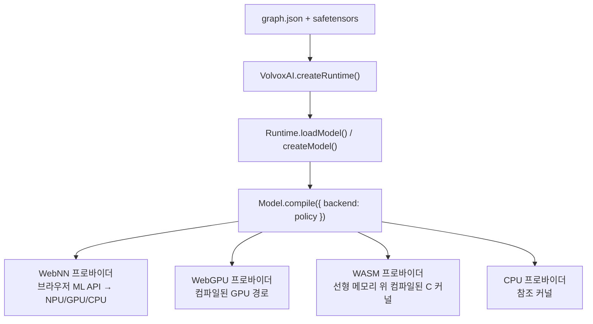

# 8장 — 브라우저 엔진 내부

*자신에게 맞는 배지를 읽으세요: 🌱 **아이디어**(누구나, 코드 없이) · 🔧 **만들기**(코드 조금) · 🔬
**심화**(엔진 개발자). 처음이신가요? 🌱 부분만 따라가세요.*

*목표: VolvoxAI가 "연산 목록" 을 실제 하드웨어에서 **빠르게** 도는 것으로 바꾸는 방법을 이해합니다 —
네 계층, 소박한 커널에서 최적화된 커널로의 도약, 그리고 연산 융합.*

> 🌱 **핵심 아이디어.** 모델이 *무엇을* 계산하는지는 이미 압니다: 작은 수학 단계의 목록. 이 장은 답을
> 바꾸지 않고 그 목록을 **빠르게** 도는 것입니다. 두 가지 일상 비결이 대부분을 합니다. 첫째, **가진
> 일꾼을 전부 쓰기**: 현대 칩은 곱셈을 한 번에 여럿 할 수 있고(코어도 여럿, 종종 GPU도), 소박한
> 한-번에-하나 루프는 그 거의 전부를 낭비합니다. 둘째, **종이 그만 나르기**: 숫자를 메모리에 넣고
> 빼는 게 느려서, 이웃 단계를 붙이고 매번 새 종이를 꺼내는 대신 같은 메모지를 재사용합니다. 나오는
> 숫자는 같고 — 훨씬 빠르고 가벼울 뿐입니다. 이것이 교과서 모델을 브라우저 탭에서 매끄럽게 도는
> 것으로 바꾸는 엔지니어링입니다.

🔧 이제 모델이 *무엇을* 계산하는지 압니다. 이 장은 *그것을 빠르게* 만드는 것입니다 — 교과서 구현을
배포 가능한 것과 가르는 엔지니어링. 실제 AI 시스템 작업의 많은 부분이 여기 있습니다.

---

## 8.1 하나의 그래프, 네 프로바이더 (계층)

> 🌱 **아이디어.** 같은 모델을 브라우저에서 "가장 화려한 하드웨어" 부터 "언제나 어디서나 동작" 까지 네
> 가지로 돌릴 수 있고, VolvoxAI가 기기가 주는 가장 좋은 것을 고릅니다. 모두 *같은* 답을 계산합니다 —
> 누가 산술을 하느냐(신경 칩, GPU, CPU)와 숫자가 어디 사느냐만 다릅니다.

🔧 1장 상기: VolvoxAI는 브라우저에서 같은 그래프를 네 가지로(플러스 네이티브 바이너리) 돌릴 수
있습니다. **누가 산술을 하는지** 와 **텐서가 어디 사는지** 만 다릅니다.



- **Tier 4 — 순수 JS** (`ts/ops/*.ts`): 책 내내 읽은 소박한 커널. 느리지만 단순하고 의존성 없음.
  **기준(ground truth)** 입니다: 모든 빠른 계층이 이것과 대조됩니다.
- **Tier 3 — WASM**: 같은 연산을 SIMD로 WebAssembly에 컴파일합니다. 범프 할당기가 모든 텐서를 하나의
  평평한 선형 메모리 블록에 넣고, 컨텍스트 실행이 컴파일된 C 커널을 호출합니다. 순수 JS보다 종종
  5–50배 빠릅니다.
- **Tier 2 — WebGPU**: 지원되는 연산은 GPU **컴퓨트 셰이더** 가 됩니다. 컴파일이 가중치를 VRAM에
  올리고 선택한 경로를 만들며, 실행은 인접 GPU 노드 사이 호스트 읽기 없이 이를 재생합니다. 필수 경로가
  지원되지 않으면, 호출자의 컴파일 정책이 연산 폴백을 명시적으로 허용한 경우가 아닌 한 컴파일이
  실패합니다. 실행은 노드를 조용히 건너뛰지 않습니다.
- **Tier 1 — WebNN**: 지원되는 Graph 영역을 브라우저 자체 신경망 API에 넘깁니다. 전용 **NPU** 로
  보낼 수 있습니다.

🔬 설계 원칙: **컴파일 시점에 유효한 경로를 고르고 증명합니다.** 컴파일 보고서는 선택한 프로바이더,
경로 증거, 그리고 프로바이더가 제공할 수 있을 때 디바이스 식별자를 기록합니다. 그 경로는 컴파일된
모델에서 고정되며, 실행 오류가 생기면 다른 백엔드를 조용히 시도하지 않고 오류를 보고합니다.

---

## 8.2 소박한 커널이 느린 이유

> 🌱 **아이디어.** 우리가 읽던 단순 루프는 한 번에 곱셈 하나를 하고, 숫자를 찾아 메모리 곳곳을
> 뜁니다. 여덟 손을 가진 계산원이 하나만 쓰고, 물건마다 가게 뒤편으로 걸어가는 것과 같습니다. 칩은
> 대부분 계산이 아니라 *기다리고* 있고 — 할 수 있는 것의 몇 퍼센트만 씁니다.

🔧 3장의 소박한 `Conv2D` 를 다시 보세요: 일곱 중첩 루프, 한 번에 곱셈 하나. *올바르지만*, 현대 CPU는
두 이유로 싫어합니다:

1. **SIMD 유닛을 낭비합니다.** CPU 코어는 *한* 명령으로 8개(AVX2) 이상의 실수를 곱할 수 있습니다.
   소박한 루프는 하나… 씩… 해서, 실리콘의 일부만 씁니다.
2. **캐시를 뒤흔듭니다.** RAM은 CPU보다 ~100배 느립니다. 코어는 최근 쓴 데이터를 작고 빠른 **캐시** 에
   둡니다. 소박한 conv는 메모리 곳곳을 뛰어(스트라이드 이미지 읽기), 계산 대신 RAM을 계속 기다립니다.

결과: 소박한 커널은 칩 실제 처리량의 **2–5%** 만 쓸 수 있습니다. 최적화는 SIMD 유닛을 먹이고 캐시를
존중하는 것입니다.

> 🔬 **뜯어보기: 계산 병목 대 메모리 병목(루프라인).** 모든 커널은 두 천장 중 하나에 막힙니다 — 칩이
> 초당 할 수 있는 곱셈-덧셈 수, 아니면 RAM에서 바이트를 옮기는 속도. 어느 쪽이 무느냐는 **산술
> 강도(arithmetic intensity)** — 로드한 바이트당 FLOP — 가 정합니다. 1×1 conv는 로드한 가중치를 여러
> 픽셀에 재사용해(강도 높음 → 계산 병목, SIMD가 도움) 반면 원소별 `Add` 는 바이트를 한 번만
> 만집니다(강도 낮음 → 메모리 병목, SIMD를 더 써도 *소용없음*). 그래서 융합(§8.4)과 버퍼
> 재사용(§8.5)이 빠른 matmul만큼 중요합니다: 계산 천장이 아니라 메모리 천장을 공략하니까요. 캐시 계층도
> 축소판 같은 이야기입니다 — L1 히트는 몇 사이클, RAM 왕복은 수백.

---

## 8.3 소박함에서 빠름으로: 같은 수학, 재배열

> 🌱 **아이디어.** 빠른 버전은 *정확히* 같은 것을 계산합니다 — 칩의 여러 손이 바쁘게, 필요한 숫자가
> 이미 가까이 있도록 일을 재조직할 뿐입니다. 데이터를 깔끔히 줄 세우고, 칩이 아주 잘하는 행렬 곱에
> 건네고, 명령당 곱셈을 여럿 하고, 코어에 나눕니다. 올바름은 단순 버전에 살고, *속도는 배치에
> 삽니다.*
>
> *같은 합, 빠른 경로:* 숫자 한 열을 더하면 위에서 아래로 가든 짝지어 묶든 합은 같습니다 — 다만 한
> 순서는 두 손을 동시에 쓰게 할 수 있지요. 빠른 커널은 덧셈의 *순서와 묶음* 만 바꾸지, 합은 결코
> 바꾸지 않습니다.

🔧 최적화된 커널은 *무엇을* 계산하는지(출력은 Tier 4와 동일)는 절대 바꾸지 않습니다 — 일의 *순서와
배치* 를 바꿉니다. VolvoxAI의 핫 경로는 밀집 층의 `native/src/kernels/gemm_f32.c` 와
`packed_quant_gemm.c`, `conv_f32_opt.c`(fp32 합성곱), `quant_cpu_opt.c`(int8 합성곱)를 포함합니다.
주요 기법:

| 기법 | 아이디어 | 성과 |
|---|---|---|
| **im2col + GEMM** | conv 패치를 큰 행렬로 펴고, 빠른 행렬 곱 호출 | 수십 년의 튜닝된 matmul 재사용; SIMD 먹임 |
| **포인트와이즈 GEMM** | 1×1 conv는 *곧* 행렬 곱 — 직접 그렇게 취급 | 단일 최대 이득(대부분 conv가 1×1) |
| **가중치 프리패킹** | 내부 루프가 읽는 정확한 순서로 로드 시 한 번 재배치 | 캐시 미스 읽기를 순차 읽기로 |
| **블로킹/타일링** | 캐시에 맞는 작은 타일을 처리한 뒤 이동 | 데이터가 뜨거운 동안 재사용 |
| **SIMD (AVX2/NEON)** | 명령당 8–32 곱셈-덧셈 | 사이클당 산술 ~8–32배 |
| **멀티스레딩** | 출력 행을 CPU 코어에 분배 | 그 위에 ~코어수배 |

```
소박한 conv                     최적화된 conv (im2col + GEMM)
 각 출력 픽셀마다:               [1] 입력 패치를 펴 큰 행렬로  (한 번)
   각 필터 탭마다:               [2] 하나의 크고, 캐시 친화적, SIMD, 스레드된
     스칼라 곱 하나                  프리팩된 가중치와의 행렬 곱
 (흩어진 메모리, 1레인)          (순차 메모리, 여러 레인, 여러 코어)
```

> **이 저장소의 실제 결과.** 🌱 한 메모리 절약 변경으로 탐지기가 RAM을 **~5배 적게** 쓰고 눈에 띄게
> 빨라졌습니다 — 같은 답, 훨씬 가벼움. 🔬 *아레나 버퍼 재사용 계획기*(노드마다 새로 할당하지 않고
> 스크래치 메모리 재사용)를 더해 피크 메모리를 **88.8 MB → 18.8 MB** 로 줄였고, 포인트와이즈-GEMM
> 경로와 합쳐 EfficientDet 순전파를 의미 있게 빠르게 해 — 구글 TFLite/XNNPACK과의 격차를 ~1.16배(웜)로
> 좁혔습니다. *그것이* 커널 엔지니어링입니다.

교훈: **올바름은 소박한 커널에 살고, 성능은 메모리 배치에 삽니다.** `ts/ops/conv2D.ts` 를 읽은 뒤
`native/src/kernels/conv_f32_opt.c` 와 diff해, 그 기예의 두 반쪽을 보세요.

> 🔬 **뜯어보기: im2col은 공짜가 아니라 — 그래서 빠른 경로는 종종 건너뛴다.** 펼친 패치 행렬을
> 실체화하면 입력이 대략 `k_h · k_w ×`(3×3 conv → 잠깐 ~9배 메모리) 부풀어 오릅니다. 큰 conv 하나엔
> 괜찮지만, 여기의 *많은* 1×1 conv엔 펼칠 게 없습니다 — 1×1 conv는 이미 행렬 곱이니까요 — 그래서
> "포인트와이즈 GEMM" 이 단일 최대 이득입니다. 프로덕션 커널은 **암시적 im2col** 도 씁니다: GEMM 루프
> 안에서 원본 텐서로 바로 인덱싱해, 큰 행렬을 만들지 않고 matmul의 속도를 얻습니다.

### 🔬 밀집 행렬 곱의 해부

같은 패턴이 이제 `MatMul`/`Linear`/`Gemm` 에 직접 나타납니다. 네이티브 CPU와 WASM은 불변 가중치를
여덟-출력 패널로 한 번 패킹하고, 레지스터에서 4행×8열을 계산하며, 보수적 32 KiB L1D의 75% 아래로
유지되도록 K를 청크로 걷습니다. 그 폴백 캐시에서 F32 커널은 `KC=496` 을 골라 24,576바이트 예산 중
23,936을 씁니다. 네이티브는 호스트 L1D 정책을 자동 감지·캐시하고, WASM은 브라우저가 캐시 토폴로지를
노출하지 않아 이식 가능한 32 KiB 가정을 유지합니다.

GPU는 같은 재사용 문제를 다르게 풉니다. 8x8 워크그룹이 협력해 16x16 A/B 타일을 워크그룹 메모리에
로드해 16x16 출력 타일을 만듭니다. 그것은 CPU식 지속 가중치 패킹이 아니라 **타일링** 입니다. 단일
토큰 디코드(`M=1`)와 작은 행렬은 공유 타일 채우기가 이득보다 비쌀 수 있어, 더 단순한 스칼라 셰이더나
전용 CPU 마이크로커널을 유지합니다. 순수 JS 커널은 공부하기 쉬운 참조로 남습니다.

그 마지막 선택이 중요합니다: "최적화된 MatMul" 은 하나의 영리한 루프가 아닙니다. 자료형·형태·기기가
고른, 패킹·캐시 블로킹·레지스터 타일링·워크그룹 타일링·저오버헤드 디코드 경로 사이의 디스패처입니다.

---

## 8.4 연산 융합: 메모리를 그만 만지기

> 🌱 **아이디어.** 단계 사이에서 기계는 보통 결과를 적어 두고 다음 단계가 다시 읽습니다 — 큰 데이터엔
> 낭비되는 왕복이 많습니다. **융합** 은 이웃 단계를 붙여 데이터를 한 번만 만지게 합니다: "곱하고 *동시에*
> 클램프" 를 한 번에, 둘 대신. 수백 단계에 걸쳐 그 모든 적고-다시-읽는 왕복을 건너뛰면 실제 속도가
> 됩니다.

🔧 연산 사이에서 결과는 메모리에 쓰이고 다음 연산이 다시 읽습니다. 큰 특징 맵에선 데이터를 *옮기는*
것이 수학보다 비쌀 수 있습니다. **연산 융합** 은 인접 연산을 병합해 데이터를 한 번만 만지게 합니다.
VolvoxAI는 컴파일 시점 융합 패스를 돌립니다(`native/src/runtime/graph_opt_fusion.inc`):

```
융합 전:  Conv2D ─▶ [특징 맵 쓰기] ─▶ ReLU6 ─▶ [다시 쓰기]
융합 후:  Conv2D+ReLU6 ─▶ [한 번 쓰기, 이미 활성화됨]
```

🔬 적용하는 융합 패턴(`docs/operator_fusion_patterns.md` 참고):

- **Conv + ReLU6** → conv의 재양자화 단계 안에서 바로 클램프(3–4장에서 `relu` 가 커널에 접힌 것을
  봤지요).
- **연쇄 `Add`** → 여러 잔차를 한 패스로 합산.
- **뎁스와이즈 → 포인트와이즈** → 중간을 흘리지 않고 MBConv 쌍을 연달아 실행.
- **Concat + Sigmoid**, **별칭 제거**(일부 `Reshape` 같은 no-op 복사 제거).

각 융합 쌍은 큰 텐서의 전체 읽기+쓰기 한 번이 줄어듭니다. 262개 노드에 걸쳐 쌓이지요.

---

## 8.5 메모리: 텐서는 일시적이다

> 🌱 **아이디어.** 모델이 만드는 숫자 대부분은 스크래치 작업입니다 — 잠시 필요하고 다시는 안 씁니다.
> 단계마다 새 종이를 꺼내는(그리고 거대한 뭉치가 필요한) 대신, 엔진은 옛 스크래치가 끝났음을 알아채고
> **같은 종이를 재사용** 합니다. 그래서 숫자가 수백 메가바이트에 이르는 모델도 그 일부의 메모리로 돌
> 수 있습니다.

🔧 미묘하지만 중요한 점: 순전파의 텐서 대부분은 **스크래치** 입니다 — 잠깐 필요하고 다시 없음(예:
어텐션 MatMul이 소비하면 `ln1_0` 은 죽음). 소박한 엔진은 노드마다 새 버퍼를 할당(단순하나 낭비).
똑똑한 엔진은 수명이 겹치지 않아 메모리를 공유할 수 있는 버퍼를 **계획** 합니다 — 위에서 말한 **아레나
버퍼 재사용 계획기**. 그래서 VolvoxAI는 텐서 *합* 이 수백 MB인 모델을 그 일부의 피크 RAM으로 돌 수
있습니다: 같은 물리 바이트를 노드마다 재활용.

> 🔬 **뜯어보기: 버퍼 재사용은 그래프 색칠이다.** 계획기는 각 텐서의 **생존 구간(live interval)** —
> 그것을 쓰는 노드부터 마지막으로 읽는 노드까지 — 을 계산한 뒤, 두 텐서의 구간이 겹치지 않을 때만 같은
> 버퍼를 줍니다. 컴파일러가 많은 변수를 적은 CPU 레지스터에 담을 때 푸는 바로 그 문제입니다(레지스터
> 할당 / 구간 색칠). 그래서 탐지기 피크 메모리가 **88.8 MB → 18.8 MB** 로 떨어졌습니다: 텐서가 줄어서가
> 아니라, *동시에 살아있는* 텐서가 줄어 같은 물리 바이트를 공유해서입니다.

```
노드 수명 (─ = 살아 있음):     버퍼 재사용:
  A: ───                          A와 C는 안 겹침 → 같은 버퍼를 줌
  B:   ─────                      B와 D는 안 겹침 → 버퍼 공유
  C:      ────
  D:          ───                 텐서 4개, 물리 버퍼 2개
```

---

## 8.6 엔진 전체, 한 문장으로

> 🌱 **아이디어 정리.** 같은 답을, 빠르게: 칩의 모든 손 쓰기(한 번에 곱셈 여럿, 여러 코어, GPU),
> 이웃 단계 붙이기, 스크래치 메모리 재사용. 모델이 *무엇을* 계산하는지는 아무것도 안 바뀌었고 — 칩이
> *얼마나 효율적으로* 하는지만 바뀌었습니다.

🔧

> **VolvoxAI는 그래프의 노드 목록을 걸으며, 각 노드를 사용 가능한 가장 빠른 백엔드의 커널에
> 디스패치하고, 그러면서 메모리 버퍼를 재사용하고 인접 연산을 융합합니다 — 소박한 참조와 정확히 같은
> 숫자를, 훨씬 빠르고 작게 냅니다.**

그것이 시스템 전체입니다. 나머지는 연산 하나, 백엔드 하나, 또는 이 골격 위 최적화 하나가 더 있는
것입니다.

> **이 장은 네 개의 *브라우저* 계층을 다뤘습니다.** VolvoxAI는 *같은 설계도* 를 데스크톱, 폰, 로봇에서
> 도는 완전한 **네이티브** 엔진(CPU + Vulkan / OpenGL / Metal / Android NNAPI에 걸친 독립형 C
> 바이너리)도 제공합니다. 그게 다음 장 전체입니다.

**다음:** [9장 — 네이티브 엔진 →](09-native-engine-architecture.md)
