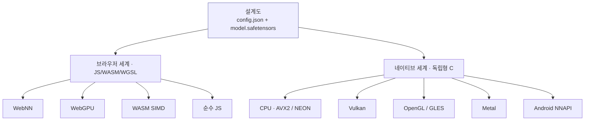
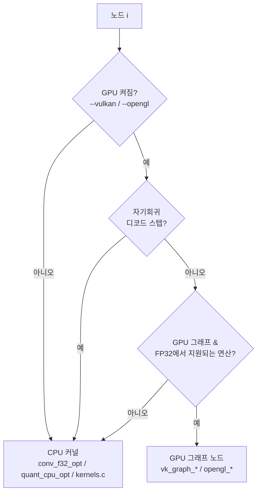

# 9장 — 네이티브 엔진 (온디바이스 AI: 데스크톱, 폰, 로봇)

*자신에게 맞는 배지를 읽으세요: 🌱 **아이디어**(누구나, 코드 없이) · 🔧 **만들기**(코드 조금) · 🔬
**심화**(엔진 개발자). 처음이신가요? 🌱 부분만 따라가세요.*

*목표: VolvoxAI의 **네이티브** 쪽 — 브라우저와 **같은 설계도** 를, 데스크톱과 폰에서, CPU와 여러
GPU/NPU 백엔드에 걸쳐 도는 독립형 C 프로그램 — 과 그것을 가능케 하는 설계 아이디어를 이해합니다.*

> 🌱 **핵심 아이디어.** 지금까지의 모든 것은 웹 브라우저에서 돌 수 있었습니다. 이 장은 *같은 모델* 을
> 작은 독립 프로그램으로 도는 것 — **브라우저 없이, 인터넷 없이, 기기 위에서 바로** — 에 관한
> 것입니다. 그것이 사람들이 말하는 **온디바이스** 또는 **엣지 AI** 입니다: 지능이 기기 자체 — 당신의
> 노트북, 폰, 카메라, 드론, **로봇** — 에 살아, 사적이고(데이터가 나가지 않음), 항상 가능하고(오프라인
> 동작), 즉각적입니다(서버 왕복 없음). 영리한 부분은 이것이 *하나의 작은 프로그램* 이라, 시작할 때
> 기기를 둘러보고 무슨 칩이 있는지(평범한 CPU, GPU, 신경 칩) 찾아 쓴다는 것입니다 — 그 칩의 소프트웨어
> 키트를 번들할 필요 없이. 브라우저와 같은 설계도가, 이제 베어메탈에서 돕니다.

🔧 1–5장은 대개 자바스크립트 계층을 읽었습니다. 가장 명료한 교재이기 때문이지요. 하지만 그건
VolvoxAI의 절반일 뿐입니다. 나머지 절반은 `native/`: *동일한* `config.json` + `.safetensors` 를
받아 브라우저 없이, Node 없이, 그리고 — 이게 놀라운 부분 — **정적으로 링크된 GPU SDK 없이** 도는
**베어메탈 C 엔진** 입니다. 이 장은 그 아키텍처와 "왜" 입니다.

---

## 9.0 온디바이스가 중요한 이유 (엣지 AI & 로봇)

> 🌱 **아이디어.** 왜 그냥 클라우드의 큰 AI를 부르지 않을까요? 로봇이나 폰이 종종 *그럴 수 없는* 세
> 이유:
>
> - **프라이버시.** 카메라 영상, 마이크, 영수증 — 그 무엇도 기기를 떠날 필요가 없습니다.
> - **오프라인 & 신뢰성.** 창고의 로봇, 들판의 드론, 터널의 차: 와이파이가 없어도 문제없습니다.
>   온디바이스 AI는 신호 없이도 계속 동작합니다.
> - **속도 & 통제.** 어디에 발을 디딜지 정하는 로봇은 서버 응답을 300ms 기다릴 수 없습니다. 로컬
>   실행은 즉각적이고 예측 가능합니다.
>
> 대가는 기기가 *작다* 는 것입니다 — 수수한 칩, 제한된 메모리, 배터리. 바로 그래서 앞 장들이
> 중요했습니다: **양자화**(6–7장)가 모델을 맞게 줄였고, **빠른 커널**(8장)이 약한 칩에서 돌게 합니다.
> 이 장은 그것들이 값을 하는 곳입니다: 같은 작은 모델이, 로봇 자체에서 돕니다.

🔬 이 책의 로봇/엣지 이야기는 번들된 로보틱스 데모가 아니라 *아키텍처적* 입니다: VolvoxAI는 엣지
기기에 떨어뜨려 설계도를 도는 독립형 바이너리를 줍니다. 특정 로봇의 센서와 모터에 연결하는 것은 엔진
바깥에 사는 애플리케이션 코드입니다(§9.9의 프런트엔드 참고). 실행 가능한 종단간 로봇 예제는 미래
작업이며, 아래는 그것을 가능케 하는 엔진입니다.

---

## 9.1 핵심 아이디어: 하나의 설계도, 두 세계

> 🌱 **아이디어.** 이 프로젝트 전체는 하나의 약속에 놓여 있습니다: **모델을 한 번 기술하고, 어디서나
> 실행하기.** 웹페이지가 로드하는 바로 그 두 파일(1장의 레시피 + 창고)이 온디바이스 프로그램이
> 로드하는 파일입니다. 로봇을 위해 다시 익스포트하거나 재학습하지 않습니다 — 문자 그대로 같은
> 모델입니다.

🔧 프로젝트 전체가 하나의 원칙을 중심으로 조직됩니다:

> **모델을 설계도로 한 번 쓰고, 어디서나 실행한다.**



브라우저 세계는 8장이었습니다. 고정 네이티브 실행 파일(`native/volvoxai`)은 모델에 구애받지 않는
원시 텐서 러너입니다. 과제 지향 이미지·어휘 정책은 별도 예제 애플리케이션에 삽니다:

```bash
make -C examples native_task_cli
examples/target/bin/volvoxai-tasks generate models/tinystories_1m \
  --prompt "Once upon a time, Lily" --max-new 50
examples/target/bin/volvoxai-tasks detect models/efficientdet_lite0_int8 \
  --image input0=photo.png --image-normalize raw-255 --boxes boxes --scores scores
```

브라우저가 로드하는 같은 파일들. 그 대칭이 설계입니다.

---

## 9.2 독립형 철학 (왜 특이한가)

> 🌱 **아이디어.** 두 특이한 규칙이 이것을 로봇에서 통하게 합니다. **하나:** 아래에 큰 프레임워크가
> 없어 — 엔진이 *곧* 작은 C 코드 뭉치라 — 설치할 무거운 게 없습니다. **둘:** 어떤 GPU의 소프트웨어
> 키트도 번들하지 않습니다. 대신 프로그램이 시작할 때 *기기에 묻습니다* "GPU 드라이버 있니? 신경 칩
> 있니?" 그리고 찾은 무엇이든 — 그 순간, 실행 시점에 — 연결합니다. 그래서 **하나** 의 프로그램 파일이
> GPU 있는 화려한 기계 *와* CPU만 있는 맨 보드 둘 다에서, 재빌드 없이 동작합니다. 그 이식성이 바로
> 엣지 기기가 필요로 하는 것입니다.

🔧 두 가지 의도적 제약이 네이티브 엔진을 빚습니다:

1. **Emscripten 없음 / 무거운 런타임 없음.** WASM 모듈은 평범한 `clang --target=wasm32 -msimd128`
   로 빌드됩니다 — `--no-entry` 의 *독립형* 빌드, libc 런타임 없음. 네이티브 바이너리는 보통의
   `clang -O3 -mavx2 -mfma -pthread`. 아래에 프레임워크가 없습니다. 엔진이 *곧* `native/` 의
   코드입니다.
2. **정적 GPU 의존성 없음.** 바이너리는 빌드 시점에 `libvulkan` 이나 OpenGL SDK를 링크하지
   **않습니다**. 대신 실행 시점에 GPU 드라이버를 **`dlopen`** 하고 진입점을 이름으로 찾습니다.
   드라이버가 있으면 GPU 가속을, 없으면 정확히 같은 바이너리가 CPU에서 돕니다. 하나의 아티팩트가
   전혀 다른 GPU 스택의 기계들에 걸쳐 이식됩니다.

🔬 그 실행 시점 로딩, 그대로(`native/src/backends/vulkan_engine.c`, `native/src/backends/opengl_engine.c`):

```c
// Vulkan: 플랫폼의 로더 이름들을 순서대로, 실행 시점에 시도.
const char* names[] = { "libvulkan.so.1", "libvulkan.so", "vulkan-1.dll" };
for (i = 0; i < 3; i++) vulkan_lib = dlopen(names[i], RTLD_NOW | RTLD_LOCAL);
vkGetInstanceProcAddr = (PFN_vkGetInstanceProcAddr)dlsym(vulkan_lib, "vkGetInstanceProcAddr");

// OpenGL/GLES: 마찬가지로 libEGL + libGLESv2/libGL (또는 Windows에선 *.dll) dlopen.
```

그것이 "GPU SDK 링크 없이 Vulkan/OpenGL/Metal/NNAPI에서 돎" 의 비결 전부입니다. 빌드 명령의 `-ldl`
이 유일한 대가입니다.

---

## 9.3 하나의 커널 소스, 두 기계 (공유 ABI)

> 🌱 **아이디어.** 모든 수학 단계를 두 번 쓰는 것 — 브라우저용 한 번, 기기용 한 번 — 은 동기화 유지가
> 악몽입니다. VolvoxAI는 각 단계의 C 코드를 **한 번** 쓰고 양쪽으로 컴파일합니다. 하나의 진실, 적은
> 버그, 노트북과 로봇에서 같은 답.

🔧 VolvoxAI는 모든 커널의 두 복사본을 유지하지 않습니다. `native/src/kernels/*.c` 의 이식성 있는
C(`native/src/kernels/kernels.c` 로 묶임)는 WebAssembly(브라우저 Tier 3) **와** 네이티브 바이너리
**둘 다** 로 컴파일됩니다. 🔬 비결은 **`uintptr_t` 힙-포인터 ABI** 입니다: 커널이 하나의 평평한
힙에 대한 정수 오프셋으로 메모리를 다뤄, 그 힙이 WASM 선형 메모리든 네이티브 `malloc` 아레나든 같은
소스가 동작합니다. 그다음 컴파일러가 **x86의 AVX2** 와 **arm64의 NEON**(대부분의 폰과 로봇의 칩
계열)으로 자동 벡터화합니다.

```
                       ┌─────────────────────────────┐
   native/src/kernels/*.c  │  이식성 C, uintptr_t 힙     │
                       └───────────┬─────────────────┘
             clang --target=wasm32 │ clang -O3 -mavx2 (x86) / -march=…(arm64)
                    ┌──────────────┴───────────────┐
       dist/<version>/volvoxai.wasm            native/volvoxai
       dist/<version>/volvoxai.full.wasm       native/volvoxai-full
             (브라우저 순방향/전체)         (데스크톱/Android CPU/전체)
```

순수 JS 연산(`ts/ops/*.ts`)은 이것들이 대조되는 참조로 남습니다 — 그래서 각 연산의 표현이 정말
**세** 가지(JS 참조, 이식성 C, 그리고 — 핫 연산엔 — *최적화된* C 커널)이고, 모두 일치해야 합니다.

---

## 9.4 엔진 수명주기 (`native/src/runtime/engine.c`)

> 🌱 **아이디어.** 엔진을 쓰는 건 세 동작입니다: 모델을 한 번 **로드**(느린 부분 — 파일 읽고 메모리
> 배치), 원하는 만큼 **실행**(빠름), 그리고 **종료**. 로봇에선: 시작할 때 한 번 로드하고, 그다음 켜져
> 있는 내내 카메라 프레임마다 모델을 저렴하게 돌립니다.

🔬 네이티브 엔진은 작고 명시적인 상태 기계입니다. 공개 API(`native/include/volvoxai.h`)는 JS의
`compile()` / `execute()` 의 C 대응물입니다:

```c
int    volvoxai_engine_configure(const VolvoxAIEngineOptions* options);           // 백엔드/디버그/스레드 정책 선택
int    volvoxai_engine_init(const char* config_path, const char* weights_path);  // 로드 + 빌드 한 번
float* volvoxai_engine_input_ptr(const char* name, long* numel);                 // 입력 텐서에 값 넣기
int    volvoxai_engine_forward(void);                                            // 그래프 전체 실행
const char* volvoxai_engine_graph_output_name(int index);                        // 선언된 출력 조회
const float* volvoxai_engine_tensor_row_f32(const char* name, int row,
                                             int* count);                         // 명시적 F32 행 읽기
void   volvoxai_engine_shutdown(void);                                           // 해제
// 일반 시퀀스 헬퍼:
int    volvoxai_engine_forward_prefix(int row_count); // 프리픽스 처리, 행/KV 캐시 채움
int    volvoxai_engine_forward_row(int row);          // 캐시로 한 행 처리
int    volvoxai_engine_forward_incremental(void);     // 의존성 인지 실행 시드
int    volvoxai_engine_incremental_row_supported(void);
int    volvoxai_engine_forward_incremental_row(int row);
```

`volvoxai_engine_init` 이 한 번의 무거운 일을 합니다(`native/src/runtime/engine.c`):

```c
int volvoxai_engine_init(const char* config_path, const char* weights_path) {
    load_weights(weights_path);        // .safetensors 블롭 mmap/파싱
    build_graph(config_path);          // config.json 파싱 → g_t[] 텐서, g_n[] 노드
    prepack_conv_weights();            // fp32 conv 가중치 재배치 (im2col/GEMM 순서)
    g_loaded = 1;
}
```

그다음 `volvoxai_engine_forward` 는 익숙한 루프입니다 — 노드 목록을 걸으며 각각 디스패치:

```c
for (int i = 0; i < g_nn; i++)
    run_node(&g_n[i], i, /*is_last=*/ i == g_nn - 1);
```

그래프는 **한 번** 빌드되고, 순전파는 저렴하고 반복 가능합니다. 이것이 `generate` 가 가중치 재로드
없이 수백 번 순전파를 돌게 하는 것입니다.

---

## 9.5 노드별 백엔드 선택 (`native/src/runtime/engine_runtime.c`)

> 🌱 **아이디어.** 각 단계마다 엔진은 *누가 그것을 해야 하는지* 를 정합니다 — GPU(대량 수학에 훌륭)
> 또는 CPU(작고 빠른 단계에 더 나음). 단계별로 정하고, 없는 GPU를 요청하면 조용히 척하지 않고
> 알려줍니다. 이것이 하나의 프로그램이, 주어진 로봇이나 폰이 가진 무슨 하드웨어든 잘 쓰는 방법입니다.

🔧 `run_node` 가 "다중 백엔드" 가 실제로 일어나는 곳입니다. 노드마다 *누가 계산하는지* 를 정하고,
그 결정은 모델별이 아니라 노드별입니다:



🔬 디스패처에 새겨진 핵심 규칙:

- **GPU는 클라이언트 플래그 하나로 옵트인**(`--vulkan`, `--opengl`, `--metal`, `--nnapi`)이고,
  기본은 CPU. 고정 러너와 과제 예제가 그 정책을 `volvoxai_engine_configure()` 에 넘깁니다. 명시적으로
  요청한, 사용 불가한 백엔드는 조용히 CPU를 고르지 않고 실패합니다.
- **백엔드 커버리지는 연산·dtype별입니다.** 지원되는 FP32와 물리 W8A8 노드는 기기 상주할 수 있고,
  지원 안 되는 노드는 CPU 참조 경로를 씁니다.
- **생성은 대개 CPU에 머뭅니다.** Vulkan/OpenGL 그래프 경로는
  `volvoxai_engine_forward_prefix()`/`volvoxai_engine_forward_row()` 중 건너뜁니다. 토큰 단위 디코드가
  지연 시간에 묶이기 때문입니다. 큰 MatMul/Gemm/Linear 노드는 일이 충분히 크면 여전히 일회성
  Vulkan/OpenGL 오프로드를 쓸 수 있고, 작은 디코드 시점 MatMul은 디스패치 오버헤드를 피하려 CPU에
  머뭅니다.
- 모든 노드는 어느 백엔드가 실행했는지(`"vulkan-graph"`, `"cpu-qconv"`, …) `--debug` 프로파일
  보고용으로 기록합니다.

---

## 9.6 GPU 경로는 지연된 커맨드 그래프

> 🌱 **아이디어.** GPU와 대화하는 데는 오버헤드가 있어, 엔진은 한 번에 한 단계씩 수다 떠는 대신 *전체*
> 할 일 목록을 적어 한 번에 넘기고, 데이터가 내내 GPU에 머무는 동안 GPU가 쭉 처리하게 합니다. 적은
> 왕복 = 더 빠름 — 8장의 "종이 그만 나르기" 와 같은 아이디어, 한 단계 위에서.

🔬 네이티브 GPU 백엔드는 매번 CPU 왕복으로 연산별 실행하지 않습니다. WebGPU 계층처럼, **커맨드
그래프를 빌드해 재생** 하며 데이터를 기기에 상주시킵니다. `vk_graph_*` 인터페이스
(`native/src/backends/vulkan_engine.h`)가 그 모양을 보여줍니다:

```c
vk_graph_begin_forward();                        // 기록 시작
vk_graph_conv2d_f32(in, out, w, b, …);           // conv 기록
vk_graph_add_relu_f32(a, b, out, n, relu);       // 융합 add+relu 기록
vk_graph_maxpool2d_f32(…); vk_graph_resize_nearest_f32(…);
vk_graph_layernorm_f32(…); vk_graph_gelu_f32(…); vk_graph_softmax_f32(…);
vk_graph_end_forward();                          // 제출 + 한 번 대기
```

이를 올바르게 만드는 두 뒷받침 아이디어:

- **호스트/기기 동기 추적.** `vk_graph_mark_host()` / `vk_graph_sync_host()` 가 CPU가 만진 버퍼를
  추적해, 데이터를 실제 필요할 때만 업로드/다운로드합니다 — 매 노드가 아니라. 가중치는 한 번
  업로드되고, 활성화는 노드 사이 GPU에 머뭅니다.
- **융합이 이어집니다.** 디스패처가 융합 노드(`add+relu`, `concat+sigmoid`)를 단일 GPU 연산으로
  기록해, 그래프 수준 융합 패스(§9.8)가 GPU에서도 값을 합니다.

OpenGL/GLES 백엔드가 이 API를 반영합니다(`opengl_graph_*`). Android **NNAPI**(`nnapi_engine.c`)는
큰 밀집 층에 자기 선택 분기가 있습니다. Metal(`metal_engine.m`)은 어텐션, Conv1D, 원소별
Mul/Sub/Div, Split, DequantizeLinear, NMS, 커스텀 프로파일 연산 등 선택된 F32 연산에 Apple 전용 그래프
디스패치를 갖습니다. 정확한 네이티브 GPU 연산 행렬은 [`docs/operation_list.md`](../operation_list.md)
에 있습니다.

---

## 9.7 셰이더 파이프라인 (WGSL이 단일 소스)

> 🌱 **아이디어.** 제조사마다 GPU가 다른 "셰이더" 방언을 씁니다. 수학을 네 번 손으로 쓰는 대신,
> VolvoxAI는 각 GPU 프로그램을 **한 번** 쓰고 모든 방언으로 자동 번역합니다. C 커널과 같은 하나의-진실
> 규율 — 적은 코드, 적은 버그.

🔬 네이티브 GPU 백엔드가 손으로 쓴 Vulkan/Metal/GLSL 셰이더를 필요로 할 것 같지만, 아닙니다 —
VolvoxAI는 **WGSL을 하나의 셰이더 언어** 로 두고 *교차 컴파일* 합니다. `make compile_shaders` 가
`tools/compile_shaders.sh` 를 돌려, Mozilla의 **`naga`** 로 모든
`shaders/{inference,training}/*.wgsl` 을 각 네이티브 백엔드가 원하는 형식으로 번역합니다:

```
shaders/{inference,training}/*.wgsl ──naga──▶ native/shaders/spv/   (SPIR-V  → Vulkan)
                        native/shaders/glsl/  (GLSL    → 데스크톱 OpenGL)
                        native/shaders/gles/  (GLSL ES → Android/임베디드)
                        native/shaders/metal/ (MSL     → Apple Metal)
```

커널의 셰이더를 WGSL로 한 번 쓰고, 네이티브 셰이더 형식들로 번역합니다. 실행 지원은 여전히 백엔드
래퍼와 디스패처 호출이 필요합니다: 오늘날 Vulkan/OpenGL은 선택된 생성 셰이더를 연결하고, Metal은
`metal_graph_*` 로 더 작은 Apple 전용 부분집합을 연결합니다. C 커널(§9.3)과 같은 "하나의 소스, 여러
타깃" 규율을 셰이더에 적용하되, 연결은 생성과 별도로 추적합니다.

---

## 9.8 컴파일 시점 연산 융합 (`native/src/runtime/graph_opt_fusion.inc`)

> 🌱 **아이디어.** 8장의 "이웃 단계 붙이기" 와 같은 비결을, 여기선 첫 실행 전 C에서 합니다. 적은 단계,
> 적은 메모리 이동 — 칩의 여러 손을 쓴 다음으로 가장 큰 속도 지렛대.

🔬 첫 순전파 전에, 네이티브 엔진은 파싱된 그래프 위로 융합 패스를 돌립니다(8장의 설계, 여기선 C
수준). 노드 목록을 제자리에서 다시 씁니다 — `fuse_relu6` 플래그, 제거된 노드에 `skip` 표시,
`concat_sigmoid_fuse` 태그:

- **Conv + ReLU6** → conv의 쓰기 안에서 클램프(`fuse_relu6`).
- **연쇄 `Add`** → 순차 잔차 add를 접음.
- **뎁스와이즈 → 포인트와이즈** → 중간 텐서를 흘리지 않고 MBConv 쌍 실행.
- **Concat + Sigmoid** → 탐지기의 클래스 헤드 꼬리를 융합.
- **별칭 제거** → no-op `Reshape`/복사 노드 제거(`skip`).

적은 노드, 큰 특징 맵 위 적은 전체 패스 — SIMD 다음으로 가장 큰 지렛대.

---

## 9.9 프런트엔드: 텐서 실행을 과제 정책과 분리하기

> 🌱 **아이디어.** 엔진은 오직 *숫자 입력, 숫자 출력* 만 압니다. 사진을 입력 숫자로 바꾸거나, 출력
> 숫자를 "이 좌표에 개" 나 단어로 바꾸는 건 — 별도로 둔 *과제* 코드입니다. 여기가 엔진을 특정 로봇에
> 볼트로 죄는 이음매입니다: 엔진은 일반으로 남고, 당신의 앱이 숫자가 *무엇을 뜻하는지* 정합니다.

🔬 `native/cli/main.c` 는 고정, 모델에 구애받지 않는 진입점입니다. 두 릴리스 바이너리 모두 원시 텐서
`run` 을 노출하고, full 바이너리는 추가로 일반 `train` 을 노출합니다. 그 외 진입점은 도움말과 버전
출력뿐입니다.

`examples/native_task_cli/main.c` 는 `argv[1]` 에 대한 평범한 `switch` 를 지닌 옵트인
애플리케이션입니다. 공개 API를 이미지·어휘·생성·후처리 정책으로 어떻게 조합하는지 보여줍니다:

| 명령 | 하는 일 | 예제 기계 |
|---|---|---|
| `generate` | 자기회귀 텍스트(TinyStories) | `tokenizer.c`(BPE) + prefix/row 실행 + KV 캐시 |
| `classify` | Top-K 이미지 분류 | argmax + `labels.txt` |
| `detect` | 객체 탐지 → 순위 박스 | 앵커 점수 + 라벨 |
| `ctc` | CTC 시퀀스 디코딩(예: OCR) | CTC 축약 |
| `seq2seq` / `chat` | 인코더-디코더 / 챗 루프 | 크로스 어텐션 런타임 |

공유 `examples/native_support/image_io.c` 는 stb_image로 PNG/JPEG를 디코드하고, 예제는 명시적 NHWC
정규화 모드를 고릅니다. 공개 **`tokenizer.c`** 런타임은 `ts/core/Tokenizer.ts` 와 같은 `vocab.bin` +
`merges.txt` 와 호환되는 처음부터 만든 바이트 단위 BPE 토크나이저를 제공합니다. 엔진이 아니라 예제가
어떤 어휘 파일을 열지 정합니다. 모든 과제는 여전히 하나의 공개 엔진 코어 위에 앉고, 고정 바이너리는
그 정책에서 자유롭게 남습니다.

---

## 9.10 일반 행 API와 과제 예제 생성

> 🌱 **아이디어.** 텍스트의 경우, 새 단어마다 모든 일을 다시 하면 낭비라, 엔진은 이미 계산한 것을
> 기억하고 *새* 부분만 합니다. 그 "기억하고 확장하기" 비결(KV 캐시)이 바로 온디바이스 챗을 굼뜬 대신
> 반응 좋게 만드는 것입니다. 코드는 건너뛰어도 됩니다 — 요점은 큰 클라우드 챗 서버가 쓰는 같은
> 효율이, 여기 몇백 줄의 읽기 쉬운 C에 있다는 것입니다.

🔬 2장은 KV 캐시를 개념적으로 소개했고, 네이티브 엔진이 그것을 구현하는 곳입니다. 각 어텐션 노드가
Key·Value 캐시를 소유합니다(`native/src/runtime/engine_internal.h` 의 `g_kcache[i]`, `g_vcache[i]`).
생성은 두 단계로 나뉩니다:

```
output = volvoxai_engine_graph_output_name(0)
volvoxai_engine_forward_prefix(n_tokens): 프롬프트 행에 그래프 실행, 모든 K/V 캐시 채움
pos = n_tokens - 1
loop:
  volvoxai_engine_tensor_row_f32(output, pos) ─▶ argmax ─▶ 다음 토큰
  pos += 1
  volvoxai_engine_forward_row(pos): 새 행 하나에 그래프 실행, 캐시된 K/V 읽고,
                                    이 행의 K/V 덧붙임   (O(seq) 작업, O(seq²) 아님)
```

이것이 정확히 프로덕션 LLM 서버가 쓰는 프리필/디코드 분리이며 — 여기선 몇백 줄의 C로 구현돼 유난히
읽기 쉽습니다.

의존성 인지 클라이언트는 같은 모델 중립 어휘를 씁니다: `volvoxai_engine_forward_incremental()` 로
유지된 중간값을 시드하고, `volvoxai_engine_incremental_row_supported()` 를 확인한 뒤,
`volvoxai_engine_forward_incremental_row()` 로 적격 행을 갱신합니다. 런타임이 캐시를 소유하고,
호출자가 행의 의미를 소유합니다. 시드와 그 갱신 사이, 수정된 행 모양 입력은 선택된 행에서만 달라야
합니다. 다중 행 변경은 증분 리셋 후 전체 증분 순전파가 필요합니다.

---

## 9.11 네이티브 엔진 빌드

> 🌱 **아이디어.** 명령 하나가 온디바이스 프로그램을 빌드합니다. 주목할 점은 빌드에서 *빠진* 것입니다:
> 어떤 GPU의 소프트웨어 키트도 링크하지 않습니다. 그 하나의 부재가 "어떤 기기에서도 돌고, 실행 시점에
> 하드웨어를 찾는다" 약속 전부를, 구체적으로 만듭니다.

🔧 Makefile이 전체 컴파일러 소스 목록과 생성 자산 단계를 한곳에 둡니다:

```bash
make build_native   # native/volvoxai + native/volvoxai-full
```

빌드는 WGSL을 컴파일하고, 각 프로파일별 압축 셰이더 팩을 생성하고, 셰이더 저장소와 XZ 디코더를 실행
파일에 링크합니다.

- `make build_native` — 데스크톱 빌드(CPU + 실행 시점 `dlopen` 을 통한 Vulkan/OpenGL).
- Android — NDK CMake 툴체인으로 크로스 컴파일(`native/CMakeLists.txt` 참고): 기본으로 arm64 API 29
  NNAPI 추론. *(arm64는 대부분의 폰, 태블릿, 단일 보드 로봇 컴퓨터의 칩 계열입니다.)*
- `make compile_shaders` — WGSL에서 외부 개발 오버라이드 SPIR-V/GLSL/GLES/Metal 트리 재생성.

🔬 `-lvulkan` / `-lGL` 이 **없음** 에 주목하세요: 유일한 GPU 관련 플래그는 `-ldl` 입니다. 그 하나의
부재가 "정적 GPU 의존성 없음" 약속 전부를, 구체적으로 만든 것입니다.

---

## 9.12 역방향 실행: 네이티브 학습 (기기에서 배우기)

> 🌱 **아이디어.** 온디바이스 프로그램은 모델을 *실행* 만 하는 게 아닙니다 — 기기에서 바로 하나를
> **학습** 할 수도 있습니다. 그것이 가젯이(또는 로봇이 자기 환경에) 데이터를 서버로 보내지 않고
> *적응* 하게 하는 것입니다. 그리고 엄격합니다: GPU로 학습하라고 하면, GPU에서 전체 일을 하거나 실패를
> 알립니다 — 조용히 대충 하지 않습니다.

🔬 네이티브 엔진은 *순방향* 만 하지 않습니다. 같은 독립형 바이너리가 백엔드에 걸쳐 2부의 **역전파**
를 구현합니다: CPU용 `native/src/kernels/training_kernels.c` 의 학습 커널, 그리고 GPU 경로용 `*Backward`
WGSL 셰이더(§9.7과 같은 `naga` 파이프라인으로 컴파일) — `shaders/training/matMulBackward.wgsl`,
`sdpaBackward.wgsl`, `conv2DBackward.wgsl` 등. `native/tests/test_vulkan_training.c` 와
`test_opengl_training.c` 같은 테스트가 그 GPU 역방향 커널을 직접 시험합니다.

학습 진입점(`volvoxai_engine_train_step`, AdamW 갱신, LoRA 지속, 최적화기 체크포인트)은 추론과 *같은*
그래프·백엔드 디스패치·메모리 아레나 위에 앉아 — 호출자가 학습 백엔드를 명시적으로 고릅니다:

```
--backend cpu       네이티브 CPU 커널로 순방향 + 역방향 (지연 기준선)
--backend vulkan    전체 역방향 계획이 Vulkan에서 돌거나, 스텝 실패
--backend opengl    OpenGL/GLES에서 마찬가지
--backend metal     Apple Metal에서 마찬가지 (Apple 런타임 빌드 필요)
```

그 엄격함은 의도적입니다(`volvoxai_engine_require_training_backend`): 실행은 전체 역방향 계획을 요청한
기기에서 하거나 실패를 보고하지, 조용히 CPU에서 끝내 빈틈을 숨기지 않습니다. 이것이 5장의
`tiny_receipt_vqa_train` 흐름이, 이 장이 기술하는 바로 그 엔진에서 도는 것 — 온디바이스 *학습*(추론만이
아니라)을 가능케 하는 것입니다.

---

## 9.13 설계, 한 그림으로

> 🌱 **아이디어 정리.** 브라우저에서 돌린 같은 모델이, 기기 위 하나의 작고 자족적인 프로그램으로도
> 돕니다 — 오프라인, 사적, 즉각적. 시작할 때 기기의 하드웨어를 알아내 쓰고, GPU 키트 번들이 필요 없고,
> 브라우저 버전과 수학을 공유해 답이 맞고, 심지어 기기에서 *배울* 수도 있습니다. 그것이 폰, 카메라,
> 로봇에 진짜 AI를 얹는 토대입니다.

🔧

```
                     ┌──────────────────────── 네이티브 엔진 ────────────────────────────┐
  config.json ──▶  build_graph ──▶ 융합 패스 ──▶ 가중치 프리팩 ──▶ volvoxai_engine_forward 루프 │
  .safetensors ─▶  load_weights                                          │                  │
                                                              노드마다: run_node()          │
                                                              ├─ CPU: conv_f32_opt /         │
                                                              │       quant_cpu_opt /        │
                                                              │       kernels.c (AVX2/NEON)  │
                                                              └─ GPU/NPU (dlopen'd):          │
                                                                 vulkan / opengl / nnapi     │
                                                                 Apple 플랫폼에선 metal       │
                     └────────────────────────────────────────────────────────────────────┘
                       고정 CLI: run · full 전용 train · help/version
                       옵트인 예제: generate · classify · detect · ctc · seq2seq · chat
```

🔬 **핵심 정리:**

- VolvoxAI는 **설계상 이중 타깃** 입니다: 하나의 설계도가 브라우저 계층과 독립형 네이티브 바이너리를
  모두 먹입니다.
- 네이티브 엔진은 **일반적이지 않으면서 이식성** 있습니다: Emscripten 없음, 정적 GPU SDK 없음 — GPU
  드라이버는 실행 시점에 `dlopen` 돼, 하나의 바이너리가 전혀 다른 기계들에 걸칩니다.
- **재사용이 세 축에서 강제됩니다**: 하나의 C 커널 소스(WASM + 네이티브), 하나의 셰이더 언어(WGSL →
  생성된 네이티브 셰이더 형식, 백엔드별 연결), 하나의 설계도(모든 백엔드) — 순수 JS 참조를 정답
  기준으로.
- 모든 것은 여전히 1장의 루프로 환원됩니다: **그래프를 걸으며, 각 노드를 사용 가능한 가장 좋은
  백엔드에 디스패치.** 네이티브는 그저 더 많은 백엔드와 더 날카로운 커널을 더할 뿐입니다.

**다음:** [11장 — 용어집과 다음 단계 →](11-glossary-and-next-steps.md)

*(5부 — 10장, "Tiny Receipt VQA, 처음부터 끝까지," 하나의 멀티모달 모델을 학습·양자화·실행하는 종합
장 — 은 예정입니다.)*
