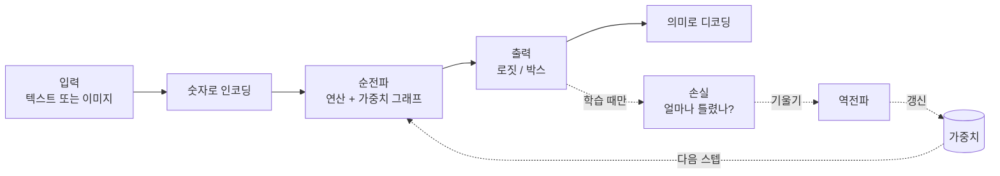

# AI는 실제로 어떻게 동작하는가 — VolvoxAI 교과서

*🌐 언어: [English](../README.md) · **한국어***

> 이 저장소의 실제 코드를 바탕으로, 신경망이 어떻게 **발견되고, 실행되고, 작아지는가** 를 직접
> 따라가 보는 안내서입니다. 동작하는 두 개의 모델 — **언어 모델**(TinyStories)과 **객체
> 탐지기**(EfficientDet-Lite0) — 을 골라, 하나의 입력이 답이 되기까지를 **연산 하나하나** 따라갑니다.
> 그다음 모델을 뒤집습니다: **기울기(gradient)를 거꾸로** 따라가고, **최적화기(optimizer)** 가
> 가중치를 개선하는 것을 지켜보고, 학습이 끝난 결과를 int8로 **양자화** 합니다.

---

## 📖 이 책을 읽는 세 가지 방법

이 책은 **세 가지 깊이로 동시에** 쓰였습니다. 모든 절에는 배지가 붙어 있어서, 원하는 만큼만 깊이
읽고 나머지는 흐름을 놓치지 않고 건너뛸 수 있습니다:

| 배지 | 대상 | 얻는 것 |
|:---:|---|---|
| 🌱 **아이디어** | **누구나** — 코딩도 수학도 필요 없음. 호기심 있는 11살도 따라올 수 있습니다. | 각 개념이 *무엇인지* 를 쉬운 말과 비유로. |
| 🔧 **만들기** | 코드를 조금 읽을 수 있는 사람. 학생, 취미 개발자, 만지작거리는 사람. | 실제 그것 — 그래프, 자바스크립트, 연산자. |
| 🔬 **심화** | 엔진 위에서 개발하는 사람. | 내부 — 양자화, 네이티브/엣지, 최적화, 학습. |

**경로 고르기:**

- 🌱 **"AI가 무엇인지 그냥 이해하고 싶다."** 모든 장에서 🌱 **아이디어** 절만 쭉 읽으세요. 코드도
  수학도 없이, 모델이 무엇이고, 어떻게 실행되고, 어떻게 학습하며, 어떻게 폰이나 로봇에 들어가는지
  이해하게 됩니다.
- 🔧 **"코드를 조금 다룰 줄 알고, 실제로 돌아가는 걸 보고 싶다."** 🌱 **+** 🔧 를 읽으세요. `ts/ops/`
  의 어떤 파일을 열어도 무엇을 하는지 알게 됩니다.
- 🔬 **"엔진을 직접 손보고 싶은 개발자다."** 전부 읽고, 옆에
  [ARCHITECTURE.md](../../../ARCHITECTURE.md) 를 펼쳐 두세요.

> 🌱 갈래는 **그것만으로도 처음부터 끝까지** 읽을 수 있게 설계되었습니다. 따라가기에 너무 어려운
> 부분은 하나도 없습니다 — 학습과 양자화조차 쉬운 말 버전이 있습니다. 깊이는 선택이지만, *이야기* 는
> 어느 수준에서도 완결됩니다.

---

## 이 책이 다루는 범위

VolvoxAI는 **전체 루프** 를 구현합니다. **순전파** — 학습된 가중치를 로드해 답을 계산하는
것(추론) — 을 실행하고, 여기에 더해 **역전파**(거의 모든 연산에 대응하는 `*Backward` 쌍,
`shaders/training/` 와 `native/src/kernels/training_kernels.c`), **최적화기**(AdamW/SGD, 기울기 누적,
체크포인트), **LoRA** 미세조정, 그리고 **양자화** 서브시스템(캘리브레이션/PTQ 및 양자화 인지 학습)까지
구현합니다. 그래서 이 책은 전체 루프를 따라갑니다:

```
   1부 순전파  ───▶  2부 역전파  ───▶  3부 최적화  ───▶  4부 엔진
   모델이란 무엇이고    가중치는 어디서       작고 빠르게 만들기      전부 어떻게 실행되는가
   어떻게 실행되는가     오는가 (학습)         (정밀도 + 양자화)       (브라우저 · 엣지 · 로봇)
                                                                        │
                                                     5부 종합  ◀──────────┘
                                                하나의 실제 멀티모달 모델을
                                                학습 → 양자화 → 실행
```

그래도 완전한 ML 연구 커리큘럼을 지향하지는 않습니다 — 데이터셋 파이프라인, 정식 평가, RLHF/DPO,
분산 학습, 아키텍처 폭(diffusion, GNN, SSM 등)은 여전히 범위 밖입니다. 11장이 남은 부분을 구체적인
지도로 바꿉니다.

---

## 장 구성

각 장은 앞 장을 기반으로 합니다. 처음 읽을 때는 순서대로 읽으세요. 각 줄의 배지는 그 장이 담고 있는
갈래를 보여줍니다.

### 1부 — 순전파: 모델이란 무엇이고 어떻게 실행되는가

1. **[기초](01-foundations.md)** 🌱🔧🔬 — 순전파란 무엇인가. 텐서(tensor), 그래프, 연산(operation).
   VolvoxAI의 멘탈 모델과 세 개의 "계층(tier)". 모델이 `graph.json`과 가중치로 저장되는 방식, 그리고
   그 파일이 받아들이는 shape의 *범위* 를 선언하는 방법.
2. **[언어 모델 한 연산씩 (TinyStories)](02-tinystories-language-model.md)** 🌱🔧🔬 — 문장
   *"Once upon a time, Lily"* 가 GPT 스타일 트랜스포머를 통과하기까지. 토큰화 → 임베딩 → 어텐션 →
   피드포워드 → 로짓 → 샘플링 → 반복.
3. **[비전 모델 한 연산씩 (EfficientDet-Lite0)](03-efficientdet-vision-model.md)** 🌱🔧🔬 — 320×320
   사진이 합성곱 탐지기를 통과하기까지. 백본 → 피처 피라미드 → 탐지 헤드 → 디코드.

### 2부 — 역전파: 가중치는 어디서 오는가

4. **[역전파](04-backward-pass.md)** 🌱🔧🔬 — 모델이 어떻게 *학습하는가*. **손실(loss)** 이 오차를
   재고, 기울기가 *거꾸로* 흐르며, 앞서 만난 모든 순방향 연산에는 **역방향 쌍(backward twin)** 이
   있습니다. 2장의 트랜스포머 블록을 역순으로 다시 걷습니다.
5. **[최적화기와 학습 루프](05-optimizer-and-training-loop.md)** 🌱🔧🔬 — 기울기를 더 나은
   가중치로: SGD/AdamW, 학습률, 기울기 누적, 학습/평가 모드, 체크포인트, 그리고 **LoRA** 미세조정.

### 3부 — 최적화: 모델을 작고 빠르게

6. **[정밀도와 양자화](06-precision-and-quantization.md)** 🌱🔧🔬 — 숫자가 비트로 저장되는 방식,
   같은 탐지기가 왜 세 가지 크기로 배포되는지, int8을 4배 작게 만드는 정확한 정수 연산.
7. **[양자화 모델 만들기](07-producing-a-quantized-model.md)** 🌱🔧🔬 — *과정* 으로서의 양자화:
   관찰자와 캘리브레이션, 사후 학습 양자화(PTQ), 그리고 양자화 인지 학습(QAT).

### 4부 — 엔진: 전부 어떻게 실행되는가 (브라우저 · 엣지 · 로봇)

8. **[브라우저 엔진 내부](08-inside-the-engine.md)** 🌱🔧🔬 — 세 개의 하드웨어 계층, *소박한(naive)*
   커널에서 *빠른* 커널로의 도약, 연산 융합, 그리고 shape 시스템의 두 반쪽: 컴파일 시점에 경계가 있는
   도메인 전체를 증명하고, 요청마다 구체 shape 하나를 바인딩하기.
9. **[네이티브 엔진](09-native-engine-architecture.md)** 🌱🔧🔬 — 같은 설계도를 데스크톱, 폰, 또는
   **로봇** 위에서 실행하는 독립형 C 바이너리 — CPU + Vulkan/OpenGL/CUDA/Metal, 순방향 **과**
   역방향, GPU 드라이버는 실행 시점에 로드. *온디바이스 / 엣지 AI* 장입니다.
   - **9C. [CUDA 백엔드 내부](09c-cuda-backend.md)** 🌱🔧🔬 — **NVIDIA GPU** 경로를 앞에서 뒤까지
     확대하는 동반 장: 드라이버만 빌리기, PTX 커널 굽기, 숫자를 카드에 상주시키기, 리플레이용 그래프
     녹화, 엄격 FP32, 그리고 — 풀 빌드에서 — 학습, W8 저작, 즉시 실행 테이프. 깊지만 🌱 갈래로 죽
     읽힙니다.

### 5부 — 종합

10. **Tiny Receipt VQA, 처음부터 끝까지** *(예정)* — 종합 장: 이 책의 모든 부분을 사용하는 하나의
    실제 멀티모달 모델 — 비전 + 트랜스포머 + 크로스 어텐션, LoRA 미세조정, W8A8 양자화 — 을 전체
    수명 주기(학습 → 체크포인트 → 양자화 → 실행)로 따라갑니다.

### 참고

11. **[용어집과 다음 단계](11-glossary-and-next-steps.md)** 🌱🔧🔬 — 모든 용어를 한곳에,
    **갈래별** 추천 학습 경로, 이 저장소를 활용한 실습, 그리고 여기서 다루는 범위 너머의 빈틈.

> **다이어그램에 대하여.** 플로차트는 [Mermaid](https://mermaid.js.org/)로 작성되어 GitHub,
> VS Code(Markdown Preview Mermaid 확장), 대부분의 마크다운 뷰어에서 이미지로 렌더링됩니다.
> 데이터 배치를 보여주는 그림은 어디서든 보이도록 순수 ASCII로 그렸습니다.

---

## 한 문단 요약 (🌱 누구나)

신경망은 마법도 아니고 두뇌도 아닙니다. 그것은 **고정된 산술 연산의 목록** — 대부분 곱하고 더하기 —
을, 큰 숫자 격자(당신의 입력)에 또 다른 큰 숫자 격자(**가중치**)를 사용해 적용하는 것입니다. 이
목록을 입력에서 출력까지 한 번 실행하는 것이 **순전파(forward pass)** 또는 **추론(inference)**
입니다. *학습(training)* 은 그 반대입니다: 순전파를 실행하고, 출력이 얼마나 틀렸는지를
**손실(loss)** 로 재고, 그 오차를 같은 연산들을 통해 **거꾸로** 밀어 모든 가중치의
**기울기(gradient)** 를 구한 뒤, **최적화기** 가 각 가중치를 조금 덜 틀리도록 밀어 줍니다 — 수백만
번. 가중치가 좋아지면 **양자화** 가 32비트 실수를 8비트 정수로 줄이되 정확도 손실은 거의 없어서,
모델이 브라우저 탭, 폰, 또는 로봇에 들어갑니다. VolvoxAI는 이 모두를 구현하며, 이 책은 각 단계의
실제 코드를 읽습니다.



이제 **[1장: 기초](01-foundations.md)** 로 시작하세요.
