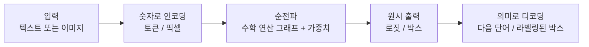

# AI는 실제로 어떻게 동작하는가 — VolvoxAI 교과서

*🌐 언어: [English](../README.md) · **한국어***

> 이 저장소의 실제 코드를 바탕으로 신경망 **추론(inference)** 을 직접 따라가 보는 안내서입니다.
> 동작하는 두 개의 모델 — **언어 모델**(TinyStories)과 **객체 탐지기**(EfficientDet-Lite0,
> fp32 / fp16 / int8) — 을 골라, 하나의 입력이 답이 되기까지를 **연산 하나하나** 따라갑니다.

이 책을 다 읽고 나면 어떤 최신 모델이든 **작은 수학 연산들의 그래프(graph)** 로 읽어낼 수 있고,
각 연산이 실제로 무엇을 계산하는지 알게 되며, 그것을 실제 하드웨어에서 빠르게 돌리는 엔지니어링
선택(메모리 배치, 양자화, GPU vs CPU)을 이해하게 됩니다. 이 책이 만드는 지식은 추론 메커니즘과
런타임 엔지니어링입니다.

---

## 범위와 현재 빠진 부분

이 교과서는 **추론(inference)** 에 집중합니다: 학습된 가중치를 로드하고, 모델 그래프를 실행하고,
출력을 디코드하고, 가중치를 양자화하고, 연산을 브라우저/네이티브 백엔드에 매핑하는 것까지입니다.
더 넓은 학습·연구 스택은 아직 다루지 않습니다:

| 빠진 영역 | 현재 없는 것 |
|---|---|
| 학습 | 역전파, autograd, 손실 함수, Adam 같은 최적화기, 학습률 스케줄, 초기화, 정규화. |
| 수학 기초 | 선형대수 유도, 연쇄 법칙/기울기를 위한 미적분, 확률, 정보 이론. |
| 데이터 | 데이터셋 구성, 입력 파이프라인, 증강, 토크나이저 학습, train/validation/test 분할, 누수 점검. |
| 평가와 실험 | 지표, 검증 방법론, ablation, 과적합, bias-variance 분석. |
| 아키텍처 폭 | diffusion, GNN, RNN/LSTM, 강화학습, VAE/GAN, retrieval과 embedding, multimodal, MoE, SSM. |
| 최신 LLM 학습 스택 | 사전학습, 지도 미세조정, LoRA/adapter, RLHF/DPO, 분산 학습, FlashAttention 내부. |
| 연구 실무 | 논문 재현, 결과 유도, inductive bias 추론, scaling law. |

7장에서 이 목록을 다음에 무엇을 추가해야 하는지에 대한 구체적 지도로 바꿉니다.

---

## 이 책을 읽는 방법

각 장은 앞 장을 기반으로 합니다. 처음 읽을 때는 순서대로 읽으세요.

1. **[기초](01-foundations.md)** — 추론이란 무엇인가. 텐서(tensor), 그래프, 연산(operation).
   VolvoxAI의 멘탈 모델과 네 개의 "계층(tier)". 모델이 *설계도(blueprint)* 로 저장되는 방식.
2. **[언어 모델 한 연산씩 (TinyStories)](02-tinystories-language-model.md)** —
   문장 *"Once upon a time, Lily"* 가 GPT 스타일 트랜스포머(transformer)를 통과해 다음 단어를
   예측하기까지. 토큰화 → 임베딩 → 어텐션 → 피드포워드 → 로짓 → 샘플링 → 반복.
3. **[비전 모델 한 연산씩 (EfficientDet-Lite0)](03-efficientdet-vision-model.md)** —
   320×320 사진이 합성곱 탐지기를 통과해 박스와 라벨을 내놓기까지.
   백본 → 피처 피라미드 → 탐지 헤드 → 디코드.
4. **[정밀도와 양자화 (fp32 / fp16 / int8)](04-precision-and-quantization.md)** —
   숫자가 비트로 저장되는 방식, 같은 탐지기가 왜 세 가지 크기로 배포되는지, 그리고 int8 버전을
   4배 작게 만드는 정확한 정수 연산.
5. **[엔진 내부](05-inside-the-engine.md)** — VolvoxAI가 *브라우저*에서 그래프를 실행하는 방법:
   네 개의 하드웨어 계층, *소박한(naive)* 커널에서 *빠른* 커널로의 도약, 그리고 연산 융합.
6. **[네이티브 엔진](06-native-engine-architecture.md)** — *나머지 절반*: 같은 설계도를 CPU +
   Vulkan/OpenGL/Metal/NNAPI 위에서 실행하는 독립형(freestanding) C 바이너리로, GPU 드라이버를
   실행 시점에 로드합니다. 전체 이중 타깃(dual-target) 아키텍처와 그 설계 선택들.
7. **[용어집과 다음 단계](07-glossary-and-next-steps.md)** — 모든 용어를 한곳에, 추천 학습 경로,
   이 저장소를 활용한 실습 문제, 그리고 추론 너머의 현재 빈틈.

> **다이어그램에 대하여.** 플로차트는 [Mermaid](https://mermaid.js.org/)로 작성되어 GitHub,
> VS Code(Markdown Preview Mermaid 확장), 대부분의 마크다운 뷰어에서 이미지로 렌더링됩니다.
> 데이터 배치를 보여주는 그림은 어디서든 보이도록 순수 ASCII로 그렸습니다.

---

## 한 문단 요약

신경망은 마법도 아니고 두뇌도 아닙니다. 그것은 **고정된 산술 연산의 목록** — 대부분 곱하고
더하기 — 을, 큰 숫자 격자(당신의 입력)에 또 다른 큰 숫자 격자(**가중치(weights)**, 학습 중에
얻어진 값)를 사용해 적용하는 것입니다. 이 목록을 입력에서 출력까지 한 번 실행하는 것을
**순전파(forward pass)** 또는 **추론(inference)** 이라고 합니다. VolvoxAI는 바로 이 일을 하는
엔진입니다. 연산 목록(*그래프*)을 읽고, 가중치를 읽어, 출력을 계산합니다. 좋은 가중치를
*발견하는* 별도의 더 어려운 과정인 학습(training)은 이 저장소에 없습니다. 우리는 **학습이 끝난
모델을 답으로 바꾸는** 부분을 공부합니다.

이제 **[1장: 기초](01-foundations.md)** 로 시작하세요.
